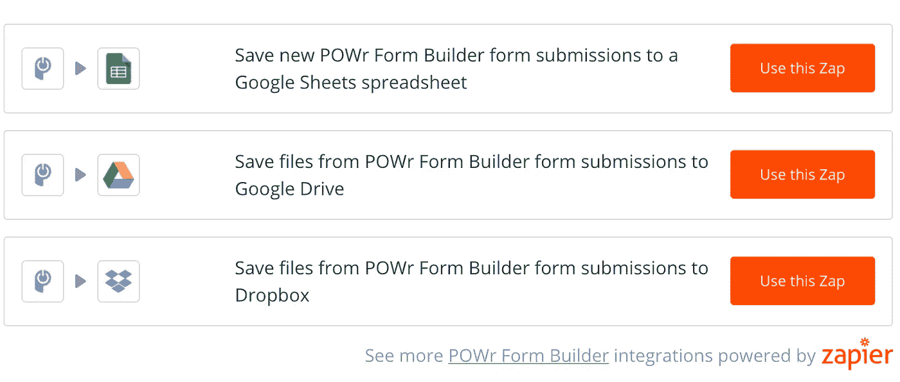
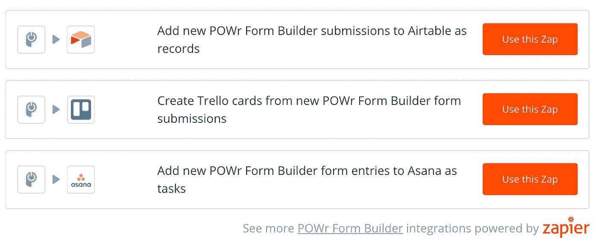

# 以下是如何自动化您的工作流程并提高效率的方法

> 原文：<https://medium.com/hackernoon/how-to-automate-your-workflows-and-be-more-powerful-d723c145df50>

当你可以做其他事情的时候，花时间做手工是一件痛苦的事情。就我个人而言，我无数次发现自己手动下载电子邮件附件，然后上传到 Google Drive 中的一个文件夹。每次可能都不会花很长时间，但是我没有想过我每天要花多少时间在这件事和许多其他的小任务上。例如，我还将社交媒体帖子的链接复制并粘贴到我们公司的 Slack(我们公司的协作和交流工具)中。加起来，它们占用了我一天的宝贵时间。技术使得简化我们的工作流程变得越来越容易，并且有无数的工具声称可以提高您的工作效率。今天，我们将为您带来迄今为止最灵活的产品之一:Zapier！

如果你不熟悉 [Zapier](https://zapier.com/learn/getting-started-guide/what-is-zapier/) ，它是一个在线自动化工具，让你可以连接应用程序，以便你可以自动化更多，并停止做繁琐，手动和重复的任务，占用你的时间。最好的部分是你不需要任何编码经验或网络开发人员来使用它！

Zapier 有如此多的可能性，因为它现在拥有超过 1000 个不同的应用程序可以相互连接。这现在也包括 POWr [表单生成器](https://www.powr.io/plugins/form-builder/standalone?utm_source=HackerNoon&utm_medium=Guest%20Blog&utm_campaign=Heres_How_You_Can_Automate_Workflows_and_Be_More_POWrful&utm_content=Zapier&src=hackernoon)。

与任何形式一样，能够使用您收集的数据、使其具有可操作性并将其存储在您需要的地方非常重要。现在，您可以用新的激动人心的方式自动处理表单数据了！

# 它是如何工作的

只需创建一个 [POWr 账户](http://www.powr.io?utm_source=HackerNoon&utm_medium=Guest%20Blog&utm_campaign=Heres_How_You_Can_Automate_Workflows_and_Be_More_POWrful&utm_content=Zapier&src=hackernoon)，并从插件库中选择[表单生成器](https://www.powr.io/plugins/form-builder/standalone?utm_source=HackerNoon&utm_medium=Guest%20Blog&utm_campaign=Heres_How_You_Can_Automate_Workflows_and_Be_More_POWrful&utm_content=Zapier&src=hackernoon)。从那里，您可以选择您想要创建的 Zap。

关于用 POWr Form Builder 表单设置 Zapier 的更多信息，请阅读我们的[帮助文档](https://powr-support.zendesk.com/hc/en-us/articles/360000760834?utm_source=jimdo&utm_medium=blog&utm_campaign=guest-blog&utm_content=zapier&src=hackernoon)。

现在让我们来看看如何使用 POWr Form Builder 和 Zapier 来充分利用表单提交，使数据更加强大！

# 在需要的地方获取信息:将表单数据保存在一个中心位置

Where did I put that file?

将信息保存在一个可访问的、有组织的中心位置是非常重要的，而不必手动复制和粘贴文件或其他信息！使用 POWr Form Builder 和 Zapier，您可以轻松地完成这项工作，让您的生活变得更加简单。如果您拥有一家在线商店，并且希望跟踪客户信息和订阅，而不必手动移动和组织数据，这是一个很好的选择。例如，你可以在谷歌表单中实时收集 RSVPs，或者将上传的文件保存在谷歌硬盘或 Dropbox 中，这样团队中的每个人都可以方便地访问它们。

# 获取更多线索:自动将联系人添加到您的 CRM 中

您可以利用 Zapier 和 POWr Form Builder 自动完成这项任务，而不必花费宝贵的时间将新联系人输入到 CRM 中。这对于获得潜在客户，然后有更多的时间来转换或培育他们，而不是花费时间手动复制并粘贴到您的客户管理工具中，是非常宝贵的。

# 了解内情:获得更多通知

I’m going to set up notifications for everything! Mwahaha!

当有人填写您的 POWr Form Builder 表单时，已经可以收到电子邮件提醒，但是 Zapier 使在其他方便的位置接收提醒成为可能，比如 Slack！

# 完成更多工作:自动将任务添加到项目管理系统中

I’m getting so much done today! High-five for me!

能够看到您从反馈表或调查中收集的信息并有效地采取行动是非常重要的，因此将任务自动添加到项目管理系统中可以让您快速推进工作。以下是一些我们最喜欢的广告:

这些 Zaps 将帮助您通过强大的自动化提高效率，并帮助您和您的团队了解最新的数据，以便您能够始终为您的业务做到最好。在这里查看所有的集成，但是不要忘记你可以[创建你自己的 Zaps](https://powr-support.zendesk.com/hc/en-us/articles/360000760834?utm_source=jimdo&utm_medium=blog&utm_campaign=guest-blog&utm_content=zapier&src=hackernoon) 来设置任何你需要的自动化，使用已经集成到 Zapier 中的数千个应用中的一个。这当然也扩展到 POWr Form Builder 之外，我们鼓励您探索所有可以加速流程和提高效率的方法。你很快就会意识到你可以节省多少时间！

This post was written by Emilie Murphy who manages Product Marketing at [POWr.io](https://www.powr.io/?utm_source=jimdo&utm_medium=blog&utm_campaign=guest-blog&utm_content=zapier&src=hackernoon). Originally from London, Emilie recently made the move to POWr, headquartered in San Francisco, where her mission is to help empower small businesses to grow online with easy-to-use, customizable and affordable tools.