# 如何使用 CoinPulley 平衡您的加密组合

> 原文：<https://medium.com/hackernoon/how-to-balance-your-crypto-portfolio-using-coinpulley-133c52d17c55>

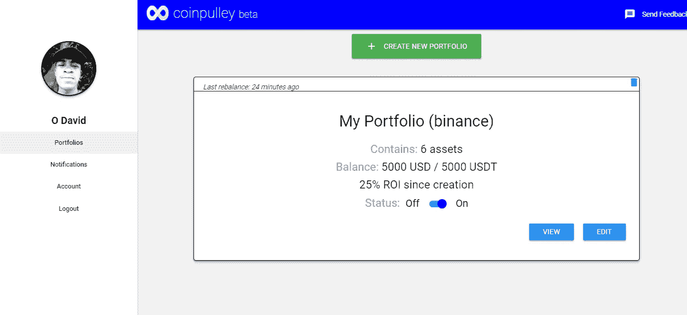

Coinpulley app interface

如果你正在阅读这篇文章，并且你不熟悉加密投资组合平衡的概念，请先阅读我的另一篇文章。

定期重新平衡有助于最大限度地提高您的加密投资组合的投资回报率，当您的任何资产价格上涨时锁定利润，当您的任何资产价格下跌时买入下跌。

你不需要在你的钱包里增加额外的资金。你只需用你锁定的利润来买入你亏损头寸的低点。这是一种系统的低买高卖方式，不像日内交易那样试图预测市场。

不过，对于中长期投资者来说，手动调整投资组合以捕捉市场涨跌是一项乏味的任务。

这就是为什么我们 CoinPulley 决定创建一个基于云的软件服务，它将帮助您以最少的设置自动重新平衡您的投资组合。我写这篇文章是为了记录在 CoinPulley 上设置你的投资组合并让它自动重新平衡所需的步骤。

**请注意** : CoinPulley 目前处于测试版，这里提供的信息会不断更新。您可以**加入我们的 Telegram** 社区，使用[此链接](https://t.me/joinchat/F8XT3EqcpM_83Hq9Lmdi1Q)获取所有更新，并查看我们的一些用户已经分享的投资组合业绩数据。

首先，基本要求:

*   交易所的资金账户。我们目前支持币安，Bittrex，Bitfinex，GDAX，KuCoin，HitBTC，Okex。最初选择这些交易所是因为它们 API 的成熟度、现有客户群的规模以及可供交易的硬币数量。
*   您将使用的每个交换的 API 密钥和 API 机密。如果你使用 GDAX，你也需要一个密码。请注意，在 CoinPulley 上使用这些 API 键之前，必须先禁用这些键。下文提供了更多信息。

# 获取需求:

*   交易所上的基金账户:我们通常假设任何已经倾向于使用我们服务的用户也已经在一个流行的交易所拥有一个账户，比如上面列出的那些。我们正在推出对更多交易所的支持。但是，如果您需要在上述任何交易所设置新的交易所帐户，请使用下面提供的链接:
*   [获取币安账户](https://www.binance.com/register.html)
*   [获取 Bittrex 账户](https://bittrex.com/account/register)
*   [获取 Bitfinex 账户](https://www.bitfinex.com/)
*   [获取 GDAX 账户](https://www.gdax.com)
*   [获得库币账户](https://www.kucoin.com/)
*   [获取 HitBTC 账户](https://hitbtc.com/)
*   [获取 Okex 账户](https://www.okex.com/)
*   API 密钥:这通常是许多现有的密码交易商或霍德尔不熟悉的步骤。然而，从您的交易所获得 API 密钥是非常容易和直接的。使用下面的教程链接来获得您各自交易所需要的 API 访问信息。
*   币安— [链接](https://support.binance.com/hc/en-us/articles/360002502072-How-to-create-API)
*   Bittrex — [链接](https://www.youtube.com/watch?v=PoC8kK35Xxk)
*   Bitfinex — [链接](https://support.bitfinex.com/hc/en-us/articles/115002349625-API-Key-Setup-Login)
*   GDAX — [链接](https://support.gdax.com/customer/en/portal/articles/2425383-how-can-i-create-an-api-key-for-gdax-)
*   KuCoin — [链接](https://www.youtube.com/watch?v=32KX_xkRIOQ)
*   HitBTC — [链接](https://www.youtube.com/watch?v=DCp1Ltywh20)
*   Okex — [链接](https://www.youtube.com/watch?v=qlLJyV4z_Bo)

如果你已经成功完成了上面的基本要求，干杯。是时候开始使用 CoinPulley 了。

有两种方法可以导航到 CoinPulley 应用程序。要么浏览位于[https://coinpulley.com](https://coinpulley.com)([点击此处](https://coinpulley.com))的主网站，要么将浏览器直接指向位于[https://app.coinpulley.com](https://app.coinpulley.com)([点击此处](https://app.coinpulley.com))的应用子域

如果你通过主网站，你应该有如下所示的屏幕。请警惕钓鱼网站。链接是“https://coinpulley.com”。你可以将它复制并粘贴到你的浏览器地址栏中。

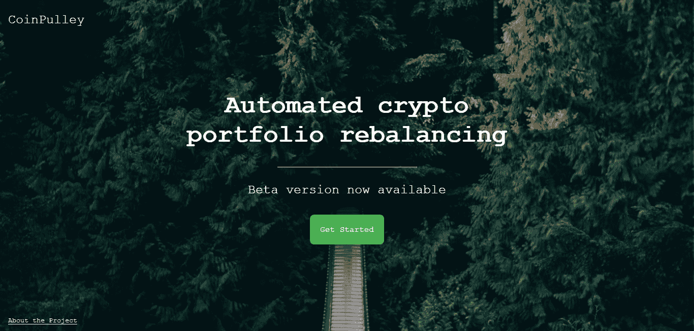

**点击中间的“开始”按钮**，它会带你到 https://app.coinpulley.com[的应用程序。](https://app.coinpulley.com.)检查你的地址栏以确保无误。您应该有一个如下所示的屏幕截图:

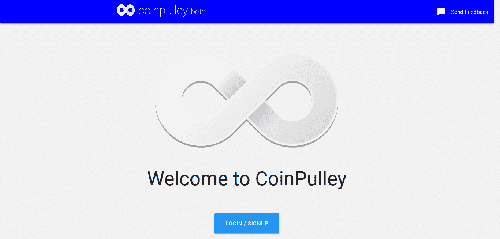

**点击“登录/注册”按钮**在应用程序上创建一个帐户(如果您还没有这样做)或登录(如果您已经有一个帐户)。由于我们致力于实施行业最佳安全实践，我们的身份验证层由领先的行业提供商 Auth0 提供支持。这意味着在为您显示的注册或登录屏幕上，您将看到以下内容:

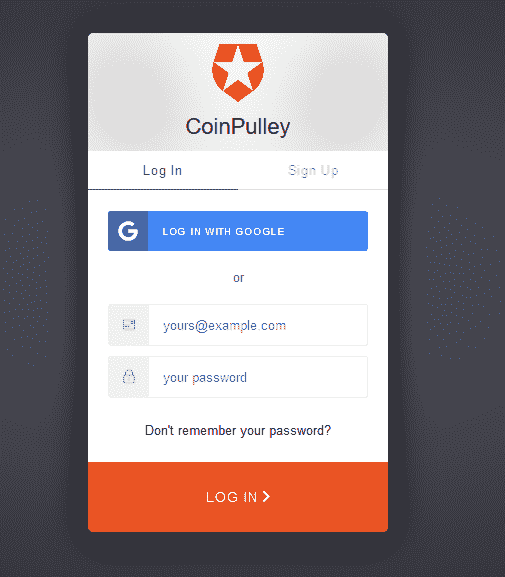

如果你看看地址栏，你会看到[https://coinpulley.auth0.com](https://coinpulley.auth0.com)是域名的主要部分。这是我们的登录页面。您可以使用 Google 社交登录，也可以使用电子邮件和密码选项。成功登录后，您将被重定向至位于[https://app.coinpulley.com 的应用程序。](https://app.coinpulley.com.)

然后，该应用程序将在侧边栏上加载您的个人资料信息，并尝试检索您创建的投资组合的摘要(如果您之前使用过该应用程序)。你的屏幕应该是这样的:

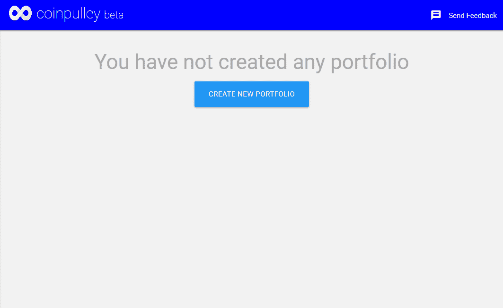

如果你之前已经建立了投资组合，你可能不需要本教程的其余部分。如果您刚刚开始使用 CoinPulley，让我们继续。第一个截图显示“您尚未创建任何投资组合”。点击下面的按钮创建一个新的投资组合。您应该会看到如下所示的屏幕:

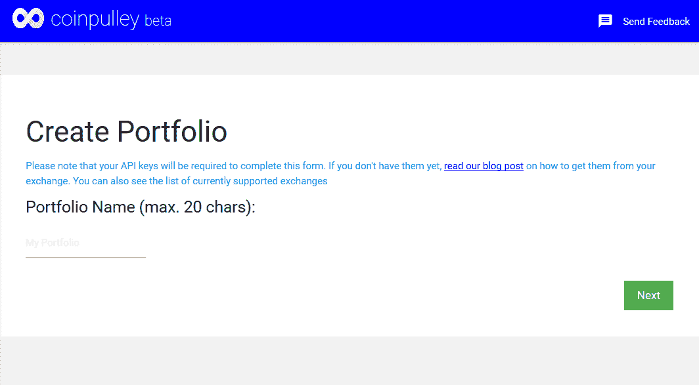

# **创建投资组合**

接下来的步骤非常简单。

1.**为您的投资组合键入一个名称**

2.**选择您要用于此投资组合的交易所。**需要注意的是，我们只允许每个投资组合进行一次交易。但是，您可以为您使用的不同交易所创建不同的投资组合。此外，如果您有理由为同一外汇账户创建两个或多个投资组合，请确保您使用不同的报价货币(例如，投资组合 1 使用 BTC，投资组合 2 使用 USDT)，并且两个投资组合不包含相同的资产。

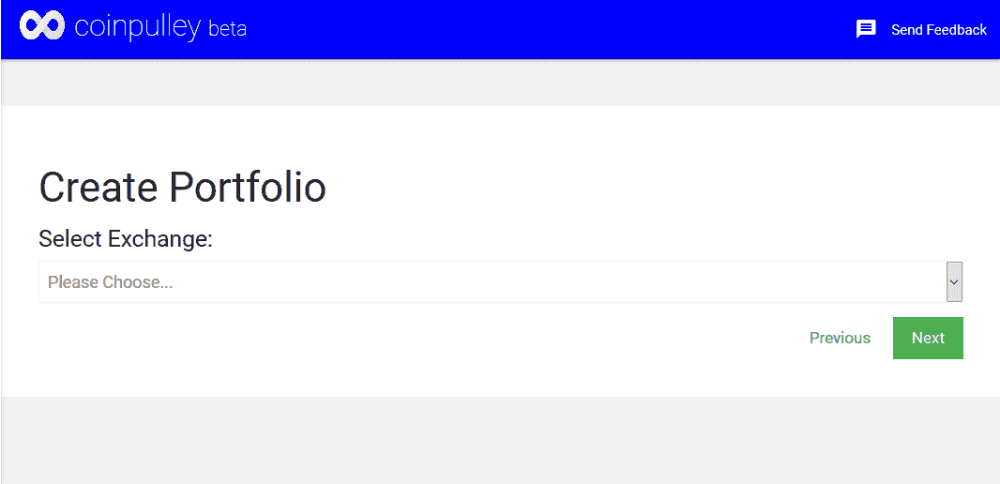

3.**选择您的报价货币**。您选择的报价货币是您的硬币将被交易到的货币。例如，如果您选择 BTC，您将只能添加有 BTC 对的硬币到您的投资组合中，包括 BTC 本身。如果 USDT 在您的交易所可用，并且您选择了 USDT，那么您的所有交易都将以 USDT 定价，并且只有在您的交易所中有 USDT 对的硬币可供您在下一步中选择。

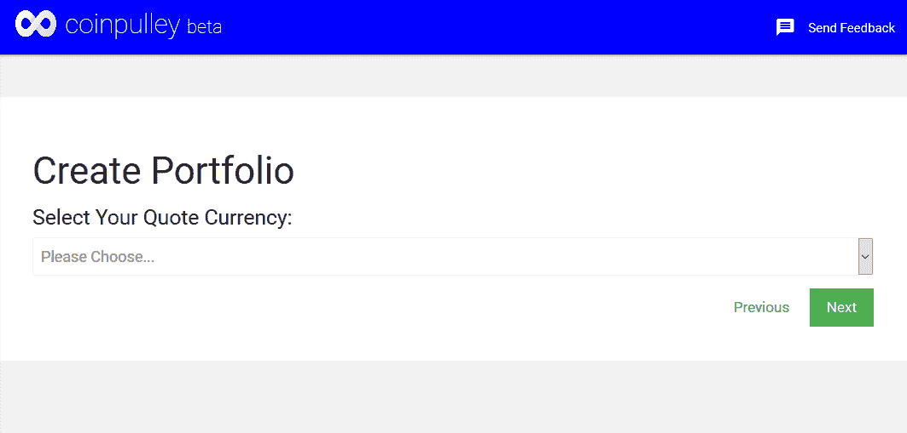

4.**选择您想在投资组合中拥有的资产(硬币/代币)**。根据您在上一步中选择的报价货币，您将看到一个可用硬币的列表。选择您的收藏夹，向下滚动并单击“下一步”按钮。请确保只选择您的余额可以分摊的硬币数量。每枚硬币的最低余额应为 20 美元。

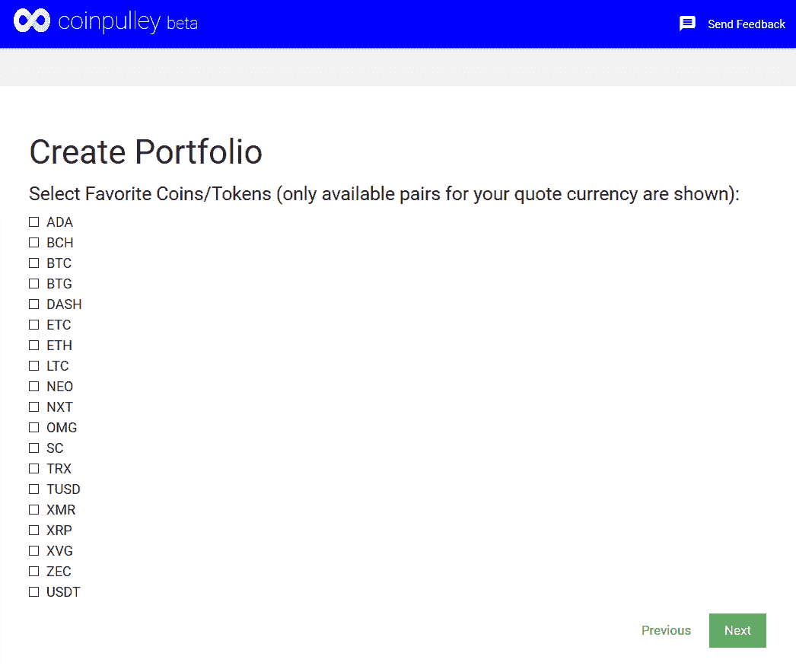

5.**为您在第 4 步**中选择的各种资产设置分配(百分比)。所有分配的总和必须正好是 100。例如，如果您在步骤 4 中选择了 4 项资产，并且希望它们具有相同的权重，请为每项资产输入 25%的分配。完成后，单击“下一步”。如果您的总分配大于或小于 100，您将得到一个错误反馈。适当调整后再试。

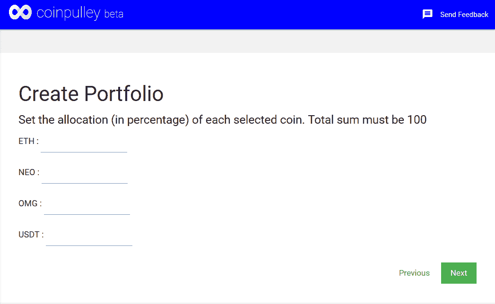

6.**输入你的 API 键**。稍后将检查该密钥的有效性。您的 API 密钥允许服务代表您进行交易。我们软件做的所有交易都是限价单。请不要忘记在您的 API 键上禁用撤销。我们不会对由于你的疏忽而造成的任何资金损失负责。您可以在此了解更多关于我们的使用条款[。](https://coinpulley.com/terms-of-use.html)

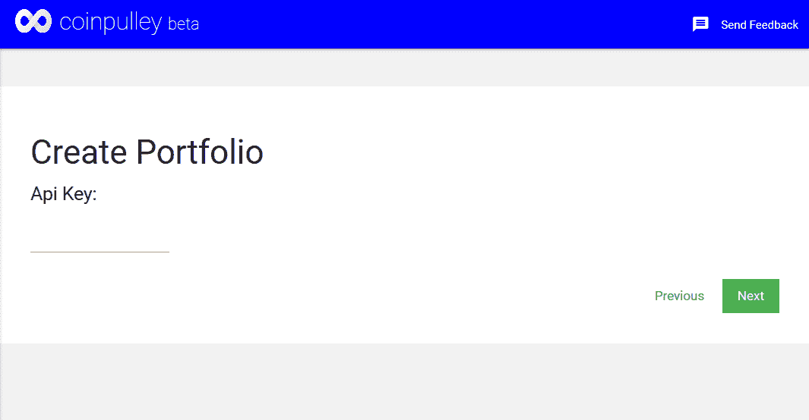

7.**输入您的 API 密码，点击“下一步”继续**。这个秘密的有效性稍后将被检验。

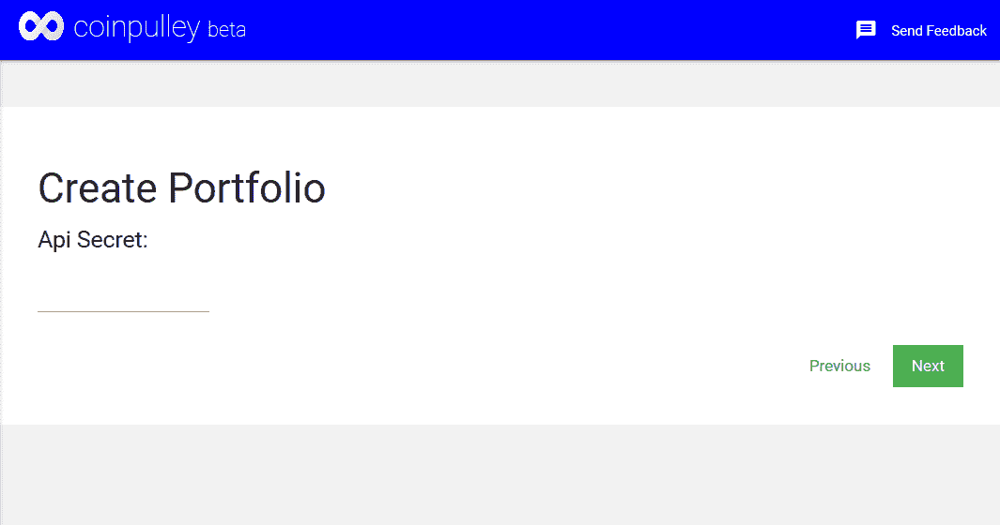

8.**输入您的 API 密码**。该字段是可选的。在我们支持的交易所列表中，只有 GDAX 交易所需要密码。单击“下一步”继续。

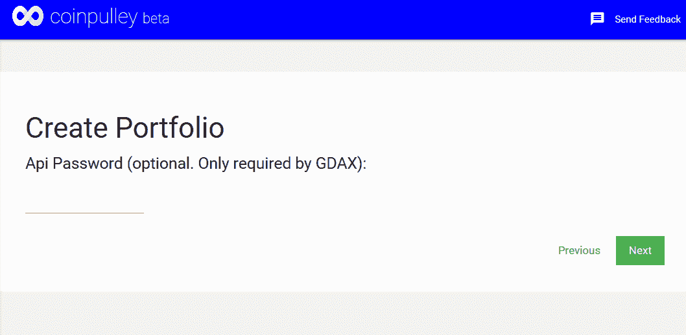

9.**设置阈值**。阈值百分比表示在触发重新平衡之前，您的硬币应该偏离其分配多少。我们建议一开始就保留 2%的默认值。您可以随时根据自己希望的重新平衡频率进行调整。请注意，如果您在下一步中选择“软”模式，最小允许订单大小也将适用于交易所。

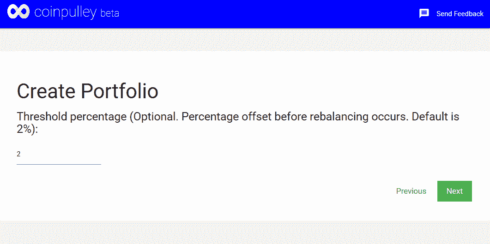

10.**选择再平衡模式**。我们提供了两种重新平衡模式。这是因为我们有小额投资组合的经验(通常少于 500 美元)。由于允许的最低交易量，小投资组合在大多数交易所都无法成功锁定利润。因此，我们创建了一个名为硬模式的选项，有效地解决了这个问题。如果您的余额足够大，我们推荐默认的软模式。

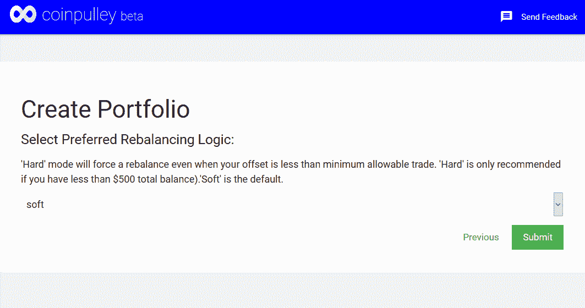

所以最后**点击“提交”按钮**。如果您的 [API](https://hackernoon.com/tagged/api) 键和[网络](https://hackernoon.com/tagged/network)连接一切顺利，您应该会在下一个屏幕上看到一条成功消息:

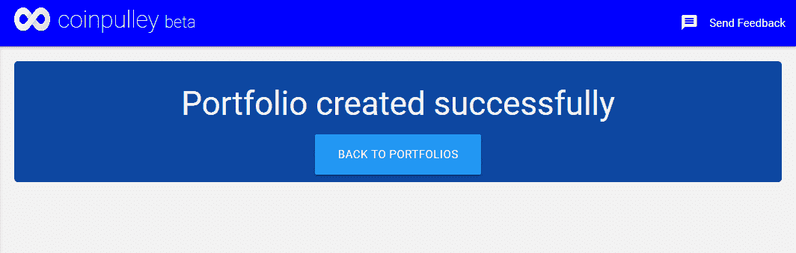

现在你可以**点击“返回投资组合”按钮**与你新创建的投资组合互动。

请注意**您的首次平衡将在创建投资组合**后最多 10-15 分钟内进行。如果您遇到任何问题，请点击页面右上角的“发送反馈”按钮(如果您在桌面上)或侧边栏菜单中的按钮(如果您在移动设备上)。

我们将发布业绩数据，向您展示定期再平衡投资组合相对于被动管理投资组合的表现。订阅我们下面的时事通讯以获取更新

谢谢你一路读到这一步。是时候采取行动了。前往 [CoinPulley](https://app.coinpulley.com) 获取您自己的免费帐户，让我们的服务以成熟的策略管理您的加密组合，同时提高您的生活效率。

点击加入我们的电报组

**请将这篇文章**鼓掌 50 次，以帮助其他人发现它，并在媒体或 Twitter ( [@olusola_dev](http://twitter.com/olusola_dev) )上关注我，以获取更多加密货币和技术相关的帖子。