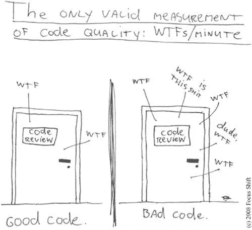

# 如何成为一名干净的程序员(第 1 部分)

> 原文：<https://medium.com/hackernoon/how-to-be-a-clean-coder-part-1-ad101ee621e7>



Which door represents your code?

我们都可以写代码，让东西工作，但当我们回头看自己的代码时，我们意识到它有多糟糕，我们已经走了多远。很好，你已经在进化了。但是这个系列会让你的[学习](https://hackernoon.com/tagged/learning)更上一层楼，甚至做得更好。

有时代码会变得一团糟，拥有一大堆代码的代价是巨大的。开发人员害怕做出新的改变，因为这可能会破坏其他东西。我们如何解决这个问题？

答案是干净的代码。这意味着代码应该足够简单，可以理解并进行进一步的修改，而不用担心会破坏其他东西。即可读性和可维护性。这需要你在编写代码时付出额外的精力和时间，但从长远来看这是有益的，因为一个软件永远不会完整，会随着时间而变化。所以让我们跳到如何编写干净的代码。

# 有意义的名字

any name?

有名字吗？不，你不是在为自己写代码。你是在为别人写代码，所以当你的团队或者你未来的自己读到旧代码的时候。他们不会揪着自己的头发试图弄清楚它的作用，无意中浪费他们的时间。代码由许多变量、类和方法组成。每样东西都有名字。名称需要一致，并且**解释代码做什么**。一些名字一致的例子可以在[这里](http://www.oracle.com/technetwork/java/codeconventions-135099.html)找到。让我们看一个例子:

```
int m; // elapsed time in minutes
```

名字`m`没有揭示任何东西。它不会唤起一种时间流逝的感觉，也不会唤起一种日子的感觉。我们应该选择一个名称来指定测量的内容和测量单位:

```
int elapsedTimeInMinutes;
```

这使得变量易于理解并揭示其确切目的。我们甚至不需要写额外的注释，因为代码是自解释的。

让我们看看另一种方法:

方法名`getThem`让我们不知道这个方法是干什么的。使用该方法的人必须进入该方法内部，并彻底检查整个代码，以了解它做了什么。现在我们将下面的代码重构为:

这和上面的代码是一样的，但是名字`getEvenNumbers`给了我们一个清晰的概念，我们不需要进入代码内部就能看到它做了什么。有了这些简单的改名，就不难理解是怎么回事了。这就是选择好名字的力量。

## 有意义的争论

考虑以下代码:

并与以下内容进行比较:

注意到这两种方法可读性的不同了吗？现在我们通过方法的签名就知道了什么参数被用于什么目的。

## 使用易发音的名字

人们不应该使用任何不标准的缩写，以免使他人混淆。用`no`代替`number`是可以容忍的，因为每个人都知道它的意思。(我不鼓励这样做，因为它可能会被“不”所混淆。)但我们不应该创造自己的缩写词，这可能会使其他人混淆。例如，在书写日期时，一个名为`Date creationTimestamp;`的变量比`Date creationdmY;`更好，因为前者可以在对话中发音。

## 使用可搜索的名称

一个人可能很容易 grep 为`MAX_CLASSES_PER_STUDENT`，但是数字 7 可能更麻烦。搜索可能会将该数字作为文件名、其他常量定义的一部分，以及在值用于不同目的的各种表达式中出现。

再次比较

到

现在代码更容易搜索，以防需要做任何更改。

## 使用正确的拼写

正确的拼写也是使东西可搜索的一部分。一个简单的单词`Hierarchy`到`Heirarichy`的拼写错误可能会导致在整个代码库中找不到那个世界。

## **方法名称**

方法应该有动词或动词短语名，如`postPayment`、`deletePage`或`save`。根据 [javabean 标准](http://java.sun.com/products/javabeans/docs/spec.html)，访问器、赋值器和谓词应该以它们的值命名，并以`get`、`set`和`is`为前缀。

```
 Address address= person.getAddress();
 if (address.isCity())…
```

当构造函数重载时，使用名称描述参数的静态工厂方法。举个例子，

`Complex fulcrumPoint = Complex.FromRealNumber(23.0);`

通常比更好

`Complex fulcrumPoint = new Complex(23.0);`

## **使用解决方案域名**

阅读你的代码的人仍然是程序员，所以你仍然可以使用一些特定领域的术语。`MainActivity`这个名字对于一个熟悉 android 的人来说意义重大。哪个程序员会不知道[编程](https://hackernoon.com/tagged/programming)术语中的`Map`是什么？

## 结论

给事物命名最困难的是有时可能需要时间，并且随着个人文化背景的不同而不同。大多数时候，我们不会记住这些名字，而是使用现代的 IDEs 来搜索和找到它们。遵循这些规则，看看你是否没有提高代码的可读性。如果你在维护别人的代码，现代的 IDEs 已经使得重构变得非常容易。短期会有回报，长期会持续有回报。

> 这篇文章中的原则摘自我最近读的一本书，[干净的代码:敏捷软件工艺手册](https://www.amazon.in/Clean-Code-Handbook-Software-Craftsmanship-ebook/dp/B001GSTOAM)。如果你想更深入地研究，我强烈推荐你去读它。

*如果你喜欢这个故事，请点击**👏 ***按钮*** ***并分享*** *帮助别人找到！欢迎留言*💬*下图。
有反馈吗？在推特上做朋友*[](https://twitter.com/s__singhal)**。*下一部分会有清洁功能，敬请期待。在那之前保持干净的编码😉**