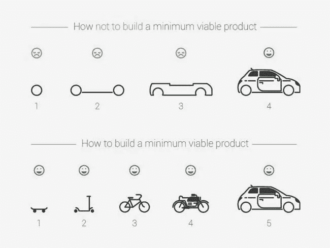
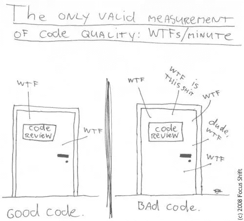

# 成为代理机构的最佳客户

> 原文：<https://medium.com/hackernoon/how-to-be-a-good-client-to-an-it-company-60d1959e55b4>

善待你的公司，收获回报。你能赢的唯一方法就是和他们建立良好的关系！

在我创办 Indiez 之前，我讨厌将技术外包给 IT 公司的想法。

不懂技术，然后雇佣别人为你做[开发](https://hackernoon.com/tagged/development)，感觉很糟糕。

就像和一个不知道怎么做爱的人结婚。

快速事实—几乎 60%的 IT 外包项目失败了。

最近，我的一个好朋友花了 5000 美元雇佣了印度的一家 IT 外包公司为他做了一个 app。这是一场灾难。输出很差，不像样，他恨自己浪费了 5000 美元。

他向我寻求建议，因为我正在构建 Indiez，这是一个构建高质量[软件](https://hackernoon.com/tagged/software)的平台。我们与许多机构和自由职业者合作，到目前为止已经建立了 200 多个产品，所以我对外包开发有一个很好的想法。

为了节约成本，将 IT 开发外包给印度、菲律宾或其他国家是一个好主意。但是当我们得到我们不想要的结果时，我们把所有的责任都推到 IT 公司身上，说…外包糟透了！

是的。糟透了。

但是考虑到这是你的产品，你采取了什么步骤使它正常工作？软件是有风险的……接近 90%的创业公司都失败了。因此，如果你认为花 5000 美元开发一个软件就能让你成为百万富翁，那你就是疯了。

所以事情是这样的，我希望你停止哭泣和抱怨你在 IT 外包中的糟糕经历。并使用下面提到的一些真实、实用的东西。

这可能不会帮助你打造最好的产品中的最好的一个…但肯定会让你感到快乐。

# 80%规则

外面的大多数机构不知道产品设计。有像 Method 或 Source Bits 或 Indiez 这样的专门机构从事产品设计。

这就是为什么你必须知道你想从与你合作的机构那里得到什么。你应该有一个功能列表，并对应用程序的用户体验有一些想法。如果你不能解决这个问题，单独雇佣一个 UI/UX 设计师来帮你解决。

[Source](http://www.launchpadapps.com.au/wp-content/uploads/2016/05/UX-Designer-vs-UI-Designer.png)

当你支付 10K 500 美元的时候，期望一个代理公司制造出一个惊人的产品是没有意义的。

但是，你不需要知道所有的事情。你只需要做到 80%的正确，剩下的工作将由你的用户或代理完成。通过使用 Proto.io(我的最爱)、Wix、Invision 等产品，你可以很快达到 80%。

# 长名单和短名单

在雇佣 IT 代理时，你应该有两种不同的功能列表——一个长的，一个短的。

长长的列表就像你想要的所有特性的清单…然而，候选列表是你绝对需要的特性的列表。保持候选名单的绝对最小化。通常添加大量的功能不会让你的应用程序变得令人惊叹。

Source: Intercom

我见过上百次这样的情况，一个企业家想要建立一个他们认为“很酷”的特殊功能，却不知道用户想要什么。

与您的用户交流并确定任务关键型功能。在发布之前只构建那些功能。

# 合理的报酬和合理的奖励。

你可以花 20 美元和 2000 美元买一件 t 恤。质量有区别。20 美元一个容易褪色，不会持续很久。

软件也是如此。你要知道，用 5000 美元和 50000 美元很难构建出同样质量的软件。如果你期待超高质量的标准，你应该愿意付出同样的代价。

Airbnb 和[脸书](https://hackernoon.com/tagged/facebook)向他们的工程师支付平均每年 15 万美元的薪水，因此他们生产出高质量的产品。

你应该看看他们过去的工作，了解他们的工作质量。这将有助于你对质量有正确的期望。

# 人类的角度

你应该永远记住在另一边有一个人类在为你工作。仅仅因为你付了钱并不意味着你拥有这个人或他们的时间。

期望他们每天工作 16 个小时，因为你可以满足你的最后期限，这有点荒谬。他们不会像你一样努力工作，因为激励机制不一致。如果你成功了，每个人都不像佛一样慷慨，他们什么都不会做。

我们做的几件对我们很有用的有趣的事情是——给表现好的员工发奖金，找出团队中表现最好的人，偶尔给他们一份披萨或啤酒。

Source: Collaboration Superpowers

# 去弄清楚

我们已经雇了人，付了钱，我们的工作就完成了。现在他们将带着一个出色的产品回来，我们将筹集数百万美元。

相信这种事情就像相信哈利波特的霍格沃茨并说这是真的一样。

两者都是想象和虚构的东西。

创业不是这样的。(虽然我希望是这样的；))作为领导，你的工作就是让他们明白你的眼光，你的行业，你看到了哪些市场空白。

我不是说你应该打一个电话，并假设他们会记得所有的事情。我要求你过度沟通！多次重复你的想象。

用一种让他们兴奋并给他们成就感的方式交流。

# 设定正确的期望值

这对你雇佣的任何人都是真实的。总是有清晰的期望并记录在案。做到这一点的一个方法是建立一个产品需求文档，其中包含你想要实现的细节和目标。

建立一个定期与团队沟通的流程。不多也不少。两天打一次更新电话是个好主意

此外，通过给他们样本和参考，告诉他们代码质量期望和设计质量期望。您可以在 Github 上找到高质量的代码示例，也可以从 Dribbble 上找到一些设计参考。

# 通过固定价格实现投资回报最大化

对企业家来说，有一个固定价格的合同感觉太好了。你付给他们价格，他们就可以做你想做的一切，你在价格上的改变。

但事实是**固定价格项目糟透了。**

初创公司的产品总是在不断发展，因此你会希望工作范围发生变化。一直谈论价格变化是很棘手的。企业家推动机构在这里或那里做一些改变，而不支付任何额外的钱，这是很常见的。

但请记住，该机构是一个企业，他们必须保持一个损益表。做这些之前没有考虑到的自由改变是成本和低利润的。随着时间的推移，他们会降低你的优先级。

因此，对固定的范围采用固定的价格，额外的按小时付费。这将激励他们继续工作。

# 快把东西拿出来

通常，当您与外包机构合作时，您的目标是建立 MVP。因此，你应该尽可能快地把产品送到用户手中。

因此，不要花几个月的时间来设计应用程序。先和他们一起设计几个关键屏幕，编码。这给了开发应用程序的人一种兴奋感，同时看到你的应用程序实时运行也是一种很棒的感觉。

# 最佳实践

研究所需代码的最佳实践是什么，并确保他们遵循这些实践。

例如，应该有持续集成和持续部署。他们应该记录代码，所有的 API 都应该有 swagger 文档。

此外，他们应该一直把代码放在 Git 上，这样你就可以跟踪团队在做什么。

# 反馈

在与 IT 外包公司合作的大部分时间里，你的主要职责是提供反馈。因此，你必须知道如何给予反馈。

仅仅说你讨厌它或者它是好的是可笑的。你必须确保你的反馈是可行的。如果你不喜欢某样东西，说出你不喜欢它的原因。

永远记住，你的团队应该感觉像:

综上所述，你必须有勇气和毅力去做好事情。软件有风险！所以，确保你准备好投入必要的时间和精力，让自己成为赢家。成功并不容易。

**坚持不懈。相信你正在做的事情。要成功。**

如果你想完成软件开发，Indiez 可以帮助你。我们与 200 多位企业家合作，帮助他们雇佣和管理优秀的技术团队。我们与少数企业家合作，并确保他们与我们和开发人员有着辉煌的工作经历。

我们也可以根据您的要求找到并管理一家好的 IT 公司。

## [在这里了解我们更多— Indiez.io](http://www.indiez.io?utm_source=Blog&utm_medium=medium_bottom_inline_link&utm_term=serial_entrepeneurs)