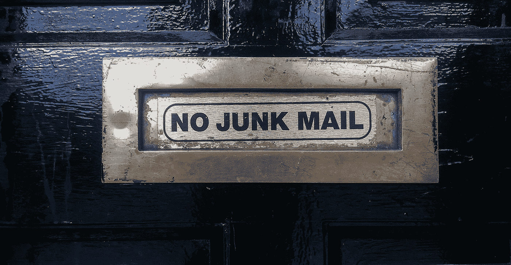
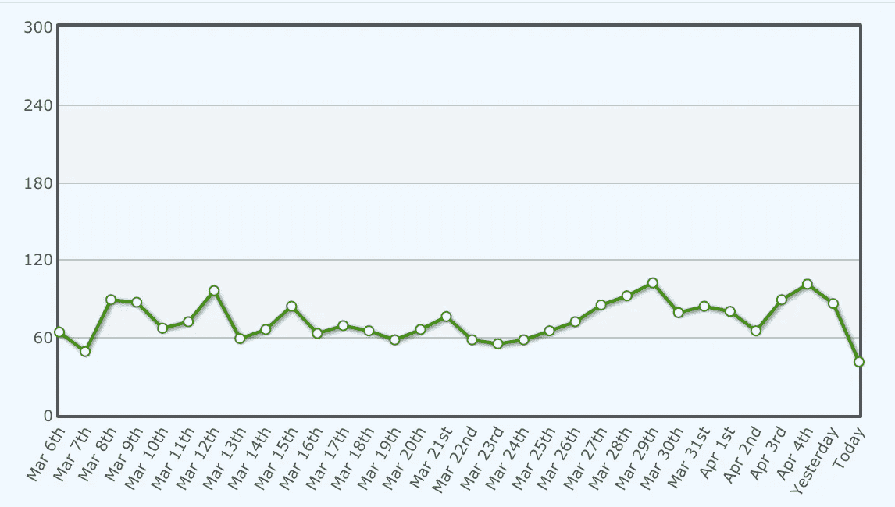

# 如何每天获得 100 名订户，并在电子邮件营销方面表现出色

> 原文：<https://medium.com/hackernoon/how-to-be-awesome-at-email-marketing-and-get-100-subscribers-day-ac9b4974c6ed>

## 吸引潜在客户的 10 个简单步骤

如果你正在创建内容并试图在网上销售产品，很有可能你被告知要创建一个电子邮件漏斗。

如果你刚刚开始，你可能不知道如何创建电子邮件漏斗。

> 你可能甚至不知道什么是电子邮件漏斗！

电子邮件漏斗是订户成为潜在客户的途径。

你的目标市场中的每个人都不会向你购买，但总有一定比例的人会向你购买。

通过创建一个强大的电子邮件渠道，你将更有效地销售你的产品，而不仅仅是把你的产品放在产品页面上，希望人们会点击它。

那充其量是一厢情愿。

虽然这个话题值得写一部相当长的电子书，但我会尽力把它归纳成 10 个简单的步骤。

# 1.设置带有自动回复功能的电子邮件列表

自动回复是一个自动发出的电子邮件序列。

> 自动平衡！

一旦用户注册，总会有一组预先设定好的消息发出。它可以立即开始，然后是每周的电子邮件，或者它可以立即开始，然后是每天的序列。

你也可以设置电子邮件序列，让**总是**在周一开始，比如 [20x 你的潜力。](http://20xyourpotential.com/)

***看到他们页面上那个计数器了吗？我跟你赌 20 美元，那个计数器会在周一自动重置，在下一周的周一再次对那个星期的任何订阅者开放。***

不幸的是，因为自动回复功能对销售产品来说是如此强大，它们通常不包括在大多数电子邮件软件的免费计划中。即使有了 Mailchimp[上的 2000 用户免费计划，你也无法使用他们的自动回复功能。*【编辑:事实证明，他们的免费计划现在允许你使用他们的自动回复功能，所以现在你更没有理由设置一个。]*](http://www.mailchimp.com/)

然而，你可以测试一个电子邮件漏斗作为一个独立的发布来销售你的电子书/课程/产品。然后，如果你的产品表现良好，你可以通过升级你的电子邮件软件来投资你的生意。

# 2.为订户创建登录页面

登陆页面只有一个目标:*吸引电子邮件订阅者。*

有许多优秀的登录页面解决方案:

*   [Thrive 内容构建器](https://thrivethemes.com/landingpages/)(现为 Thrive 架构师)
*   [解绑](http://unbounce.com/)
*   [首页](http://leadpages.net/)

这是三个受欢迎的，但谷歌搜索会给出更多的选择。我使用 Thrive Architect 和 Leadpages 的组合作为我的挤压页面和销售页面。

我的电子邮件列表每天有大约 50-100 名订阅者，我的登录页面转化率为 62%，因为我非常了解我在 [Audio Issues](http://www.audio-issues.com) 的听众。

Subscribers/Day

Conversion Rate for Email Subscription Squeeze Page

如何让人们订阅是棘手的部分，为此你需要给他们一个理由*为什么他们应该*。

# 3.给人们一些有价值的东西作为订阅的交换

人们订阅你的邮件列表的动机是什么？他们为什么要关心？

> 对他们有什么好处？

解决你知道你的观众有一个微小的问题。它不必是一个全面的解决方案(*这就是你的产品应该是*)。

给他们一个解决小而烦人的问题的方法**你知道他们有。**

这通常被称为销售线索磁铁，或“选择加入贿赂”，听起来比实际情况更糟。

如果你足够了解你的市场，你可能会有很多想法。

这里有几个。你可以混搭，也可以自己寻找灵感。

*   美食博客的 10 个简单食谱。
*   如果你在生产力领域，采访一位生产力大师。
*   图形艺术家的 10 个连环画布局模板
*   创业者网站搭建视频
*   广告文案的标题技巧

如此等等…

然而，如果你是一名作家、音乐家或艺术家，那么你可能会以不同的方式来对待它。

不要提供一个问题的解决方案，而是提供一些你的粉丝在其他地方得不到的独家信息。

*   独家现场录音
*   没有在其他地方发表的短篇小说
*   独家采访
*   幕后视频

当你更像一个有创造力的艺术家而不是企业家时，考虑更多的 VIP 身份而不是快速解决方案。尽管如此，如果你的观众是想效仿你成功的人，那么“这就是我如何做到的”视频可能是一个两全其美的好方法。

# 4.帮助你的订户

不要仅仅停留在销售线索磁铁上。如果你有一个很好的线索磁铁，可以解决你的观众的问题，那么你已经赢得了他们的信任。

此时，是时候通过额外的电子邮件解决进一步的问题来巩固这种信任了。

*   在销售线索磁铁中，你有什么可以详细说明的吗？
*   你的市场有你能帮助解决的无关紧要的问题吗？

这些都是关于未来电子邮件的想法。

一旦他们知道你的邮件包含有价值的信息，可以解决他们的问题，他们就更有可能打开它们，因为你已经赢得了他们的信任。

我必须承认，我为我的电子邮件不总是有价值而感到内疚。然而，我的自动应答序列是精心设计的，以提供适量的价值和推广。

# 5.具有娱乐性和知识性

您希望与您的订户建立关系。展现个性，做好自己。

没有人喜欢乏味的企业营销文案。讲述你是如何克服他们面临的问题的，以及为什么你认为你应该向前支付该解决方案。

风度翩翩，让人们进来。请他们回应你。如果你告诉你的读者你阅读了你得到的每一个回复，他们很有可能会给你发邮件。

利用这个机会询问你的订户他们需要什么帮助。这些都是你可以用来制作产品的重要信息。

# 6.调查你的听众

在销售线索磁铁之后的第一封电子邮件中，我通常会问我的观众他们最纠结的是什么。

我使用 Ryan Levesque 的[提问调查法](http://amzn.to/2q1hEpt)，这是我极力推荐的一本书。

使用一个简单的谷歌调查，我可以收集我的观众的所有反应，并在以后进行分析。

这帮我做了两件事:

*   给我内容的想法，给我的订户，帮助他们更进一步。
*   帮助我组合我知道他们会想要的产品。

一旦你知道你的观众的痛点是什么，就更容易为他们创造有用的内容。真的就这么简单。

# 7.为他们的问题提供全面的解决方案

在你开始邮件漏斗流程之前，你可能已经有了一个产品想法。

您可能已经根据调查反馈创建了一个。

或者你把两者结合起来，调整你的想法以更好地适应你名单上的观众。

不管你是怎么想出这个主意的，只要确保它是他们*已经*遇到的问题的真正解决方案。

如果你问你的市场他们的问题是什么，你创造了一个解决方案来解决这个问题，他们就会购买你的产品。

> 有一点细微差别，但它真的就这么简单。

# 8.预见异议并解决它们

即使你的订户想成为你的顾客，他们可能仍然担心你的产品是否适合他们。

我建议在你的电子邮件序列中用一整封电子邮件来回应这些异议。

使用类似“[产品 X]适合我吗？”像常见问题一样写邮件。

如果你从你的观众那里收到一堆关于你的产品的问题，很有可能其他更沉默的订阅者也有同样的问题。

在 evergreen 电子邮件中解决这些异议减少了您必须回复的电子邮件数量，它会自动消除和转移那些犹豫不决的买家的顾虑。

# 9.使用证明来增加可信度

如果你的产品不能帮助任何人，它就会被认为是没有价值的。

一份关于你的产品帮助创造的转变的证明比你向他们做出的任何承诺都有价值。

如果你的产品是新产品，没有顾客给你推荐，你可以做几件事:

## 关于你的推荐

使用人们对你的品格、正直和乐于助人的评价。它不一定与你的产品直接相关，但可以是类似于“[你的名字]在[无论你的行业/问题是什么]上给了我巨大的帮助。”

## 赠送礼品以获得奖状

如果你觉得这太可疑，你可以搞一次促销活动，赠送几份你的产品以换取一份推荐。

免费赠送东西可能有点低估了它的价值，但是你让订阅者为他们的免费产品工作。除非你有非常忠诚的观众，否则你的赠品不会有 100%的推荐率。

然而，如果你送出 10 份，而你得到 3-5 份推荐，这通常足以在你的邮件序列中创造一个有价值的故事。

# 10.在发布序列之后调查你的观众

你永远也不会把你所有的订户转化为顾客。那是极其一厢情愿的想法。

但是，在发布会结束后，你可以试着更好地了解你的非买家。知道他们为什么不买，会帮助你写出更强的文案。这会帮助你更好地组织你的邮件。它将帮助你理解在你的产品的未来版本中添加什么，或者在你创造的下一个产品中关注什么。

非买家调查非常有用，但不要忽视你的实际客户。知道*为什么* *有人买了*也很有用。它帮助你更好地了解你的目标市场，他们的内在推理和他们的词汇。

# 结论

拥有一个电子邮件漏斗是你在网上创业时做出的最重要的商业决策之一。

如果你有流量进来，并且你的登陆页面将流量转化为用户，这就是**字面上的自动销售系统！**

睡觉的时候有钱。遛狗的时候要给钱。抑郁时的钱。当你站在世界之巅时的钱。

我知道你需要做很多技术上的事情来设置这种东西，但是如果这是你正在努力解决的问题，并且想要得到帮助，请告诉我我能怎么帮助你。

期待更多的了解你！

比约尔格温

## 我是一名电子邮件营销专家，帮助您扩大电子邮件列表，产生吸引内容的想法，并通过电子邮件营销推动销售。

## [获取您的精彩电子邮件宣言，了解如何通过 6 个简单的步骤每天获得 100 名电子邮件订户。](https://bbenediktsson.com/)