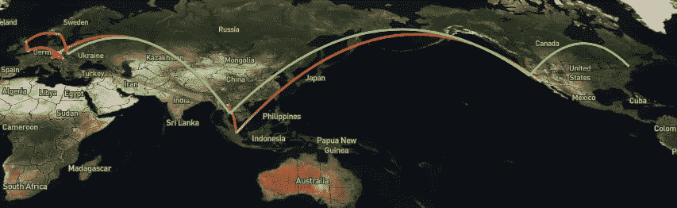
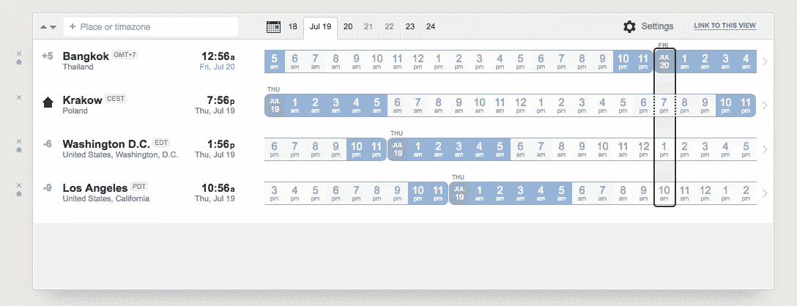

# 如何在旅行中保持高效

> 原文：<https://medium.com/hackernoon/how-to-be-productive-when-traveling-108c855489f2>

今年 5 月，我创办了一家软件代理公司，开始了数字游牧生活。这意味着无论我去哪里，我都会把我的工作带在笔记本电脑和手机上。

以下是我在过去的一个半月里学到的关于当你一直在移动时如何工作的知识。

Screenshot from NomadList, my travels this summer.

# **1。决定你哪天上班**

由于我们大多数人只是为了度假而旅行，当你到达一个新的地方时，很容易忘记你需要完成工作。在观光和完成工作之间，时间会把你的周和日隔开。接受这样一个想法:无论你身在何处，你都生活在其中。

当你周围的环境不断变化时，你需要弄清楚如何进入“区域”。我们的大脑会对触发器做出反应。弄清楚你的工作诱因会是什么。当我坐在咖啡馆里打开笔记本电脑时，我知道是工作时间了。

触发器只有在你不断强化的情况下才会起作用。如果你用一个小时的社交媒体来跟踪一个触发器，那么你已经强化了你大脑中错误的神经元。一旦你扣动扳机，就开始工作。

# **2。快速和慢速行驶**

你去的地方越多，你一天中物流花费的时间就越多。

如果可以的话，我建议你试着在一个地方呆上至少一两周。这给了你足够的时间去看你想看的一切，也给了你足够的时间去工作而不去感受 FOMO。

当你搬家时，优先考虑短途航班。如果你想在城市间跳跃，把这些跳跃打包在两次长期停留之间的几天内。

# **3。致电美国**

如果你在美国有客户或同事，那么你需要某种方式与他们交谈。

以下是我如何使用谷歌语音免费打电话到美国。

1.  获取一个谷歌语音号码。
2.  下载适用于 [iphone](https://itunes.apple.com/app/hangouts/id643496868?mt=8) 或 [android](https://play.google.com/store/apps/details?id=com.google.android.talk&hl=en) 的 Hangout Dialer 应用程序(同时下载适用于 android 的[Hangout Dialer](https://play.google.com/store/apps/details?id=com.google.android.apps.hangoutsdialer&hl=en))。
3.  通过将 hangouts 连接到 google voice 来设置电话转移，并告诉 hangouts 在有来电时响铃。

[**谷歌语音设置**](https://voice.google.com/u/0/settings) **:**

**Google Hangouts 设置:**

现在你可以免费打电话和接电话到美国。只要你有 wifi，你就可以在手机或电脑上接听电话。

无论我去哪里，我首先拿起的是一张有数据套餐的 SIM 卡。这样，我就不必依赖寻找 wifi 来保持随时可达。

如果你在泰国，我推荐真无线。在欧洲，我一直使用沃达丰，但他们的价格过高，我对他们的服务有一些问题。

我喜欢游牧者的一个原因是，每当你到达一个新的城市，他们都会给你推荐，包括一个好的 SIM 卡提供商。

你也可以考虑像 [ProjectFi](https://fi.google.com/about/) 和 [AT & T Passport](https://www.att.com/offers/international-plans/passport.html) 这样的国际电话计划。

# **4。生产力工具**

Is this what productivity looks like?

**沟通:空闲、电子邮件、视频聊天**

已经在#3 中讨论过

**日程安排:谷歌日历和 Todoist**

确保你的日程表与所有的旅行后勤和工作相关事件保持同步。谷歌日历也是安排你的时间段的好地方。

我开始使用 Todoist，取代我以前的物理清单系统。我发现当我在旅途中时，很难跟踪纸质笔记，所以对我来说，一切都在数字化。

**记笔记:文本编辑、Evernote、概念**

出于同样的原因，我也开始再次使用 Evernote。我一直在用 Mac 上的文本编辑程序写大量的笔记。

我喜欢“文本编辑”,因为它是一个不会让人分心的写作工具，但很难让我的笔记井井有条。Evernote 可以让你标记文章，并且他们的搜索功能很棒。

我仍然更喜欢在“文本编辑”中进行实际写作，但我正在考虑将一切都切换到[概念](https://www.notion.so/)作为两者的替代方案。

# **5。时区**

如果你和不同时区的人一起工作，你将不得不应对一些奇怪的时间。

我最喜欢的时区工具是[https://worldtimebuddy.com。](https://www.worldtimebuddy.com/)

Screenshot from worldtimebuddy.com

这是我发现的最好的一款一眼就能比较时区的应用。

对我来说，我最关心的是两个地点之间的日光时间重叠。重叠越少，就越难保持同步。

怪异的时间是你作为数字流浪者生活的主要权衡之一。愿意在深夜或清晨工作。

6。持续改进

如果你现在有坏习惯，旅行是重置大脑的好方法。成瘾有很大的环境因素。

搬家给你一个重新开始和养成新习惯的机会。确保你没有带着你的坏习惯。如果你把打开笔记本电脑和去脸书联系起来，那么搬家救不了你。

如果你度过了一个毫无收获的早晨或者养成了一个坏习惯，不要让它扼杀了你完成工作的欲望。散散步，关掉手机，写下你想做的事情。

当你坐下来的时候，强迫自己在接下来的 15 分钟里做这件事，不要做其他事情。这些时间通常足以让你恢复状态。

尽管写了这篇文章，我自己的工作习惯仍然是一个进步中的工作。这些是我目前正在努力改进的主要方面:

1.  时间阻塞
2.  保持有条理
3.  跟踪生产力

你试过把工作和旅行混在一起吗？什么对你有用？