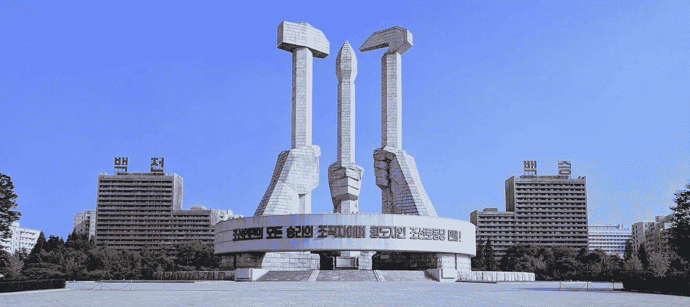
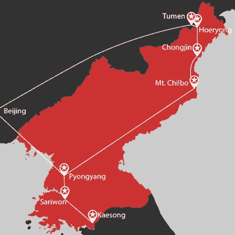
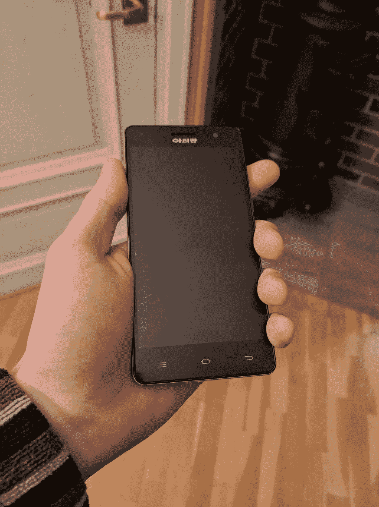
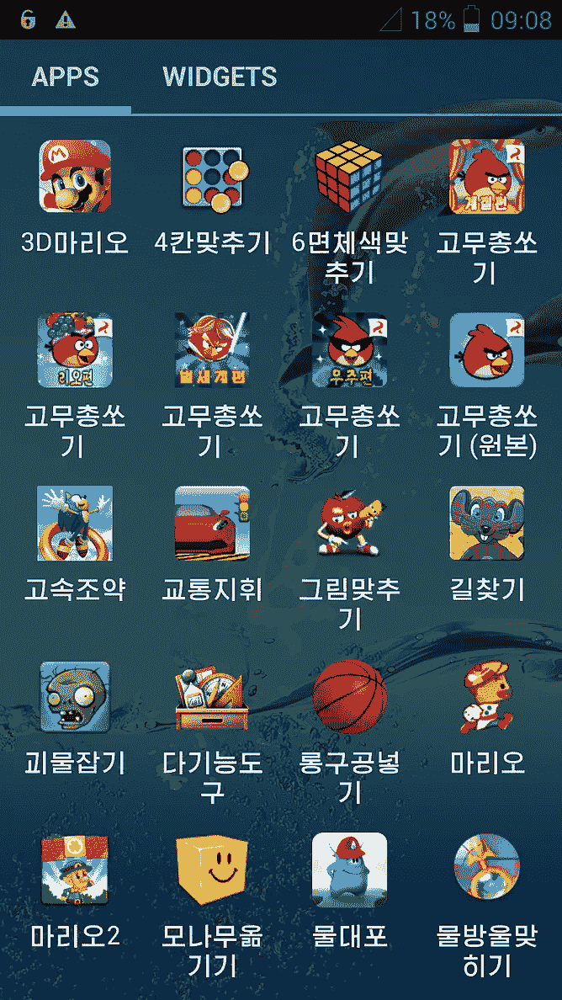
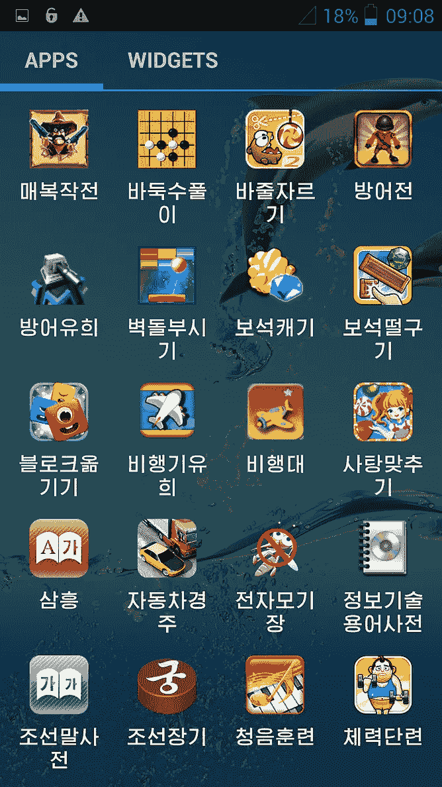
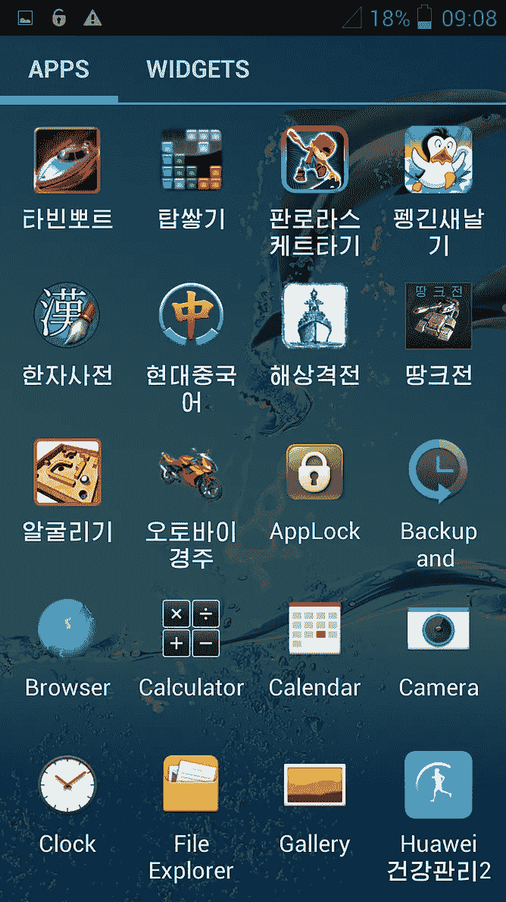
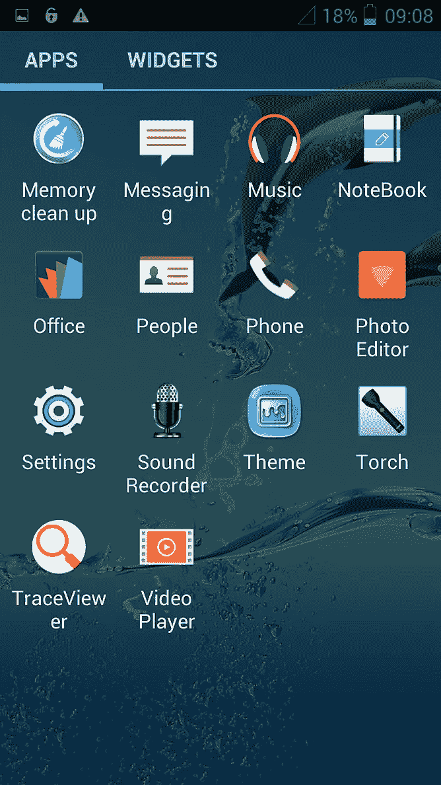
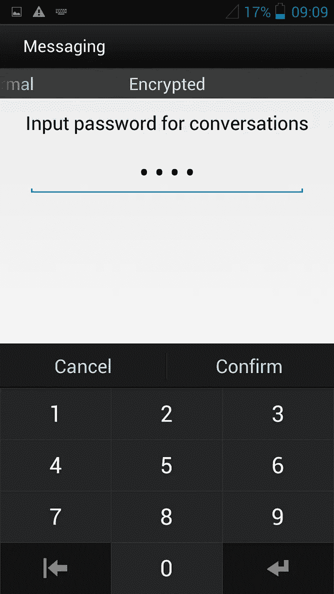
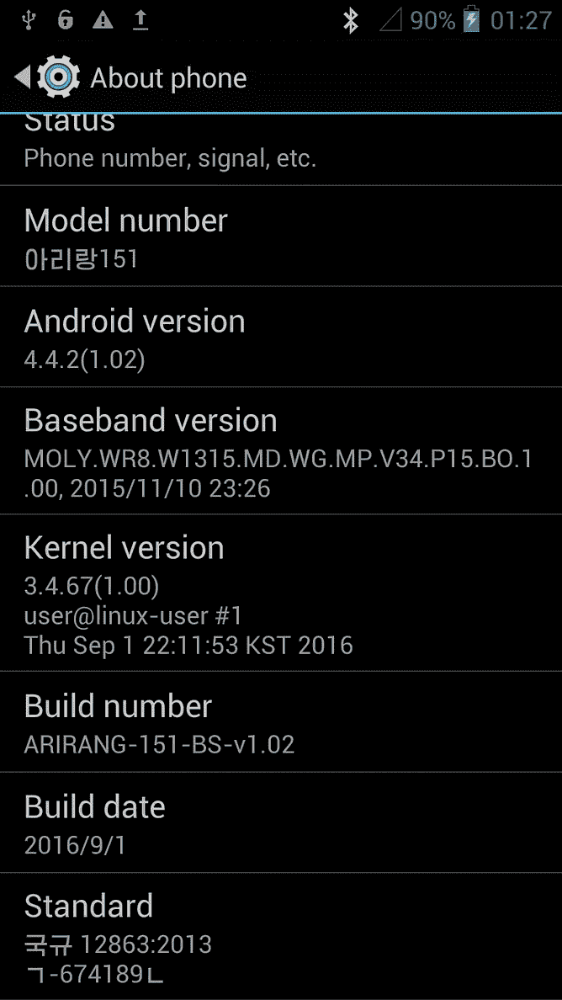
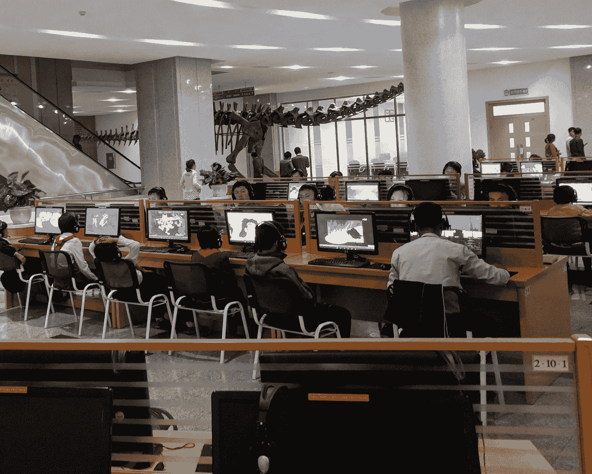

# 如何在朝鲜变聪明

> 原文：<https://medium.com/hackernoon/how-to-be-smart-in-north-korea-85d61443014e>

The Ideals of North Korean Workers Party Monument, Pyongyang

去年，当世界似乎处于核战争的边缘时，我和哥哥去了朝鲜。和许多其他人一样，我们几乎每天都通过新闻或纪录片接触到这个国家。关于集中营、大规模监控和一个以用重型军事装备处决对手而闻名的疯狂领导人的故事，与我们作为在斯堪的纳维亚半岛长大的 90 年代的孩子所经历的事情相去甚远。

**我们一再发现自己留下的问题比答案还多，所以我们决定亲自去那里看看。我们知道参观不能回答我们所有的问题，但希望它能为我们提供一个参考框架。**

游览这个国家被证明是相当容易的。我们决定和少先队旅行社一起旅行，他们负责从签证到火车票的一切事宜，并及时回答我们可能有的任何问题。从他们的大量不同的旅游目录中，我们决定选择[“真正的旅游:朝鲜”](http://www.youngpioneertours.com/tour/real-deal-tour-dprk-2/)，它提供了一个难得的乡村景观，我们希望能更细致入微地了解这个国家。

The Real Deal Tour of North Korea

这是一次为期十天的旅行，我从未体验过。当然，这是精心策划的。我们见到的人和看到的地方显然都是经过精心挑选的，以讲述一个繁荣和自给自足的故事，这是政治制度的基石和金氏王朝存在的理由。尽管如此，或者也许正因为如此，他们没能掩盖这个国家的极端贫困。他们无法掩盖停电和自来水的缺乏，运送农民和枯萎庄稼的牛车，在稻田里为家人或黑市收集收获的谷物的老妇人。他们也无法隐藏锈迹斑斑的清津火车或有轨电车，它们曾经载着工人去钢铁厂。或者是奇尔博山国家公园吉祥物上剥落的油漆。最时髦的维尼纶不够时髦，不足以掩饰饭后卡拉 ok 时的强颜欢笑。

在真正的计划经济精神下，整个行程似乎都是由明确的规则规定的，没有任何偏离的余地。每顿饭都必须有泡菜，每个卧室都必须配备冰箱，我们行程中的每一站都必须有礼品店，通常卖的东西和上一站一样。不断有人向我们提出购买各种东西，从庆祝洲际弹道导弹发射的邮票，到装饰有狮子和其他野生动物图案的大型壁挂式地毯，这些在该地区非常不典型。然而，事实证明，我最喜欢的纪念品是在礼品店买不到的，即一部“本地生产”的智能手机。

**阿里郎 151 于 2016 年**发布，看起来像一部普通的安卓手机。它有一个摄像头，蓝牙，3G，4GB 内部存储，一个 MicroSD 卡和一个 micro-SIM 卡插槽。它没有的是 WiFi，这是有道理的，因为我在整个访问期间都没有观察到我自己的手机上有 WiFi 热点。

The Arirang 151

**手机的操作系统是安卓 4.4.2 的大幅修改版本。除了定制加载屏幕和主题，这款手机还配备了一个 500 MB 的宣传视频(考虑到 4GB 的存储空间，这是一个有趣的选择)，以及大量预装的应用程序，主要是游戏，包括超级马里奥、植物大战僵尸、五个不同版本的愤怒的小鸟、割断绳子等。由于这款手机是二手的，因此随后安装了华为健身追踪器应用程序。我在整个访问过程中观察到有几个人在使用这些追踪器。我不知道他们戴着它们是为了看时间、健身还是炫耀财富，但对于一个如此热衷于 DIY 的政权来说，允许佩戴中国生产的消费电子产品似乎是一个有趣的选择。**

************************

**Apps, encrypted text messages, and system information**

****除了游戏，手机还**预装了一个 app locker，应该可以方便的锁定应用，以及短信和联系人的“加密”。然而，令人怀疑的是，这个应用程序锁提供了比简单的屏幕锁更多的安全性。这些信息肯定不是端到端加密的，应用程序用一个四位数的访问码锁定。储物柜的目的可能是给用户一些虚假的隐私感，鼓励更自由的对话。**

**然而，与任何标准智能手机的最大区别不是定制的应用程序或主题，而是当我试图将手机连接到任何东西时变得明显的东西。虽然我可以通过蓝牙与电脑建立连接，但我无法成功交换任何信息，当我插入 SIM 卡时，手机就关机了。我成功地通过 USB 进行了通信，并可以传输手机上的所有内容，但当我试图将任何内容传输到手机上时，文件在打开时就会消失。**

****我对**为防止与外国设备交换数据所做的努力印象深刻。难怪这款手机发布时已经使用了五年的操作系统。虽然我拒绝相信硬件是在朝鲜生产的，但这些修改可能是朝鲜程序员在当地进行的。众所周知，朝鲜会实施网络攻击，当我向当地人介绍我的程序员职业时，他们有时会提到他们的近亲中有人在国外从事开发工作。**

****访问一个在互联网出现之前就与世隔绝的国家，这本身一定会很有趣。令我惊讶的是，朝鲜并不是我想象中的科技荒原。在全国各地，我们都被自豪地展示了装满计算机的图书馆，据说所有的图书馆都连接到了内部网，并对公民免费开放。对于这样一个孤立且自上而下结构化的国家，这显然是一个由口述而非创新驱动的声望工程。向大众普及电脑理应将朝鲜带入“信息时代”，尽管它缺乏最具定义性的特征，即信息的自由流动。****

****

**Computers at the Sci-Tech Complex, Pyongyang**

**智能手机和健身追踪器与电脑的不同之处在于，它们是个人的，公众肯定买不到。它们非常昂贵，并且只提供给有外汇的公民，例如在旅游业工作的人。但人们正在使用它们，特别是在平壤，而且全国各地都有一些配套的基础设施。**

****假设智能手机** **不仅仅是用来给来访的外交官和游客留下深刻印象的工具，它们的存在见证了关于周围世界的一些知识和过去 10 年消费电子产品取得的技术进步。与中国的密切关系和走私的韩国肥皂剧可能引起了对智能手机的意识和需求，而朝鲜政权选择了满足这一需求。如果是这样的话，那么这个国家可能并不像人们想象的那样坚不可摧。****

**我们当然仍在谈论由无所不在的政府生产和批准的设备，政府的生存依赖于了解和控制一切。但是，通过给它的人民工具和专业知识，绕过政府实施的安全措施，他们可能只是创造了一个他们无法控制的媒体。**