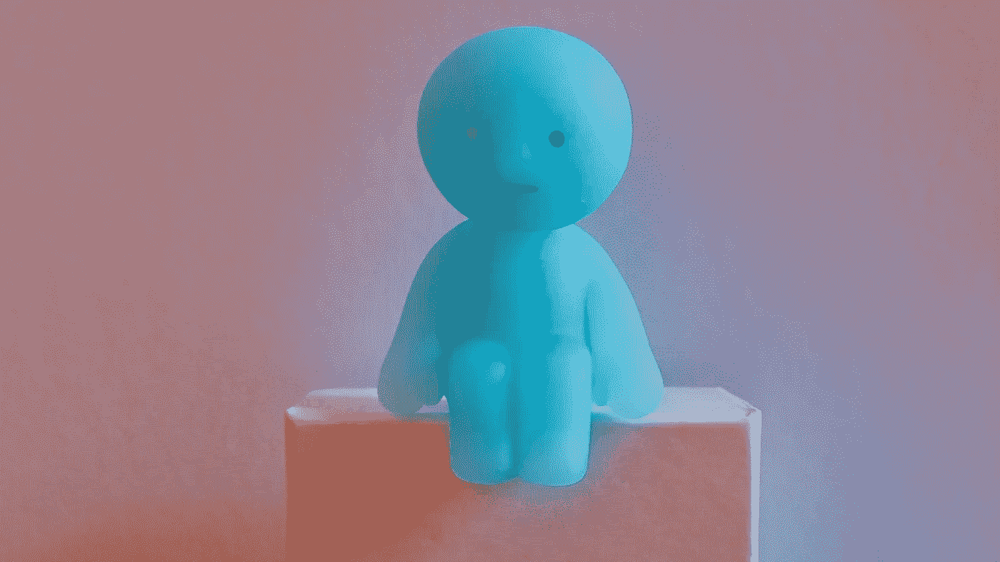

# 如何在现在和未来获得成功

> 原文：<https://medium.com/hackernoon/how-to-be-successful-now-in-the-future-c87cc77d723f>

## ***心态，心态&心态***

数字技术现在很“热门”。这是显而易见的。围绕这些技术的活动数量增长之快令人惊讶。

每个人都想更多地了解新技术，以及它们将如何影响他们的生活。每个人对他们都有自己的看法。一些人喜欢他们，而许多人(仍然)不信任他们。

上周在日本举行的一次会议上，这一点对我来说(再次)变得非常清楚。

我们的生活越来越围绕着数字技术。算法和社交媒体已经“主宰”了我们今天的经济、社会和文化。它们越来越多地决定了我们工作、交流和联系的方式。我们生活的方方面面现在都是“技术驱动的”

和往常一样，并不是每个参加日本活动的人都被说服了。他们紧紧抓住“旧世界”不放，否认改变是可能的。有趣的是，他们提到了比特币的波动性和区块链的能耗来证明他们的观点。很明显，他们只是不想相信世界的数字化。

> **但他们错了。“数字化转型”是真实的，它正在我们身边发生。**

没有回头路了。我们都必须思考这些技术如何影响我们的生活，以及我们应该做些什么。

这里并不是要理解数字创新背后的所有技术细节。但是，我们确实需要 ***改变我们的心态*** 和 ***弄清楚*** 我们如何利用数字技术创造的巨大机遇。

> 如果使用得当，数字技术可以让我们更快乐、更成功。

他们有能力“放权”，给我们更多的自主权和选择权。这就是“数字转型”的真正含义:影响我们所有人的文化转变。

**那么，我们该如何改变自己的心态呢？**

我们怎样才能培养“数字思维”，以便在这个新世界中获得最大收益？

我认为我们需要意识到数字文化的风险，并更明智地对待我们与新技术的关系。

这就是我的意思。

# 注意数字文化的“风险”。。。

当然，我们都可以看到与新数字技术和围绕它们出现的数字文化相关的“危险”。

考虑这些技术带来的一些潜在风险:

*   我们倾向于过度关注短期目标。例如，我们专注于立即积累尽可能多的“关注者”、“喜欢”或“正面评论”。是的，这可能是令人兴奋的。但“速赢”的不利之处在于，人们对开发有意义的内容或体验、激励他人或对社区或社会产生积极影响的兴趣大大降低。
*   我们不断地与他人进行不健康的比较。我们用“关注者”和“喜欢”来衡量我们相对于他人的表现，我们害怕“负面评论”这种负面评论是我的一些同事和朋友害怕使用社交媒体的原因。
*   我们面临着“羊群行为”的风险。我们随波逐流，寻求他人的认可或承认，我们不再真实，为了“合群”而看不见自己。
*   我们经常被数字技术“俘获”，它成为一种占据我们生活的痴迷。我们被我们的“屏幕时间”所困，并对我们的设备产生了不健康的依赖(在某些情况下，上瘾)。
*   我们有时甚至会基于对我们的“在线角色”的认可，发展出一种常常不应有的自我重要性或权利感。

当然，我这里一概而论。但是我认为每个人——如果他们诚实的话——都能理解这些风险。对于任何参与新数字文化的人来说，它们都是一种持续的诱惑。

对这种风险的一种可能的反应是“拒绝”这种技术，并退出与数字世界的接触。

或者，人们可能会等待技术提供商找到这些问题的“技术”解决方案。例如，旨在限制屏幕时间和降低过度依赖数字设备的风险的技术措施。

然而，这种策略的问题在于，通过这种方式退出，我们可能会失去由技术驱动的数字文化创造的大量机会。

> 这样的数字机会是非常真实的。

如上所述，技术为我们提供了多种选择和自由，使我们人性化，个性化，并带来更大程度的幸福和多样性。

# **更聪明地使用数字技术**

但是，我确实认为我们需要在新技术上变得更聪明。我们必须“想出办法”来降低风险，最大限度地利用机会来建设和创造一个让自己满意的生活。

我相信这意味着发展一种新的“数字思维方式”,我们需要继续努力。我们都需要成为创造新机会的技术的积极使用者，而不是上述有害过程的受害者。这关系到我们所有人(年轻人和老年人)，也关系到企业。

**那么我们如何弄清楚呢？**

在与新技术的关系中，我们如何变得更聪明？

**这种新的数字思维模式的关键要素是什么？**

以下是开始讨论的五条建议:

## **# 1——积累经验**

我们需要追逐当下，积累尽可能多的新经验。通过新的经历，我们可以对“我们是谁”和“我们想用生命做什么”有更好的认识在这方面，我们不应该过分关注结果，而应该考虑过程。

## **#2 —实验**

我们需要“边做边学”。这意味着无论我们做什么，都要练习并变得更好。当然，当我们努力不断自我完善时，我们必须小心谨慎，但是这种实验性的生活是发现和创造新机会的唯一途径。

## **# 3——保持耐心**

我们需要坚持不懈，始终如一。当事情没有像希望或预期的那样进行时，我们应该避免失望或沮丧(例如，当社交媒体没有吸引预期的流量时)。持续接触并不总是容易的，但这是最好的选择。

## **#4 —共同创造**

我们需要理解协作和分享的重要性。数字世界非常重视“团队”和“团队合作”。

## **#5 —构建社区**

最后，我们需要寻找和我们有相同兴趣的其他人的社区。这样，我们可以创造一个真正鼓舞人心的环境，让我们成为更好的自己。

以上所有策略都可以和我之前写过的“软技能”联系起来。

# **最后一个想法**

在数字时代，技术确实成为我们身份的一部分。在这方面，我们现在都在成为“电子人”。但不是以一种不健康的方式，而是以一种授权和创造更多机会来实现个人价值的方式。

以“社交媒体”为例。这是在快速变化的世界中引人注目的完美方式。然而，令人惊讶的是，我的学生中很少有人认真对待社交媒体。是的，他们有一个脸书或 Instagram 账户，分享他们生活中的许多事情，但没有认真努力建立一个可以帮助他们未来生活的个人故事或品牌。

此外，我们所有人都需要保持谦逊，明白我们在不断地学习自己。由于创新呈指数增长，“数字生活”永远不会被完全掌握。

在这个新的数字世界中航行并不总是容易的，但是“搞清楚”和变得更聪明的好处是真实的。

最后，我们这个新世界最好的一点是，年龄、背景或先前的经历不再像以前那样重要。这都是关于“数字思维”这是我在日本活动中传达的主要信息。

> 拥有正确的心态确实会为我们所有人创造更多获得自由、幸福和更高层次人性的机会。

*感谢您的阅读！请点击*👏*下面，还是留下评论吧。*

每周都有新的故事。因此，如果你关注我，你不会错过我关于数字时代如何改变我们生活和工作方式的最新见解。