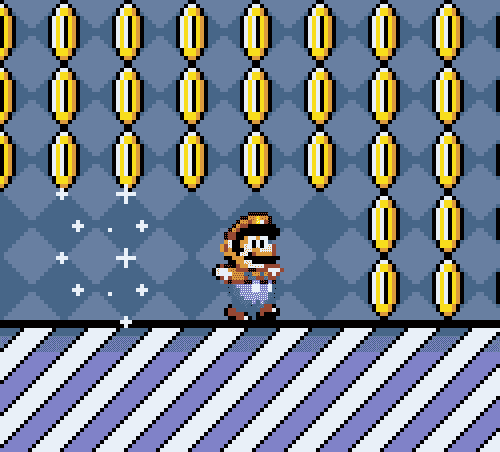
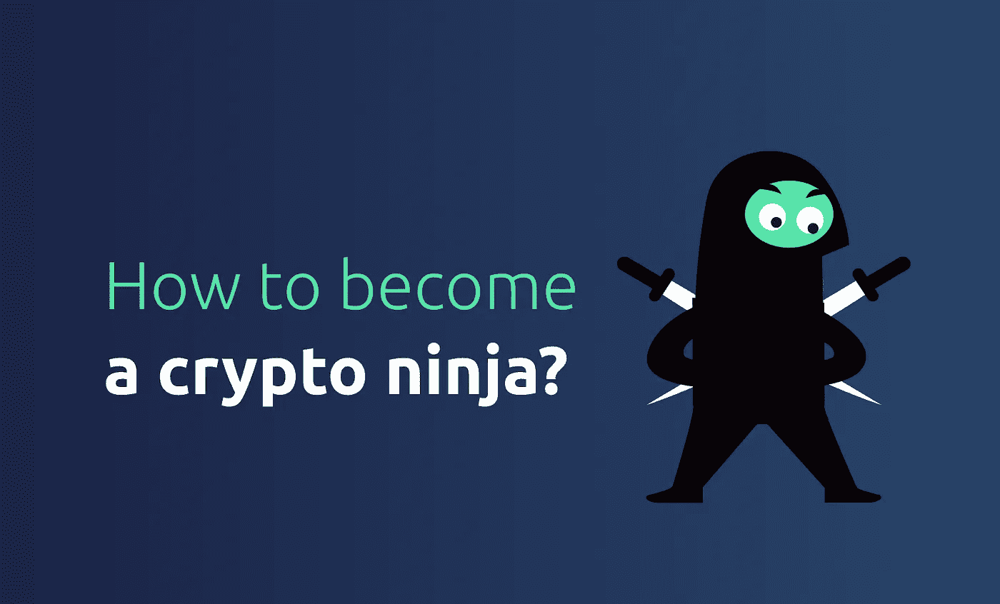
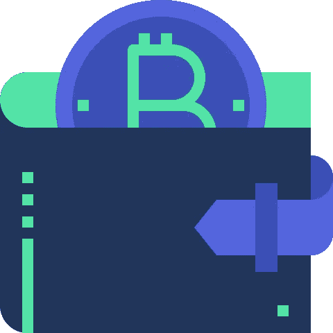
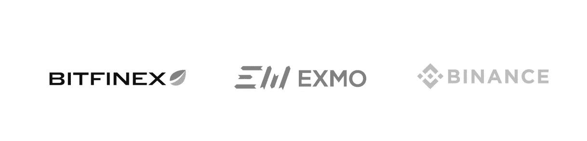
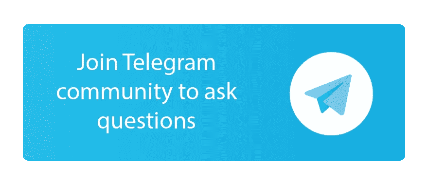

# 如何成为一名加密忍者

> 原文：<https://medium.com/hackernoon/how-to-become-a-crypto-ninja-8c69f948178b>

虽然加密货币的实施已经计划和讨论了好几年，但随着数字时代的发展，它的使用直到最近才出现爆炸式增长。

许多人将这些时代称为**比特币繁荣的时代**，因为它的产生完全扰乱了交易活动。**事实上，比特币可以被视为所有加密货币的先驱。**

> 加密货币的好处主要可以总结为几点，旨在将世界从银行系统中解放出来，并允许更安全的交易。

记住这一点，投资加密货币似乎是一个巨大的机会，**因为每一笔加密交易都在区块链技术的帮助下被安全地记录下来。**

## 如果你曾多次想过参与到这场数字货币热潮中，但你还没有采取任何行动，也不知道该向哪里迈出第一步，那么这篇文章就是为你准备的。

# 今天我们想看的是:如何成为一名加密投资者？这项活动涉及哪些选择和机会？

他要做的第一个加密步骤当然是创建一个加密钱包。我们知道加密货币都是数字的，但归根结底，你的加密硬币和加密钞票也需要一个加密钱包。

**加密钱包允许您存储、控制和完全拥有您的硬币，并让您有机会监控您的余额并在完全安全的情况下进行交易。**

创建和管理一个加密钱包是非常容易的，但是请记住，选项是多种多样的，而且在大多数情况下，专家建议混合使用不同的钱包，因为它们都有自己的特点。

根据您的目的和偏好，您可以决定使用:

> **钱包应用，**
> 
> **桌面钱包，**
> 
> **网上钱包，**
> 
> **硬件钱包或**
> 
> **纸质钱包。**

1 **钱包应用**通常是每个人在开始密码交易生涯时都喜欢的应用，因为它们易于使用，通常具有友好的界面，最重要的是，它们可以随身携带并随时查阅。

它们不同于桌面钱包。这些，你很容易理解，只能从你的电脑上访问。你可以很容易地下载它们，它们保证你有更高的安全级别。

3 **在线钱包**可以从任何提供互联网连接的设备上访问。

另一方面，如果你不想依赖你的网络，你可以选择一个硬件钱包，它可以完美地离线工作。

5 另一个离线选择是由**纸钱包**代表的，它允许你打印出你的比特币私人密钥，这可以是一个对抗黑客的安全解决方案。

## 无论你决定用什么样的钱包，对大多数人来说，打开的过程都是相似的。所有你需要做的就是创建你的加密帐户，链接到你的卡，你就一切就绪了！

*别忘了，你选择的钱包取决于你想交易的货币。其中，Ledger Nano S 被认为是以太交易所的最佳选择，而比特币基地则被推荐用于比特币。*

## 当然，选择哪种货币交易是在选择哪个市场交易之后。
你不能在**外汇股票**交易所进行加密交易，但选择仍然很多——超过 250 种！

1 其中一个选项是**币安**，它可以确保安全交易和低费用。与其他加密交易市场相比，币安的交易量最高，有超过 700 万的交易者在使用它。

2 另一个重要的加密市场是 **Bitfinex** ，它也被来自世界各地的数百万人使用，它已经成为最大的比特币交易平台四年了。

第三种选择可能是 Exmo，它宣传快速存款和快速取款，同时承诺市场上最低的佣金。

正确的加密交易市场的识别很大程度上取决于你决定交易的货币。我们之前提到过比特币，因为它肯定是所有数字货币中最知名的。
当然，然而，比特币并不是市场上唯一可用的货币。**其他加密货币有莱特币、以太币、瑞波币。**

推出 itecoin 的目的是提供比比特币更好、更便宜、更快捷的选择，但从本质上来说，它与加密货币的先驱没有太大区别。

E 是用作以太坊平台加密货币的令牌。以太坊的主要特点是它的**区块链技术专注于运行任何分散应用程序的编程代码。**

ipple 于 2012 年推出，它与其他加密货币不同，因为它是**唯一一种与合法银行相连的货币，如桑坦德银行、美洲银行和瑞银集团。**

## 确保你在遇到的每个转折点都朝着正确的方向前进的一般规则是仔细做研究，避免鲜为人知的选择，以避免欺诈和容易被黑客攻击的平台。

*有什么问题或顾虑吗？问问我们电报社区的团队！*

## 交易链接

## [网站](https://aitrading.com)

## [路线图](https://aitrading.com/#s_time)

## [白皮书](https://aitrading.com/pdf/AITrading_WP_EN.pdf)

## [媒体博客](https://medium.com/aitrading)

## [电报社区](https://t.me/aitrading_com)

## [电报通道](https://t.me/aitrading_en)

## [推特](https://twitter.com/aitrading_com)

## [脸书](https://facebook.com/aitrading.official)

## [Insta](https://instagram.com/aitrading_official)

## [Bitcointalk 安](https://bit.ly/2It3Dd2)

## [钢模](https://steemit.com/@aitrading.com)

## [子编辑](https://www.reddit.com/r/aitrading_official)