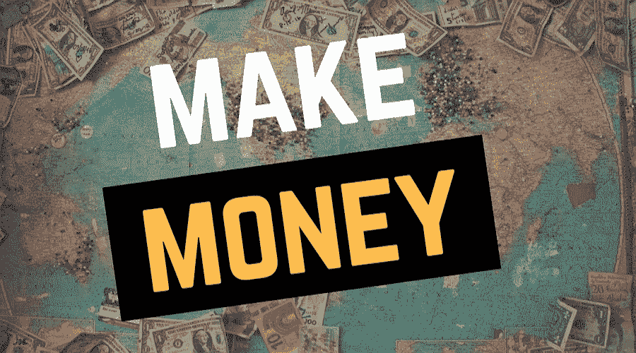
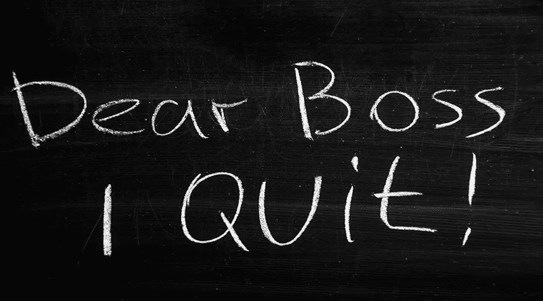
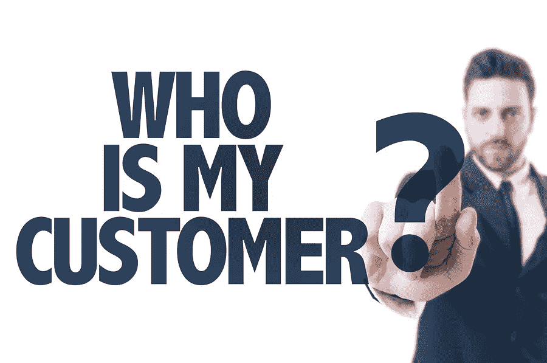
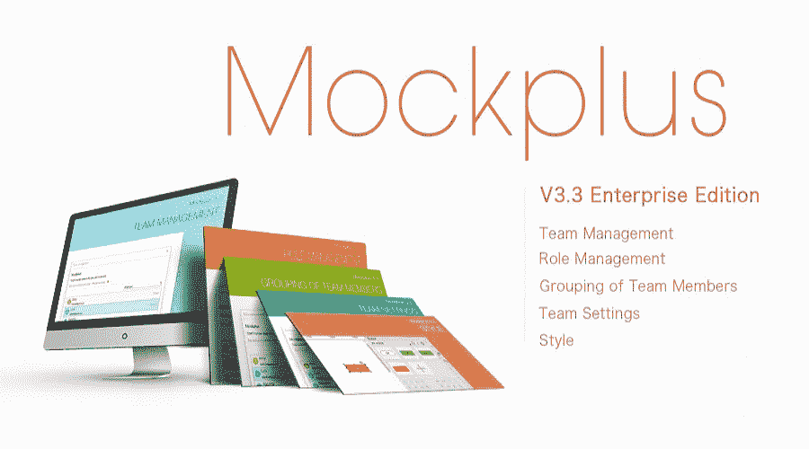
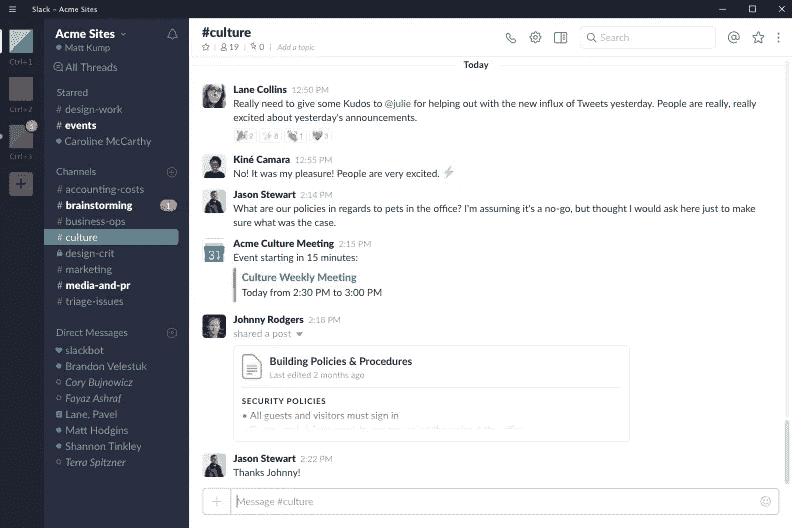

# 如何成为一名自由网页设计师并获得一份真正的工作

> 原文：<https://medium.com/hackernoon/how-to-become-a-freelance-web-designer-and-get-a-real-job-9ecd2f9dc402>

如果你想成为一名自由网页设计师，这篇文章将指导你开始一份自由网页设计工作的所有细节。

你幻想过没有每天打卡，被人呼来喝去的生活吗？

你喜欢在家工作，做自己的设计生意吗？

你准备好成为自由网页设计师了吗？你适合做一个吗？

如果你选择成为一名自由网页设计师，这篇文章将指导你了解你需要知道的所有方面。

这里列出了在你想成为一名自由网页设计师之前最常被问到的四个问题:

# 1.自由网页设计师挣钱多吗？

看情况。老实说，我经常羡慕我的一个自由网页设计师朋友，他不需要早起赶公交车。他可以做任何他喜欢的事情，而不用被监督。但是做一名自由职业者对他来说仍然是一个挑战，毕竟没有固定的工资收入。

然而，随着他业务的扩大，收入自然会增加，然而，这也伴随着牺牲自己的时间和更多的精力的风险。如果你想赚更多的钱，你需要做的就是提升你的设计能力和业务能力。

一开始，你赚不了多少钱，但这只是你需要经历的一个过程。如果你能管理好你的合作关系圈，提高你的设计能力，你就会富有。

# 2.你不用和各种各样的人打交道？

有些人可能很烦人，尤其是客户。但即使你不在办公室工作，仍然需要与不同的人打交道，没有人，没有资源，也就意味着没有钱。你不能强迫他们和你有同样的想法，显然，他们不是网页设计师。如果他们能成为你的客户或合作伙伴，一定有原因。即使你讨厌他们，你也需要忍受。

# 3.作为一名自由网页设计师，你能拥有所有的自由吗？

不要！自由职业不能给你所有的自由。我可以理解你想逃避监督和管理。如果你是一个单身的人(没有宠物)并且不想赚更多的钱，那么你是完全自由的。然而，如果你想有一个成功的项目，那么你肯定会有一个截止日期。

当你花一个小时跑回星巴克喝杯咖啡的时候，一定有好几封邮件等着你回复。因此，你需要降低期望值。但这不是一件坏事，它让你记住你是在为你的客户工作，你必须承担起你的责任。

# 4.在家工作好吗？

如果你在家工作，你可以听音乐，玩电子游戏，穿你想穿的衣服，或者只是整天睡觉，没有人会对你大喊大叫，没有人会在意。但是如果你想有更多的客户和钱，你就不能有自己的时间。此外，在这段时间里，你可能要喂你的宠物或者做一些家务。所以你会发现生活和工作是不能分开的，它可能会影响你的情感甚至你的家庭。在这种情况下，我建议你租一个画室来避免这种情况。

**如果你对以上问题没问题，那么你需要:**

# 1.评估你的设计能力(你能做什么)

如何评价自己的设计能力？你以前的工作经验和设计工作是你自我评估的标准。首先，你可以把自己的[设计作品集](https://www.mockplus.com/blog/post/free-online-portfolio-websites)放到网上或者 Dribbble 上进行评估。第二，你需要知道自己擅长什么，视觉设计？UI 设计？UX 设计？还是[全栈式设计](https://www.mockplus.com/blog/post/full-stack-designer)？在业余时间，你还需要练习专业技能，比如原型制作能力，网页设计能力，网页设计结构。

# 2.在以下 6 个工作平台上快速找到一份自由网页设计工作

*   自由记者
*   向上工作
*   确实是
*   商务化人际关系网
*   Webflow 专家
*   托普塔尔

更多网页设计自由职业你可以在这里找到:

[https://www.mockplus.com/blog/post/web-design-free...](https://www.mockplus.com/blog/post/web-design-freelance)

# 3.找到客户

**从你的朋友和家人开始**——一开始，你可以在脸书、Twitter、Linkedin 等社交媒体上宣传你的新自由职业，并询问你的朋友或家人是否需要做任何设计工作。

**以前的合作伙伴或客户** —与以前的合作伙伴或客户保持良好的关系很重要，你可以直接问他们是否有工作给你。更重要的是，如果你有一个好的名声，会更容易让他们信任你。

**竞赛** — 99designs 和 Crowdspring 允许自由设计师向竞赛提交他们的设计。如果他们被选为获奖者，他们的工作将得到报酬。

# 4.建立自己的关系圈，并维护它

与你的客户保持良好的关系会让你获得更多的工作机会和资源，也会遇到更多有趣的人。你可以问他们有什么你能帮忙的。有时候一个免费的帮助可以获得很大的信任。

# 5.具有较强的业务能力

既然给自己打工，就要经营好自己的事业。不要忽视你的财务管理。这可能很费时间，但当你管理好自己的事业时，这将是你的财富。当然，你也可以雇一个私人助理帮你处理。

# 2018 年你可以求助的 4 个自由网页设计工具

我相信所有的自由网页设计师都希望他们的工作更有效，更省时:

# 时间管理工具—收获

此工具允许您跟踪时间和项目预算。该解决方案为小型企业和自由职业者提供发票和时间表功能。最重要的是，这个项目评估工具非常容易使用，用户可以从软件中发送自动付款提醒，以防客户没有按时支付发票。这是一个“对于讨厌向客户催款的经理来说压力较小的选择。”

# [原型工具](https://www.mockplus.com/) — Mockplus

Mockplus 绝对是设计师最喜欢的 web 原型工具。它的交互功能非常强大，五分钟就能做出一个交互页面。您可以创建自定义项目、web 项目、应用程序项目等。在最新更新的功能中，与表格组件 excel 相同的“合并单元格”和“拆分单元格”功能非常惊艳。还有大量的网页设计项目和模板可供下载。

对于与大客户合作的自由职业者来说，Mockplus 也是一个不错的选择，这要归功于它的[团队合作功能](https://www.mockplus.com/newfeatures/post/team-management-collaboration):

*   修改公司信息
*   邀请/删除团队成员
*   为他们设置角色并自由分组

协作项目成功发布后，您还可以轻松管理它们，例如:

*   通知项目成员进行审核
*   密码保护
*   复制 URL
*   查看修订历史和更多。

**Mockplus 仅售 199 美元。**

# 沟通和项目管理工具— Slack

Slack 是一个实时沟通工具，工作在这里流动。它是您需要的人、您共享的信息和您使用的工具聚集在一起完成工作的地方。它还集成了各种常见的第三方客户端，如 Dropbox、Google Drive、Trello、Github 等。如果您想与您的客户和合作伙伴保持良好的合作关系，这是一个很好的选择。

# 自由职业者合同模板工具—盆景

自由职业者合同是任何自由职业者所能拥有的最重要的文件之一。这是一份具有法律约束力的文件，其主要目的是定义客户和作为自由职业者的你之间的业务关系。无论你是刚刚起步还是已经自由职业多年，拥有一份合同总是为了你的利益和你的客户。如果您有合适的工具、文档和措施来保护您的商业利益，这一点尤其正确。

# 自由网页设计师应该注意 4 件事:

# 1.清楚付款方式

你应该知道付款方式。你是按小时付费还是按项目付费？还有，你需要知道在你完成工作后，他们会付你多久的工资？你需要提供发票吗？

# 2.你应该了解整体的设计风格

设计内容和风格有时候不方便在前期定义，但是你要了解整体的设计风格，估计需要多少时间。

# 3.合同

一份自由职业合同可以让你免除很多与工作相关的压力和痛苦。这可能是你防止被诈骗和浪费时间和资源的唯一保护措施。

你应该检查合同的每一项，并知道在项目完成或产品发布后是否可以公开设计细节。

# 4.提前计划你一个月需要多少钱

如果你想成为一名自由职业的网页设计师，你必须对你每个月的基本开销(个人生活开销和业务开销)有一个财务计划，以确定你需要赚多少钱来维持基本开销。

# 结论

我想每个设计师都梦想成为一名自由职业者，但做一名自由职业者并不容易。如果你想成为一名自由网页设计师，希望这篇文章能给你一些启发。