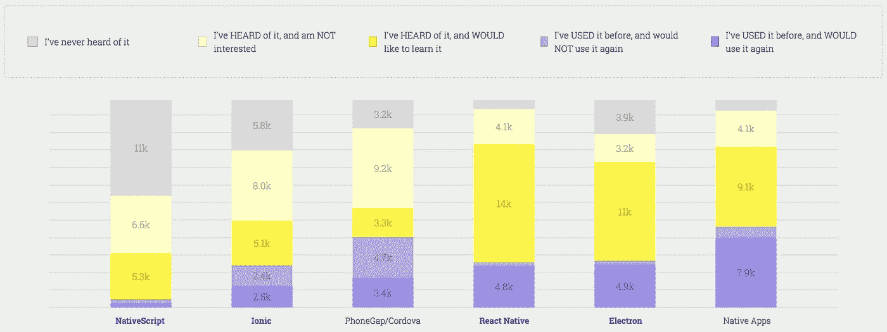

# 2018 年如何成为 React 原生开发者

> 原文：<https://medium.com/hackernoon/how-to-become-a-react-native-developer-in-2018-d9bc85e1d91f>

如果你看了来自*JavaScript 2017*的结果，你会发现大量有趣的数据。

一个让我印象深刻的观点是——很多人想学习 React Native。

[The State of JavaScript Mobile Results](https://stateofjs.com/2017/mobile/results)

很高兴看到这个。我花了去年的时间，全职教人们使用 React Native。从希望最大限度地利用现有资源同时接触 iOS 和 Android 的开发团队，到希望通过移动应用改善社区生活质量的非洲和印度人。

这种教学的一部分是回复人们的电子邮件，他们中的许多人刚刚开始，试图找出学习母语的“最佳”方法。

我经常做的事情:回复邮件。一个经常出现的问题？学习 React Native 的“最好”方法是什么？尽管没有唯一的方法，以下是我告诉数百名即将做出反应的本地开发人员的。希望对你也有帮助。

# 技巧

在我们深入实际成为 React 本地开发人员的战术材料之前，我想给你一些关于自我教育的建议。我发现人们通常擅长自学新的学科……当他们投入时间的时候。

我知道我们都很忙，但是通过做一些事情，你会学到很多。

## 避开噪音

你现在处于中等状态。你可能已经通过谷歌或者在订阅出版物时发现了这一点。这意味着你可能会看到/听到很多与技术相关的东西。

这太棒了！我们生活的这个技术世界正在不断发展和演变。

但这可能会让人精疲力尽，尤其是如果你才刚开始。我的建议是这样的——一旦你读完这篇文章并制定了一个学习计划，请保持低调。

专注于你正在学习的东西，暂时忘掉新的东西。让自己学习核心概念，而不是永远追着最新的包/做事方式不放。

制定一个计划并坚持下去。对抗 FOMO(害怕错过)。一旦你掌握了基础知识，几个星期后就会有了。

## 保持低赌注

我经常回复电子邮件，人们试图将一些复杂的包集成到他们现有的应用程序中，但没有成功。它需要工作——这是我的大应用程序！

我知道你想马上开始开发你的应用*。但那不是学习的最好地方。这是令人沮丧的，因为有许多移动的部分，当下周，你看到你做错了什么，现在你必须在你的应用程序中检查并修复它时，这是令人愤怒的。*

*一次学习一个概念/一个包/一种技术。在一次性/沙盒环境中进行。*

*一旦你在沙盒中找到了答案，就把它带到你真正的应用程序中。您会更高兴，您的代码会受益，并且您会更好地理解发生了什么。*

**

*I guarantee it.*

## *规定时间*

*你很忙。我很忙。我们都很忙。但是我们会为重要的事情腾出时间——也许是和医生的预约，也许是和老板或投资者的会面，也许是和新欢的约会。*

*关键是——你做出承诺，把它放在你的日历上，然后坚持下去。*

*学习和自我投资同样重要，值得安排。它需要像其他重要承诺一样得到遵守。*

> *但是我没有时间！*

*找出 5 分钟——我知道你可以。每个工作日留出 5 分钟。一旦感觉舒服了，就加到 10。一旦感觉舒服了，就加到 15。*

*重点是把它放在你的日程表上，并为它而出现。相信我，这很有效。*

*我的学习时间是午饭前 30 分钟，晚饭后 15-30 分钟。*

## *制定学习计划*

*我之前提到过，但我真的想重申一下。有计划是值得的。你已经为生活中的许多事情这样做了——为什么不为学习母语而这样做呢？*

*回到我的第一个建议——如果你没有计划，你会发现自己在媒体/Twitter 上追逐最新的东西。现在不是说这个的时候。现在是制定学习计划的时候了。*

*我建议你这样做。看看我下面提到的学习资源，浏览一下他们提供的内容，把它放在你的日历上。在你看其他东西之前，低下你的头，把它做完。*

> *制定学习计划可能看起来像是一个障碍，或者是一件复杂的事情。不是的！为了消除干扰，我为你做了一个来配合这篇文章。[现在下载](https://app.convertkit.com/landing_pages/324860?v=6)。*

## *不要只是消费*

*我发现这是我的课程的很多[学生纠结的事情。他们看视频，仅此而已。视频结束后，在旁边编码或写我刚才做的相同的事情。](https://learn.handlebarlabs.com/courses)*

*消费和创造是我们达到精通和真正理解的方式。你会遇到必须调试的问题，你会质疑为什么事情会以某种方式完成，你会建立肌肉记忆。*

*不要只是消费，要创造。*

# *学习资源*

## *Java Script 语言*

*简单，自由，有趣。*

* [## 猫的 JavaScript

### JavaScript 是一种编程语言，或者换句话说，是一种指示计算机做事情的方法。只是…

jsforcats.com](http://jsforcats.com/) 

想要更多资源？这是他们中的一大群——由

## [做出反应。组件—反应](https://medium.com/u/c359511de780#the-component-lifecycle)

### [用于构建用户界面的 JavaScript 库](https://medium.com/u/c359511de780#the-component-lifecycle)

[reactjs.org](https://medium.com/u/c359511de780#the-component-lifecycle)

## 反应自然

首先是，就像 React 一样，官方文件。特别是《学习基础》指南。

 [## 学习基础反应自然

### React Native 类似 React，但它使用本机组件而不是 web 组件作为构建块。所以为了…

facebook.github.io](https://facebook.github.io/react-native/docs/tutorial.html) 

一旦你完成了，我就为你准备了一个*免费课程*。它将引导您使用 React Native 构建一个货币转换器。

 [## React 本机基础:构建货币转换器

### 学习使用导航、设置 Redux、设计组件、使用远程 API 等等

learn . handlebar labs . com 其他](https://learn.handlebarlabs.com/p/react-native-basics-build-a-currency-converter) 

另一个可靠的免费资源是*由 [Devin Abbott](https://medium.com/u/cb21631de456?source=post_page-----d9bc85e1d91f--------------------------------) 创作的*React Native Express。

 [## React 本机 Express

### 通过互动的例子学习母语反应。

www.reactnativeexpress.com](http://www.reactnativeexpress.com/) 

这些资源会给你一个坚实的基础。

# 要使用的工具

学习新东西最困难的事情之一是确保你的环境设置能让你真正学到东西。以下是让它变得更简单的方法。

## 世博会

Expo 让开发移动应用变得异常简单。无论你在什么平台上，它都允许你创建移动应用程序，它们会处理令人生畏的原生内容，你在这个学习阶段不需要担心这些内容。

另一个好处是——它们默认为你提供了许多 API(比如访问摄像头、访问图标等等)，所以你不必担心安装它们。它只是工作。

如果你从未使用过 React Native，或者即使你使用过，我也强烈建议你去看看。这就是我现在构建所有应用程序的方式。

 [## 世博会

### 围绕 React Native 构建的免费开源工具链可帮助您使用……

世博会](https://expo.io/) 

## 反应导航

你的应用程序很可能会有不止一个屏幕。要处理导航，请检查 React 导航。它很容易使用和你遇到的大多数教程(一旦你完成你的学习计划！)将可能使用它。

 [## 反应导航

### 编辑描述

reactnavigation.org](https://reactnavigation.org/) 

## 反应本地元素

React Native Elements 是一个 UI 库，可以让你快速简单地制作好看的应用程序。

除了提供通用的 UI 组件，这还是学习如何使用 React Native 的一个好方法。这些组件设计得非常好，这是一个学习如何构造和构建自己的 UI 组件的好项目。

 [## 反应-原生-训练/反应-原生-元素

### react-native-elements —跨平台 react 原生 UI 工具包

github.com](https://github.com/react-native-training/react-native-elements) 

呜！这里有很多。但是它会给你一个开始学习母语的好地方。

记住，你通过制定计划和安排时间来学习。我整理了一份学习指南，带你学习我在这里列出的资源。我把它分成逻辑组和时间估计——你只需要把它放在你的日历上。

> 想要我为这篇文章准备的学习计划吗？[下载到这里](https://app.convertkit.com/landing_pages/324860?v=6)！

 [## React 本地学习计划|车把实验室

### 推荐资源时间估计没有更多的借口如果你一直想学习 React Native 但找不到…

app.convertkit.com](https://app.convertkit.com/landing_pages/324860?v=6) 

> 我是斯潘塞。我教人们使用 React Native。如果你有问题——在[推特](https://twitter.com/spencer_carli)上给我打电话！*