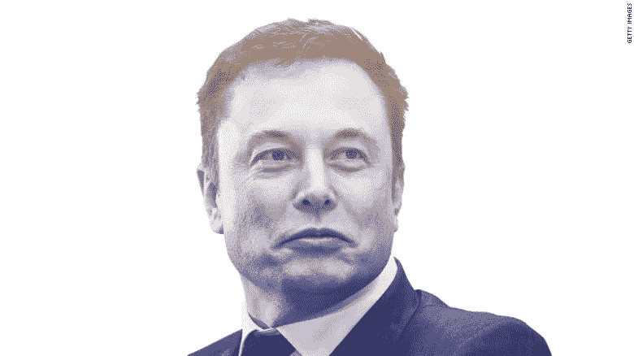

# 如何成为像埃隆·马斯克那样的专家型通才

> 原文：<https://medium.com/hackernoon/how-to-become-an-expert-generalist-like-elon-musk-959e304155df>

我是深度工作的强烈倡导者——在这种工作中，一个人可以长时间专注于一项任务，不受干扰和干扰。然而，在任何一天，我都在做许多不同的事情——为我的产品进行研究和分析，定义新的想法和假设，写博客，为脱口秀[喜剧](https://hackernoon.com/tagged/comedy)写笑话，为我的小说构思情节。这还没有考虑到我所有的消费活动，比如听播客和 ted 演讲，看电视节目，阅读书籍和文章。

当我看着我在某一天或某一周花在这些活动上的时间时，我觉得我在同时处理很多事情和多项任务。但是对我的时间日志的进一步分析表明，我确实在个人创造性任务上花了很长时间，同时在消费任务上花了很多时间——骑自行车上班时听播客，做饭时听 ted 演讲，吃饭时看电视节目，等等。

普遍的看法是，为了做好一件事，我们需要花大量的时间专注地做这件事。虽然这是真的，但它并没有真正从长远的角度看待事物。

在我成长的过程中，曾经有过“万事通，无所不能”这样的说法。不过，我再也听不到了。几个世纪后的今天，像几百年前的埃隆·马斯克和莱昂纳多·达·芬奇一样的专家通才再次流行起来。

专家-多面手用投资组合思维运作，并将其与深度工作相结合。这就是它们如此罕见的原因，迄今为止只有少数几个例子。

通过观察股票交易员或风险资本家的行为，可以更好地理解投资组合思维。他们挑选几个涵盖不同市场因素的赌注，将它们组合成一个投资组合，以增加最终成功的几率。

几个自由职业者也是这样。作者不再只是写书了。他们接受演讲任务，接受教学任务，接受咨询任务。当然，他们仍然花大量时间写作。

他们花在这些其他活动上的时间会影响他们的写作时间吗？如果他们只关注写作而不关注其他，他们会成为更好的作家吗？

绝对的。毫无疑问。

但是他们做出了权衡的决定。做所有这些额外活动的回报高于写作能力提高带来的增量回报。这在短期内是不正确的。

也许一个没有演讲或咨询经验的作者需要花很多努力去擅长它——在这段时间里，她可以通过把时间投入到写作中来获得更多。

但是投资组合思维允许有懈怠，允许将时间和精力投入到可能不会立即(或永远)带来回报的事情上。但是如果他们这样做了，会带来很好的回报。

成为专家型通才的两个关键要素是深度工作与组合思维相结合。

## 在你走之前…

如果你喜欢这个，请支持我的工作。你需要做的就是鼓掌。

[*跟我讨论美好生活的错综复杂。*](http://eepurl.com/cqwJZT)

[*读我的书*](https://www.amazon.com/s/ref=nb_sb_noss?url=search-alias%3Daps&field-keywords=mayantuyacu)