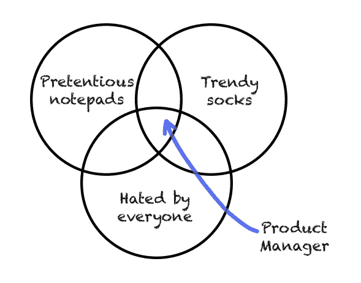
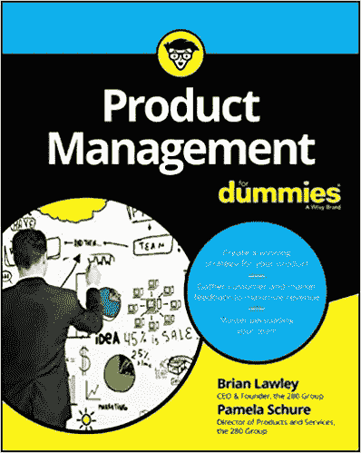
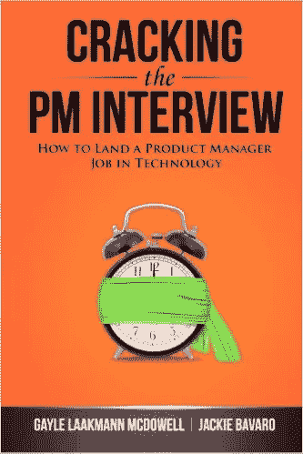
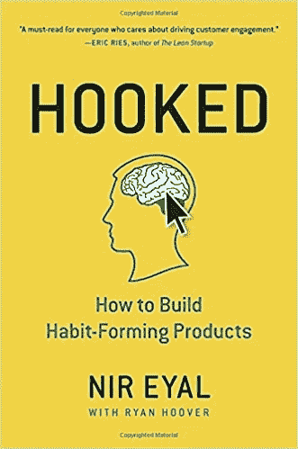
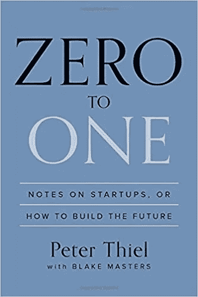
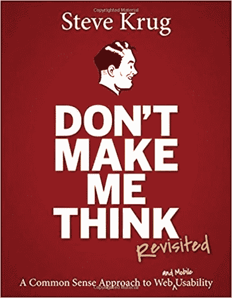
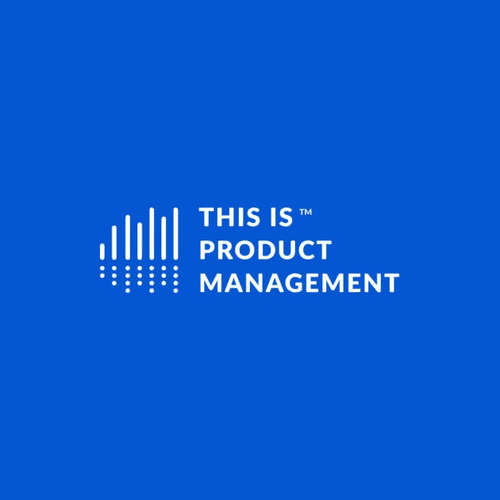
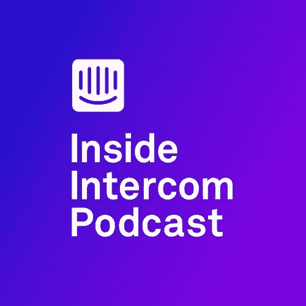

# 如何成为产品经理+自由实践

> 原文：<https://medium.com/hackernoon/how-to-become-an-outstanding-product-manager-free-practice-f4424ac023b9>

Becoming a Product Manager

3 年前，我改变了我的职业道路，从软件开发到产品管理。人们不时走近我，想知道我是怎么做到的。他们以不同的形式问同一个问题:如何成为产品经理？想成为产品经理，我需要学习什么？3 年了，我可以自己回答这个问题，也可以帮你自己得到答案。

根据我自己的经历和旅程，我将与你分享对我有效的方法。我确信还有其他方法可以成为产品经理，我敦促你继续阅读并寻找最适合你的方法。

我将讨论 3 个主题:

*   你为什么想成为产品经理？往里看
*   学习资源(书籍、播客、在线阅读等)
*   实践

From [DepartmentOfProduct.com](https://www.departmentofproduct.com/blog/apis-explained-for-product-managers/)

# 从为什么开始？

你为什么想成为产品经理？这是一个你必须自己回答的私人问题。

以下问题可能有助于你自己回答这个问题:

*   思考你未来 10 年的职业生涯——你想做什么样的决定？你想做哪种类型的作业？
*   如果你像我一样，成为一名产品经理意味着你从组织的生产圈，即代码、设计或测试圈，转移到决策者圈。作为一个人你能接受吗？

如果你成为产品经理的原因是你想成为首席执行官——不幸的是，[你来错了地方](https://www.mindtheproduct.com/2017/03/product-managers-not-ceo-anything/)。

至于我，这些是我的原因:

*   我希望我的重点是为用户解决问题，而不是解决技术问题
*   我想练习和掌握软技能，包括每天在人前演讲，说服并设法在没有实权的情况下做出改变，围绕一个想法建立共识等等

如果你仍然对这一步感兴趣，请继续阅读，获取成为产品经理的最佳在线资料。

# 继续学习

在下面的部分，你可以找到一些学习产品管理的资料。这些帮助我了解了产品管理的一些基础知识，包括入职、UX(代表用户体验)、UI(代表用户界面)、优先级、数据驱动的决策和营销。

在本节中，您会发现推荐:

*   面向产品经理的书籍
*   面向产品经理的播客
*   产品经理在线阅读

# 书

[读](https://www.amazon.com/kindle-dbs/hz/signup?ref_=assoc_tag_ph_1454291293420&_encoding=UTF8&camp=1789&creative=9325&linkCode=pf4&tag=ozrad00-20&linkId=c37fa2ce043138537c422136c46b3d3d) ( [或听](https://www.amazon.com/Audible-Free-Trial-Digital-Membership/dp/B00NB86OYE/?ref_=assoc_tag_ph_1485906643682&_encoding=UTF8&camp=1789&creative=9325&linkCode=pf4&tag=ozrad00-20&linkId=a633b1d7b0f709a2ac7c6dc34de52f00))书。世界上一些最聪明的人把他们一生的智慧总结成一本书，并愿意花很少的钱与你分享。接受他们的礼物。

顺便说一句，如果你喜欢阅读(像我一样)，亚马逊有 30 天免费试用 kindle 书籍和有声书[你应该看看](https://www.amazon.com/kindle-dbs/hz/signup?ref_=assoc_tag_ph_1454291293420&_encoding=UTF8&camp=1789&creative=9325&linkCode=pf4&tag=ozrad00-20&linkId=c37fa2ce043138537c422136c46b3d3d)。

Brian Lawley 的《假人产品管理》

*产品管理在组织中起着举足轻重的作用。事实上，它现在被认为是美国企业界第四重要的头衔——然而只有极小一部分产品经理接受过这个重要职位的培训。*

亚马逊图书链接—[https://amzn.to/2FFb3wy](https://amzn.to/2FFb3wy)

Cracking the PM interview by Gayle Mcdowell

盖尔·麦克道尔的《破解首相访谈》

*了解“项目经理”的角色在不同的公司是如何变化的，你需要什么样的经验，如何将你现有的经验转化为现实，一份优秀的项目经理简历和求职信是什么样的，最后，如何掌握项目经理面试问题。*

亚马逊图书链接—[https://amzn.to/2S9Qo5e](https://amzn.to/2S9Qo5e)

Hooked — how to build habit forming products by Nir Eyal

[上钩](https://amzn.to/2zpjJSe)——如何打造习惯养成产品。

*成功的公司是如何创造出让人爱不释手的产品的？*

*…一个嵌入到许多成功公司产品中的四步流程，潜移默化地鼓励客户行为。*

亚马逊图书链接—[https://amzn.to/2zpjJSe](https://amzn.to/2zpjJSe)

彼得·泰尔的《零比一》——这本书真的启发了我。

在《从零到一》中，传奇企业家兼投资者彼得·泰尔展示了我们如何找到独特的方法来创造这些新事物。

亚马逊图书链接—【https://amzn.to/2DJR8KA 

[不要让我思考](https://amzn.to/2r4MK0X)——一个关于网站可用性的常识方法。

*..可用性专家 Steve Krug 的指南，帮助理解直观导航和信息设计的原则。*

亚马逊图书链接—[https://amzn.to/2r4MK0X](https://amzn.to/2r4MK0X)

Intercom on onboarding

[入职对讲机](https://amzn.to/2RaWEJZ) —他们说第一印象不会有第二次机会。

*用户入职是扩展产品公司最重要的一步——它帮助你将新注册用户转化为成功用户。*

亚马逊图书链接—[https://amzn.to/2RaWEJZ](https://amzn.to/2RaWEJZ)

# 在线阅读

探索这些在线资料，它们将帮助您掌握作为产品经理的技能:

**UX 和 UI:**

*   [用户在线](https://www.useronboard.com/) — Samual Hulik 拆解最佳和最时尚应用的在线流程。

> 用户入门是增加新用户在采用你的产品时成功的可能性的过程。

*   [关于 UX](https://www.interaction-design.org/literature/article/5-things-everyone-should-know-about-ux-work) 的交互设计——交互设计网站写 UX

**伟大的阅读**

*   好的产品经理坏的产品经理——15 年前由 a16z VC 的本·霍洛维茨撰写
*   产品学派的产品书—[https://amzn.to/2FPfrJM](https://amzn.to/2FPfrJM)

**MVP**

*   [创业公司最难学的一课](http://www.paulgraham.com/startuplessons.html) —这篇文章是由最好的创业公司加速器 Y-Combinator 的联合创始人保罗·格拉厄姆在 2006 年写的

**数据**

*   [Mixpanel 博客—信号](https://mixpanel.com/blog/) — Mixpanel，这是一个产品分析工具，用于产品人员撰写和采访产品经理和其他行业领导者

**人际技能**

*   [re:与谷歌合作](https://rework.withgoogle.com/) — re:Work 是谷歌和其他公司的实践、研究和想法的集合，帮助你把人放在第一位。激励人心的管理读物
*   [谷歌从寻求建立完美团队的过程中学到了什么](https://www.nytimes.com/2016/02/28/magazine/what-google-learned-from-its-quest-to-build-the-perfect-team.html)——这是一篇关于谷歌进行的一项研究任务的精彩阅读，该研究任务是关于为什么一些工作组兴旺而另一些却步履蹒跚

**练习**

*   [面试产品经理的终极指南](http://www.venturegrit.com/how-to-interview-a-product-manager-the-ultimate-guide/)
*   [PM 面试](http://thepminterview.com/) —一个虚拟的 PM 面试问题，也是《破解 PM 面试》一书的推广
*   [90 个 PM 问题](https://www.impactinterview.com/2017/01/big-list-90-product-manager-interview-questions/) — 90 个适合你背景的问题

# 播客

我过去常常听产品管理方面的播客来获得灵感和了解这个行业。找时间听听播客来获得灵感:

How I built this by Guy Raz and Ted Radio Hour by Guy Raz

[“我是如何建造的”](https://www.npr.org/podcasts/510313/how-i-built-this)盖伊·拉兹的播客

> 《我是如何建立的》编织了一个关于创新者、企业家和理想主义者的叙事之旅——以及他们建立的运动

盖伊有另一个很棒的节目，叫做“Ted 广播时间”。

[“这是产品管理”](https://www.thisisproductmanagement.com/)Mike fish bein 的播客:

加入 15，000 名每周听众的行列，向产品管理领域最聪明的人学习。

[【对讲机】](https://blog.intercom.com/category/podcast/)播客:

与产品管理、设计、创业和营销领域的从业者对话。

# 实践

成为一名产品经理需要实践，在决定产品管理是否适合你之前，你应该投入大约 20 个小时。我想和你分享一个我一直在做的练习，它教会了我很多。

从鸟瞰的角度来看，当开发一个新产品(相对于迭代现有产品)时，你的例行程序包括 7 个主要步骤，我们将在接下来讨论。

**在我们开始之前——选择一种产品**

首先，选择一个你想成为其产品经理的网站或应用。比如 Snapchat、Instagram、脸书、谷歌日历。

你选择了吗？以下是步骤:

**第一步——发现问题**

作为产品经理，问题无处不在，你只需要知道如何寻找它们。如何发现问题的一些例子:

1.  调查你的产品的度量标准，思考为什么度量标准不尽如人意的假设
2.  阅读用户反馈——支持票、社交提及或商店评论
3.  直接或通过你组织中的人(客户成功经理、业务开发人员等)采访你的客户。)

**第二步——对问题进行优先排序和验证**

成为一名成功的产品经理需要优先考虑你将关注的问题，并找到“最佳”问题。

“最佳”问题是能够对用户产生最大积极影响并且能够在最短时间内解决的问题。

**第三步——找到解决方案**

对你发现的问题提出解决方案，每个问题 3 个解决方案将是一个很好的开始。确保您的解决方案有效的一些提示:

1.  解释一下为什么这个解决方案可以解决问题
2.  用数据支持您的解决方案
3.  挑战自己，成为你想法的最大批判者
4.  不要感情用事地依赖你的解决方案

**第四步——研究竞争对手，相应调整你的解决方案**

其他产品经理投入时间和精力来解决你面临的同样的问题。你应该通过研究他们的产品来利用他们的智慧。截图，视频，了解他们的道理。最后，记住他们也是人，也会犯错误。

**第五步——抽奖**

使用笔和纸，使用[轻木](https://balsamiq.com/download/)，使用[轴](https://www.axure.com/download)，画出你的想法。这一步主要与需要 UI 和 UX 的解决方案相关。[阅读关于用户界面和 UX 的内容](http://amzn.to/2oXyiHI)。

当创建你的设计时，想想你的设计将如何传达你的信息。设计将帮助你向最专业的人解释你的想法。

**第六步—定义 MVP**

MVP 代表最小可行产品，你应该读一下它([这里有一本 Eric Reiss 写的很棒的书](https://amzn.to/2IAman8))。作为一名产品经理，您希望尽快见到客户，以验证您的问题和解决方案。MVP 不必包含一行代码，不必包含任何设计，也不必验证问题和解决方案。

也就是说，这篇文章是一个 MVP，用来验证那些想从事产品管理工作却没有指导的开发者的问题是真实存在的。

**第七步——出席**

为了完善你发现的问题和解决方案，向他人展示你的思考过程并观察——你在哪里很难对你的决定产生共鸣？你有新的想法吗？相应提高。

用另一种产品重复这个练习，直到你对这个过程感到足够舒服。

如果你喜欢这首歌，一定要鼓掌、分享并关注我——它对我来说意义重大！