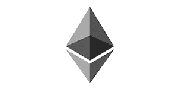
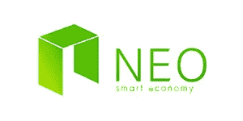
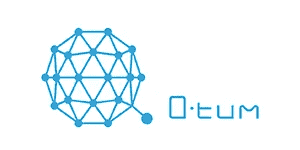
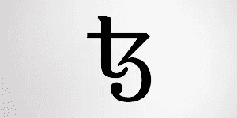
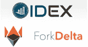
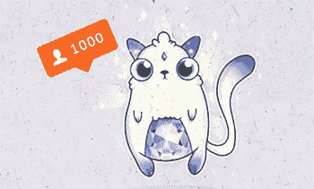
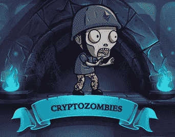
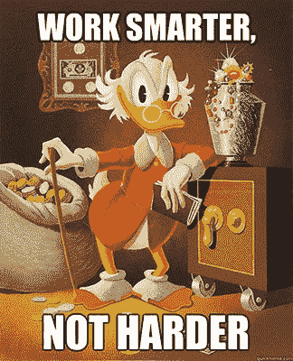

# 如何通过开发以太坊游戏致富

> 原文：<https://medium.com/hackernoon/how-to-become-wealthy-developing-ethereum-games-c7a8ec04e583>

你是一个有抱负的区块链开发者，正在寻找将你的技能货币化的方法吗？那么你应该仔细看看去中心化应用程序(称为 DApps ),因为它们很可能会效仿过去几年改变 it 行业的移动应用程序。你知道手机 app 行业每年带来多少钱吗？

# DApp 繁荣来了？

2017 年，来自 Google Play 和 App Store 的移动应用收入约为 600 亿美元，比 2016 年增长了 35%。自从市场上出现移动应用程序热潮以来，该行业的增长率令人瞩目，因为每年创造的收入和应用程序数量都在稳步上升。

数字说明了一切。移动应用已经彻底改变了 IT 和游戏行业，在接下来的几年里，我们可能会看到类似的去中心化应用的繁荣。目前，DappRadar 上有 200 多个 dapp[上市](https://dappradar.com/)，游戏 dapp 是其中的少数。这个数字很低，因为该行业仍处于起步阶段，而且为了实现更快的发展，还必须解决可扩展性等问题。但是现有的 DApps 已经为他们的开发者带来了资金。

隐猫就是一个很好的例子。自推出以来，人们已经花费了超过 2300 万美元[在这个平台上交易独特的数字小猫。考虑到这款游戏现在每天大约有 1000 名活跃用户，这已经不错了。想象一下，当 DApps 变得更受欢迎时，它将产生多少钱。这可能比我们预期的要早，因为可扩展性等问题现在已经得到了解决。例如，Loom Network 正在推出它的 sidechain 解决方案，它将允许构建可扩展的、安全的基于以太坊的 DApps。看看移动应用目前带来的收入可能会给你一个提示，DApp 开发在未来几年可能会变得多么有利可图。例如，《部落冲突》的开发者](https://kittysales.herokuapp.com/)[一天就能获得](/@appiqotechnologies/how-much-money-you-can-earn-with-an-app-8e29044e779e)超过一百万美元的收入！

合乎逻辑的假设是，当 DApp 行业变得更加发达，更多的 dapp 进入并吸引更多的用户时，领先的 dapp 将为他们的创作者带来类似数量的金钱，很可能甚至更多。如果你想加入未来的 DApp 热潮，你最好早点开始，趁这个行业还处于起步阶段，你有很多机会去尝试，今天就开始你的 DApp 开发者生涯。

# 主要 DApp 平台

对于移动应用程序，两大平台是 iOS 及其 AppStore 和 Android 及其谷歌 Play 商店。你现在肯定听说过他们。类似的，也有这样的平台给 DApps。这些都是刚刚出现的，因为该行业还处于起步阶段，但如果你想了解更多与 DApp 相关的机会，你一定要了解主要的平台。

# 以太坊

目前，它是 DApps 最受欢迎的平台。现在 DappRadar 上有 200 多个基于以太坊的 DApps。与移动应用程序相比，这个数字非常小，但这个平台正在快速扩张，每天都有新的 DApps 添加进来。早在 2010 年，Google Play 和 App Store 上只有几千个应用程序，但在接下来的几年里，这个行业发展迅猛，现在仅 Google Store 上就有超过 350 万个应用程序。同样的指数增长也可能发生在 DApps 上，所以不要让小数字影响你。

# 新的

可以说是以太坊的主要竞争对手。这个平台上的[dapp](http://ndapp.org/)数量比以太坊上的少，但是你仍然应该关注 NEO，因为它比以太坊有很多技术[优势](https://www.investinblockchain.com/neo-vs-ethereum/)。NEO 使用的是利害关系证明共识机制，而以太坊使用的是工作证明机制，这种机制更加昂贵和耗费能源，使得以太坊比 NEO 慢得多。以太坊上的交易费用也更高。NEO 每秒能够处理超过 10，000 次交易，而以太坊每秒只能处理 15 次交易。此外，与以太坊不同，NEO 的智能合约也可以与法定货币配合使用，使其更加人性化。NEO 会分红，因为持有 NEO 会产生支付交易所需的气体。虽然以太坊现在比 NEO 更受 DApp 开发者的欢迎，但这种情况在未来可能会改变。

# Qtum

说到 DApps，这个平台是另一个潜在的以太坊竞争对手。它还利用了类似以太坊的智能合约，但同时它被认为比以太坊更安全，并通过使用分散的治理协议解决了可扩展性问题，该协议允许通过区块链上的特殊智能合约修改单个区块链参数，而不会对生态系统造成任何破坏。Qtum 的另一个优势是其面向移动的方法。他们甚至开发了自己的[移动应用](https://qtum.org/en/videos/qtum-go-mobile-demo)。因此，该平台在未来托管移动 DApps 方面有很大的潜力，但现在它没有以太坊那么受欢迎，所以它还没有得到太多的支持。它只有[几个 dapp](https://qtumeco.io/dapps)在 Qtum 上运行。

# 泰佐斯

这个平台也有一些与以太坊竞争的潜力。它的主要好处是[类似于 NEO 的](https://www.reddit.com/r/tezos/comments/7sijav/tezos_vs_ethereum/)——使用利害关系证明而不是工作证明，以及通过[利益相关者的链上协调](https://www.tezos.com/governance)进行自我修改的能力，这样就可以对协议进行根本的修改而无需硬分叉。该平台尚未完全推出，但已经有几个 DApps 在 Tezos 的网站上做广告。

2018 年 3 月 27 日平台开发的 DApps 数量:

正如你所看到的，现在 dapp 正在发生很多事情——不仅新的 dapp 不断出现，而且新的平台也在为它们创建。到目前为止，以太坊是最受欢迎的一个，从这个平台开始你的开发者之旅是值得的。首先，以太坊比其他平台有更多的外部支持和学习资源。第二，即使未来某个其他平台会攻克以太坊，你的经历也会让你顺利过渡到那个新平台。最后，基于以太坊的 DApps 目前更有利可图。

# 现在流行的 DApps 挣多少钱？

为了给你一个线索，让你知道现在用以太坊 DApp 可以赚多少钱，我们从每日活跃访客的角度看了三个最受欢迎的 dapp:fork delta(约 2700 名用户)、IDEX(2500 名用户)和 Cryptokitties(约 1000 名用户)。

# [ForkDelta](https://forkdelta.github.io/)

这是一个去中心化的交易平台，于 2018 年 1 月从 EtherDelta exchange 中分离出来，后一个平台被出售给了试图引入新规则的新所有者，这些规则推迟了社区。根据 DappRadar 的数据，目前，ForkDelta 是最受欢迎的 DApp，拥有约 2，700 名每日活跃用户，总用户余额为 30，525 ETH，每天约有 2，000 ETH 通过它进行交易。该项目是社区驱动的，不幸的是，它的所有者目前没有获得任何东西，因为交易费仍然归以太三角洲所有。他们接受捐赠来支持项目的发展。

# [IDEX](https://idex.market/)

又是一个去中心化的交流平台。它拥有约 2500 名每日活跃用户，平均每天 15000 笔[交易](https://dappradar.com/app/165/idex)，价值约 6,000 ETH(截至目前约 300 万美元)。IDEX [向做市商(下订单的人)收取每笔交易 0.02%的费用，向市场接受者(发现现有订单并完成订单的人)收取 0.01%的费用。如果我们假设 IDEX 从每笔交易中获得 0.03%，这将意味着其所有者平均每天获得约 90，000 美元的交易费。](https://idex.market/faq)

# [隐猫](https://www.cryptokitties.co/)

这是最受欢迎的游戏 DApp，用户可以在这里购买和繁殖数字小猫。每个加密小猫都是独一无二的，每隔 15 分钟就会发布新的。用户可以[购买](https://www.cryptokitties.co/faq#How-are-you-making-money-with-CryptoKitties)一个新的 kitty，购买 kitty 的钱归 DApp 的开发者所有。如果一个用户有两只猫，或者有一只猫并从另一个用户那里租了另一只猫，你也可以和其他用户交换小猫或者培育新的小猫。然后开发商从每笔交易中收取 [3.75%](https://www.cryptokitties.co/faq#How-are-you-making-money-with-CryptoKitties) 。自游戏于 2017 年 12 月推出以来，人们已经在小猫身上花费了超过[【2200】万美元，这意味着开发者从那时起已经获得了超过 82.5 万美元。](https://kittysales.co/)

让 DApps 更加有利可图的是，它只需要支付开发成本。DApp 所有者不必支付托管服务器的费用，DApps 基于去中心化的以太坊区块链基础设施，因此上面提到的数字非常接近实际利润数字。

# 如何才能推出一款成功的 DApp

正如你所看到的，DApps 可以获得很高的利润，尽管这个行业现在还处于发展的初级阶段。你可能想知道怎样才能成为一个成功的 DApp。隐猫的故事是回答这个问题的最佳例证。

CryptoKitties 是由温哥华风险工作室 AxiomZen 的一个团队推出的。他们拥有 80 多名员工，开发各个领域的尖端技术产品，从移动应用程序开发到 VR 和区块链开发。CryptoKitties 诞生于 2017 年 10 月最大的以太坊黑客马拉松——ETH Waterloo。那是游戏的 alpha 版本推出的时候。来自 AxiomZen [的四名员工组成的团队](https://bitcoinmagazine.com/articles/how-hackathon-birthed-cryptokitties-origin-story1/)参加了黑客马拉松。他们有备而来，穿着印有可爱小猫图案的彩虹色 t 恤。

CryptoKitties 背后的人有丰富的开发经验。它的联合创始人之一，[迪特·雪莉](https://www.axiomzen.co/about/dieter)，是 Axiom Zen 的首席技术架构师。他是一名加密货币爱好者，早在 2010 年就挖掘出了他的第一枚比特币。迪特对新技术的喜爱可以用他是网络繁荣的老手来解释。他知道新技术是如何迅速出现并改变世界的。另一个参与 CryptoKitties 的人是[法比亚诺·索里亚尼](https://www.axiomzen.co/about/fabiano)。他在巴西学习计算机科学，还在上大学的时候就创办了自己的第一家视频游戏制作公司。法比亚诺是一名区块链爱好者，他对弥合网络和区块链之间的鸿沟很感兴趣。最后但同样重要的是，Axiom Zen 的全栈工程师 Nick Salloum 现在正在研究 CryptoKitties。他来自特立尼达，在加拿大麦吉尔大学获得机械工程学士学位。

正如你所看到的，世界上最成功的区块链游戏背后的人有着非常不同的背景。尽管如此，他们在拥有优秀的开发专业知识以及创造新产品和探索新技术的意愿方面是相似的。这种开放的思想和专业的卓越对于任何想在区块链取得成功的人来说都是必要的。但是你从哪里开始你在这个领域的职业发展呢？

# 如何开始在以太坊上开发 DApps

如果你有兴趣开始 DApp 开发者的职业生涯，你绝对应该研究一下[隐型僵尸](https://cryptozombies.io/)。这是一个教育网络应用程序，教你如何创建自己的 crypto kitties-像 DApp，它适合完全的初学者。你将学习如何用 Solidity 编写智能合同，如何用它创建数字僵尸，然后制造一支僵尸军队，甚至让他们互相战斗。他们还有一个[电报聊天](https://t.me/loomnetwork)，在那里你可以和其他有抱负的开发人员交谈，如果你在学习时对一些概念的理解有问题，还可以得到有用的反馈。

请记住，隐型僵尸的创造者织机网络公司[正在为该应用推出一个特殊的侧链](/loom-network/cryptozombies-has-come-to-a-fork-in-the-road-surprise-rewards-1a950f2c9d4e)。他们正在为 DApps 开发一个侧链平台，这将允许新的 DApps 易于扩展，同时连接到以太坊的主区块链。Loom Network 最近推出了 [DelegateCall](https://delegatecall.com/) ，这是一项带有自己侧链的 Q & A 服务，现在轮到 CryptoZombies 了。基本上，他们这样做是为了说明侧链解决方案适用于不同类型的服务。他们计划推出《战地》,一款同样基于侧链的 DApp 游戏。正如你所看到的，Loom Network 正在快速扩张，由于其成功的扩展解决方案，他们很可能在未来几年成为 DApps 的主要平台，这确实是一个改变游戏规则的因素。所以最好早点和他们接触，隐型僵尸是一个很好的开始。

请注意，如果你在 4 月 6 日之前完成隐型僵尸教程，你将获得[奖励](/loom-network/cryptozombies-has-come-to-a-fork-in-the-road-surprise-rewards-1a950f2c9d4e)，包括织机代币、委派代币和战场卡包。

正如你所看到的，建立 DApps 是非常有利可图的。要开始这样做，你只需要获得相关的开发技能，这并不困难，因为那里有丰富的教育资源。如果你想更深入地了解区块链开发，你可能会发现这些来自业内专家的建议很有用，还有这些给区块链开发者的十大课程。谁知道呢，也许迟早你会创造一个改变游戏规则的 DApp，让你变得富有。值得一试。

*原载于 2018 年 3 月 27 日*[*howtotoken.com*](https://howtotoken.com/career/become-wealthy-developing-ethereum-games/)*。*

## 关于作者:

[基里尔·希洛夫](http://twitter.com/kirills4ilov)——geek forge . io 和 Howtotoken.com 的创始人。采访全球 10，000 名顶尖专家，他们揭示了通往技术奇点的道路上最大的问题。加入我的**# 10k QA challenge:**[geek forge 公式](https://formula.geekforge.io/)。