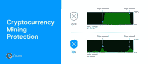
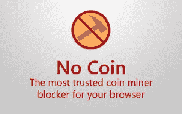
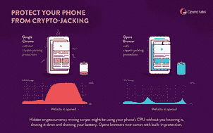

# 如何阻止黑客在你的电脑和智能手机上挖掘加密货币

> 原文：<https://medium.com/hackernoon/how-to-block-hackers-from-mining-cryptocurrency-on-your-computer-and-smartphones-c0c485b6eae6>

加密货币变得非常受欢迎，主要是因为它们的天文价格收益。但这些虚拟货币还有另一个重要因素——挖矿。[让](https://hackernoon.com/tagged/making)看起来像是在物理上开采黄金，开采加密货币意味着机器正在解决一个密码难题，以便验证任何交易。

但是，如果我告诉你，黑客能够使用你的电脑或智能手机的能力来挖掘货币呢？被称为[的密码劫持](https://hackernoon.com/tagged/cryptojacking)，这导致你的设备更快地消耗电池或过热，因为它们在你不知情的情况下使用处理器的能量。事实上，目前有两个这样的黑客已经位列十大恶意软件之列。所以问题来了，你如何确保你不受它的影响？别担心，继续读下去，看看你如何保护自己。

**什么是密码劫持**

也被称为加密货币挖掘，它是指在未经您同意的情况下，您的系统资源被用来挖掘虚拟货币。这可以通过在网站上使用 javascript 代码来实现，当您访问该网站时，就会启动挖掘过程。

黑客已经能够入侵网站来运行这样的脚本。但与此同时，也有一些网站在使用来自像 Coinhive.com 这样的服务的即插即用脚本。

简单来说，无论是黑客还是你访问的一些热门网站(如 Piratebay)都可以利用你的设备挖掘加密货币。

**如何检查自己是否受到密码劫持的影响**

如果你注意到你的智能手机或笔记本电脑开始过热，或者 CPU 使用率飙升，即使你没有使用密集型应用程序，那么你很可能受到了加密货币挖掘的影响。

你也可以在你的设备上访问这个[网站](https://cryptojackingtest.com/)来检查你是否安全。

不管你的电脑或手机是否被加密，预防总是胜于治疗，你可以遵循下面的建议来保护自己。

**使用 Opera 浏览器**

虽然 Chrome 是最受欢迎的电脑浏览器之一，但 Opera 总是推出一些有趣的功能来与谷歌的产品竞争。最新版本的 [Opera 浏览器](https://www.opera.com/computer)带有广告拦截器，内置了针对加密货币挖掘的保护。该功能阻止网站运行密码劫持脚本，与阻止网页上的广告没有太大区别。

要启用此功能，您只需进入*设置* > *基本* > *屏蔽广告*和*检查 NoCoin* 。如果您使用的是 MacOS，您可以在*偏好设置*中找到该选项。

事实上，Opera 还为加密货币爱好者提供了一些其他有趣的选择。该浏览器带有货币转换器，让您将文本形式的价格转换为比特币、以太币、比特币现金或莱特币。

**无法放弃 Chrome 或 Firefox？**

如果你不想改变你的默认浏览器，那么你可以为 [Chrome](https://chrome.google.com/webstore/detail/no-coin-block-miners-on-t/gojamcfopckidlocpkbelmpjcgmbgjcl?hl=en) 下载一个叫做 No Coin 的扩展。对于 Firefox 的用户来说，一个叫做 NoMiner 的插件做着类似的工作。类似于 Opera 的内置解决方案，这些扩展监控具有基于浏览器的挖掘脚本的网站。如果一个网站有这样的脚本，它会立即被屏蔽。

**智能手机呢？**

如前所述，加密货币也可以被黑客通过智能手机挖掘。对于我们口袋里的这些设备，Opera 又一次拯救了我们。安卓版的 [Opera](https://play.google.com/store/apps/details?id=com.opera.browser) 和 [Opera Mini](https://play.google.com/store/apps/details?id=com.opera.mini.native) 都带有加密劫持保护功能，通过广告拦截器直接拦截此类脚本。与我们的计算机相比，这些恶意脚本可能对我们的手机更加有害。考虑到如果网站是开放的，它可能会在后台持续挖掘——影响电池寿命和 CPU / GPU 的使用，从而导致过热。

进入应用程序的*设置*可以打开广告拦截器。

你也可以使用安装了 No Miner 插件的 Firefox 来无忧无虑地浏览网页。

如果您使用的是 iPhone 和 Safari 网络浏览器，那么在您访问网站时，使用 [1blocker](https://1blocker.com/) 来阻止所有此类恶意脚本的运行。

**使用恶意字节**

如果你想绝对确定，那就在你的电脑和智能手机上安装 [Malwarebytes](https://www.malwarebytes.com/) 。虽然前者是免费的，但后者需要付费购买该应用的高级版本。然而，它非常有用，因为一些移动应用程序也开始了加密货币挖掘，使用上述方法无法阻止。

你也可以继续使用卡巴斯基等反病毒应用程序来保护自己免受密码劫持。

必须指出的是，网站挖掘加密货币不一定是坏事，但是如果他们在用户不知情的情况下这样做，这肯定表明了恶意的意图。如果你喜欢一个网站，你当然可以用上面提到的各种方法将它添加到例外列表中，以便让它在你访问它时继续在你的手机或电脑上挖掘。你也可以用你设备的能量来挖掘一些好的理由，就像[展示的那样，把你的账单捐给](https://donateyourtab.to/)。

*如果你喜欢阅读这篇文章，别忘了订阅每周时事通讯，上周在 Crypto* *中的* [*，我们在一个地方策划了加密货币领域的所有事件。*](https://lastweekincrypto.com/)