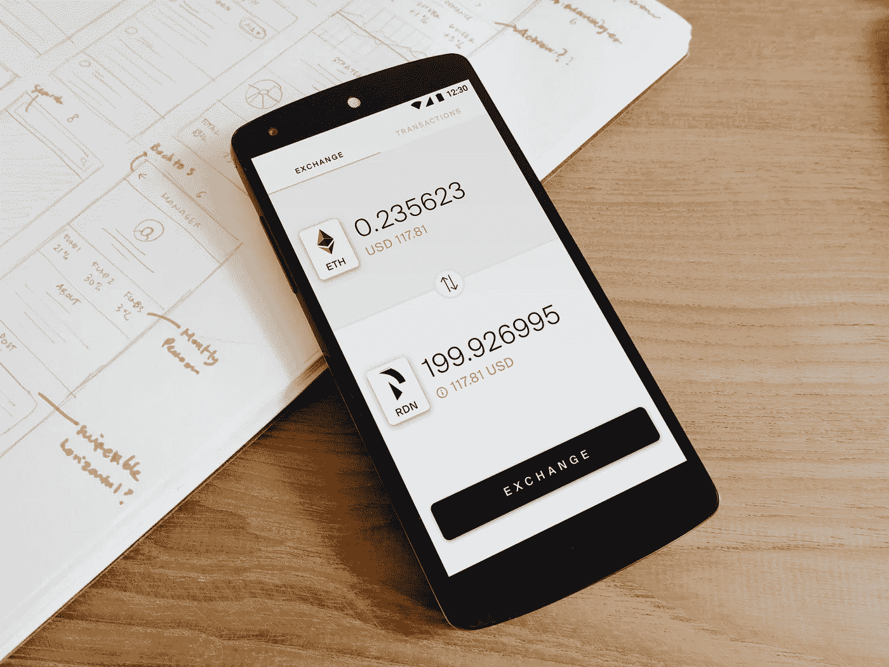

# 如何:移动区块链 dApps📱

> 原文：<https://medium.com/hackernoon/how-to-blockchain-dapps-for-mobile-55a3ccce2d48>



Blockchain apps now on mobile

你一定遇到过使用 truffle 和一些钱包集成来调用智能合同的 web 应用程序。但是市面上的 app(特别是跨平台的)非常少。我认为这是因为缺乏教程或过多的教程。

> 这是我的尝试，帮助一些开发者制作一个连接到区块链的移动应用🌈

本教程展示了如何使用 [canonical-weth](https://blog.0xproject.com/canonical-weth-a9aa7d0279dd) [智能契约](https://en.wikipedia.org/wiki/Smart_contract)包装和解包以太[令牌](https://etherscan.io/token/0xc02aaa39b223fe8d0a0e5c4f27ead9083c756cc2)。

**TLDR；**🤓

1.  克隆此回购`git clone [https://github.com/kunsachdeva/React-Native-Blockchain-Skeleton](https://github.com/kunsachdeva/React-Native-Blockchain-Skeleton)`
2.  `npm install`或`yarn`
3.  更新`constants.js`文件
4.  瞧吧！🤷

这是更长的版本；

首先以传统方式创建一个空白的 react 本机应用程序:

```
react-native init MyDecentralisedApp
```

我们继续吧🔥让它发生！

```
npm i canonical-weth -S
```

这会给你[神器](https://ethereum.stackexchange.com/questions/30457/what-are-artifacts-in-truffle)到 [weth](https://weth.io) 智能契约。它包含了 [abi](https://github.com/ethereum/wiki/wiki/Ethereum-Contract-ABI) 数组和一些编译好的 solidity 代码的描述。你可以在这里了解那个东西[(本教程不需要)。](https://www.sitepoint.com/compiling-smart-contracts-abi/)

为了用它制作一个`Contract`物体，我们需要块菌库。
使用以下方式安装:

```
npm i truffle-contract -S
```

为此，我们还需要 web3。为了简单起见，我们使用 web3 版本`0.20.5`，但您也可以使用 web3 1.x.x。它只需要您为`es2015`添加一个预设。

```
npm i web3@0.20.5 -S 
```

在这一点上，构建您的应用程序应该会出现一些节点库缺失的错误，比如`crypto`或`events`。这是因为 react-native 在默认情况下没有 nodejs 模块。这一点已经在 react-native issues 中提到。即使它使用 node 作为它的包管理器，它也不包含它的内置模块。<链接到问题>


为了解决这个问题，我们从 react-native-node-modules 库中添加节点模块

```
npm i abec/react-native-node-modules -S
```

这应该可以解决您的节点问题🚀。继续，让我们制作松露物体。

```
var Contract = require('truffle-contract')
var wethArtifact = require('canonical-weth')
var contract = Contract(wethArtifact)
var contractAtAddress = contract.atAdd('0xc778417e063141139fce010982780140aa0cd5ab')
```

我从 weth 上的这篇[文章](https://blog.0xproject.com/canonical-weth-a9aa7d0279dd)中得到了上面的地址。它适用于 rinkeby testnet 链。它是公开的，可以在 [etherscan](https://rinkeby.etherscan.io/address/0xc778417e063141139fce010982780140aa0cd5ab) 上看到。要在区块链使用任何合同，你必须找到它的地址。通常在[以太扫描](https://etherscan.io)上搜索就可以了。


现在我们有了合同，我们需要在同一个区块链上将这个合同称为钱包。你可以把这个钱包想象成用户，你在用这个用户调用智能合约功能。这在区块链上是必要的，每一次，每一个呼叫都必须与一个地址相关联。

在我们的场景中，我们有很多选择:
— [乙醚钱包](https://www.npmjs.com/package/ethers-wallet)

— [松露高清钱包](https://github.com/trufflesuite/truffle-hdwallet-provider)

— [Web3 钱包提供商](https://www.npmjs.com/package/infura-web3-provider)

你可以选择任何一个。在本例中，我们将使用 Truffle HD Wallet。
样本用法[此处](https://github.com/trufflesuite/truffle-hdwallet-provider#general-usage)。
让我们也安装这个:

```
npm i trufflehdwallet -S
```

现在我们可以[在链上创建一个新的钱包](https://www.youtube.com/watch?v=24EjCaK9qR8)或者使用现有的钱包。我们将使用一个现有的。为此，我们需要部署智能合约的区块链的 RPC 网络地址。

由于我们在 *Infura* 上使用来自 *Rinkeby* testnet 的地址，所以我们的 RPC url 将是`rinkeby.infura.io`。

我们将使用这个 url 来创建一个提供者对象。这就为钱包的使用设置了“环境”。你可以认为这是登录。你用密码——助记符——登录你的钱包。

```
const TESTRPC_ADDRESS = 'https://rinkeby.infura.io/'
const web3Provider = new HDWalletProvider(MNEMONIC,TESTRPC_ADDRESS);
web3 = new Web3(web3Provider);
```

用您自己的字符串格式替换`MNEMONIC`。

我们现在也准备称之为智能合同。基于我们正在使用的 weth 智能合约的定义，我们知道它具有`deposit`和`withdraw`功能。这些可以通过对契约的异步调用来调用，或者将其用作[承诺](https://developer.mozilla.org/en-US/docs/Web/JavaScript/Reference/Global_Objects/Promise)。

```
var transaction = await wethDeployed.deposit({ from: MY_ADDRESS, value: 0.001 * 1e18, gas: 2000000 });console.log(transaction)
```

`transaction`变量会给你很多关于你在区块链的交易地点的信息。你可以从中提取地址，然后回到以太扫描来找到它。

**🗿我们成功了！这就是你制作自己的跨平台 dApp 所需要的一切。**


概括地说，您可以使用任何智能合同(具有 abi 和地址)，并且您可以使用任何钱包，只要钱包和合同在同一区块链上。

如果你遇到任何问题:*📖* *开*关[发行](https://github.com/kunsachdeva/React-Native-Blockchain-Skeleton/issues)
如果不(推荐): *⭐* *明星*回购。

请随时进一步贡献。这是一项不断变化和快速发展的技术。每天都有新的库和更聪明的做事方式被引入。

> 在[电报](https://t.me/kunsachdeva)[*@ kunsechdeva*](https://twitter.com/kunsachdeva)上找我或者加入 [Midas](https://t.me/midasapp) 了解更多更新。