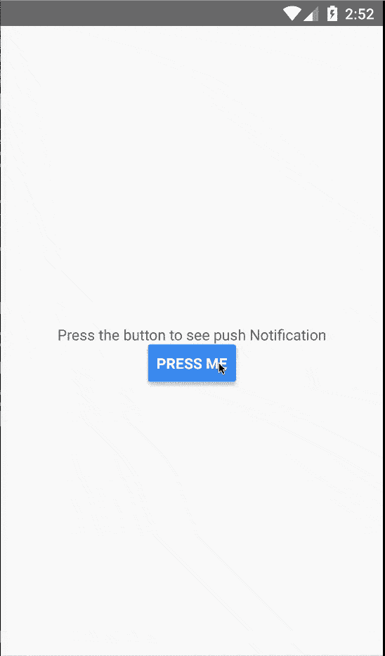
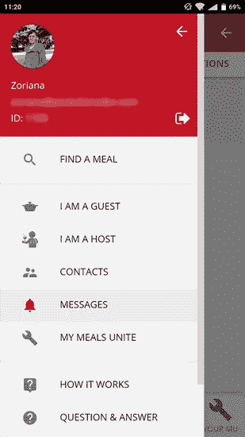
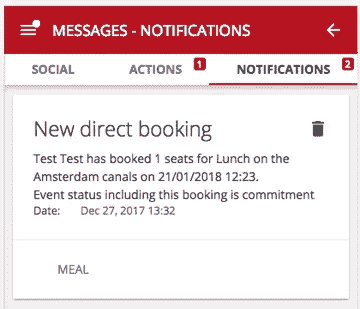
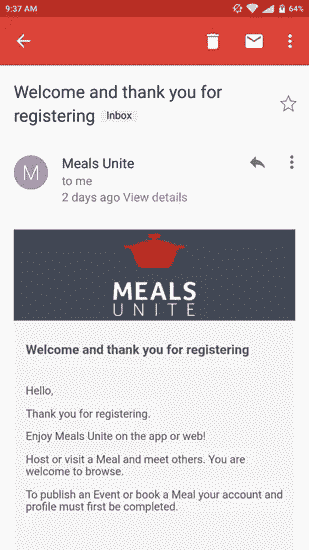
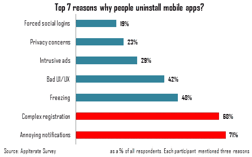

# 如何为您的市场构建 3 种类型的移动应用程序通知？

> 原文：<https://medium.com/hackernoon/how-to-build-3-types-of-mobile-app-notifications-for-your-marketplace-6ca212bd4f1d>

Sheep with a bell (Source: [Unsplash](https://unsplash.com/photos/00rW-mX1ipg))

如今，通知是几乎任何类型的移动应用和市场的必备功能。各种更新和提醒依赖于这个，乍一看，很小的功能。在本文中，我们想与您分享以下内容:

*   不同应用通知的细节；。什么样的通知最适合你的 B2B 或 B2C 市场应用？
*   [代码部分]如何为您的市场类型创建短信提醒系统、电子邮件通知系统和应用内消息示例；
*   关于如何建立你的客户会喜欢的通知系统的提示，考虑应用内消息和移动推送通知的最佳实践。

在我们展示如何构建通知系统之前，让我们从随机类型的移动应用程序通知开始:

# 1.推送通知(当然)

推送通知是目前移动通知系统中的明星。随着智能设备的兴起，这种通知变得流行起来，但实际上，这种通知始于 21 世纪初。这种通知在随机类型的应用中用于各种目的。提醒用户待办任务、朋友的生日或未来事件——这还不是推送通知功能的完整列表。更重要的是，所有这些提醒更新都是在后台进行的，不需要经常检查应用程序。

Push notifications example

*通过阅读“* [*如何在 React Native*](https://apiko.com/blog/react-native-push-notifications/) *”文章，我们将为您提供推送通知的工作原理以及关于移动推送通知最佳实践的更多信息。*

# 2.应用内消息示例。应用内消息传递是如何工作的？

这是各种类型的移动应用通知中的另一种已知解决方案。应用内消息需要用户在应用内出现。在广泛传播的应用程序内消息的例子中，可能有不同的优惠，来自应用程序制造商的营销消息，帐户或个人信息相关的通知，等等。

在 Apiko，我们开发了位于荷兰的活动管理市场应用程序，名为 Meals Unite。它(主要)是一个移动市场，允许你在家招待你的朋友或完全陌生的人来认识新朋友，从而安排用餐时间。这种概念的产品一定会通过现场交流和饮食文化让我们更加了解对方。

目前，该应用可用于 Android 设备。试用一下，并从 Google Play 下载 Meals Unite。

看看我们如何在 Meals Unite 中实现应用内消息传递示例机制:

App’s interface

In-app notification

# 比较应用内通知和推送通知时需要注意什么

说实话，没有比这个或那个更好的通知了。你需要知道的是，这样的项目细节，像通知程序一样，应该在持续的 A/B 测试中。为了最大限度地利用通知的有效性，有几个小技巧可供参考:

*   应用最新的 UX 界面设计趋势或创建自己的趋势，
*   使用 UX 文案方法
*   试验并确定个人应用内消息或移动推送通知的最佳实践。

# 3.其他类型的通知(短信通知系统和电子邮件通知系统)

当前类型的移动应用程序通知可以被认为是次要的，更集中地强调重要消息。我们可以在这里报名:

*   短信提醒/短信通知。当涉及到活动计划、提醒或促销时，这样的提醒可能是有帮助的。与推送通知一样，这种通知程序为用户提供了一个快速的状态信息，而无需直接与应用程序交互。
*   电子邮件通知，就像短信提醒，但被直接发送到您的邮箱。电子邮件通知系统，在很大程度上，是用于一个公司通过他们的客户数据库发送的车载信息、报价和投票。

Onboarding email as email notification

# 应用内消息传递、电子邮件通知和短信提醒系统。如何建立三位一体的通知系统？

(我们故意没有在这里提到推送通知是如何工作的。你可以找到一整篇关于这类通知的独立文章，上面已经提到过)

让我们看看如何创建短信、邮件和应用内通知发送机制及其 API 组织。

下面是端到端通知发送者示例(简化版)。

首先，让我们定义我们的通知(可以存储为单独的 YAML 或 JSON 文件):

下面我们提供了 API 本地化的可能代码示例:

现在，让我们开始通知发送者实现本身。首先，我们定义发送通知的方式:

接下来，我们应该指定通知类型和我们将使用的发送方法之间的关系:

现在，我们需要实现每个发送方法(注意:所有函数共享公共接口):

最后，我们可以实现负责发送通知的 main 函数(它将由客户端代码使用):

以下是我们新通知系统的使用示例:

**给定的方法如何有利于你的市场项目的各种类型的移动应用通知的开发？**

*   对多个发送方法的单个函数调用
*   每个通知类型的自定义发送方法
*   内置本地化
*   能够在通知文本中呈现自定义数据(上下文)
*   易于使用—通过多种发送方法发送通知只需 3 个参数。

# 让我们把最后弄亮。关于如何建立引人注目的通知系统的提示

实现什么类型的移动应用通知没有严格确定的规则。你可以尝试文章中提到的所有 4 种通知方式:推送通知、电子邮件通知系统、短信通知系统和使用应用内消息的最佳实践。

在本文结束之前，这里有一些关于如何通过通知提升客户参与度的技巧:

*   在更个性化的层面上与用户互动(为了做到这一点，避免发送无意义的通知，跟踪他们的应用内活动以及他们使用你的产品的方式)
*   让你的通知唤起情感。不要创建明显的“您有 1 个通知”或“有一条消息供您查看”更新。秘诀是保持简短，同时尽可能用阴谋的色彩来描述。查看由 Leanplum 编写的[简洁通知示例](https://www.leanplum.com/blog/7-most-creative-push-notifications/)
*   过多的通知会让你的产品变成某种促销应用。仅发送最重要的更新和消息。让用户决定通知的优先级，以及他们是否愿意接收某些通知
*   保持通知的简单设计，并为它们提供自然的外观和感觉。

*你肯定不希望你的客户和用户在使用你的 marketplace 应用程序时有一张无聊的脸。*

***规则是——不要过度…***

嗯，不需要解释。

综上所述

我们希望这篇文章对通知领域和市场中各种类型的移动应用程序通知有所启发。在这里，我们试图回答这样的问题，如什么是移动推送通知的最佳实践，应用内消息如何工作，以及如何创建短信提醒系统和电子邮件通知系统。

*原载于 2018 年 2 月 22 日 apiko.com***。**