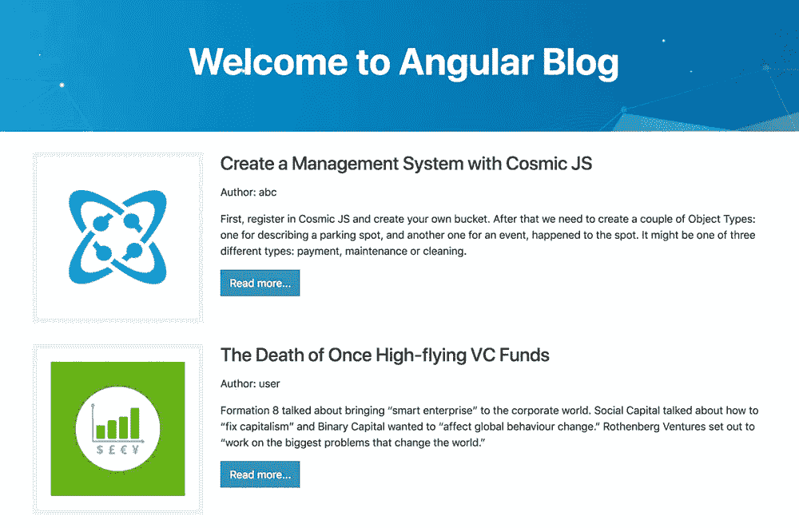
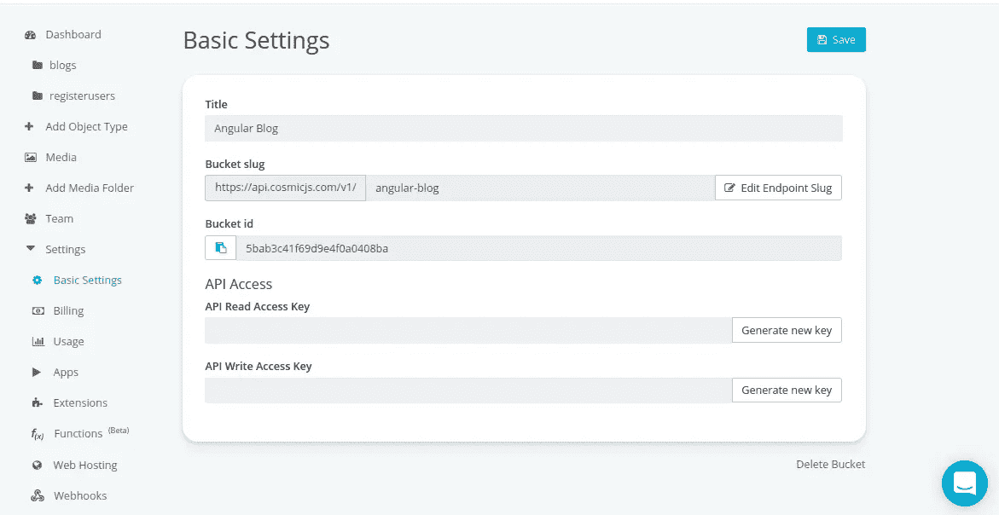
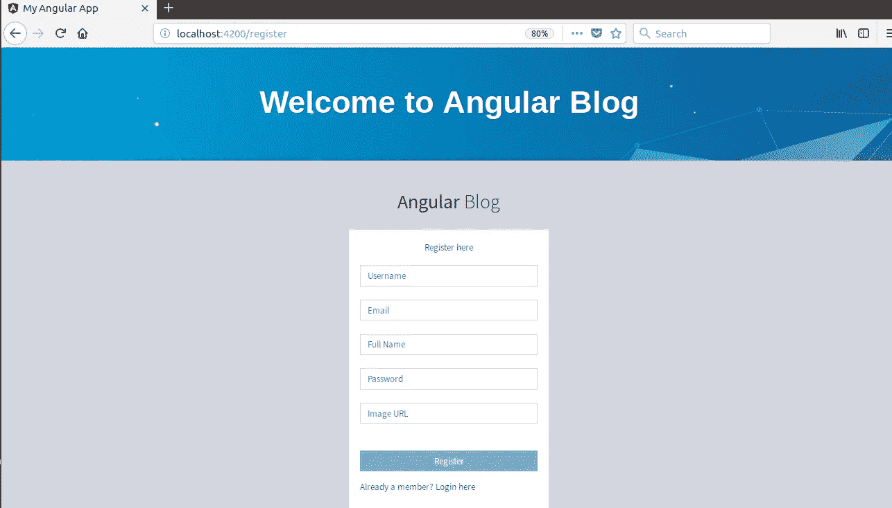
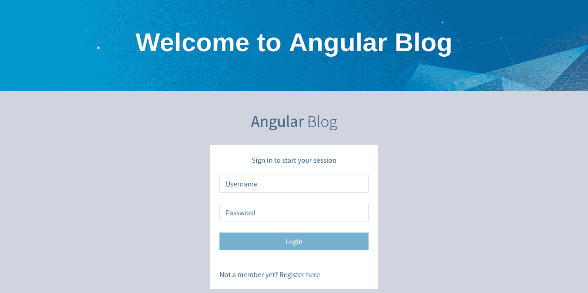
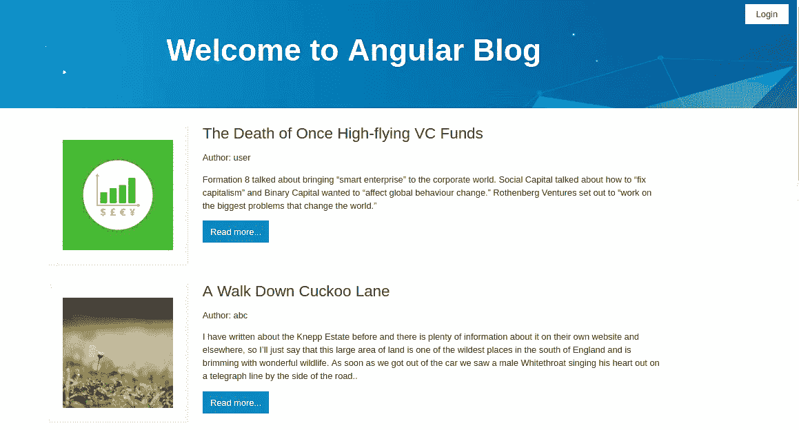
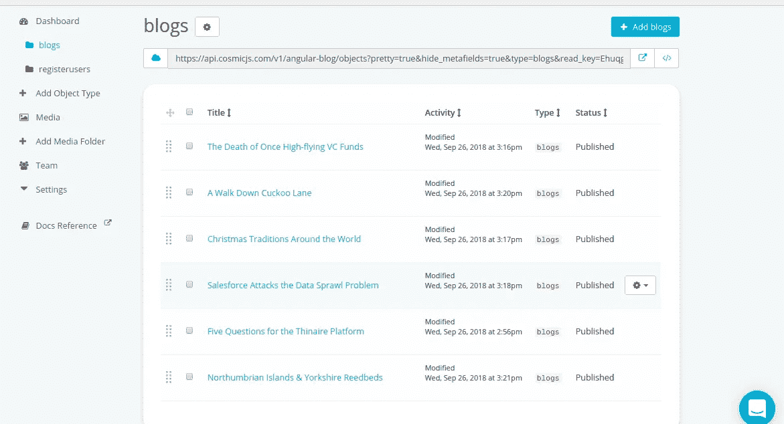
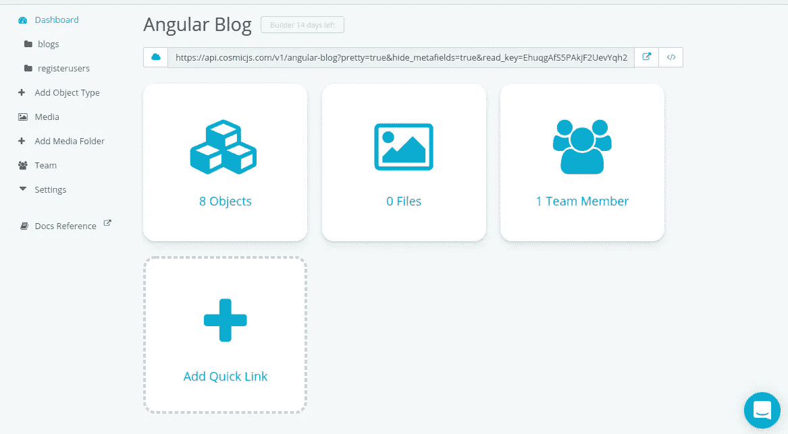
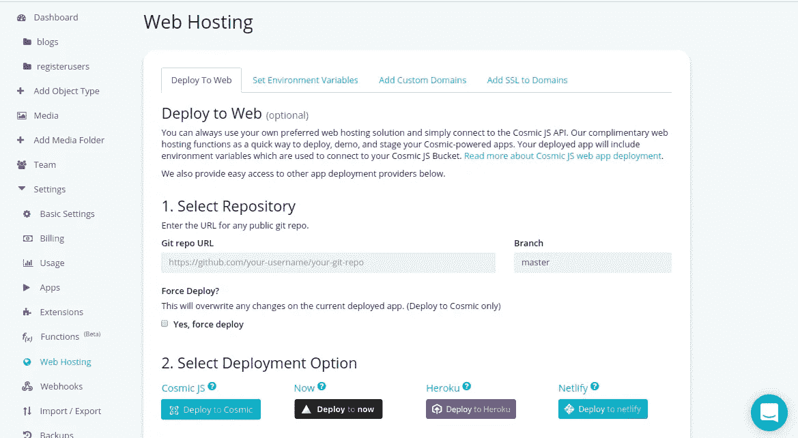

# 如何使用 Angular 和 Cosmic JS 建立博客

> 原文：<https://medium.com/hackernoon/how-to-build-a-blog-using-angular-and-cosmic-js-27c3dc6616cd>

Originally written by Gurmeet Singh for Cosmic JS Developer Articles

在本教程中，我将向您展示如何构建一个由 Angular 提供支持并托管在 Cosmic JS 应用服务器上的博客。

# TL；速度三角形定位法(dead reckoning)

[下载 GitHub 回购](https://github.com/cosmicjs/angular-blog) [。](https://github.com/Dev0515/Cosmo-Angular)
[试玩](https://cosmicjs.com/apps/angular-blog)。

# 先决条件

您需要预先安装节点 JS、npm 和 Angular cli。在开始之前，确保你已经有了它们。您可以参考[角度文档](https://angular.io/guide/quickstart)了解如何操作。

# 入门指南

在这里，我们将创建角度项目。我们将使用 ng cli 来完成。因此，一旦安装了所有的先决条件，就需要设置新的 Angular 项目:

`ng new cosmic-angular`

它会在你的系统上安装 Angular 应用程序，名为“cosmic-angular”。现在运行以下命令:

`cd cosmic-angular
ng serve --open`

它将在默认端口 4200 的浏览器上运行您的应用程序，即 [http://localhost:4200/](http://localhost:4200/)

# 用宇宙 JS 设置事物

首先创建存储桶，并记住存储桶名称:

然后创建一个名为“博客”的新对象类型，请记住对象类型 slug(“博客”)。它将存储所有发表的博客。现在创建一个名为“registeruser”的新对象，它将存储新用户的信息，我们也将使用它来登录。

您还需要创建 Bucket write 键。允许用户上传博客和创建账户是必要的。打开设置页面，单击 API 写访问密钥上的“生成新密钥”,然后复制生成的密钥并保存更改。

# 角度配置

创建文件:src/config/cosmo.config.ts 以匹配以下内容:

请记住，组件、服务、模型和配置文件应该放在不同的文件夹中，以便于区分。

# 用于 Angular 的无头 CMS

我们计划在不止一个角度分量中使用宇宙 JS 物体。在这种情况下，创建一个专用的服务并在一个地方存储所有与宇宙 JS 相关的东西是有意义的，比如存储桶名、写密钥等。让我们用以下内容创建 src/app/services/cosmic . service . ts:

该服务有许多方法，我们正在解释它们:

*   getUser():用于获取注册用户的详细信息
*   addUser():注册新用户
*   addBlog():将博客保存到宇宙服务器
*   showAllBlogs():获取保存在服务器上的所有博客
*   showBlogs():获取登录用户的博客
*   singlePostHome():显示单个选中的博客
*   login():用于用户登录

# 角度的宇宙模型

在 src/app/models/cosmic.model.ts 下创建一个模型，内容为:

这里我们声明了两个类，分别用于注册用户和在服务器上保存博客。

# 查看所有博客组件

使用以下内容创建 src/app/components/all blogs/all blogs . component . ts 文件:

这里我们导入了 cosmic 服务来命中 cosmic JS 服务器的 API。主要函数 showAllBlogs()从服务器获取存储在对象“Blogs”下的完整数据。

# 角度仪表板组件

在组件部分为登录用户创建仪表板组件。这里为用户添加博客，查看自己的帖子，查看所有帖子和注销做一些导航。该组件的路径将是:src/app/components/dashboard/dashboard . component . ts，内容将是:

在这个组件中，我们分别使用函数 addNewBlog()、viewBlogs()、viewAllBlogs()和 logout()创建了一些导航添加博客、我的博客、所有博客和 Logout。

# 显示单个博客

创建一个新组件，向名为 usersinglepost.component.ts 的用户显示所选的单个帖子。代码为:

这里我们创建了一个方法 post()，它根据提供给它的 blog_id 从服务器获取一个 blog。

# 用户注册—有角度的部分

这是主要部分，其中你将不得不作出一个注册组件来注册用户，也应该检查重复的用户在同一时间。路径为:src/app/components/register/register . component . ts，内容为:

这里有一个名为 register()的主函数，用于注册新用户。其中，首先我们检查重复的用户，如果用户名已经存在，它会显示一条消息，否则它会创建新的帐户，并导航到登录页面。

# 登录用户

在此组件中，我们将通过匹配服务器上可用的 registeruser 对象中提供的用户详细信息来登录用户。login.component.ts 的内容是:

在 login()函数中，我们调用了宇宙服务器和 login()函数。它匹配 cosmic 服务器上的记录，并将用户详细信息保存在本地存储器上，以保持用户登录。

# 这里到底发生了什么？

在这个博客上，在主页上你会看到所有用户的所有博客。你可以点击阅读更多按钮来阅读一篇博客。在这里您可以注册一个新的帐户，注册成功后您可以登录。因为我们使用 cosmic JS 服务器作为后端，所以一切都存储在这个服务器上。

登录后，您将导航到仪表板，在那里您可以发布博客，阅读您自己的博客，检查所有用户的所有博客，最后您可以注销。

现在，您可以在本地主机上运行整个项目。

# 内容建模

您应该为不同类型的数据创建不同的对象类型。在我们的例子中，我们创建了一个名为 blogs 和 second registerusers 的对象类型。包含所有在我们的博客上发表的博客和注册用户的博客将存储注册用户的数据。**稍后我们将添加另一个名为 posts and photos** 的对象类型，它将包含在一些博客下发布的所有帖子以及为每个博客或帖子分别上传的媒体。

上面的截图显示了我们的博客-对象类型。发布的博客显示在这里。

这张图片显示了我们服务器上的所有对象。这里显示了两种对象类型:blogs 和 registerusers。因此，我们将所有数据以不同对象的形式存储在 cosmic js 服务器上，并将这些对象分类为对象类型。

# 部署到 Cosmic JS 服务器

这是本教程的主要步骤，我们将在 cosmic JS 服务器上部署这个 Angular 博客。有一些要求:

*   你必须有一个公共的 GIt repo
*   [必须满足取决于您平台的特定要求](https://devcenter.heroku.com/)

现在，请遵循以下步骤:

# 修改 package.json

在这里，您必须指定 angular cli 和编译器 cli 的版本，即 angular 版本:

# 准备软件

现在运行以下命令:

`npm install --save express`

现在将以下代码添加到 package.json 中

现在创建一个 app.js 文件并添加以下代码:

# 现在构建用于生产的 Angular 应用程序

将以下代码添加到 app.json 中:

现在所有的任务都完成了，你的应用已经准备好部署在 Cosmic JS 服务器上了。

# 部署它

在你的宇宙服务器仪表板上，进入设置>虚拟主机下的部署部分。添加 git repo 并单击 deploy 按钮。

# 结论

通过使用 Cosmic JS 应用服务器，您可以使用您的公共 git repo 将您的应用快速部署到主机。在这里，您不用担心服务器配置和软件安装。

如果您对使用 Cosmic JS 构建网站和应用有任何意见或问题，[在 Twitter 上联系我们](https://twitter.com/cosmic_js)和[加入 Slack 上的对话](https://cosmicjs.com/community)。