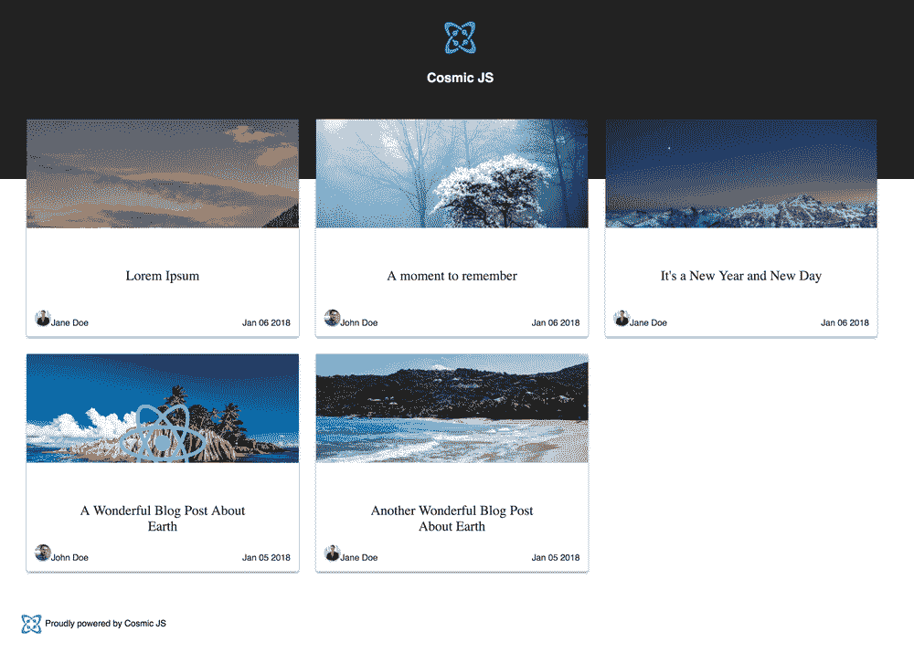
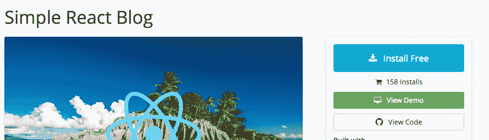
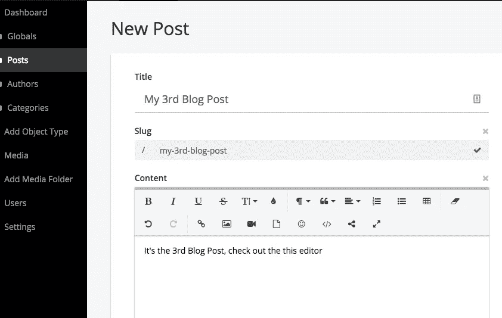
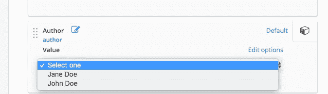
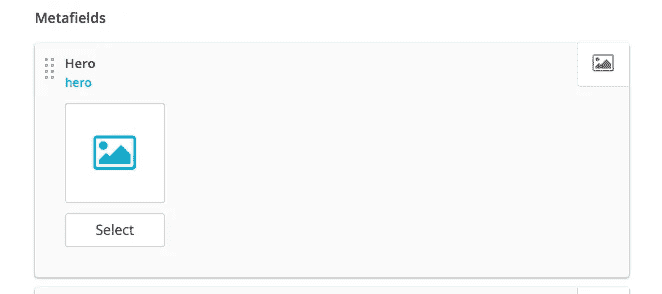
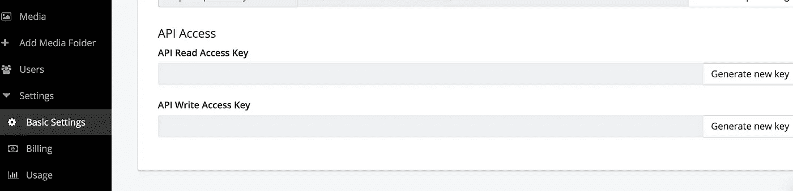
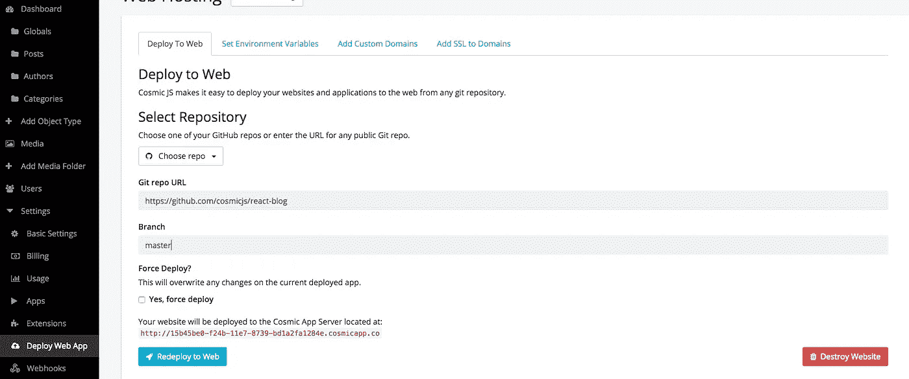
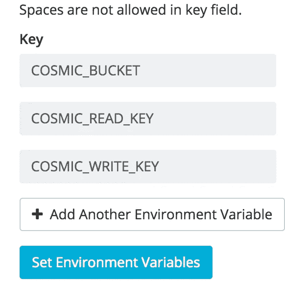

# 如何用 Cosmic JS 建博客并反应

> 原文：<https://medium.com/hackernoon/how-to-build-a-blog-with-cosmic-js-and-react-38305f122c53>



**TL；** 博士通过创建一个新的宇宙 JS 应用程序并克隆一个库来构建一个[宇宙 JS](https://cosmicjs.com) React 应用程序。

*   [查看并安装演示](https://cosmicjs.com/apps/react-blog)
*   [查看代码库](https://github.com/cosmicjs/react-blog)

**简介**

CMS API 为内容创建者和开发者提供了更多的能力来构建他们自己类型的前端 web 应用程序。作为顶级 Javascript 框架，React 将在 2018 年继续受到大量关注。Cosmic JS 让前端开发人员有更多的时间来构建客户端应用程序，花更少的时间来设置 API 或数据库。MongoDB 实例将是这个简单过程的又一部分。没有必要更新静态文件，登录到服务器。 [Cosmic JS](https://cosmicjs.com/) 内容编辑器支持您的应用程序。

Cosmic JS 提供了一个平台，让开发人员专注于代码和设计。这意味着更多的时间推动代码，更少的时间思考。

**用 Cosmic JS 建博客**

登录你的 Cosmic JS 账户很简单，用 Github 登录！查看[宇宙应用](https://cosmicjs.com/apps)并找到[简单反应博客](https://cosmicjs.com/apps/simple-react-blog)。点击免费安装按钮，并建立您的新博客应用程序。



创建您的第一篇文章

在应用程序安装时，您将被引导至新的应用程序控制面板。在这个例子中，有 4 个对象——文章、作者、类别和全局。您的博客内容保存在 Posts 对象中，所以让我们创建一个新的博客帖子！单击左侧导航栏中的文章对象，并选择添加文章



创建一篇博客文章，并确保检查编辑器的功能。插入一个图像，编写一些代码，添加一个链接，当然还有一个😀。内容创建者不限于他们可以创建的内容类型。

要创建新作者，请签出作者并选择添加作者。



让我们为我们的博客文章选择一张图片。



点击发布，将我们的博客文章动态推送到我们的应用程序中。请注意在开发人员和编辑人员角色之间切换的选项。

宇宙 JS 凭证

在左侧导航栏中，选择设置和基本设置。通过选择为两者生成新密钥来创建新的读/写访问密钥。

在本教程的剩余部分，让我们保持这个开关打开。



**部署您的网络应用**

您可以使用 Git repo Url 从 Cosmic JS Dashboard 部署您的 web 应用程序。单击设置->部署 Web 应用程序。确保你的 Git Repo URL 设置为[https://github.com/cosmicjs/react-blog](https://github.com/cosmicjs/react-blog)



另一个重要的步骤是设置环境变量。将 API 读访问键、API 写访问键和 Bucket Slug 复制并粘贴到 Cosmic JS Credentials 部分的 Set 环境变量选项卡中。



按“部署到网络”并访问您的新博客！

**发展模式**

先决条件

*   结节
*   NPM

终端命令

启动应用程序

```
npm start
```

[查看你的宇宙 JS 博客！](http://localhost:5000/)

用 Cosmic JS 构建博客应用程序就是这么简单。请务必在 Github 上查看我们博客应用程序的 OG GraqhQL 和 React 版本。如果你想看其他演示和源代码，请查看[应用页面](https://cosmicjs.com/apps)。

我希望你喜欢这个教程，如果你有任何问题[在 Twitter 上联系我们](https://twitter.com/cosmic_js)和[加入我们的 Slack 社区](https://cosmicjs.com/community)。

> 这篇文章最初出现在[Cosmic JS](https://cosmicjs.com/articles/how-to-build-a-blog-with-cosmic-js-and-react-jc2f3o9g)[上的一篇社区成员](https://cosmicjs.com)的文章中。