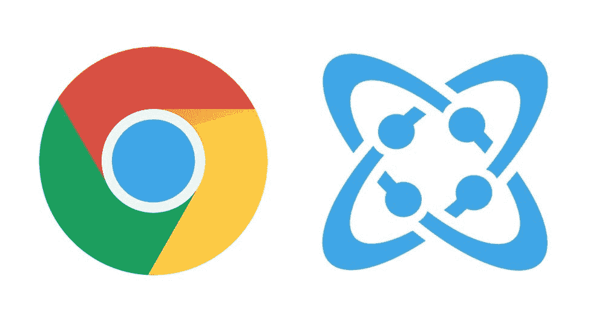

# 如何构建一个 Chrome 扩展将网页内容保存到 Cosmic JS

> 原文：<https://medium.com/hackernoon/how-to-build-a-chrome-extension-to-save-web-content-to-cosmic-js-ca503ceabd84>

在本教程中，我们将构建一个 Google Chrome 扩展来保存 web 内容到[宇宙 JS 桶](https://cosmicjs.com)。把它想象成你的个人网络剪切机。

# TL；速度三角形定位法(dead reckoning)

[**从 GitHub repo 下载代码**](https://github.com/cosmicjs/content-grabber)

# 先决条件

你只需要安装 Chrome 进行测试，其他什么都不用做。

# 安装演示

1.  通过下载或克隆 repo 将源代码放入您的机器，repo 位于 [**此处**](https://github.com/cosmicjs/content-grabber) **。**
2.  在 Chrome 中，访问`chrome://extensions`
3.  勾选右上角的复选框，启用开发者模式。
4.  单击“加载解压缩的扩展…”按钮。
5.  选择包含您的**解包的**扩展的目录。
6.  刷新加载的页面。

现在，您将在 Omnibox 的右侧看到扩展图标。点击它，用你的宇宙 JS 凭证登录。您现在可以开始将内容保存到存储桶中。

# 理解源代码

Chrome 扩展中的定义文件是 [manifest.json](https://github.com/cosmicjs/content-grabber/blob/master/manifest.json) 文件。清单中的大多数字段都是不言自明的。让我们浏览一下主要的字段，看看每个文件都做些什么。

*   `manifest_version`是“2”。不要改变它是非常重要的，因为它是 chrome 如何编译扩展的标志。
*   `permissions`包括扩展需要的权限
    - `storage`权限允许你在“Chrome 本地存储”存储数据，这对于跨网站和不同页面保存数据很重要。
    - `https://api.cosmicjs.com/v1`权限允许在扩展中的任何地方从 API 检索数据和向 API 发送数据。
*   `browser_action`包含与顶栏图标和 HTML 文件相关的“默认图标”和“默认弹出”
*   `content_scripts`这是一个重要的部分，它包含注入网站的脚本
    - `matches: [*://*/*]`告诉浏览器将脚本注入任何协议【http，https，...]和任何域。
*   - `css`字段包含要注入的 CSS 样式表
*   - `js`字段包含要注入的 JavaScript 文件
*   - `all_frames`为真，告知将脚本注入所有框架，如“iframe”标签。重要的是让扩展在任何地方都能工作
*   `background`包括后台脚本，用于管理向 Cosmic JS 发送数据并检查授权

js 文件夹中的 JavaScript 文件是整个功能的所在。`myscript.js`文件包含所有扩展的功能。`contentscript.js`文件使用 jquery 和`myscript.js`管理扩展功能匹配的网站。`background.js` file 定期调用授权函数，同时也向 Cosmic bucket 发送数据。

# 结论

API 优先的内容管理系统的优势在于，你可以将你的应用集成到任何地方。因此，你的 Cosmic JS Bucket 可以驱动你的 web 应用、本地应用、浏览器扩展或者任何可以使用 API 的东西。如果您有任何问题，请通过 [Twitter](https://twitter.com/cosmic_js) 联系我们，或者加入我们的 [Slack](https://cosmicjs.com/community) 社区。

[本文原载于 Cosmic JS](https://cosmicjs.com/articles/how-to-build-a-chrome-extension-to-save-web-content-to-cosmic-js) 。