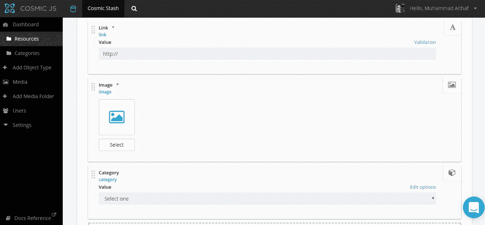
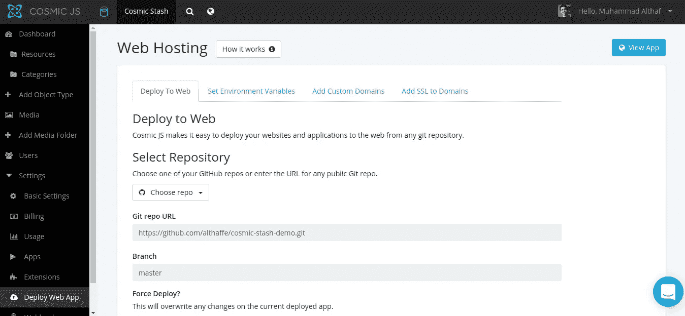

# 如何用 Vue 和 Cosmic JS 搭建内容策展网站

> 原文：<https://medium.com/hackernoon/how-to-build-a-content-curation-website-with-vue-and-cosmic-js-323cb4ac3681>

What we will be building

构建资源和工具的精选集合是在您的社区中获得可见性的简单方法。在本教程中，我们将建立一个简单的内容监管网站，由[宇宙 JS](https://cosmicjs.com/) 提供支持。您将看到使用 Cosmic 为我们的内容创建关系数据库模型是多么容易，以及我们从无到有进行部署的速度有多快。

我们将使用 Vue JS 作为我们的前端框架，使用 flexbox 驱动的布尔玛让一切看起来都很漂亮。所以让我们开始吧。

# TL；速度三角形定位法(dead reckoning)

[从 Github Repo](https://github.com/cosmicjs/vue-content-curation-app) 下载代码
[检验演示](https://cosmicjs.com/apps/content-curation-website)

# 先决条件

您需要在您的计算机上已经安装了 node 和 npm。如果没有，访问 [node js 网站](https://nodejs.org/en/)，安装最新的稳定版本。

# 入门指南

对于我们的项目，首先构建我们的后端模型是有意义的。

**设置宇宙 JS 后端**

登录到您的宇宙 JS 仪表板，并选择“添加新桶”。在下一个屏幕中，为您的存储桶提供一个名称，然后选择“从头开始”。

我们现在有了我们的存储桶设置，需要添加我们的内容。但是首先，我们需要建模我们的内容将如何构建。我们将为此添加两种对象类型。类别和资源。

点击菜单中的“添加对象类型”。对于类别，我们不需要任何元字段，所以只需添加单数名称“Category”并保存对象类型。

类似地，创建一个名为“Resource”的对象。

我们需要为每个资源定义几个元字段。点击元字段并添加以下字段。

1.  标题为“Link”且值为“http://”的纯文本字段
2.  标题为“图像”的图像/文件字段
3.  以标题“类别”和“类别”作为对象类型进行选择的单个对象关系。

我们使用最后一个字段为资源分配一个类别。现在保存对象类型。

我们现在已经有了内容结构。现在，您可以从相应的选项卡添加类别和资源。

# 安装演示

内容准备就绪后，我们现在可以关注应用程序的源代码了。

项目演示的源代码位于[https://github.com/cosmicjs/vue-content-curation-app](https://github.com/cosmicjs/vue-content-curation-app)。通过使用`git clone`克隆存储库或者点击 github 页面中的下载按钮，将一个副本下载到您的机器上。

一旦有了存储库，将`cd`放入目录中，并使用`npm install`安装项目依赖项。要让应用程序运行起来，您还需要再做一步。将根文件夹中的`.env.sample`文件复制并重命名为`.env`，并填写 bucket 配置变量——这些变量可以从您的 cosmic dashboard 中的设置→基本设置选项卡中获得。(如果你愿意，可以跳过 write_key，因为我们还没有从应用程序向我们的 cosmic js 后端写入任何内容)

一旦完成，你就可以用`npm run dev`在开发模式下启动应用程序，默认情况下，你可以在`localhost:8080`或者在`.env`文件中定义的端口访问它。

要为生产构建应用程序，运行`npm build`。准备提供的已构建应用程序将生成到“dist/”文件夹中。要为应用程序提供服务，运行`npm start`，这将启动一个 Express 服务器，并在默认情况下在`localhost:5000`或您在`.env`文件中定义的任何其他端口提供我们构建的文件。

# 理解源代码

该项目是用 vue-cli 搭建的，这给了我们一个很好的工作结构。唯一的主要增加是`server.js`文件，它包含在 Cosmic JS 中用于部署。

如您所见，这将启动一个 Express 服务器，并将我们的`dist/`文件夹作为静态文件。如前所述，`dist/`文件夹是生产应用程序的内置位置。

在`src/`文件夹中，有四个文件夹。

`assets/`目录用于静态资产，如图像、样式表等。我们在`assets/styles/`文件夹中有一个`main.scss`文件，你可以在其中定义全局样式，也可以根据需要修改任何布尔玛变量。

`components/`文件夹包含两个组成文件。类别列表的列表组件和每个类别页面的单个组件。

文件夹`router/`包含 vue 路由器配置，文件夹`resources/`包含一个宇宙桶初始化文件，我们可以导入并在组件中使用它

# 部署应用程序

因为 Cosmic JS 在后端做繁重的工作，而且没有数据库需要配置，所以部署就像在公园散步一样简单。我们将研究使用 cosmic JS 托管的部署。

转到您的宇宙仪表板中的存储桶，导航到设置→部署 Web 应用程序。提供您的 Github 存储库 url 和要部署的分支。Cosmic 让我们之前设置的三个环境变量在每次部署时自动可用，所以您不需要手动输入。

您可以探索其他部署选项，包括设置自定义环境变量、添加自定义域和 ssl 等。完成后，只需点击“部署到网站”，该网站将被部署。您将收到一封关于成功部署的电子邮件

# 结论

我希望通过这个简短的教程，你能看到 CosmicJS 的潜力。通过消除后端的繁重工作，Cosmic 本质上加快了过程，减少了构建内容驱动的网站和应用程序的麻烦。如果您有任何问题，请随时通过 [Twitter](https://twitter.com/cosmic_js) 联系我们，或者加入我们的 [Slack](https://cosmicjs.com/community) 社区。