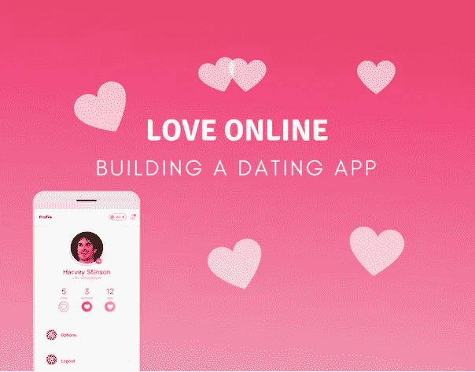
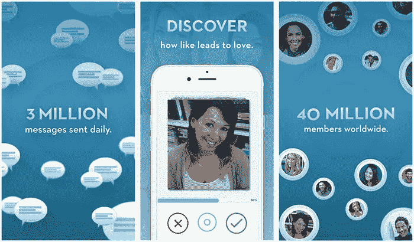
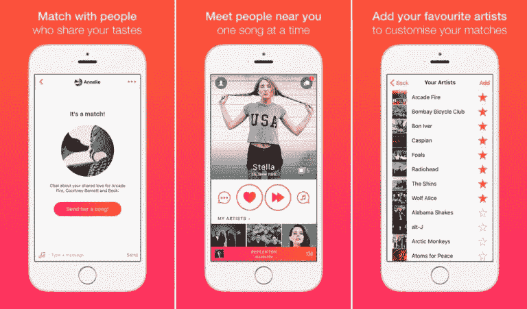
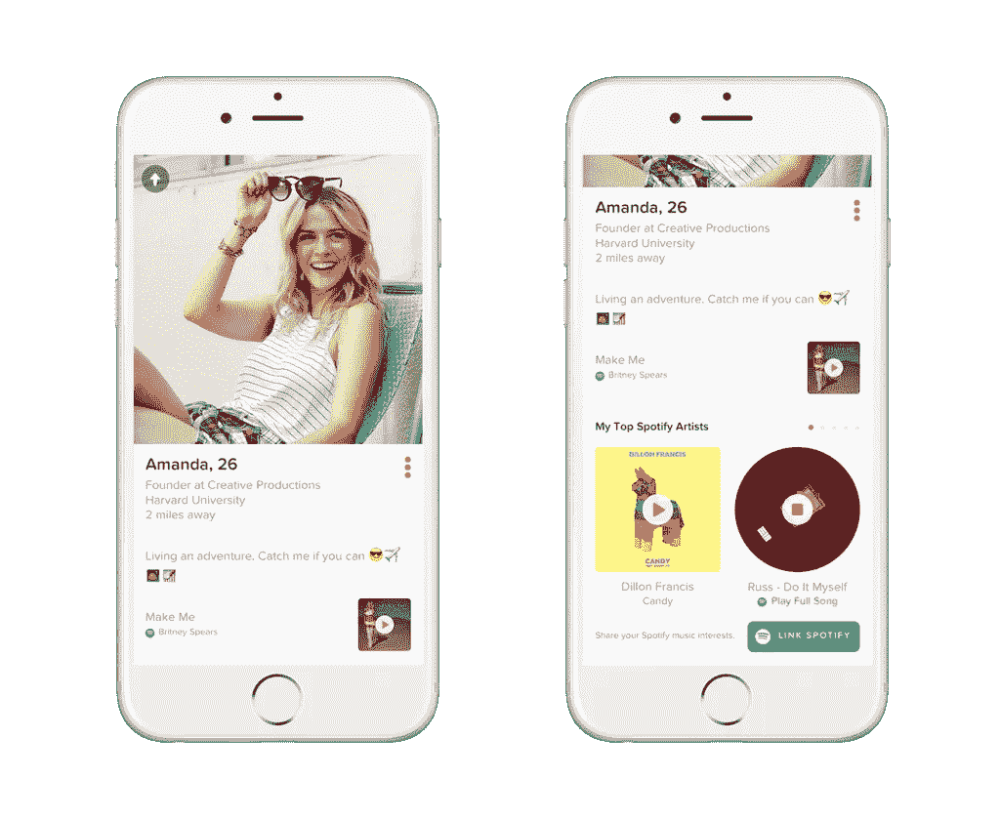
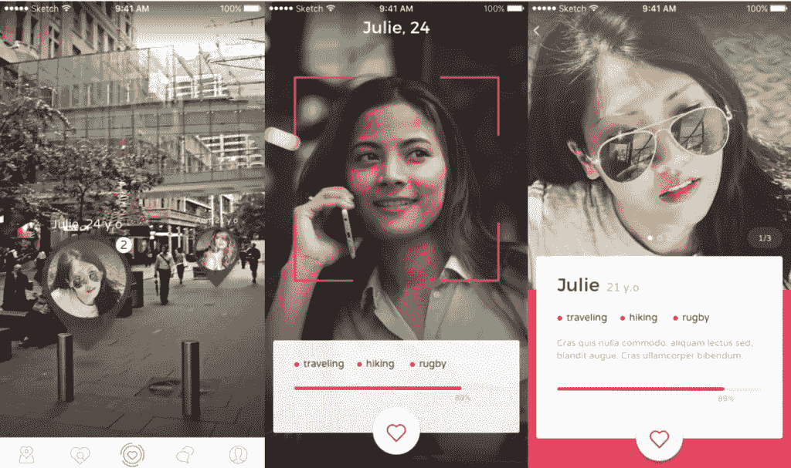

# 如何搭建一个交友 App？约会手机应用的终极指南

> 原文：<https://medium.com/hackernoon/how-to-build-a-dating-app-an-ultimate-guide-on-dating-mobile-app-aaa6964cb7f1>

随着超过 27%的承诺关系开始于互联网，网上约会不再是一个禁忌。据估计，全球约会应用程序和网站上有超过 2000 万次匹配，也就是说有大约 4000 万用户。
印度是在线约会用户的第九大市场。
随着快餐经济和互联网渗透率的增加，这些数字将会成倍增长。

[图片来源](http://www.thehealthsite.com/sexual-health/ways-to-spot-a-fake-profile-on-tinder-and-other-dating-apps-v0916/)

据预测，到 2031 年，至少 50%的已婚夫妇会在网上相遇。在线约会服务用户平均每年花费 243 美元。

电脑现在是本能，手机肯定是未来。48%的用户通过智能手机访问约会服务。
随着 Reliance Jio 的推出，智能手机和 4G 互联网变得更加普及，该国智能手机用户数量估计已增至 3 亿。

# 印度的网上约会

从网上约会或多或少限于向有良好 DPs 的人发送好友请求的日子以来，印度已经走过了漫长的道路。然后，当然，寻找灵魂伴侣从浏览报纸分类广告转移到在婚姻网站上搜索。这相当于在网上与 ladke/ladki waale 会面。

[图像来源](https://techcrunch.com/2017/03/02/dating-app-sapio-wants-you-to-think-harder-about-swiping-right/)

像 Tinder、Badoo、really crazy 和 Happn 这样的约会应用程序已经改变了这种情况，尤其是在印度。看起来年轻的印度人终于准备好寻找自己的伴侣，而不需要父母在网站上搜罗。与 2012 年的 27%相比，59%的年轻人表示他们并不轻视网恋。

印度是 Tinder 增长最快的市场，也是亚洲最大的市场。
每周发送 100 万个“超级赞”，女性发送的比男性多。因此，印度发生了巨大的变化，因为传统上女性甚至很难选择自己的伴侣。

Tinder 的成功鼓励了一些企业家在在线约会领域开发一些令人惊叹的应用程序。这些约会应用吸引了越来越多的用户，也吸引了投资者的巨额资金。用户发现约会应用程序很有帮助，无论他们是在寻找婚姻、认真的关系还是大众最喜欢的约会。

# 改变约会世界

这场可能以勾搭运动开始的运动，迅速而彻底地改变了下一代人与另一半相遇的方式。一项研究预测，三分之一的婚姻将是网上约会的直接结果，当然，没有其他更微妙的方式来表达兴趣，就像在个人资料上滑动一样。

有了一个可以满足所有人想象的平台——发布你吃过的食物，跟踪朋友的生活，用不到 140 个字符表达痛苦，甚至还有一个给你戴上狗耳朵的平台，人们有单独的应用程序来找到“BAE”就不足为奇了。

人类天生渴望找到伴侣，但我们越来越受到责任的限制。
垃圾桶里堆满了咖啡杯，午休时间被额外的工作时间所取代。
忙碌是常态，或许是一种骄傲，但这给线下会议留下了很小的空间。

因此,“寻找 BAE”应用程序已经像病毒一样传播开来，收集火柴已经变成了一项运动。
毫无疑问，2016 年在线约会市场价值 22 亿美元，收入 3.81 亿美元。
这是一个炙手可热的市场，脸书都准备在应用程序中添加内置约会功能，这足以表明市场的巨大。

然而，以下是一些事实:

[图像来源](https://www.igeeksblog.com/best-iphone-dating-apps/)

市场规模-2018 年在线约会细分市场的收入达到 13.83 亿美元。
·用户渗透率为 5.7%，预计将增至 6.3%
·仅 Tinder 就有 5000 万用户，平均每天有 1200 万场比赛。这意味着至少有十亿次刷单。平均每天花在约会应用上的时间增加到了 90 分钟。印度是亚洲最大的网上约会市场，因为其大部分人口都是年轻人。
仅在印度，刷卡次数就从 2015 年的 750 万次上升至 1400 万次。
·真正疯狂地看到了 100%的月环比增长率。

在如此高的需求下，企业家和初创公司有很大的空间进入这个市场并取得成功。

# 应用还是不应用

[图像来源](https://www.topappslike.com/tastebuds/)

约会应用变得如此流行的首要原因是它们更有效率。
一个网站并不像一个应用程序那样点击即可访问。
另一方面，一个应用程序是和用户一起旅行的。有了地理邻近和机器学习等功能，根据你的偏好量身定制选择，网站可能很快就会变得多余。

事实上，五分之四的人更喜欢手机约会，而不是在线网站。61%的用户更有可能在约会应用上“勾搭”而不是在网站上。网站不像应用程序那样容易使用和创收。
各种各样的应用程序已经进入利基市场，如 LGBT 约会服务、严肃约会，甚至基于不喜欢的约会应用程序。
所有这些偏好都是通过大数据和机器学习实现的，这些数据和机器学习更容易通过智能手机收集和实现。

构建一个应用程序现在不再是一个选择的问题。
因此，如果你想开发自己的约会应用，让用户上瘾的关键是它背后的 UX。
这个界面必须让人们在网上见面像向左滑动或向右滑动一样简单。

# 顶级媒人

在线约会在印度相对较新，Tinder 直到 2015 年才进入市场。然而，像 Matrimony.com[和 Shaadi.com](http://matrimony.com/)这样的婚姻网站在过去十年里一直很流行。
让我们面对现实吧，他们不是很浪漫，有时你可能会和他/她的母亲聊天。约会应用是我们浪漫主义者的救星。在这个恋爱的季节，让我们来看看印度最受欢迎的约会应用:

[图像来源](https://hellogiggles.com/love-sex/dating/dating-app-study-compliments/)

**1。** [**火绒**](https://tinder.com/?lang=en)

自 2015 年推出以来，Tinder 一直是印度在线约会领域的市场领导者。每天超过 1400 万次的点击量，它仍然是不可战胜的。该应用程序提供了最高数量的匹配，主要是在寻找休闲约会(俗称“勾搭”)的个人中。
Tinder 在相亲市场变得流行，但也不是没有后果。几个被调查的人报告说加入 Tinder 只是为了好玩，很快就厌倦了。然而，无聊并不是一个大问题，尤其是当女性拒绝出去约会时会面临骚扰这样的问题。
这可能是 Tinder 拥有 66%男性用户的结果。

**2。** [**MTJF |不止是朋友**](https://mtjf.co/)

如果你的朋友对你没有同样的感觉，表达你的感受会带来很大的风险，让事情变得尴尬。
不含 MTJF。MTJF 的双重选择加入机制确保一个人知道另一个人喜欢他/她，只有当他们都喜欢对方的时候。当其他约会应用充斥着数百万个虚假账户时，MTJF 保证你永远不会遇到虚假账户。
MTJF 使用手机号码& OTP 验证机制验证每个用户。
这样你就可以随时确定你在和你想交谈的人交谈。

**3。** [**真正疯狂地**](http://trulymadly.com/)

随着 Tinder 上骚扰问题和虚假资料的报道，真正疯狂是一个受欢迎的变化。
该应用根据用户的社交媒体整合、工作验证、用户 ID 和移动验证为其用户分配信任分数。该应用拥有 220 万用户，但女性用户仅占其中的 30%。
虽然信利疯狂想要正版验证用户，并声称对所有信息保密，但最近的脸书数据泄露并不让人很放心。因此，用户非常不愿意在网上分享这些细节。

**4。** [**拉拢**](http://www.getwooapp.com/)

和其国际竞争对手 Tinder 一样，WOO 需要通过脸书登录，并整合了 LinkedIn 以提供专业信息。WOO 创始人声称，它不是很“像火绒”,因为它更关心根据兴趣、好恶和职业创造有意义的匹配。WOO 提供了几项安全增强措施，其中最重要的是，在匹配之前，人名只显示为首字母。

**5。** [**FLOH**](https://www.floh.in/)

FLOH 是一个只接受邀请的约会应用程序，专门针对那些寻求将认真的关系转变为婚姻的人。
理想情况下，FLOH 的用户群在 26-36 岁之间。该应用程序需要你支付 7000 印度卢比才能使用三个月，然而，它保证在他们的活动中会见 50 名单身人士，并一对一介绍 10 场比赛。与其他约会应用不同，FLOH 拥有 55%的女性会员。

**6。**

**Happn 是一款针对特定地点的配对应用，它可以帮助用户发现已经有过交集的人。用户只需启用他们的定位服务，就可以看到经过他们身边的人，给他们一个即时发送信息的选项。在赫里尼克·罗申的倡导下，它有了一个大爆炸式的发布活动。
然而，HAPPN 在印度并没有取得惊人的成功，因为印度人很保守，可能会有一些人为了匹配 Happn 而尾随女性。**

****7。** [**邦布尔**](https://bumble.com/)**

**Bumble 在印度网上约会市场有着巨大的潜在空间，到目前为止，这个市场对女性来说并不是很有前景。爬行和跟踪者长期以来一直是主要约会应用的令人不安的缺点，Bumble 解决了这一问题。通过只允许女性发起对话，它克服了这个问题。**

# **约会应用的基本功能**

**是什么让一个交友 app 让人上瘾，让人动心？**

**对于 Tinder 来说，它是无与伦比的用户体验。Tinder 的 USP 是用几乎即时的匹配让遇见的人一扫而光。
对于 TrulyMadly 来说，是基于兴趣和偏好匹配的经过验证的用户。如果与人见面必须像向右滑动一样简单，那么界面必须非常出色。
以下是一款优秀约会应用的基本要素:**

****#1 社交媒体整合:**世界是在线的，整合像脸书和 Instagram 这样的平台以使登录和注册变得简单快捷非常重要。
这也允许应用程序收集关于喜欢和不喜欢的数据，并访问用户的朋友列表。脸书也是一个伟大的方式来验证用户，以避免伪造的个人资料。
当两个用户有共同的匹配和朋友时，从应用匹配中冒险成功建立关系的可能性更高。这让第一次约会不那么尴尬，给情侣们共同的话题。**

****#2 简介:**每个人都讨厌填写长表格。类似医院的用户界面已经成为过去，所有数据已经在线，使用脸书登录可以自动输入姓名、性别、电子邮件等初始数据。
几个约会应用程序通过添加很酷的图片使整个过程游戏化，变得有趣。**

****#3 地理定位:**跟一个远离自己居住地的人匹配，没什么用。因此，对于约会应用来说，拥有基于位置的匹配是很重要的。住在同一地区或同一城市的人更有可能相遇，除非他们足够大胆地开始异地恋。像 Tinder 这样的应用程序提供付费服务，允许用户将位置更改为他们可能在不久的将来要去或计划去的地方。**

****

**[图像来源](http://theindependent.sg/love-at-first-click/)**

****#4 匹配:**配对的谁、什么、哪里、为什么都是由一些内部开发的算法运行的，这些算法根据用户的好恶来匹配用户。
然而，约会算法并没有那么简单，要让一个配对应用发挥作用，关键是要有算法显示出用户在其他人之前喜欢过你。
同样常见的是，刷单和匹配次数多的用户会首先显示。
这可能不太道德，但对于增加匹配数量的企业来说却是必不可少的。**

****#5 聊天/信息:**为了促进对话并使应用程序更具吸引力，有一个聊天框来让匹配的用户开始对话是必不可少的。这也是与女性交流的一种更安全的方式，尤其是要记住，滥用者无法获得联系方式。
几个用户在发现匹配的用户不兼容后没有交换联系方式。
这进一步确立了对应用内消息平台的需求。**

****#6 推送通知:**当用户有匹配时得到通知是很重要的。由于这个原因，推送通知需要成为应用程序的一部分——以避免错过可能的浪漫。**

# **在约会应用上赚钱**

**从网上约会一开始，货币化就是一个问题。随着约会应用的出现和围绕提供最佳质量的巨大战争，这一点变得更加突出。普通用户每天花 90 分钟在约会应用上，收入潜力巨大，但风险也很大。
以下是一些从约会应用中赚钱的既定方法:**

****订阅模式:**该模式要求每月、每季度或每年提供高质量的功能。
FLOH 基于订阅模式，根据用户的选择将用户与特定用户相匹配。
它保证至少有 10 个一对一的介绍。**

**几个应用程序，最大的是 Tinder，使用免费增值的收入模式。所有的基本服务都是免费的，高级服务只提供给付费的顾客。例如，Tinder 提供了 Tinder Plus 服务，可以进行无限匹配，并返回到你已经滑动过的个人资料。**

**礼品:综合礼品发送设施也是一种可行的收入模式。可以收费提供鲜花、巧克力和贺卡等礼物。**

**广告:考虑到竞争，广告对约会应用来说是一种风险。用户倾向于反对重复出现的广告，很快就会卸载。然而，可以使用不中断的微妙广告。**

****第三方服务:**约会应用可以包括允许预订出租车或预订有特别优惠的桌子的服务，甚至还有电影约会主持人。**

# **约会应用背后的技术**

**像 Tinder 这样的约会应用程序的令人兴奋的功能是投入开发的数小时辛勤工作和许多工具测试和应用的明显结果。
一个应用的性能是它最好的资产，因此最好的技术和团队应该在它背后工作。
EB 团队一直是开发应用程序的市场领导者，不仅获奖，还从全球巨头那里筹集了数千美元的资金。**

****

**[图片来源](https://globaldatinginsights.com/2016/09/21/tinder-teams-up-with-spotify-for-new-feature/)**

**像 Tinder 这样的应用程序的技术堆栈包括 JavaScript、HTML5 和 Python 作为编程语言，以及用于构建和测试应用程序的 AWS 平台。对于地理定位，大多数约会应用程序使用智能手机内置的 GPS。NoSQL 和 MongoDB 是用作可伸缩数据库环境的最佳平台。
GoDaddy SSL 认证确保输入数据和进行交易时的安全性。Tinder 有自己在开源平台 Mapbox 上设计的自定义地图。**

**重要的是要知道应用程序必须在哪个平台上开发，最受欢迎的是 IOS 和 Android，因为这些平台上的开发可能完全不同。
注意，如果计划是你的约会应用将被数千甚至数百万用户使用，构建一个可上升的后端将花费更多的时间。**

# **约会应用的未来**

**视频约会: Hinge 和“Coffee Meets Bagel”已经启动了视频聊天选项，可以虚拟约会，避免失望。由于 44%的网上约会者报告说他们在网下遇到他们的伴侣后感到失望，虚拟视频约会有巨大的潜力。随着一些应用程序在约会应用程序中提供内置视频通话选项，这已经开始受到关注。**

****AR 中的约会:**你玩过病毒游戏 Pokemon Go 吗？增强现实中的约会是类似的，除了在这种情况下，你抓住的是日期而不是口袋妖怪。听起来很有趣，对吧？FlirtAR 是第一家涉足这一市场的公司。它的工作原理有点像 Happn，但在这里你可以看到你熟悉的气球标记。
点击气球，打开个人资料。
现在，如果他们也喜欢你，你可以在应用程序上主动出击；如果他们就在附近，你可以亲自出击。**

****

**[图像来源](https://globaldatinginsights.com/2017/08/31/new-augmented-reality-dating-app-flirtar-raises-1-5m-series-a/)**

**虚拟现实中的约会:虚拟现实在技术上是一项突破性的发展，其使用范围只是在不久前才为人所知。
一家顶级移动应用程序开发公司开发出了 VRCHAT，它构建了一个虚拟的互动空间，用户可以与世界各地的任何人交谈，仿佛他们在同一个房间里一样。这使得浪漫的相亲成为可能，即使是虚拟的。**

**虚拟约会的关键卖点是它提供的好处:**

**它节省了虚拟现实中的时间**

**虚拟现实约会效率更高**

**帮助发展有意义的联系**

**让浪漫约会成为可能，无需走出家门**

**游戏化让约会变得有趣，也让集体约会成为可能**

**了解潜在的合作伙伴或让你警惕危险信号**

**省钱**

**虽然没有什么可以取代物理存在，但将技术整合到在线约会和约会应用程序中的整个概念肯定会有一个更好的未来。
充满希望的年轻夫妇希望虚拟现实技术在不久的将来能够成功地传递物理感觉，比如拥抱和牵手，当然是在虚拟空间中。**

# **构建您的约会应用程序**

**当今约会经验的浅薄已经给全世界的网上约会者带来了越来越多的疲劳感。
尽管市场前景看好，但在线约会领域还没有出现独角兽，也没有明确的领导者。虽然这是一个构建约会应用的简单指南，但是你的应用不需要包含所有这些功能。但是无论它想要达到什么目的，它都必须做得很好，这样才能让你的应用与众不同。**

**看看我们最近的一个项目，一个交友应用 MTJF，不仅仅是朋友的简称。**

**虽然很容易将手机或在线约会视为陈腐和浅薄，但我们已经看到，除了应用程序的游戏化方面或更多匹配的即时满足之外，还有更多附加值。
约会应用程序简化了寻找和遇到合适伴侣的最初且往往繁琐的过程，并成为用户认为有价值、有帮助且值得花时间的工具。**

**在未来几年，市场将需要一个重新加载，使网上约会更好。如果你有一个约会应用的想法，让我们把它做得比 Tinder 更好。**

**如果你喜欢读这篇文章，别忘了鼓掌一次、两次或多次。**

**— — — — — — — — — — — — — — — — — — — — — — — — — — -**

# **阅读我的其他 Hackernoon 文章**

**1.[我的非技术女联合创始人是如何为顶尖创业公司打造 45 位 CTO 的！](https://hackernoon.com/how-my-non-tech-female-cofounder-built-45-ctos-for-top-notch-startups-12a9a9a31167)
2。[做一个手机 app 要多少钱？](https://hackernoon.com/how-much-does-it-cost-to-make-an-mobile-app-7343dbd99f68)
3。[如何雇佣一个合适的设计师或开发人员](https://hackernoon.com/how-to-hire-a-right-designer-or-developer-d4f24d78e2e1)
4。[如何搭建一个订餐 App？手机点餐 App](https://hackernoon.com/how-to-build-a-food-ordering-app-an-ultimate-guide-on-food-ordering-mobile-app-c19441826aca)
5 终极指南。[Mayank Pratap 如何打造 engineer Babu——一家盈利的 IT 服务公司](https://hackernoon.com/how-mayank-pratap-built-engineerbabu-a-profitable-it-service-company-generating-more-than-50-000-per-month-bcd3006bdbb5)**

***我是 Mayank，*[*engineer Babu*](https://www.engineerbabu.com/)*的联合创始人。请随时联系我关于*[*Linkedin*](https://www.linkedin.com/in/mayankpratap/)*| mayank@engineerbabu.com* 此外 [EngineerBabu](https://www.engineerbabu.com/) 帮助初创公司、企业和所有者通过构建高级 IT 解决方案来发展他们的业务。他们开发的项目 95%都按时完成了。 [30+由风投](https://www.engineerbabu.com/casestudies)资助，获得最具创新总理设计奖，入选 Y-Combinator 2016 & 2017。**