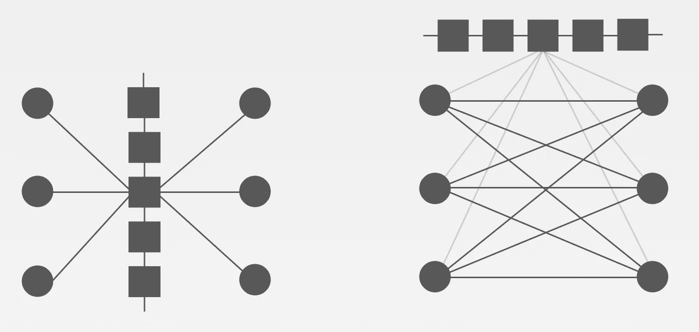
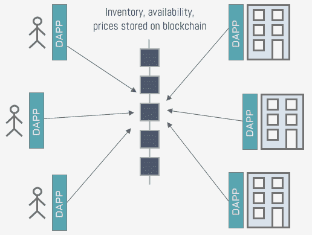
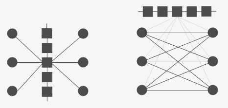
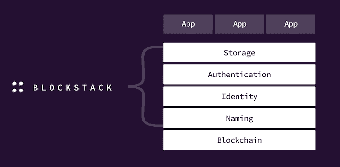

# 如何构建一个可伸缩的分散式应用程序？少尝试区块链。

> 原文：<https://medium.com/hackernoon/how-to-build-a-decentralized-application-that-scales-try-less-blockchain-b3e61b1d7bd6>

不，在[区块链](https://hackernoon.com/tagged/blockchain)运行你的分散式应用程序(dapp)不会带来成功的业务。事实上，大多数用户并不关心一个应用程序是否在区块链上运行——他们只是选择一个更便宜、更快、更容易使用的产品。

可悲的是，即使区块链有自己独特的属性，运行在其上的大多数应用程序都比集中式应用程序更贵、更慢、更不直观。

在 dapp 白皮书中经常可以找到这样一段话:“*区块链价格昂贵，还不能支持每秒所需的交易数量。幸运的是，许多聪明人都在致力于公共区块链扩展，到我们推出 dapp 时，区块链将具有足够的可扩展性。”*

在一个简单的段落中，dapp 开发人员可以放弃任何关于可伸缩性问题和问题替代解决方案的深入讨论。这通常会导致低效的软件设计，其中运行在区块链上的智能合约是应用程序的核心，并充当其后端系统。

然而，就 dapp 设计而言，还有未开发的场地，通过减少对区块链的依赖，其规模要大得多。例如，Blockstack 提倡将大部分应用程序数据和逻辑存储在区块链之外的设计。

让我们首先来看看一种更传统的方法，它使用区块链作为 dapp 用户之间的中介，并且扩展性不是很好。

# 方法 1:区块链作为后端

为了让事情更清楚，让我们以酒店业为例。这是一个庞大的行业，像 Booking.com 的*、[这样的中介为酒店客人和酒店经营者牵线搭桥，收取高昂的费用](http://www.dailymail.co.uk/news/article-3044298/Hotel-guests-fleeced-online-agents-Hoteliers-say-forced-hike-prices-cover-25-commission-taken-websites.html)。*

*对于任何我们想用这种方法消除的中介，我们都试图使用区块链的智能合约(如以太坊)来复制其业务逻辑。*

*在公正的“世界计算机”上运行的开源智能合同可以连接价值创造者和消费者，而无需第三方公司介入，最终结果是降低中介机构收取的成本和佣金。*

*如下图所示，酒店使用 dapp 向区块链发布关于其库存中的房间、其可用性以及工作日和周末的价格的信息，甚至可能存储房间描述和任何其他相关信息。*

**

*任何想要预订房间的人都可以使用 dapp 搜索区块链上的酒店和房间。一旦用户选择了一个房间，通过将所需数量的代币转移到酒店作为押金来进行预订。反过来，智能合同更新区块链以反映该房间不再可用。*

*这种方法中的可伸缩性问题有两个方面。首先是每秒的最大事务数。其次，必须存储在区块链上的数据量。*

*我们粗略算一下。Booking.com 声称他们的网站上有近 200 万家酒店。假设一家酒店平均有 10 个房间，每个房间每年仅被预订 20 次，这意味着平均每秒钟约有 13 次预订。*

*为了客观地看待这个数字，以太坊每秒可以处理大约 15 笔交易。*

*酒店上传并不断更新库存会产生更多的交易。酒店经常更新房间价格，有时每天更新，每次价格和库存变化都需要区块链交易。*

*还有一个大小问题——以太坊区块链最近已经超过 2TB 了。如果以太坊风格的 dapps 流行起来，它们将使区块链膨胀到不可持续的程度。*

*这种基于区块链的系统可以消除第三方，因为它的公正性和缺乏中央权威——区块链技术的基石。但是区块链也是不可变的、不可逆的和分布式的——这很好，但是从速度和交易费用来看，代价是相当大的。*

*这就是为什么 dapp 开发者应该仔细评估每个使用区块链的特性是否真的需要一个不可变的、不可逆的分布式账本。*

*例如:将每家酒店的数据分布在世界各地的数百台机器上，然后永远保存在那里，这有什么附加值？历史房价和房态数据必须永远嵌入区块链吗？大概不会。*

*如果我们问这些问题，我们会发现我们并不需要区块链所有昂贵的特性来满足所有的功能。那么，还有什么选择呢？*

# *方法 2:受块堆栈启发的设计*

*尽管 [Blockstack 的](https://blockstack.org/)主要关注用户拥有其数据的 dapps，但他们也有一个谨慎使用区块链的理念——仅在绝对必要时使用。他们的理由是区块链速度慢且昂贵，应该只用于一次性的或不频繁的手术。dapp 之间的其余交互应该对等进行，即 dapp 用户应该直接相互共享数据，而不是通过区块链。毕竟，BitTorrent、Email 和 Tor 等最古老、最成功的去中心化应用是在区块链技术存在之前发明的。*

**

*On the left: the first approach, where dapp users communicate through a blockchain. On the right: dapp users communicate directly with each other. A blockchain is only used for identity and other essentials.*

*让我们回到酒店预订的例子。我们想要的是一个公正、独立和开放的协议，将客人与酒店联系起来。换句话说，我们想要消除一个集中的中介。例如，我们不需要将房价和酒店库存永远存储在一个共享的、坚不可摧的分布式账本上。*

*我们为什么不让酒店的客人和酒店直接沟通呢——而不是通过区块链。酒店可以将它们的价格、库存和可用性存储在任何人都可以访问的地方:无论是 IPFS、亚马逊 S3，甚至是他们的本地服务器。这正是名为 [Gaia](https://github.com/blockstack/gaia) 的块堆栈分散存储系统所提供的功能。它允许 dapp 用户选择他们想要存储数据的地方，并通过一种叫做[多人存储](https://blockstack.org/tutorials/multi-player-storage)的方法控制谁可以访问这些数据。*

*为了建立信任，每个酒店的数据都由酒店加密签名。无论这些数据存储在哪里，都可以使用存储在区块链上的与酒店身份相关联的公钥来验证其完整性。*

*在 Blockstack 中，只有您的身份信息存储在区块链上。关于如何访问每个用户数据的信息存储在*区域文件*中，并通过块堆栈节点的对等网络传播。同样，您不需要信任节点提供的数据，因为您可以通过将其与存储在区块链上并由其他用户拥有的哈希进行比较来验证其真实性。*

*在该系统的简化版本中，酒店客人将使用 Blockstack 的对等网络来发现酒店，并从提供的网络位置检索他们的库存。您检索的所有数据的真实性和完整性可以通过使用存储在 Blockstack 的[虚拟链](https://www.youtube.com/watch?v=LBft0c4RZcQ)上的公钥和哈希来验证。*

*这是一个比前一个更复杂的架构，需要更复杂的基础设施。事实上，这就是 Blockstack 的用武之地，它提供了构建这种去中心化系统所需的所有组件。*

**

*在这种设计中，我们在区块链上只存储实际上需要不可变、不可逆和分布式的数据。在 Blockstack 中，你只需要通过区块链交易来注册你的身份，并宣布你的数据将被存放在网上的什么地方。如果您想要更改某些信息，您可能需要发出更多的事务，但是这不是一个重复发生的事件。*

*此外，与以前的方法相反，应用程序的逻辑驻留在客户端应用程序上，而不是智能合约上。这使得开发人员无需对智能合约进行代价高昂(有时甚至不可能)的更改就可以更改逻辑；通过将应用程序数据及其逻辑保持在区块链之外，分散式应用程序可以实现与传统集中式系统相当的性能和可扩展性水平。*

# *最后的想法*

*Blockstack 应用程序可以比运行在区块链上的传统应用程序更好地扩展，但它是一种稍微年轻的方法，有自己的挑战和未解决的问题。*

*例如，不在智能合约上运行 dapp 减少了对特定于应用程序的实用程序令牌的需求。这可能会带来一个商业问题，因为 ico 已经成为这种分散应用(包括 Blockstack 本身)的主要资金来源。*

*还有技术上的挑战。例如，在智能合同中实现酒店预订功能是相对简单的，其中在原子操作中，预订房间是为了交换令牌。在没有智能合约的情况下，预订预订如何在 Blockstack 应用上工作并不那么明显。*

*一句话:dapps 通常以潜在数百万用户的全球市场为目标，为了取得成功，它们需要非常好的扩展性。在不久的将来，仅仅依靠区块链来实现这种级别的可扩展性是错误的。为了能够与 Booking.com*和 T3*这样的大型集中市场参与者竞争，分散的应用开发者应该考虑替代方法来设计他们的系统，比如 Blockstack 提倡的方法。*

**感谢* [*拉里·萨利布拉*](https://twitter.com/larrysalibra) *审阅并提供区块链图。**

> **有反馈或想法要分享吗？我们聊聊吧！在*[*Twitter*](https://twitter.com/vrepsys)*或*[*LinkedIn*](https://www.linkedin.com/in/vrepsys)上与我联系*