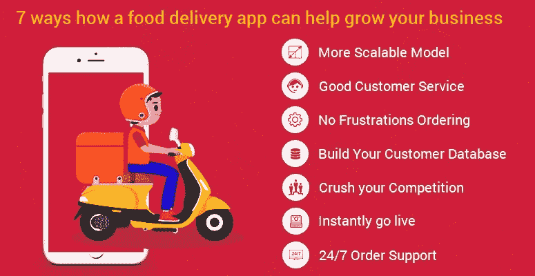
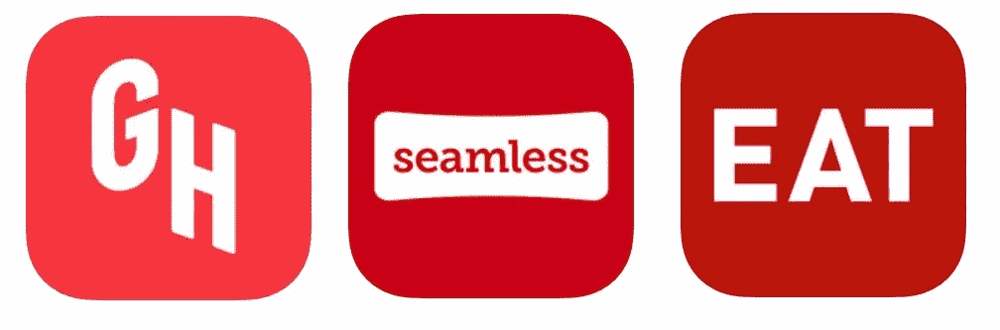
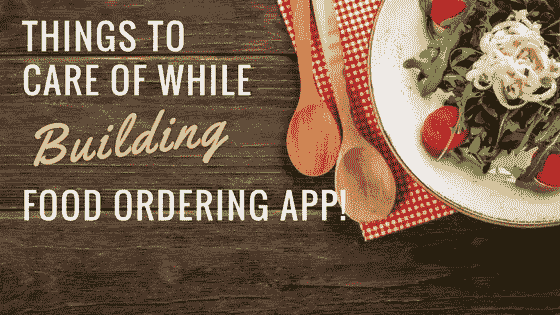
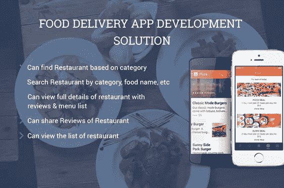
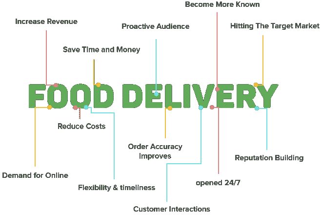
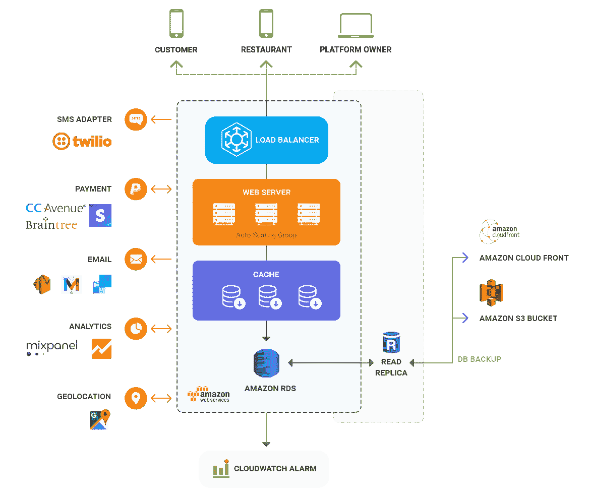
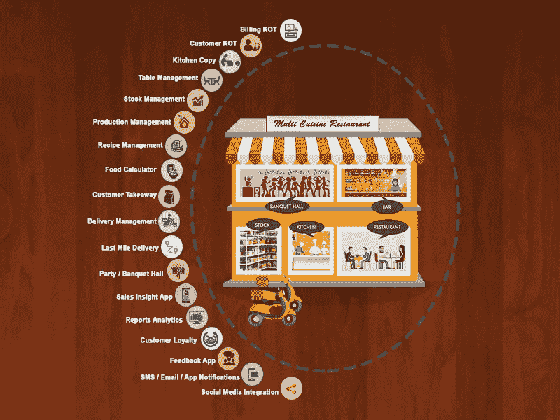
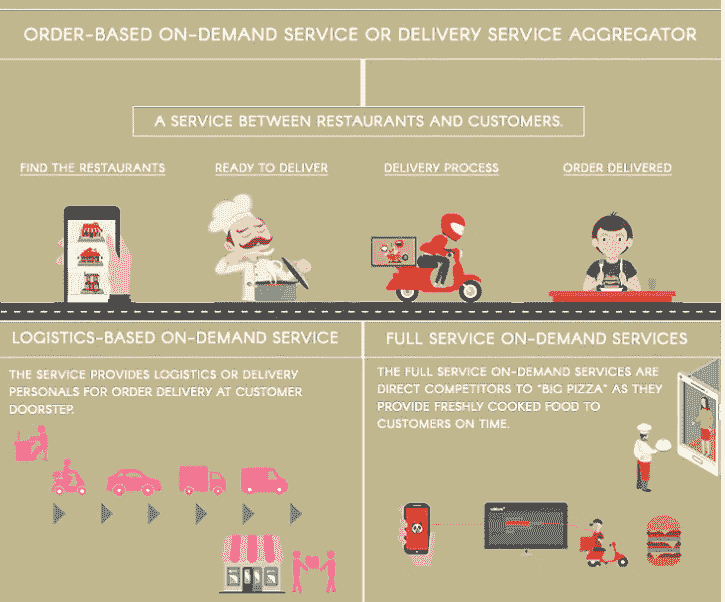

# 如何搭建一个订餐 App？点餐手机应用终极指南

> 原文：<https://medium.com/hackernoon/how-to-build-a-food-ordering-app-an-ultimate-guide-on-food-ordering-mobile-app-c19441826aca>

吃饭是每个人都喜欢做的事情，有什么比舒适地坐在家里，读你最喜欢的书，看一些节目或电影，或者只是与家人和朋友一起闲逛，从你最喜欢的餐馆点食物更好的呢？从餐馆老板制作自己的**订餐应用**让你坐在沙发上就能送餐到像 *foodpanda、swiggy、zomato* 这样的服务，这些服务充当了餐馆和客户之间的合作平台。

谁不梦想开一家美食店，开一家只提供自己喜欢的食物的餐馆，或者开一家提供与众不同且有诀窍的食物的餐馆呢？与众不同的东西。

[图像来源](https://www.kopatech.com/blog/7-ways-how-food-delivery-app-can-help-grow-your-restaurant-business.html)

不仅如此，每天都有越来越多的初创公司涉足食品行业，如今每个初创公司对移动应用的需求甚至超过了对网站的需求。
[随着这么多工具和技术的出现，构建一个移动应用](https://www.engineerbabu.com/blog/mobile-app-developer-resources/)变得很容易，但是根据你正在构建的应用的类型，你可能需要遵循一定的指导方针和标准。

不仅仅是为了你自己开发一个应用程序，移动应用程序行业目前是一个巨大的收入来源，食品初创公司每天都在增加，他们中的每一个都需要至少一个应用程序用于一个单一的平台，其中大多数都针对多个平台，如 *Android、iOS、Windows* 等。

# 流行的点餐应用程序之间的比较

[图像来源](https://frequentmiler.boardingarea.com/2018/03/22/3-free-restaurant-deliveries-with-apple-pay/)

研究和分析是任何开发过程中至关重要的一部分，你可以加入自己的见解来使你的产品更好，但也需要加入现有竞争对手的功能和其他小东西。
一些最受欢迎的食品配送应用程序，你可以从中找到线索 **GrubHub，eat24，seamless** 。

# 格鲁布布

这个应用程序是最常用的食品订购服务之一，它提供了搜索您想要的美食或浏览附近当地餐馆列表的功能。
您可以创建自己的收藏夹列表进行个性化设置，而不必每次都去搜索查找。它还有一个额外的用户评论功能。

# Eat24

Eat24 的工作方式与大多数其他网站略有不同，在这里你必须添加你的地址，然后在快速搜索后，它会显示出附近所有的食物类型和不同的餐馆。
之后，你可以根据菜式浏览，也可以通过“**T2”栏目简单点餐。你可以现在点菜，也可以留着以后再点。
它还能帮助你追踪食物从餐厅到你家门口的过程，这样你就能知道食物什么时候会送到。**

# 无缝的

与其他应用不同的是，这款应用可以根据你想要的价格来搜索食物。您也可以根据自己的喜好留下某些特殊要求，如。

# 构建送餐应用程序时需要注意的事项

在您成功构建原型和/或推出测试版产品后，在您开始*构建应用程序之前，有许多事情要做；在您构建应用程序时，有许多说明和程序要做；在您构建应用程序时，有许多评估和反馈*。
在您继续之前，我们会告诉您创建和启动食品配送应用程序的步骤，您可能需要阅读一下[著名食品配送应用程序的详细回顾](https://www.tomsguide.com/us/best-food-delivery-apps,review-3044.html)，这是我们之前介绍的简介的延续。

我在下面创建了一个指南，为你提供一步一步的详细说明，包括应用程序开发过程中不同组成部分的各个方面和覆盖范围。

如果你想从零开始，那么应用程序的开发可能会很困难和棘手，更不用说基于消费者反馈和欣赏的交付应用程序了。
最重要的是，你不必这么做，所有送餐应用的基础都是一样的。
在构建食品交付应用程序时，您需要考虑的一些基本事项是*简单干净的设计、没有不必要功能的极简 UI/UX、视觉增强和本地餐馆数据集成*。

[图像来源](https://www.linkedin.com/pulse/food-delivery-app-development-solution-vijay-patel/)

在你开始开发一个产品之前，最好记住你的目标，你想要的特性和你要关注的优势。

*   从本地开始，测试你的概念，发起营销活动，然后扩大规模。
*   雇用一些有经验和熟练的应用程序开发人员，他们以前在这个领域工作过。阅读本[外包应用开发者指南](https://www.engineerbabu.com/blog/mobile-app-outsourcing-engineerbabu/)。
*   推广是必要的，在你发布你的测试版产品之前，从最初的阶段开始。**通过社交媒体、电子邮件**等吸引潜在客户
*   专注于从客户那里获得反馈，并在此基础上进行即兴创作。
*   雇佣一个有价值的团队并让它留下来，**有竞争力的工资，灵活的工作时间，在家工作的选择，激励，奖励**等等只是一些常见的福利。

有许多不同类型的食品交付应用程序，你必须首先决定你期待创建哪种应用程序。

1.  *提供本地烹饪食物的应用* ( **必胜客**和其他本地特许餐馆，他们烹饪和出售自己的东西)。
2.  *平台接口送餐 app*如 **foodpanda、GrubHub** 等，充当餐厅与顾客之间的桥梁。
3.  作为一种*杂货递送服务*的应用程序，如**邮戳**等。
4.  *提供熟食以及鼓励家庭烹饪的应用*，如 **plated、chef'd** 等。

在我们继续之前，你可能想看看在开发产品时要记住的 101 个要点。

# 市场研究和目标受众

任何潜在产品开发的第一步都是定义你的目标人群范围，并研究其市场。使用应用程序的大多是生活忙碌的人，比如工作阶层的专业人士、企业家、学生等等。他们应该是你的应用程序的主要目标。

[图像来源](https://www.tekkiwebsolutions.com/)

在你着手制造你的产品之前，建议你在开始之前先了解一下你的竞争对手，不仅要了解他们的特点和他们受欢迎的原因，还要确保你没有抄袭任何人的想法。事先花时间研究，这样你就不必在后期做任何修改。好好研究你的竞争对手，看看他们的特点，他们提供的服务，以及他们与众不同的地方。

# 技术方面

在开始开发之前选择正确的技术是非常重要的，这取决于你的预算、平台和所需的特性，从 PHP 到 ruby 都可能不同。
其他功能，如 *iOS 或 Android、原生应用或混合应用，从头开始创建应用或使用第三方工具，如 API、应用克隆和 SDK*。无论你做出什么选择，都将直接影响你开发应用程序所需的成本和精力。

[图像来源](https://mobisoftinfotech.com/products/food-delivery-app-development-solution)

另一个来自技术方面但与设计关系更密切的是应用程序的用户界面和 UX。
目标是让它尽可能完美、顺畅、快速，包括**支付系统、菜单处理和订单选择**。
在你的应用中，客户对其账户的个性化程度越高，他就越有可能长期留下来。毕竟，食物对任何人来说都是个人的。

# 功能和特性

任何事物与其他事物的区别在于它在功能和特征上的不同。
那些从交付应用程序订购的人正在寻找他们的舒适区，因此你的应用程序必须易于导航，并且易于根据用户需求进行定制。
时尚的设计和介绍性的游览，可以帮助用户第一次找到他们的路。
下面列出了一些除了你已经想到的以外，你还应该记得包括的主要功能:

*   第一件事是包含餐馆的详细信息以及标明价格的完整菜单，如果可能的话，菜单中最好有图片，因为它们增加了美感。
*   还应该有一个快速订购的选项，如该用户过去的订单或该特定餐厅的热门项目。
*   一个**地理定位功能**是必须的，因为它可以帮助用户从附近的餐馆中选择送货到他的位置。它也有助于计算不提供免费送货或没有固定送货费的餐馆的送货费。
*   一个**内置的跟踪器**可以跟踪订单状态，以及用于路线目的的谷歌地图集成，效果非常好。有了导航系统，送货员和用户都省去了很多麻烦。
*   对于手头没有现金或更喜欢在线支付的人来说，需要一个具有广泛支持的支付网关集成。您可以从现有的几个网关中进行选择，如 stripe、Paypal 等。
*   除了*订单跟踪之外，还推荐使用短信通知*来处理订单确认、订单发送等事宜，因为这可以让用户不必一直跟踪订单，并让他保持放松。

[图像来源](http://www.foodenginepos.com/)

*   一个自定义的搜索选项，寻找美食，位置，可用性等餐厅也应该有。浏览大量的可用选项列表并不是用户一直想要的。
*   预定送货是另一个不断发展的趋势，与每月 dibbas 和 tiffin 服务不同，人们更喜欢每天吃各种不同的食物，这一选项有助于他们在繁忙的日程安排之前订购他们想吃的东西。
*   奖励忠诚客户的项目，以及不时提供的项目，也有助于吸引用户并长期留住他们。
*   社交媒体登录和整合，比如直接在你的社交账户上发布你正在吃的东西，会对这一代人有很大帮助。
*   除了基于短信的通知，你还可以使用推送通知，它们是留住客户的绝佳工具。
*   每个用户都有一个独立的用户账户，这不仅仅是强制性的，它还可以帮助用户准确地定制应用程序，并根据他的需求进行个性化。
*   除此之外，有能力为*用户留下评级，给评论，书签他们最喜欢的地方，最重要的是用户的交易历史*是必须具备的。

# 定价和预算

无论你是企业家还是商人，在降低成本和控制预算方面，这并不重要。
毫无疑问，定价是着手之前要决定的主要事情。
在决定价格和开发预算时，需要记住以下几点:

*   你希望在应用程序中包含的功能范围，以及你希望向用户提供的功能。
*   不管你是用 iOS 还是安卓，安卓通常都比较便宜。
*   你要去后端开发或者第三方集成。服务器后端最初可能成本更高，但从长期来看是首选，而如果您目前预算不足，第三方也可以，但从长期来看，这会增加巨大的经常性成本。
*   你是否打算在你的应用中整合社交媒体，以及你是否打算在应用中保留一个管理面板。
*   如果你的方法是开发一个跨平台的应用，那么你的成本会比开发一个原生应用低。
*   你雇佣的团队会花掉你预算的很大一部分，所以在雇佣资历过高的人时不要做得太过火。
*   你希望你的应用程序视觉效果越好，设计越复杂，成本就越高。
*   发布和您计划发布的升级后所需的维护。

[图像来源](https://dzone.com/articles/how-much-does-it-cost-to-develop-an-on-demand-deli-1)

基于上述各种因素，您可以看到应用程序的开发和维护成本没有特定的范围，但是，我们可以对应用程序进行粗略的概括和分类，并基于这些价格等级，进一步降低我们需要的应用程序的价格范围。

1.  基本的应用程序，如那些简单的 UX/用户界面，项目列表，简单的搜索和基本的最低要求的功能，仅开发成本就高达 50，000 美元。此类应用的开发后维护成本极低。
2.  具有更高级功能列表和功能集成、自定义 UX/用户界面、添加的表格支持、支付网关集成、社交媒体集成、导航器、推送通知等的应用程序可以在 50，000 美元到 100，000 美元之间。
3.  高端应用包括高级水平的复杂性、音频/视频处理、启用实时跟踪器、自定义图形、第三方 API 集成、支持多个数据库的服务器、离线本地缓存等，其成本可能高达 10 万美元以上。

现在，根据您的预算和功能，您需要雇用开发过程中不可或缺的团队成员。根据您的需求，您可以选择任何一种团队结构。

**基本团队** 它由完成工作所需的核心成员组成。

*   UI/UX 设计器
*   总共 2-4 名开发人员
*   质量保证工程师
*   后端开发人员
*   项目管理人

**先进团队**

*   团队经理/项目经理
*   UI/UX 设计器
*   每个平台 3-4 名开发人员
*   质量保证工程师
*   2-3 名后端开发人员
*   管理面板开发人员

除此之外，全球各地的成本也可能有所不同，所以你可能要考虑从第三世界国家外包和雇佣。

平均而言，应用程序开发的成本约为 50，000 美元，每小时 50 美元，开发时间约为 3 个月。

# 发布原型并获得反馈

任何产品在最初阶段都是先作为 beta 产品推出，然后作为最终产品推出，这一步至关重要，因为它有助于开发人员了解他们可能没有注意到的错误，并获得关于潜在改进的反馈。你不需要把你所有的设计方面和其他东西都放进去，只需要运行应用程序所需的基本简约功能。

这有助于识别弱点和强项，并在发布前为改进提供时间和空间。

在你从 beta 测试人员那里得到第一次反馈后，你要做的就是执行更多的测试，比如 A/B 测试，以识别更多的问题并修复它们，完成开发过程。
不仅如此，如果你计划在 iOS 应用商店或 google play 商店等市场上发布你的应用，那么你也必须满足他们的要求，才能在那里展示你的存在。

[谷歌 Play 商店发布清单](https://developer.android.com/distribute/best-practices/launch/launch-checklist)

[iOS 应用商店指南](https://developer.apple.com/app-store/review/guidelines/)

此外，添加这些[分析工具](http://www.tgdaily.com/technology/mobile/the-5-most-popular-mobile-app-analytics-tools)来跟踪和监控消费者行为，以进一步改善前景。

现在你已经完成了以上所有的工作，理论上你已经准备好了你的应用程序，并准备在你选择的任何应用程序商店上发布，但是你的工作还没有完成，远远没有完成。
**持续的即兴创作**和**建设性的批评**，如果你想在这个竞争激烈的市场中长久立足，这是你必须热爱的两件事。

现在，在你经历了以上所有这些之后，你一定期待着雇佣一些专业人士或得到一些专业建议并建立一个团队，然后进入规划和发展阶段。

好吧，让有经验有技能的人分享他们的观点，为你的问题提供解决方案，消除你的疑虑，这不会有什么坏处。
您可以浏览我们的专家针对各种主题所做的大量[案例研究](https://www.engineerbabu.com/casestudies)。

如果你感到好奇或需要进一步了解我们，那么你可以看看我们长长的快乐的[客户名单](https://www.engineerbabu.com/customers)和[他们对我们的评价](https://www.engineerbabu.com/reviews)。

如果仍然不满意，那么请详细查看我们为其他客户构建的一些订餐应用程序( [Eat App](https://projects.invisionapp.com/share/X4DN219SA#/screens/255017030) 、 [Breezymeal](https://projects.invisionapp.com/share/FSF4NZNQG#/screens/271121325_Splash-Screen01) 、 [Food temple](https://projects.invisionapp.com/share/NCGI2QVGVKH#/screens/287012605_Splash-Screen) 、 [Mann ka dabba](https://projects.invisionapp.com/share/76HVB7YGPH4#/screens/291292026_Splash_01) 、 [Food triangle](https://projects.invisionapp.com/share/CKF5A6CUG#/screens/271312251_Splash3) )，并使用和测试它们，直到您满意为止，直到您觉得我们是订餐应用程序开发的最佳选择。

我们建议您给我们一份[询盘](https://www.engineerbabu.com/)，与我们的专家讨论您的需求，了解他们。这样做不仅能从你的角度明确你的需求，还能帮助你理解送餐应用的开发过程。

如果你有任何疑问/疑问/建议，希望我们已经涵盖了你需要知道的关于构建一个食品订购应用程序的所有内容。请在评论中或通过我们的联系方式告诉我们，我们会尽快回复您。

如果你喜欢读这篇文章，别忘了鼓掌一次、两次或多次。

— — — — — — — — — — — — — — — — — — — — — — — — — — -

# 阅读我的其他 Hackernoon 文章

1.[我的非科技女联合创始人是如何为顶尖创业公司打造 45 位 CTO 的！](https://hackernoon.com/how-my-non-tech-female-cofounder-built-45-ctos-for-top-notch-startups-12a9a9a31167)2
。[如何搭建一个交友 App？约会手机 App](https://hackernoon.com/how-to-build-a-dating-app-an-ultimate-guide-on-dating-mobile-app-aaa6964cb7f1)
3 终极指南。[如何雇佣一个合适的设计师或开发人员](https://hackernoon.com/how-to-hire-a-right-designer-or-developer-d4f24d78e2e1)
4。[Mayank Pratap 如何打造 engineer Babu——一家盈利的 IT 服务公司](https://hackernoon.com/how-mayank-pratap-built-engineerbabu-a-profitable-it-service-company-generating-more-than-50-000-per-month-bcd3006bdbb5)

*我是 Mayank，*[*engineer Babu*](https://www.engineerbabu.com/)*的联合创始人。请随时联系我，联系方式是*[*Linkedin*](https://www.linkedin.com/in/mayankpratap/)*| mayank@engineerbabu.com* 此外 [EngineerBabu](https://www.engineerbabu.com/) 帮助初创公司、企业和所有者通过构建高级 IT 解决方案来发展业务。他们开发的项目 95%都按时完成了。 [30+由风投](https://www.engineerbabu.com/casestudies)资助，获得最具创新总理设计奖，入选 Y-Combinator 2016 & 2017。