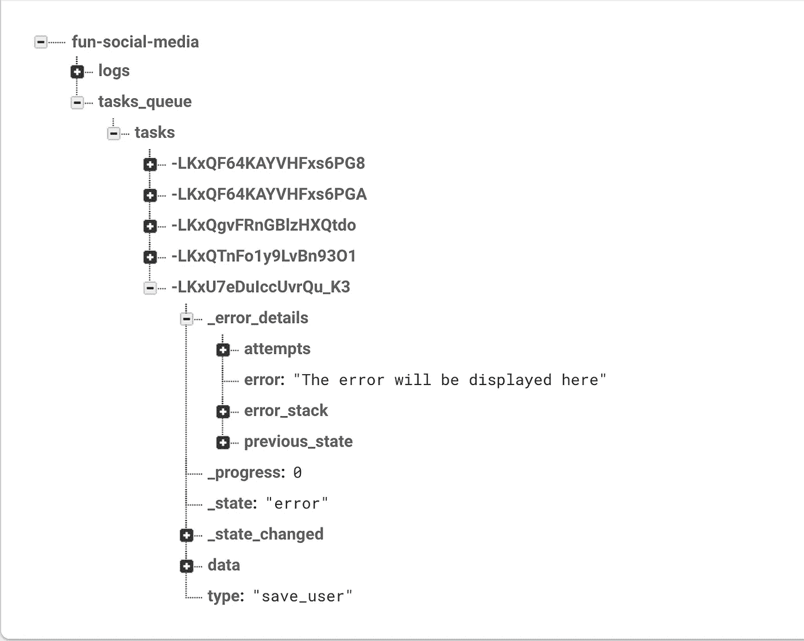

# 如何在有限的时间和预算下建立一个有趣的社交媒体

> 原文：<https://medium.com/hackernoon/how-to-build-a-fun-social-media-on-limited-time-and-budget-c28c84ba93db>

## 你对社交媒体有一些新颖有趣的想法。你想要一款安全、智能、快速且可扩展的应用。
这就是你如何在有限的时间和预算内实现这一目标的方法。


> 这篇文章基于个人经验和数小时的研究。它将主要包含代码示例。

**配料:**
[node . js](https://nodejs.org/en/)
[GCP](https://cloud.google.com/)—可扩展服务器和额外工具
[Firebase](https://firebase.google.com/?) —实时数据库
[Cloudflare](https://www.cloudflare.com/) —安全和性能
[Mailgun](https://www.mailgun.com/) —电子邮件

我们将使用一个应用引擎，并将其分成 3 个微服务
第一个微服务—后端服务器
第二个微服务— Cron 服务器
第三个微服务— Web 服务器

> 我将为客户端使用 [React](https://reactjs.org/) 。
> 后端解决方案对其他客户端选项来说也很好。

***之前先写第一行代码***

你需要为第一次发布设定你的目标。决定什么是第一个版本必须的，什么是你可以添加的，这很重要。

为你的社交媒体应用程序选择一个名称。
检查域名是否可用。
*你可以用* [*谷歌域名*](https://domains.google/#/) *或者*[*go daddy*](https://www.godaddy.com/)*来做这个。*

在 GCP、Firebase Cloudflare 和 Mailgun 开设账户并创建新项目。

在脸书和 Instagram 上打开开发者账户，启用登录选项。(确保您发送的是审核请求，这可能需要一些时间)。

# 后端 API 服务器

## 目标:

客户端友好
安全性
自动扩展
易于维护
保留日志
实时报告错误

是的，您可以使用传统的 RESTful API 服务器来实现这些目标，但是，我想向您展示另一个可以节省您大量时间的替代方案。

我们将使用 [Firebase 队列](https://github.com/FirebaseExtended/firebase-queue)，Firebase 实时数据库和谷歌应用引擎来创建它。

> 这将是我的文件夹层次结构。

```
📁config
  📁keys
    ➥serviceAccountKey.json
  configuration.json
  index.js📁services
  📁firebase
    ➥index.js
  📁image_manipulation
    ➥index.js
  📁notifications
    ➥index.js📁utils
  ➥index.jsapp.js
app.yaml
package.json
```

节点依赖关系:

```
"fcm-node": "^1.0.15",
"firebase": "^5.4.0",
"firebase-admin": "^6.0.0",
"firebase-queue": "^1.6.1",
"mailgun-js": "^0.20.0"
```

图像处理依赖关系:

```
"@google-cloud/storage": "^1.5.1",
"@google-cloud/vision": "^0.14.0",
"image-size": "^0.6.2",
"imagemin": "^5.3.1",
"imagemin-giflossy": "^5.1.10",
"imagemin-jpeg-recompress": "^5.1.0",
"sharp": "^0.18.4",
"smartcrop": "^1.1.1",
"smartcrop-sharp": "^1.0.5"
```

让我们从 config/configuration.json 开始:

```
{
  "firebase": {
    "projectId": "YOUT_PROJECT_ID",
    "url": "YOUT_PROJECT_DB_URL",
    "serviceAccount": "config/keys/serviceAccountKey.json"
  },
  "mailgun": {
    "apiKey": "YOUT_MAILGUN_KEY",
    "domain": "YOUT_MAILGUN_DOMAIN"
  },
  "app": {
```

config/index.js(注意有 configuration.dev.json)

```
**const** config = process.env.NODE_ENV === 'production' 
? require('config/configuration.json') 
: require('config/configuration.dev.json');

module.exports = config;
```

app.yaml

```
**service**: api
**runtime**: nodejs
**env**: flex
**env_variables**:
  **NODE_ENV**: prod
```

services/firebase/index.js

```
**const** admin = require('firebase-admin');
**const** config  = require('config');

admin.initializeApp({
    credential: admin.credential.cert(require(config.firebase.serviceAccount)),
    databaseURL: config.firebase.url
});

**const** db = admin.firestore();
**const** tasksDB = admin.database();
**const** tasksQueue = tasksDB.ref('tasks_queue/');

db.settings({ timestampsInSnapshots: **true** });// Here we will write our db functionsmodule.exports = {
    tasksQueue
```

现在我们可以开始编写我们的服务器( **app.js)**

> 就我个人而言，我喜欢这样设置 require()路径:(你可以在这里[了解更多信息](https://gist.github.com/branneman/8048520)

```
process.env.NODE_PATH = __dirname;
require('module').*Module*._initPaths();
```

我们将从设置开始，添加三个简单的“任务” ***saveUser、updateUser*** 和 ***likePost*** 。

***addLogs*** 函数会将收到的任务保存到我们在 Firebase 的日志表中。

***mailError*** 在出现错误的情况下，会将任务数据和错误信息一起通过电子邮件发送出去。

而 ***processTask*** 将监听 Firebases 实时数据库上的 *tasks_queue* 表，每当有新任务写入该表时，它将根据其类型处理该任务。如果有比他能处理的更多的任务，应用引擎将自动缩放。

如您所见，我们需要向 Firebase 端点文件添加一些功能

```
**function** setData(ref, data){
    **if** (**typeof** ref === 'string') **return** db.doc(ref).set(data);
    **return** ref.set(data);
}**function** updateData(ref, data){
    **if** (**typeof** ref === 'string') **return** db.doc(ref).update(data);
    **return** ref.update(data)ateLogs(date, taskType, time, task) {
    tasksDB.ref(`logs/${date}/${taskType}/${time}/task`).set(task)**ion** likePost(postId){
    **return new** Promise((resolve, reject) => {
        **const** postRef = db.collection('posts').doc(postId);
        **return** db.runTransaction((transaction) => {
            **return** transaction.get(postRef).then((postDoc) => {
                **if** (!postDoc.exists) resolve();
                **const** newLikes = postDoc.data().likes + 1;
                transaction.update(postRef, { likes: newLikes });
            });
        }).then(resolve).catch(reject);
    });
}// Don't forget to add them to the module exports
```

“任务”表看起来是这样的:



另一件我们可能想添加到服务器的事情是图像处理。比方说，一个用户上传了一张照片到我们有趣的社交媒体上，我们需要压缩这张照片，如果它是冒犯性的，可能会提醒我们，我们甚至想为它创建一个智能缩略图。

我们将添加任务来处理该请求

现在，让我们看一下 services/image _ manipulation/index . js(我不会详细讨论这个)

## 通知

我们最有价值的保留工具。

例如，如果有人喜欢他们的帖子，我们需要通知用户。我们希望能够跨平台、Android、iOS 和 web 向用户发送消息和通知。

一件好事也将保存在我们的数据库，这样我们就可以显示应用程序内的所有通知。

让我们改变我们的 like_post 函数

```
**function** likePost(data = {}) {
    **return new** Promise((resolve, reject) => {
        **const** { user, postId, postOwner, } = data;
        Promise.all([
            db.likePost(postId),
            db.newNotification('like', user, postOwner),
        ]).then(resolve).catch(reject);
    });
}
```

并将***new notification***添加到我们的 Firebase 端点文件中

```
**const** fcm = require('services/notifications');
**const** notificationsText = require('texts/en/notifications');

**function** newNotification(tag, from, to) {
    **return new** Promise((resolve, reject) => {
        **const** notification = notificationsText(tag, from, to);
        **if** (to.deviceToken) fcm.sendNativeNotification(notification, deviceToken);
        **const** newNotificationRef = db.collection(`messages/${to.uid}/notification`).doc();
        newNotificationRef.set(notification).then(resolve).catch(reject);
    });
}
```

服务/通知/索引. js

现在你已经有了 API 服务器，它完全满足了你的引导需求(你仍然需要编写一些函数来处理你的客户端任务)。

[安全](https://hackernoon.com/tagged/security)规则可以通过 [Firebase](https://hackernoon.com/tagged/firebase) 控制台上的规则选项卡轻松设置。你可以在这里阅读更多关于它的[。](https://firebase.google.com/docs/database/security/)

# Cron 服务器

如果我们需要一些调度功能在后台运行。我们将通过以下方式实现这一目标:

*在这个例子中，我们的调度函数将像一个随机发布*

文件夹层次结构

```
📁bin
  ➥www📁config
  📁keys
    ➥serviceAccountKey.json
  configuration.json
  index.📁cron_jobs
  ➥ index.js
    random_like.js📁services
  📁firebase
    ➥index.js📁utils
  ➥index.jsapp.js
app.yaml
cron.yaml
package.json
```

节点依赖关系:

```
"express": "^4.16.3",
"firebase": "^5.4.0",
"firebase-admin": "^6.0.0"
```

配置保持与 API 服务器相同。

app.yaml

```
**service**: cron
**runtime**: nodejs
**env**: flex
**env_variables**:
  **NODE_ENV**: production
```

cron.yaml

```
**cron**:
- **description**: Like a Random Post
  **url**: /like_random_post
  **schedule**: every 10 minutes
  **timezone**: Etc/GMT
  **target**: cron
```

app.js

```
process.env.NODE_PATH = __dirname;
require('module').*Module*._initPaths();

**const** express = require('express');
**const** app = express();
app.enable('trust proxy');

app.use('/', require('cron_jobs'));

app.use((err, req, res, next) => res.status(500).send(err.message || 'Something broke!'));

module.exports = app;
```

cron_jobs/inde

```
**t** express = require('express');
**const** randomLike = require('cron_jobs/random_like');
**const** router = express.Router();

// [START routing]
router.get('/like_random_post', randomLike);
// [END routing]

module.exports = router;
```

cron_jobs/random_like.js

```
**//** At the Firebase endpoint file**function** addTask(type, data){
    **return** tasksDB.ref('tasks_queue/tasks').push({ type, data });
}
```

正如您在 cron.yaml 文件中看到的，每隔 10 分钟就会向/like_random_post 端点(目标:cron 微服务)发出一个 GET 请求。该函数从数据库中获得一个随机的 post，并将一个“like_post”任务添加到我们的任务队列中。

这是我们故事的第一部分，现在你应该有一个工作服务器，可以用于任何类型的应用程序，本地或网络。

# 第 2 部分—前端

# 网络服务器

该服务器将向用户提供 **WebApp** 页面。基本上，我们只需要一条路由，因为我们将使用 React-router 处理所有路由。然而，当我们的用户将他们的帖子分享给其他社交媒体时，我们希望它具有吸引力。丰富的预览是一个伟大的工具来实现这一点。


为了支持丰富的预览，我们需要为每个帖子调整 html 文件。

> 我将在这里添加一个例子代码如何可以很容易地做到这一点，这只是一个例子，还有其他方法可以做到这一点。

文件夹层次结构:

```
📁bin
  ➥www📁config
  📁keys
    ➥serviceAccountKey.json
  configuration.json
  index.📁routes
  ➥ index.js
    post.js📁services
  📁firebase
    ➥index.js📁utils
  ➥index.js📁views
  ➥index.js
  ➥html_template.jsapp.js
app.yaml
package.json
```

app.yaml

```
**runtime**: nodejs
**env**: flex
**env_variables**:
  **NODE_ENV**: production
```

app.js

*如你所见，我们将压缩文件以获得更好的性能。*

routes/index.js

```
'use strict';

**const** express = require('express');
**const** router = express.Router();
**const** htmlTemplate = require('../views');

// [START post]
router.get('/post/*', require('./post'));
// [END post]

// [START app]
router.get('/*', (req, res) => {
    // console.log(req);
    **return** res.send(htmlTemplate())
});
// [END app]

module.exports = router;
```

routes/post.js

html _ 模板. js

# Web 应用程序

> 有很多很棒的“如何构建 React web 应用程序”的文章。在这里，我将重点介绍一些社交媒体 web 应用程序的挑战。

## 目标:

提要
现场听众
图片上传
丰富的预览

让我们从 WebApp 的根开始

pushNotification 是我们与应用程序用户交流的方式，看起来像这样:


为此，我们将使用“toastr js”。

```
**import** toastr **from** 'toastr';

**export default function** pushNotification(message, type = 'error') {
    toastr.options.positionClass = 'toast-bottom-full-width';
    toastr.options.showMethod = 'slideDown';
    toastr.options.hideMethod = 'slideUp';
    toastr.options.hideDuration = 300;
    toastr.options.newestOnTop = **false**;
    toastr.remove();
    **switch** (type) {
        **case** 'info':
            toastr.info(message);
            **break**;
        **case** 'error':
            toastr.error(message);
            **break**;
        **case** 'success':
            toastr.success(message);
            **break**;
        **case** 'warning':
            toastr.warning(message);
            **break**;
        **default**:
            toastr.error(message);
            **break**;
    }
}
```

Firebase 端点文件:

```
import firebase from 'firebase/app';
import 'firebase/auth';
import 'firebase/storage';
import 'firebase/firestore';
import 'firebase/database';
import config from 'config';class Firebase {static serverTimestamp() {
        return firebase.firestore.FieldValue.serverTimestamp();
    }constructor() {
        firebase.initializeApp({
            apiKey: config.firebase.api_key,
            authDomain: config.firebase.domain,
            projectId: config.firebase.project_id,
            storageBucket: config.firebase.bucket,
        });
        this.auth = firebase.auth();
        this.db = firebase.firestore();
        this.db.settings({ timestampsInSnapshots: true });
        **this**.tasksDB = firebase.database();
        this.tasks = **this**.tasksDB.ref('tasks_queue/tasks');
        this.storage = firebase.storage();
    }}export default Firebase;
```

## 饲料

```
📁feed
  📁view
    ➥feed_item.js
    ➥index.js
   ➥index.js
```

希望我们将需要处理大量的职位。为了正确管理它，我们需要:

1.使用查询游标对数据进行分页

2.高效无限可滚动容器

3.查看发布更新监听程序

“控制器”:

对于无限可滚动容器，我们将使用“react-infinite”

“视图”:

对于 post 项，我们需要添加一些侦听器。例如，likes — counter 应该不断实时更新。然而，为大量的帖子设置监听器会显著影响我们的 webapp 性能，为了提高效率，我们将只监听视图中的帖子的变化，并使用“反应-可见性-传感器”来做到这一点。

让我们向 Firebase 端点文件添加一些函数

```
getRecentPosts(startAfter = **null**) {
    **const** postRef = startAfter
        ? **this**.db.collection('posts')
            .orderBy('created_at', 'desc')
            .startAfter(startAfter.created_at)
            .limit(config.app.feed_paging)
        : **this**.db.collection('posts')
            .orderBy('created_at', 'desc')
                .limit(config.app.feed_paging);
    **return** postRef.get().then(snapshot => snapshot.docs.map(doc => doc.data()));
}postChangesListener(postId, callback) {
    **return this**.db.collection('posts').doc(postId).onSnapshot((doc) => {
        **if** (callback) callback(doc.data());
    });
}addTask(type, data) {
    return this.tasks.push({ type, ...data });
}
```

## 图像上传

我们希望我们的用户能够上传照片到我们的网络应用程序，我们希望为这些照片创建缩略图，我们不希望他们等待很长时间才能完成。为了做到这一点，我们将需要降低照片的大小(为了更快的上传和创建缩略图)。

上传照片组件:

当我们调整照片大小时，我们需要考虑它的 exif 数据，否则我们可能会遇到方向问题。

图像工具:

## 登录示例

## 最终 Firebase 端点文件

请注意，Firestore 数据操作并不发生在客户端，而是通过 Firebase RD 向服务器添加任务。这只是出于安全考虑。

> 我用的是 webpack 4，这是我的 webpack.config.js，如果你需要代码分割和 gzip，你可以用它作为例子。

在您完成编写第一个版本并将所有内容部署到 GCP 后，您现在可以将您的应用引擎记录添加到您的 Cloudflare DNS 设置，并获得免费的性能和安全性提升，包括 SSL、CDN 等。

这是我建立你的新的有趣的社交媒体的最后一个建议:**包含所有的分析**。这就是你如何知道你的用户在做什么。这将有助于你进步，并把你的时间投入到对他们来说重要的事情上。

> 我很想得到你的意见和建议。如果您有任何问题，请随时通过我的 [linkedin](https://www.linkedin.com/in/sagi-medina-935699122/) 联系我。感谢您的阅读！传播爱:)