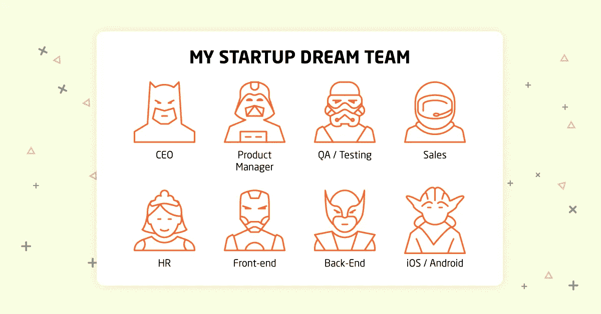

# 如何建立一个优秀的内部开发团队

> 原文：<https://medium.com/hackernoon/how-to-build-a-great-in-house-team-of-developers-5bddc1e5a6a>

每个初创公司必须回答的最令人不安也是最重要的问题之一是，如何建立一支优秀的内部开发团队。我们向我们和我们的客户解释它的工作方式。

显然，创造一个好产品的最好方法是雇佣一个好的团队。然而，组建一个好的团队并确保他们彼此合作是一个漫长而耗时的过程。浪费时间不是一个初创公司可以允许的奢侈，所以最大限度地减少建立一个伟大的内部软件开发团队所需的时间应该是一个优先事项。

在之前的几篇文章中，我们解释了与专门的和内部的软件开发团队合作的区别，选择专门团队路线的好处，以及雇佣可靠的专门软件开发团队的特点。是时候解释我们(和我们的客户)在启动他们的第一个成功项目时，如何组建由顶尖人才组成的伟大团队了。很明显，在发布下一批产品时，他们已经有了现成的团队。

# 第一步:聘请专家需要专家

虽然你可能对你的创业产品将解决的现实世界问题有清晰的理解，但你不应该成为一个知道前端开发、后端开发、QA 和测试、iOS/Android 移动应用开发以及所有其他软件交付管道部分的单人乐队。这样说，你需要找一个专家。

任何领域的专家都必须保持知名度。他们活跃在各种社交媒体团体、Reddit、Quora、Stack Overflow 和其他网站上。寻找权威/业力/点赞数最大的社区成员等。与你感兴趣的领域相关的人。这些人通常是各种会议、聚会和其他活动的参与者，甚至是主题发言人。

你可以在网上或在参加上述活动时向他们提出问题，寻求他们的帮助或咨询。当然，他们可能会忽略调查，但这种行为的公开泄露风险和对其声誉的可能损害很可能会阻止这种行为。他们通常会给你介绍一个合适的候选人，或者自己申请这份工作。最重要的是，他们将阐明潜在的项目需求，并给出所需技术堆栈和团队结构的估计，以及为评估您的潜在员工的技能提供宝贵的背景。

# 步骤 2:大量测试，我们不谈论软件

你需要确保你未来的团队领导是 A 级专家，而不是 C 级员工。高技能的专业人士知道自己的优势和劣势，不怕艰巨的任务或团队竞争。此外，他们将能够正确地评估任务的复杂性，并将适当的部分委派给适当的执行者。

请专家设计测试来评估候选人的技能。让他们在技术上变得困难，因为你正在寻找你未来的团队领导，想要久经沙场的老手，而不是新手。这将有效地帮助筛选出 3-5 名候选人进行实际面试，而你只需付出很少的努力。你需要做的就是选择具有最佳软技能的人——一个优秀的沟通者，一个自信的领导者和一个勤奋的执行者，能够有效地监督团队。

# 第三步:组建团队并开始工作

如果你的创业公司的未来产品不太复杂，雇佣一名所需的专家就足以形成团队的骨干。如果这个项目具有挑战性，你将需要花更多的时间雇佣下属来增加力量。请记住，A 级团队领导倾向于雇佣 A 级或 B 级高管，这对你的项目整体来说是有好处的。重复步骤 2-3，直到你确信你建立的团队能够处理手头的工作。

看起来我们都准备好了，不是吗？然而，在描述雇佣一个专门的软件开发团队和在内部从头开始建立这样一个团队之间的[差异时，我们提到了某些明显的复杂性。困难包括(但不限于)从第一天开始就必须支付工资，如果没有雇佣专家，产品就无法完成，如果任何团队成员决定退出，就会有减缓或停止整体进度的风险。](https://itsvit.com/blog/hiring-dedicated-software-development-team-vs-building-house/)

上述文章中也描述了这些复杂问题的解决方案。选择从 MSP 雇佣一个专门的软件开发团队来为你开发产品。一旦产品开始产生收入，或者下一轮投资到来，你就可以开始建立自己的软件开发团队，并逐渐用内部人才取代雇佣的人才。

# 关于如何建立一个优秀的内部开发团队的最终想法

当您的内部人员加入到正在进行的工作中时，他们可以更容易地通过研究开发人员的文档来掌握当前的开发阶段，并替换承包商的人员。由于灵活的外派计划，许多像 [IT Svit 这样的 MSP 可以帮助](https://itsvit.com/contacts/)顺利地将产品从他们的看护转移到您的团队，并在需要时提供备份和替换，更不用说培训您的团队以最高效率使用现有的系统和基础设施。

因此，我们坚信，随着时间的推移，每个创业公司都能够建立一个内部软件开发团队来支持和发展他们的产品。如果你没有一支准备好的团队，开发 MVP 就有点问题。这就是雇佣一个专门的软件开发团队非常有帮助的地方。

我们希望这篇文章能激发一些思考，并很高兴知道你对建立一个优秀的内部开发团队的最佳方法的看法。你是否使用了相似的战术或不同的诀窍来组建这样的团队？请在下面的评论中告诉我们！

*最初，这个故事被发布在我公司的博客上——https://itsvit.com/blog/build-great-house-team-developers/*