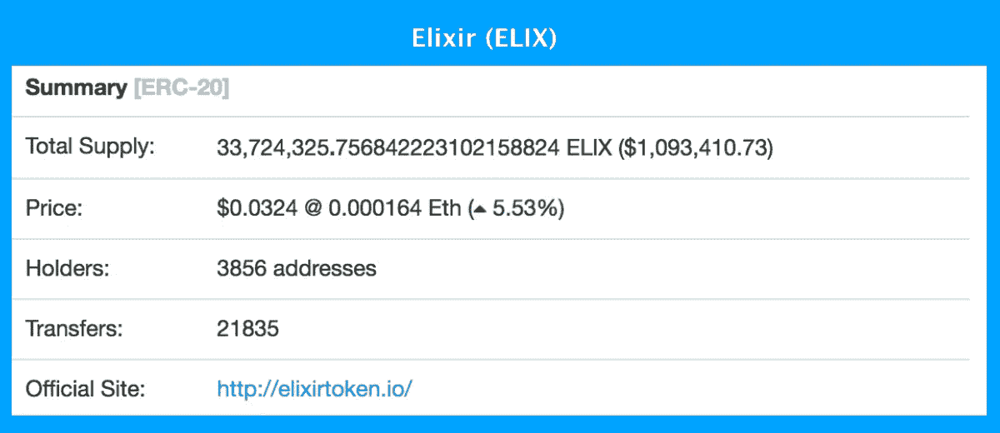

# 如何用加密空投建立一个巨大的社区

> 原文：<https://medium.com/hackernoon/how-to-build-a-huge-community-with-a-crypto-airdrop-644eb252c71e>

加密货币空投是初始硬币发行(ico)的一个很好的替代方案。空投是免费赠品，有助于分发代币，启动社区，并避免围绕 ico 的复杂监管审查。

空投实现了几个关键目标:

1.  空投建立了一个对你正在制造的产品感到兴奋的初始群体
2.  空投会产生品牌意识，这会促使人们以后使用你的产品
3.  你可以在传统广告方法上花费更少(通过产生更低的成本转换率)

让我们详细看一下这些优势。首先，建立第一批对你的产品感兴趣的社区成员是关键。这些人会密切关注您的项目，并希望听到您的进度更新。让他们定期更新很重要，这样他们就知道一直在进步。还有什么比给他们一些他们以后可以使用的代币更能让他们兴奋的呢？

第二，如果你把空投的消息传出去，你就能为你的品牌制造轰动效应。让人们通过加密电报和空闲频道了解你的项目。在脸书、Reddit 上发布，在 Twitter 上让人们知道。甚至在一个中型博客页面上为你的项目添加几篇文章也不会有坏处。最重要的是，让人们知道你在做什么，为什么他们应该感到兴奋。随着越来越多的人发起空投，这个空间变得越来越饱和，你需要*给人们一个好的理由来参与*你的空投。

如果操作正确，空投产生的嗡嗡声是有机的，而且基本上是免费的。留出时间传播消息，并在空投开始前开始营销。你应该至少花几天时间让人们知道你即将进行的空投。使用谷歌 reCAPTCHA 来阻止机器人条目，或者让人们通过在社交渠道上与朋友宣布他们参与该项目来接收空投令牌。后一种策略有一个额外的优势，那就是创造了病毒循环，让消息传播得更快。你不需要运行昂贵的脸书或谷歌广告，而是在你的项目上使用价值主张和免费代币来引起人们的兴趣。

要释放您的令牌，您需要在以太坊区块链创建并部署智能合约。我们将在另一篇文章中讨论技术细节，请关注 ELIX 博客中的更多信息。一旦部署了 airdrop 令牌，您就可以通过令牌持有者的数量来大致了解项目的规模。这是长生不老药的样子:

空投也可以是一种更公平的方式，将代币分发给更多的人，同时让人们参与到你的项目中来。空投不是通过允许富人购买更多代币来偏袒他们，而是平等地向每个人赠送代币。例如，人们可能需要在推特或脸书上关注你的项目，或者加入一个电报频道。如果他们真的对你的项目和你做的东西感兴趣，他们会留下来看看一切进展如何。他们还会有代币，可以在你即将推出的平台上使用，给他们一个额外的理由留下来。空投有助于启动讨论、社交媒体活动，并播下一颗种子，稍后将获得巨大回报。有很多创建空投的网站，但你也可以在 Bitcointalk 这样的论坛上创建自己的网站，或者在社交媒体上发布公告。你还应该有一个项目标识、白皮书和各种社交渠道，这样人们就可以了解你的项目的特别之处。

我们使用了其中的一些策略来构建我们的众筹和智能合约平台 ELIX。您可以使用 ELIX 在几分钟内[创建一个产品或活动](https://blog.elixirtoken.io/how-to-create-a-campaign-or-product-with-elix-in-just-a-few-minutes/):

