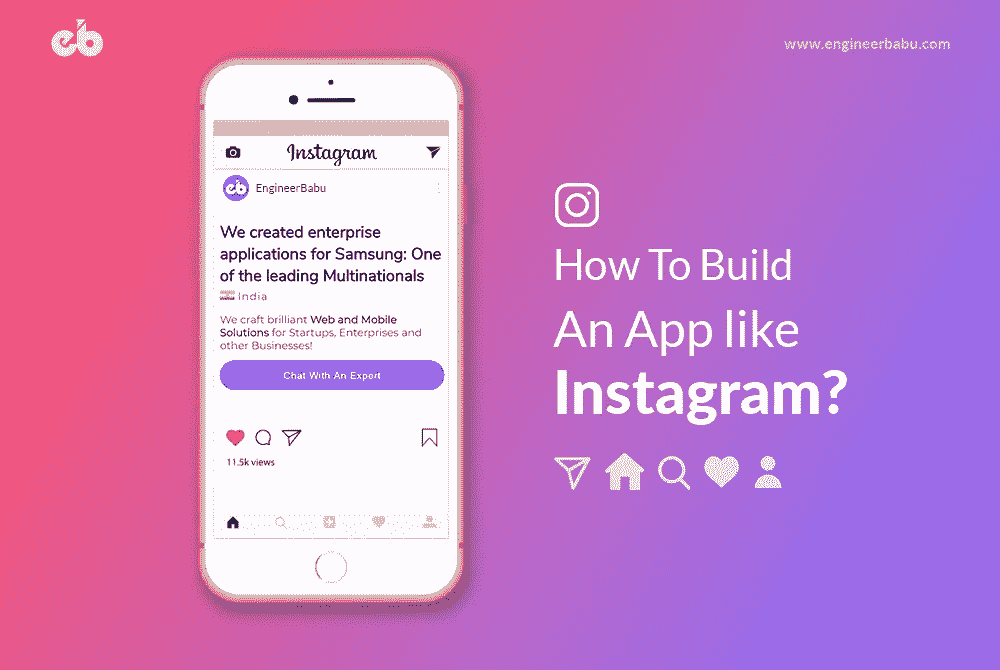
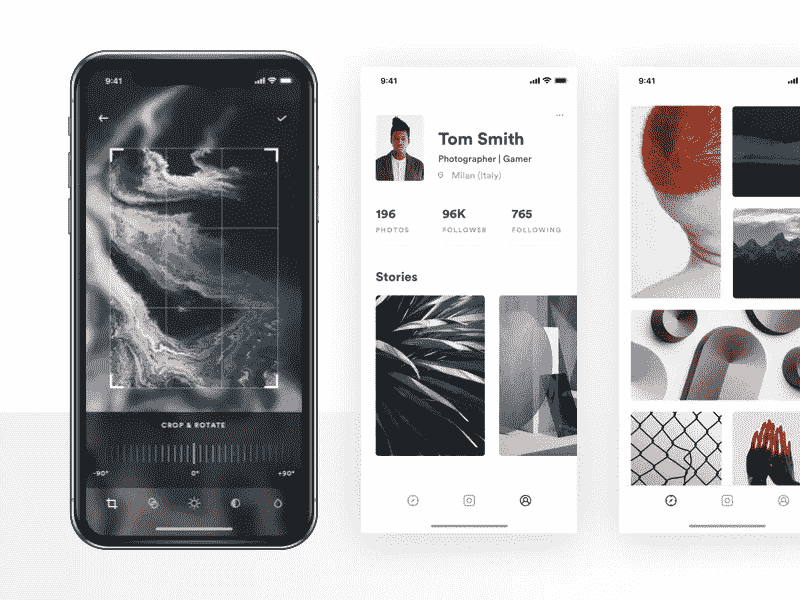
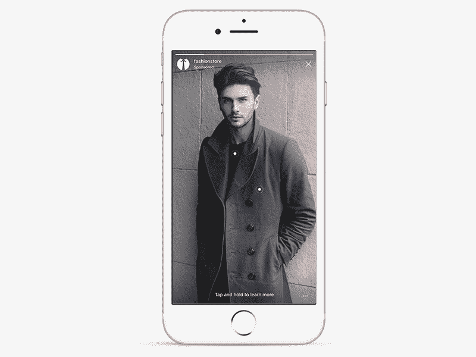
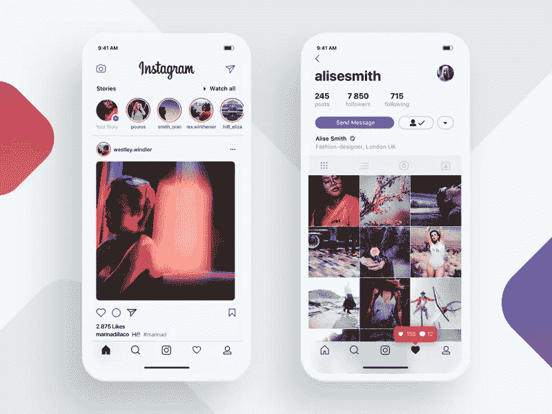
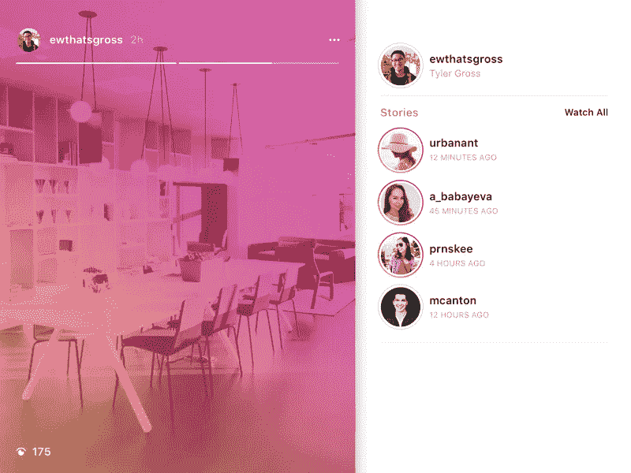
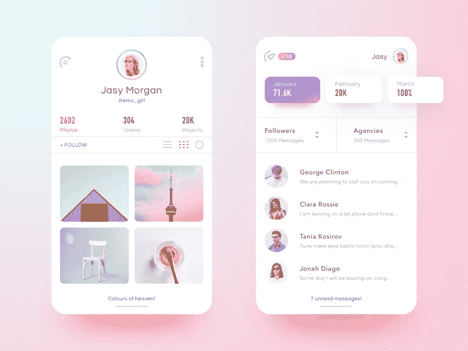
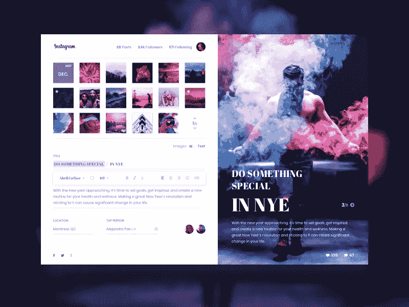

# 如何搭建一个像 Instagram 这样的手机 App？

> 原文：<https://medium.com/hackernoon/how-to-build-a-mobile-app-like-instagram-c0d2e7dc01b3>

## *开发像 Instagram 这样的照片分享移动应用程序你必须知道的事情*

[Image Source](https://www.engineerbabu.com)

Instagram 是世界各地的人们将“旅行”作为严肃爱好的原因。此外， [Instagram](https://www.instagram.com/) 是数字企业开始将照片分享应用视为一项严肃业务的原因。

单纯的照片分享应用能成为一项严肃的业务吗？

是啊！

一个企业需要的只是参与。此外，随着智能手机的兴起，用户可以更容易地随心所欲地点击图片，并与他人分享。

自拍是千禧一代在未来几年设定的新规范。这种摄影文化甚至没有让婴儿潮一代免受其上瘾的影响。关键是，不管用户的身份是什么，这个照片分享应用都在通过吸引不同年龄组的用户来不断拓宽自己的视野。

如果我们相信 Hootsuite 上的统计数据，Instagram 今天有超过 10 亿的活跃用户，他们每天分享大约 9500 万个帖子。

这对有抱负的类似 Instagram 的照片分享应用企业传达了什么信息？

统计数据显示，照片分享应用业务尚未结束。它在创新和扩张方面都有巨大的潜力。随着视频优先的内容即将成为数字业务的未来，视频广告将成为 Instagram 等照片共享移动应用最有希望的收入来源。

总而言之，现在是时候建立你自己的类似 Instagram 的移动应用了。我来给你提供一个完整的指南，来构建一个类似 Instagram 的 app。

# 建立一个像 Instagram 这样的照片分享移动应用程序到底是什么感觉

Image *Source: Alberto Conti (Dirbbble)*

Instagram 不仅仅是一款照片分享应用。它是在一把保护伞下经营的一群小企业。

## 作为照片编辑应用的 Instagram:

这是一个伪装的照片编辑应用程序，有如此多的彩色滤镜。

用户可以裁剪图片，调整对比度和亮度，在图片中使用标记和文本，或者简单地摆弄滤镜。

# 作为一家照片分享公司，这对你有什么好处？

因为你已经为你的用户配备了编辑照片所需的额外工具，他们会在平台上停留更长的时间。在这段时间里，你有责任用赞助广告、视频广告等来填充他们的订阅源。并从中获利。

## Instagram 作为电子商务门户:

电子商务的成功催生了一个新名词，称为“社交商务”。

Instagram Shop: An e-Commerce platform like feature — [Image Source](https://dribbble.com/shots/4758877-Swipe-up-to-shop-Instagram-Stories-interaction-concept)

毫无疑问，照片分享应用让用户在平台上保持互动。这为品牌创造了大量的机会，向已经参与的客户展示他们的产品，并创造了除自己的应用程序和网站之外的额外收入来源。

光明的一面？

作为照片共享应用程序的所有者，您可以从每笔交易中获得佣金。

## Instagram 作为信使应用程序:

无论是任何类型的应用程序，直接消息功能已经在功能列表的 MVP 中占据了一席之地。

直接信息有助于用户与其他用户深入联系。除了在他们的提要中滚动几个小时之外，直接消息还能够用表情符号吸引用户，分享提要中的图片，创建群组和聊天！

# 开发像 Instagram 这样的照片分享应用程序所需的一系列功能

Image *Source: Ivan Martynenko (Dribbble)*

像 Instagram 这样的照片分享应用的功能在保持参与度不变和不断提升方面做出了相当大的贡献。它帮助用户区分优质应用程序和以赚钱为唯一目的的蹩脚应用程序。通过提供用户友好的功能，你传达了你的企业关心它的用户，这是吸引和留住客户所需要的，尤其是当你没有实体产品的时候。

以下是开发类似于 Instagram 的照片分享应用程序时必须知道的功能列表:

## 快速简单的注册过程

注册屏幕上有什么？嗯，是决定用户停留时间更长还是直接卸载 app 的决定因素。大多数时候，企业觉得需要提取完整的信息。然而，它可能对您的业务弊大于利，因为它会让您的用户一页又一页地输入和提交数据。

计划从你的用户那里提取信息，用脸书的方式。在注册期间，脸书从未向用户索要手机号码。随着时间的推移，它开始使用手机号码登录，并智能地收集联系方式。

因此，为了建立你的照片分享应用程序，社交媒体登录和注册是必须具备的功能。它不仅让你的用户更容易快速注册，也为你的企业创造了跨平台广告的机会。

## 推送通知

让我们面对现实吧。照片分享手机应用对你的用户来说只是一个娱乐应用。你的应用并不是用户娱乐的唯一来源。在这种情况下，如何让他们回到你的应用程序，并确保他们花了大量的数字时间使用你的应用程序？

答案很简单——推送通知！

你的用户是好奇的社会人。他们甚至想知道朋友生活的最新动态。

设置一个算法，帮助你知道用户最关注谁。每当特定用户共享更新或照片时。向其他用户发送推送通知，让他们不断回到你的照片分享应用，希望了解更多信息。

## 故事

Stories on Instagram — [Image Source](https://dribbble.com/shots/3776491-Stories-on-Instagram-com)

Whatsapp、脸书和 Instagram 上的故事已经成为用户生成内容中最吸引人的形式。每当发布一个故事，就会向其他用户发送推送通知。故事可以用作邀请参与功能。

构建故事特征的一种创新方式可以是通过向用户提供控制来选择他们想要他们的故事显示的时间量。

默认情况下，持续时间可以是 24 小时，用户可以根据自己的意愿设置他们的故事显示持续时间。

## 社交媒体整合

您的用户在您的平台上发布了一张图片。接下来呢？他们想在其他社交媒体平台上发布同一张照片。

现在，把竞争放在一边，想想你的平台需要推广，还有什么比和脸书一起推广更好的呢？如果没有其他，至少提供一个脸书集成。通过这种方式，您的用户将能够在您的照片共享应用程序上发布他们的照片，并通过点击将其共享到其他社交媒体平台上！

你不仅在建立客户体验，还通过利用流行社交媒体平台上的用户生成内容来推广你的应用。还有比这更好的双赢营销策略吗？

## 跨平台兼容性

Instagram 不能在许多具备所有功能的桌面和操作系统上运行。这是一个专门的照片分享移动应用程序。为了最大限度地利用 Instagram 的这个瓶颈，你可以创建一个全功能的 web 应用程序和一个移动应用程序。

虽然智能手机的摄像头起着重要的作用，但对你的应用程序进行编码，使其能够访问网络摄像头来点击图片。

为什么只用于发布和分享图片？

您可以创建一个照片共享应用程序，帮助用户使用 web 应用程序执行所有操作，如图片、与群组共享、评论图片等。

## 故事中的直接消息传递

Direct Messaging on Instagram — [Image Source](https://dribbble.com/shots/3858166-Zedian-App-Messaging-filter)

对用户来说，一个令人兴奋的特性是故事中的直接信息。这就像对公众讲话，但得到的是个人的回答。

用户可以为他们的追随者提出问题，要求他们提出建议，创建投票，并通过图像、短视频甚至纯文本在平台内保持互动。

## 搜索选项

搜索模块帮助用户寻找人、标签和地点。而且，app 还在搜索栏提供了建议。

这是一个照片分享应用程序的 MVP 功能。您可以利用搜索结果来了解特定用户的最佳追随者，并用这些追随者的更新填充他的提要。

通过这种方式，用户将在个性化订阅源的帮助下更感兴趣。

## GPS 集成

你的用户喜欢旅行。更重要的是，他们希望他们的追随者知道他们去过哪里。这需要为你的照片分享应用程序集成 GPS。

位置特征本质上是动态的。这意味着用户既可以自动获取位置，也可以在连接不良时手动添加位置。

## 活动

活动功能本身可以分为两类:

*   你的活动
*   追随者的活动

在这里，用户可以获得关于关注谁的建议，并跟踪他们最近在照片共享应用程序上的行为。

而另一方面，关注者的活动功能显示了关于关注者在照片共享应用上做什么的完整信息以及确切的时间活动。

# 如何用你的类似 Instagram 的照片分享应用脱颖而出？

Image *Source: Yi Li (Dribbble)*

在 Instagram 上有一个成功的商业模式，你不会是唯一的企业。为顾客服务并赢得他们的忠诚已经是一场激烈的竞争了。

如果是这种情况，在照片分享应用市场脱颖而出的解决方案是什么？

需要记住的一个重要方面是，照片分享业务没有任何明显的收入模式。他们收入的很大一部分来自视频广告、赞助广告和电子商务。这意味着这类照片分享应用的收入来源于参与度。

建议的解决方案可以是通过开发用户友好的功能来遵循客户第一的方法。一个更好的方法是建立一个类似 Instagram 的应用程序，提供合适的功能来提升客户的参与度。

# 构建类似 Instagram 的移动应用程序时需要考虑的重要事项

你有了一个用自己的照片分享应用程序创业的想法。

接下来呢？

移动应用程序开发从头到尾都需要大量的规划。这意味着，在启动应用程序的第一个版本之前，您必须随时随地。

然而，如果您很好地规划开发，您的许多麻烦可以大大减少。让我给你介绍一个合适的计划。

在基层，每个照片分享应用看起来都很相似。你的照片分享应用的基本版本只需要一个简单的与关注者分享照片的功能。但是当你把品牌和用户界面/UX 设计添加到你的应用程序中，在你的用户的思维中创造一个强大的品牌意识时，这种差异就开始形成了。

在构建 Instagram 这样的应用程序时，需要记住的其他重要元素包括:

*   用户友好的导航
*   简洁的用户界面/UX 设计
*   令人愉悦的视觉效果和图形
*   个性化订阅源
*   简单的照片共享选项

构建类似 Instagram 的应用程序的理想方式如下:

*   你最先想到的应该是你的 USP。知道你的照片分享移动应用想要达到的目标是什么。这必须在开始开发过程之前弄清楚，以便在你的应用程序开发方法中非常清楚。
*   始终用最基本的功能规划您的业务，然后逐渐用高级功能丰富它。这样你就可以测试你的市场并进行实施。
*   人口统计学也是如此。你可能有很强的个人影响力，但从人口统计学的角度来看，循序渐进总是一个好主意。瞄准特定的人群，赢得他们的忠诚度，他们会代表你谈论你的品牌。
*   你的最终目标显然是从所有这些辛苦的努力中获得收入。然而，你的主要目标应该是为你的用户创造参与度。了解照片分享应用的收入法则:没有参与，就没有收入！

# 建立一个像 Instagram 这样的应用程序可能的收入模式是什么？

Image *Source: Alejandro Ramirez (Dribbble)*

Instagram 通过利用用户的注意力跨度来赚钱。注意力持续时间越长，收入越高。

你的照片分享应用可能的收入来源有:

*   赞助广告
*   赞助帖子
*   视频广告
*   社交商务
*   轮播广告

既然已经说了所有关于开发照片分享应用程序的事情，显然你会对预算感到疑惑。让我们来了解一下建立一个像 Instagram 这样的应用程序的成本。

# 开发像 Instagram 这样的移动应用程序的成本:

最终，作为一个商人，你的重点必须放在投资回报率上。而要算出预期的营业额，就需要知道所需的投资。长话短说，让我们来看看建立一个像 Instagram 这样的照片分享移动应用的[成本是多少:](https://www.engineerbabu.com/blog/mobile-application-cost/)

## 特征的影响:

基本上，你可以用三种可能性来开发你的照片分享移动应用。

您可以选择最可行的功能、高级功能，或者基本功能和一些高级功能的完美结合。

## 操作系统的影响:

众所周知，与安卓应用相比，iOS 应用给你的口袋带来了更大的缺口。但是，选择操作系统取决于您的目标受众及其设备偏好。可能的情况是，你的目标受众可以有相等的比例，你可能必须为两个平台推出一个应用程序。

## 技术的影响:

虽然用 Kotlin 编写你的应用程序会更贵，但也更时尚，这取决于你自己来确定你的应用程序开发需求。同样，您必须在本地和混合应用程序开发方面做出更明智的选择。如果你在技术上不完善，你可以向你的开发者寻求帮助。

## 资源的影响:

如果你还没有一个头脑冷静的开发团队，而你正在考虑将他们外包出去，你需要在选择过程中非常小心。寻找案例研究和经验。比较应用程序开发的成本，然后做出决定。

虽然不同的应用程序开发公司有自己的变量，但开发一个类似 Instagram 的移动应用程序的成本相当模糊。因此，无法确定准确的数字，但为了给你一个粗略的估计，请看以下内容:

*   如果我们考虑最基本版本的应用程序，只有 MVP 功能和干净的 UI/UX 设计，预计开发价格可以高达 6500 美元。但是，几乎不需要支持和维护。
*   如果我们考虑基本功能和一些高级功能的混合，价格可能会增加到 20，000 美元到 25，000 美元之间。
*   如果我们考虑开发具有完整高级功能的应用程序，那么价格可以高达 65，000 美元至 75，000 美元。

# 如何外包开发者来搭建一个像手机 App 一样的 Instagram？

Image *Source: Lina Leusenko (Dribbble)*

根据你计划为你的企业开发什么，确定工作范围，然后决定为你的企业建立一个像 Instagram 这样的移动应用程序所需的资源数量。

有许多不同类型的定价模式可供您选择—基于时间的、基于范围的、固定价格和固定时间的定价模式，或者专用资源租用。虽然其中一些模型是基于客户的需求，但其他模型是由应用程序开发公司自己决定的。

## 基于资源的专门招聘

当选择基于专门资源的招聘时，确保你了解工作范围，并且你没有为额外的资源付费。

要开发一个类似 Instagram 的移动应用程序的基本版本，您的资源集将是-

*   UI 和 UX 设计器
*   2-4 名开发人员
*   质量保证工程师
*   后端开发人员
*   项目经理

要开发照片共享移动应用的高级版本，您需要一个团队——

*   团队经理/项目经理
*   UI/UX 设计器
*   每个平台 3-4 名开发人员
*   质量保证工程师
*   2-3 名后端开发人员
*   管理面板开发人员

准备好在现实世界中使用您的照片共享移动应用程序了吗？

我们错过了一两个方面吗？我们很想丰富我们的知识。
最后，这份专为帮助你构建 Instagram 这样的应用而定制的指南，请帮助我们接触更多的读者，为他们鼓掌，让他们知道我们的研究和分析有多么有用！

— — — — — — — — — — — — — — — — — — — — — — — — — —

## 看我的其他相关文章

**1。** [**做一个手机 app 要多少钱？**](https://www.engineerbabu.com/blog/mobile-application-cost/) **，也上** ****2。** [**如何搭建一个交友 App？一款关于交友手机 App**](https://www.engineerbabu.com/blog/love-online-building-a-dating-app/) **的终极指南，也是关于**[**hacker noon**](https://hackernoon.com/how-to-build-a-dating-app-an-ultimate-guide-on-dating-mobile-app-aaa6964cb7f1) **3。** [**如何打造一个像优步一样的 app？**](https://www.engineerbabu.com/blog/how-to-build-an-app-like-uber/) **，也上** ****4。** [**如何打造一个像 Zomato 一样的 App:百万美元指南**](https://www.engineerbabu.com/blog/how-to-build-app-like-zomato/) **，也上**[**hacker noon**](https://hackernoon.com/how-to-build-a-food-ordering-app-like-zomato-cf41f83de5ec)****

> *****我是 Mayank，*[*engineer Babu*](https://www.engineerbabu.com/)*的联合创始人。随时联系我上*[*LinkedIn*](https://www.linkedin.com/in/mayankpratap/)*| mayank@engineerbabu.com(关于 EngineerBabu —* [*中*](https://hackernoon.com/how-mayank-pratap-built-engineerbabu-a-profitable-it-service-company-generating-more-than-50-000-per-month-bcd3006bdbb5) *)。*****

****此外， [EngineerBabu](https://www.engineerbabu.com/) 通过构建高级 IT 解决方案，帮助初创公司、企业和所有者发展业务。他们开发的项目 95%都按时完成了。 [30+获风投](https://www.engineerbabu.com/casestudies)资助，赢得最具创新总理设计奖，入选 Y-Combinator 2016 & 2017。****