# 如何建立一个你不会讨厌的通知

> 原文：<https://medium.com/hackernoon/how-to-build-a-notification-that-you-wont-hate-62bfaec722f1>


[通知](https://hackernoon.com/tagged/notifications)吸。我是说他们真的真的很烂。考虑一下我的桌面[工作区](https://hackernoon.com/tagged/workspace)在任何给定时间的样子。

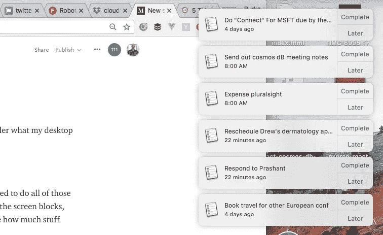

我的意思是，是的，我确实创建了那些提醒，是的，我确实需要做所有这些事情，但是在屏幕右侧显示通知会挡住屏幕的整个右上角，**！你知道那里发生了多少事情吗？**

当有人在团队中给我打电话时，我不能接电话。

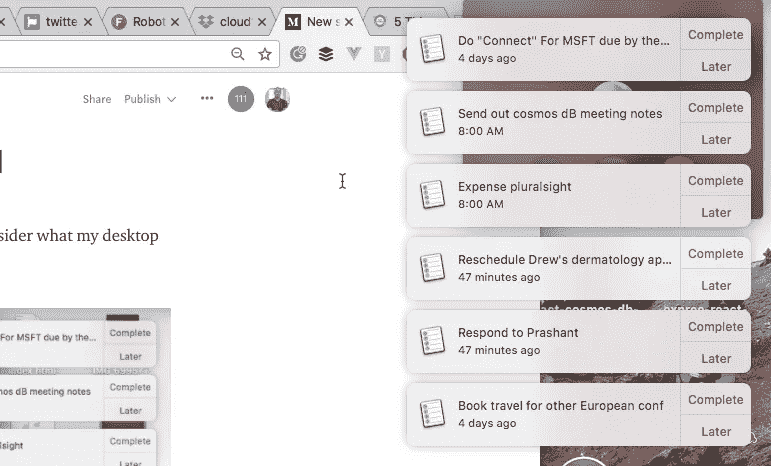

后面有一个电话，你甚至不能通过我的拖延墙看到它。我肯定无法回答。我都看不清是谁！

我无法访问我的任何 Chrome 扩展

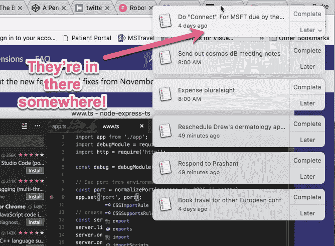

我无法搜索 Apple Music，因为搜索栏被屏蔽了。是的——我是唯一一个用苹果音乐的人。

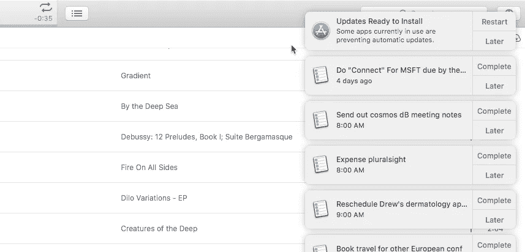

在手机上也没好到哪里去。因为这个原因，我几乎关掉了所有的通知。每时每刻都有很多事情发生。推文、电子邮件、提醒、短信、电话、即时消息——通知让我紧张。甚至连顶部空间通知都让我紧张！

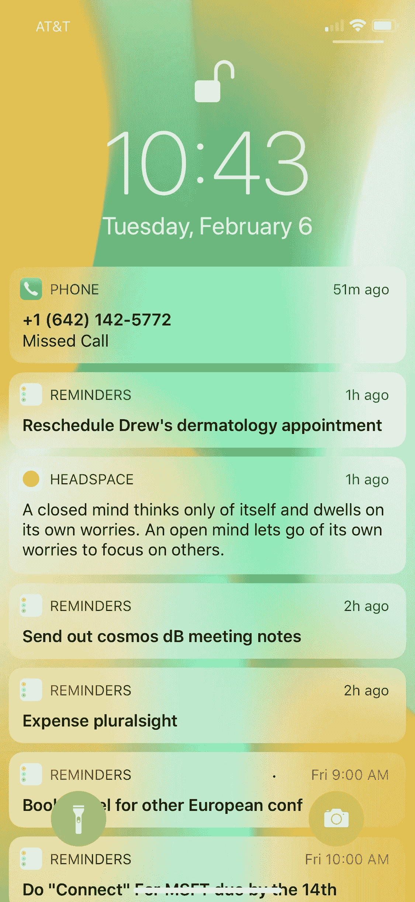

No Headspace. I can’t have an open mind because it’s currently full of notifications!

我意识到，在这一点上，你们中的许多人可能正在搜索评论框，这样你们就可以告诉我 Android 是如何解决所有这些问题的，如果我走进光里，我所有的问题都会消失。

我不能。我已经告诉过你我在用苹果音乐。我有一块苹果手表。和一台苹果电脑。苹果让我陷入困境——更像是一个十足的纳尔逊。你不能就这样离开一个完整的纳尔逊。你坐过完整的尼尔森吗？

另外，反正我也不相信你。

我以前写过这方面的文章，称通知是对你大脑的 DoS 攻击。

> “通知是对你大脑的拒绝服务攻击”
> 
> 我。我不记得什么时候了。大概是因为通知吧。

但是我**确实**想知道是怎么回事。我只是不想让它变得如此具有侵略性，就像一个小孩子不停地唠叨我一样。

“我们到了吗？”

“我们到了吗？”

“我们到了吗？”

我向上帝发誓我会把这辆车停下来…

## 我们可以做得更好

我还是想知道事情是什么时候发生的，但是不应该把我激怒到喝酒的地步。老实说，喝酒无论如何都要发生，我只是希望当我到达那里的时候不要那么紧张。

首先，让我们确定我不想要什么…

*   不要打断我——不要把东西放在我的屏幕上；移动或其他。我不在乎他们是在顶端还是右边。我不在乎他们过一会儿会不会消失。你没有权利拿东西戳我的脸。永远不会。除非是啤酒。或者奶酪棒。
*   **无噪音—** 噪音差一点。我一直关着 Skype，因为我无法忍受每当有人上线或下线时它发出的声音。是的，我肯定你能关掉它。我对 Skype 太生气了，不想花那么多时间去配置它。

公平地说，在设备上做通知很难。如果你不能制造噪音，你不能在屏幕上显示任何东西，你能做什么？

让我提出一个替代方案:如果我们根本不使用设备**会怎么样。如果通知是通过环境中的其他东西发生的呢？比如说一盏灯。**

# **介绍 Twitter 灯泡**

**Twitter Bulb 是一项自动化服务，每当 Twitter 上有通知时，它就会在我的办公室里闪一闪蓝色的光。这是它在运行时的样子…**

**耶宝贝！这比被 Mac OS 扇了一巴掌好多了。它微妙、温和、有效，我敢说，令人愉快？令人愉快。我喜欢灯。**

**让我们看看如何建立一个 Twitter 灯泡。但是在我们为 Twitter 灯泡建立服务之前，我们需要灯泡！为此，我们将从名为 LIFX 的产品开始。**

# **LIFX**

**LIFX 制造了一些非常酷的连接灯。更重要的是，LIFX API 是完全开放的，并且有很好的文档记录。我买了 LIFX Mini，它在亚马逊上的零售价约为 40 美元。它支持 Wifi，支持 80 亿种颜色或类似的东西。我不知道。无论有多少种颜色都是很多的。它还有一个可爱的盒子！**

**[](https://www.lifx.com/) [## 支持 Wi-Fi 的 led 智能灯

### 无集线器的 LIFX Wi-Fi LED 智能灯泡。通过 iPhone 和 Android 设备控制您的灯光。彩色发光二极管…

www.lifx.com](https://www.lifx.com/) 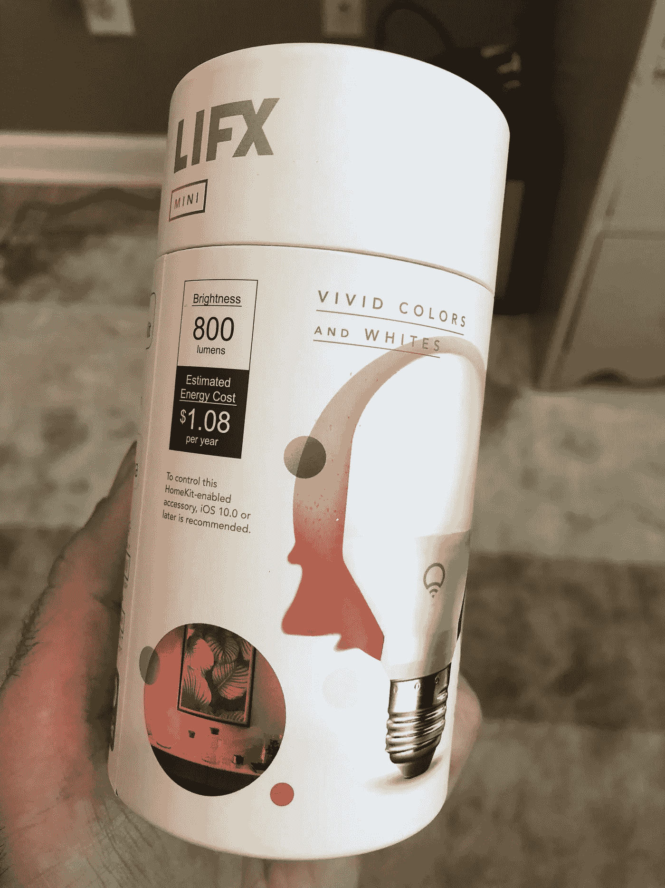

ADORBS

LIFX 有一个移动应用程序，在 iOS 应用程序商店中获得了响亮的 2.5 星。然而，它对我来说很好，我想也许有人在这里有深仇大恨。

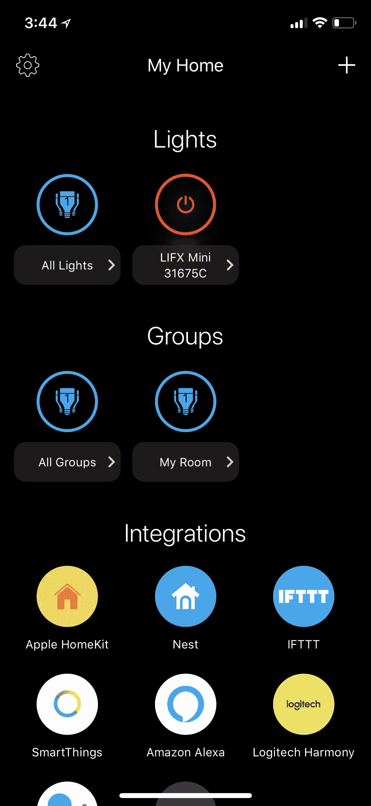

第一步是把灯连接到你的 Wifi 上。你可以打开灯，然后在你的设备上寻找它的 Wifi 信号。然后你连接到灯泡，你可以在应用程序中设置它的 Wifi。这正是其他联网设备的工作方式。

你需要做的第二件事是**认领**你的灯泡。这基本上是你点击应用程序中的一个按钮，上面写着“这是我的灯泡”。它会给你发送一个验证码，然后“嘣”的一声，你就认领了。我一点也不明白。我在我的无线网上设置了这个东西，不是吗？这是我的灯泡。然而，如果你不认领你的灯泡，API 就不会工作，它也不会告诉你。这很好。

# 使用 LIFX API

LIFX 上的 API 是开放、简单和 RESTful 的——不管这意味着什么。认证不需要太多。事实上，如果您不想经历 OAuth 的繁琐，您可以注册一个令牌，然后将请求传递给 API。我不是 OAuth 的粉丝。或者想知道如何拼写“rigamarole”。

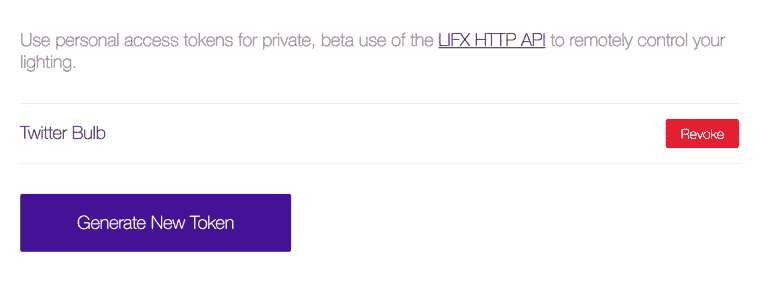

令牌基于应用程序，而非用户。你可以看到我为 Twitter 灯泡服务创建了一个。

现在我们已经有了一个令牌，我们准备构建一个端点，我们可以点击它来控制灯泡。这样，我们的令牌保持私有，我们可以添加我们想要的任何进一步的逻辑。我们可以使用无服务器，而不是创建一个完整的 web 应用程序。

# 创建无服务器端点

我用 Azure 函数[创建了一个无服务器函数](https://cda.ms/8W)。我的首选方法是使用 CLI。这有一个额外的好处，即能够用 Visual Studio 代码在本地进行无服务器调试。我还使用了 VS 代码的 [Azure Functions 扩展，因为我是为工具而来的。](https://cda.ms/8X)

[](https://marketplace.visualstudio.com/items?itemName=ms-azuretools.vscode-azurefunctions&WT.mc_id=twitterbulb-medium-buhollan) [## Azure 函数- Visual Studio 市场

### 这是一个针对 Visual Studio 代码的 Azure 函数扩展。

marketplace.visualstudio.com](https://marketplace.visualstudio.com/items?itemName=ms-azuretools.vscode-azurefunctions&WT.mc_id=twitterbulb-medium-buhollan) 

假设您已经安装了 CLI 和函数扩展，从 VS 代码中，您可以创建一个新的函数应用程序。然后，我创建了一个名为“呼吸”的功能，这是 LIFX 灯泡产生柔和脉冲的效果的名称。还有一种方法叫做“把脉”，但它实际上并不把脉。呼吸脉冲。还和我在一起吗？

很好。让我们来构建函数。

构建 Azure 函数就像构建任何节点应用程序一样。导出一个被调用的主函数。该函数获取一个上下文对象和一个传递给它的请求对象。在该函数内部，您可以执行与 Node 中相同的操作。你只需要在完成后在`context`上设置`res`对象，然后调用`context.done`。`res`是返回给用户的响应，调用 done 告诉运行时“我们完成了”。

首先，安装`lifx-http-api`包。没错——这个灯泡有一个节点包。这就是你热爱 JavaScript 的原因。

我还使用了`dotenv`包，它允许我轻松地设置本地环境变量。

这是我们完成后完整代码的样子。注意，我们使用`req.query`对象来查看传入的是什么颜色。如果没有颜色传入，我们返回一个错误。

```
const lifx = require('lifx-http-api');
require('dotenv').config();module.exports = function(context, req) { // if a color was passed on the query string
  if (req.query.color) {
    let client = new lifx({
      bearerToken: process.env.LIFX_TOKEN
    }); // This sets the options for the bulb
    let options = {
      color: req.query.color,
      duration: 2,
      power: true
    }; client
      .setState('all', options)
      .then(result => {
        context.res = {
          // status: 200, /* Defaults to 200 */
          body: result
        }; context.done();
      })
      .catch(err => {
        context.res = {
          status: 500,
          body: err
        }; context.done();
      });
  } 
  else {
    context.res = {
      body: 'Please pass a valid color',
      status: 500
    };

    context.done();  
  }
};
```

仅此而已。我们现在可以在本地运行这个，如果我们做的一切都正确，它应该会触发一个具有所需颜色的呼吸效果。确实如此。

我使用 Azure 中的 [Github 钩子将我的功能推向生产。这样，每当我修改代码时，应用程序就会自动重新部署。](https://cda.ms/8Z)

一旦该功能发布到 Azure，你就可以将 URL 发送给你所有的朋友，让他们改变你的灯泡的颜色。我在抽搐流中做了一段时间，很有趣。虽然我以前从未使用过 Twitch，所以我觉得自己有点愚蠢。

现在我们准备将 Twitter 逻辑引入这个项目。最简单的方法是用一个 [Azure Logic 应用](https://cda.ms/90)。

[](https://azure.microsoft.com/en-us/services/logic-apps/?WT.mc_id=twitterbulb-medium-buhollan) [## 逻辑应用服务|微软 Azure

### 逻辑应用程序使您能够轻松开发和交付强大的集成解决方案。

azure.microsoft.com](https://azure.microsoft.com/en-us/services/logic-apps/?WT.mc_id=twitterbulb-medium-buhollan) 

# Azure 逻辑应用

Azure Logic 应用有点像 IFTTT。有一堆连接器用来监听动作，然后执行触发器。

Logic 应用程序有一个内置的 Twitter 连接器。你只需认证，然后选择你想要搜索的内容。我选择了我自己的名字，因为这将吸引 Twitter 上任何真正涉及你的行动。老实说没那么多。这是一种可悲的事态。

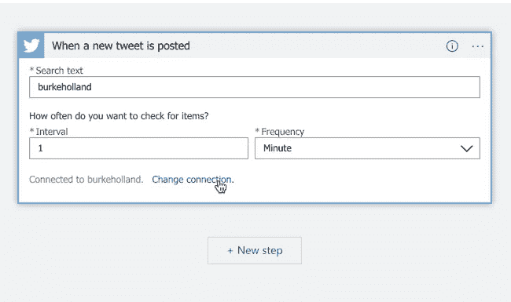

逻辑应用有直接进入 Azure 功能的连接器。

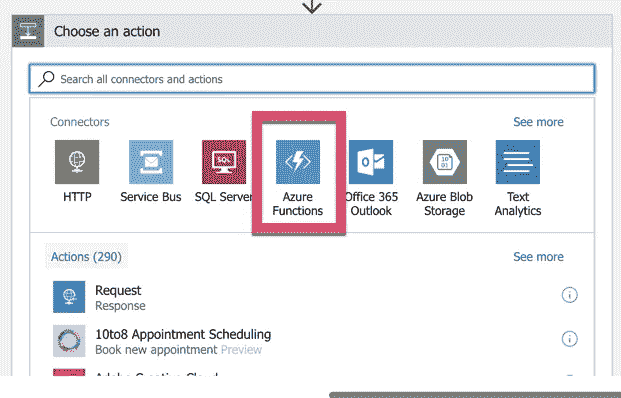

我花了一段时间才弄明白如何将颜色参数从 Logic Apps 传递给我的函数，但我最终意识到它在“查询”字段中是 JSON 格式的。

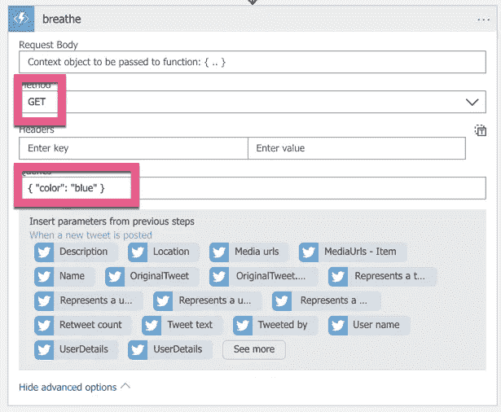

就是这样！我们完了。点击屏幕顶部的“运行”按钮，坐下来享受 LIFX 灯泡带来的新的宁静通知。看着你的生活质量提高，你开始理解生活的真正意义——当然是用灯泡收到 Twitter 通知。

# 我们还能做什么？

如果您查看逻辑应用程序中的所有其他动作类型，您会看到各种服务的连接器。我们还可以用连接的灯泡做些什么？有 Outlook，Github，Dropbox，Salesforce 的连接器。我们基本上可以用这个灯泡来通知我们互联网上发生的一切。我们甚至可以使用 [LUIS](https://cda.ms/92) 服务来确定他们在互联网上是否是错误的！

 [## LUIS:语言理解智能服务

### 语言理解智能服务(LUIS)提供了一种快速有效的方式来添加语言理解到…

www.luis.ai](https://www.luis.ai/?WT.mc_id=twitterbulb-medium-buhollan) 

那是推特灯泡。和一个额外的逻辑应用程序。我真的很喜欢 LIFX 灯泡和布莱恩·克拉克，我有一些计划用它来建造更荒谬的项目。不客气**