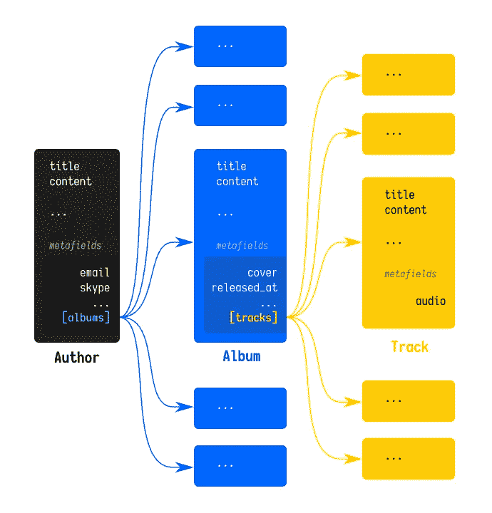
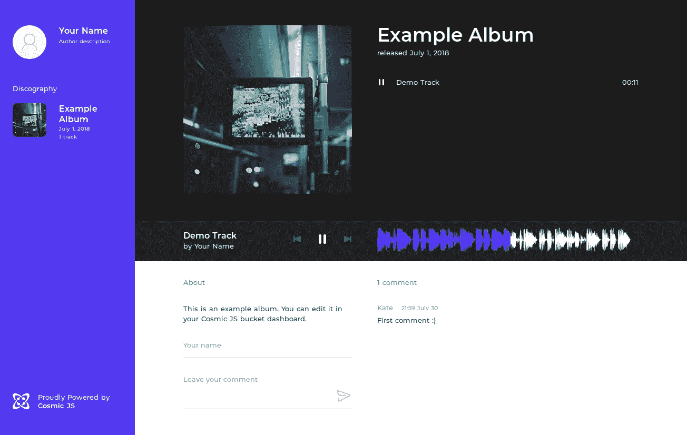

# 如何建立一个由 Cosmic JS 和 Nuxt.js 驱动的个人音乐网站

> 原文：<https://medium.com/hackernoon/how-to-build-a-personal-music-site-powered-by-cosmic-js-and-nuxt-js-e749bce8bf0>

Article originally written by Sergey Ukolov in Cosmic JS Developer Articles.

[Cosmic JS](https://cosmicjs.com/) 让你轻松创建嵌套的对象结构，上传媒体文件。在本教程中，我们将学习如何构建嵌套结构，以及如何从 [Cosmic JS API](https://cosmicjs.github.io/rest-api-docs/) 中获取这些数据，以便在一个由 Cosmic JS 和 Nuxt.js 支持的简单的个人音乐网站中使用

# TL；博士:

[个人音乐网站演示](https://cosmicjs.com/apps/vue-music-website)
[个人音乐网站代码库](https://github.com/cosmicjs/vue-music-website)

# 介绍

因为已经有很多文章可以让您学习如何使用 Cosmic JS Dashboard，所以我们将使用一个已经准备好的 Bucket snapshot。

# 创建一个桶

首先，您需要创建一个新的存储桶，因为下一步**将从其中删除所有数据**。

下载 base [bucket.json](https://raw.githubusercontent.com/zezic/cosmicjs-music-site/master/bucket.json) ，其中包含 bucket 对象模板描述以及我们应用程序的一些演示数据。要将其导入到您的 Bucket，只需遵循您的 Bucket dashboard 页面并导航到*设置>导入/导出*部分；你会看到*添加导入文件*按钮——点击它，选择你之前下载的 *bucket.json* 文件。

现在，带有新导入的对象模板的存储桶允许您将对象构建到下一个结构中:

在 Cosmic JS 中，当您需要将对象嵌套/链接到另一个对象时，您可以使用多对象关系元字段。然后，当你获取根对象时，你将通过元字段对象获得所有与之相关的项目。在下一段中，您将看到如何部署一个只通过一个 Cosmic JS API 请求就能访问这些结构的应用程序。

# 部署应用程序

要部署实际的应用程序，请遵循以下步骤:

**1)将存储库克隆到你的机器上，然后转到新创建的文件夹**

**2)安装应用依赖关系**

**3)配置您的本地应用实例**

实际上，配置 Cosmic JS 托管应用程序的方式是通过读取环境变量，但这次为了更清楚地了解我们的本地部署，我们只编辑名为 **instance.config.js** 的文件。为了能够针对您自己的 Cosmic JS Bucket 运行应用程序，您需要更改该文件中的以下 3 个属性:

*   **鼻涕虫**
*   **read_key**
*   **写 _ 键**

要获得此设置，请转到您的铲斗仪表板，导航至*设置>基本设置*。在那里，您将看到名为:

*   **斗蛞蝓**
*   **API 读取访问键**
*   **API 写访问键**

将这些字段的值复制到您的 **instance.config.js** 并保存它。之后，它应该看起来像这样:

**4)运行应用程序**

在应用程序构建完成后，你会看到一条消息说服务器已经在它的地址和端口上启动了。使用您的 web 浏览器导航到此地址。您应该会看到应用程序主页，其中包含从您的存储桶加载的演示数据:

# 了解如何获取数据

当您习惯了 JavaScript 作为一种异步语言时，从 Cosmic JS 获取数据到您的 JS 应用程序是非常简单的。在这个特定的应用程序示例中，我们使用一个小工厂来生成一个承诺，该承诺后来解析为 Bucket 实例，允许我们从中获取对象。在这个文件[中，你可以看到它是如何完成的:](https://github.com/zezic/cosmicjs-music-site/blob/master/lib/cosmic.js)

您可以注意到 Bucket 初始化需要我们在配置文件中预先设置的参数。

然后，您可以看到 Bucket access 实际上是如何用于应用程序的状态管理的。这里是[索引 Vuex 文件](https://github.com/zezic/cosmicjs-music-site/blob/master/store/index.js)的简化视图:

我们在这里等待着诺言何时兑现。然后我们调用 **getObjects** ,类型为“authors ”,数量限制为 1，并禁用元字段解释。然后，如果响应返回非空状态，我们选择第一个收到的对象，并将其存储到我们的状态。就是这样！

如果您想更仔细地查看收到的数据，您可以安装 [vue-devtools](https://github.com/vuejs/vue-devtools) ，然后通过**“NPM run dev”**命令在开发模式下运行 app，并通过浏览器中的 vue-devtools 检查 Vuex 状态。你会看到接收到的数据树不仅包含作者对象，还包含相关的专辑和曲目。

# 把数据推送给 Cosmic JS 怎么样？

您不仅可以从 Bucket 中“读取”对象，还可以将它们写入(创建)到 Bucket 中。为了实现这种操作，我们的应用程序允许用户发布关于相册的评论。在注释表的上下文中查看[下一段代码，您会发现使用 **addObject** 方法创建对象就像通过 **getObjects** 从 Cosmic JS 中获取它们一样简单。](https://github.com/zezic/cosmicjs-music-site/blob/master/components/CommentForm.vue#L50-L60)

# 结论

Cosmic JS 允许您基于多个对象关系创建数据结构，然后通过几行代码在您的应用程序中接收这些数据。

如果你对用 Cosmic JS 构建应用有任何意见或问题，[在 Twitter 上联系我们](https://twitter.com/cosmic_js)和[在 Slack 上加入对话](https://cosmicjs.com/community)。