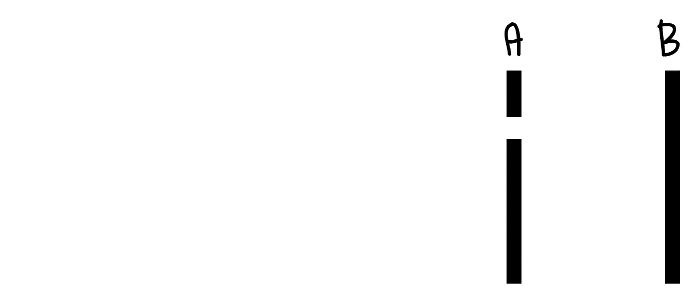
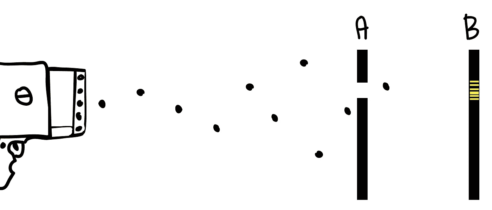
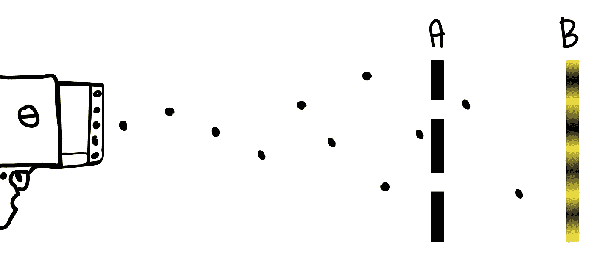
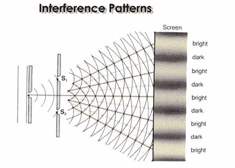
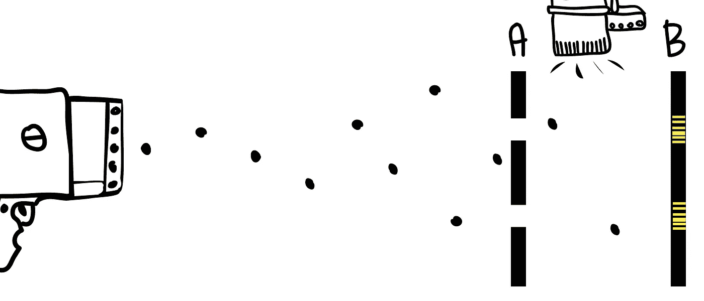
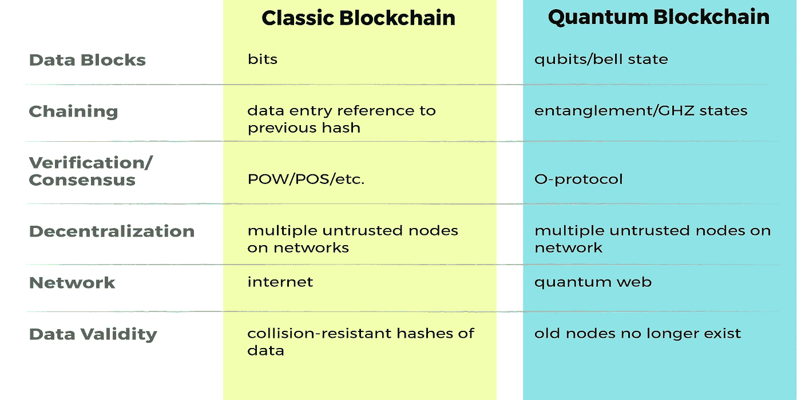

# 如何建造一个穿越时间的量子纠缠区块链

> 原文：<https://medium.com/hackernoon/how-to-build-a-quantum-entangled-blockchain-that-travels-through-time-9df493a8ce16>

这篇文章是我的系列文章之一🍌香蕉白皮书——区块链白皮书以一种易于理解的方式重新编写(比如香蕉！)风度。我的目标是帮助读者以最小的痛苦快速理解和评估复杂的区块链思想。

写量子物理学很难。

首先，*很复杂*。比《T4》和《区块链》要复杂得多。在区块链，如果需要的话，我可以在文本编辑器中打开代码，或者花一个下午的时间阅读博弈论，这些白皮书很有意义。但量子物理学要复杂得多，它用数学术语解释抽象理论，而不是用可见的现实(从代码是可见的现实的意义上来说)。量子物理学需要一个令人沮丧的广泛的知识基础，才能提供比重述别人所说的更多的东西。更困难的是，即使是专家也无法就量子的行为方式达成一致。

第二，量子物理学存在于一种知识崇拜中。现在，我知道——区块链也存在于一个知识邪教中。我们可以承认这一点，对吧？我们喜欢成为“少数人中的一员”，利用内部人士的专业知识，利用我们的微观地位获得经济和个人品牌收益。没关系。我们用去中心化的利他动机、为没有银行账户的人提供银行服务以及“去他妈的男人”的呼声来调和我们的崇拜。对于区块链，我们有一种商业驱动的崇拜，最终推动真正的利润和真正的产品。区块链是已经实现的东西。但量子物理学让我想起了 90 年代围绕纳米技术的知识崇拜，外行人(可能来自阅读 K. Eric Drexler 的书)抓住了解决人类最大问题的大量概念——例如，纳米机器人可以持续扫描和修复我们的细胞，将平均寿命延长到几个世纪。有可能，是的，有一天可能，是的。但是，假设往往被解读为真理，实际产品远在未来，而不是兴奋所证明的。

量子物理的第三个问题？它从根本上与我们感知现实和与现实互动的方式不一致。就像我们无法真正设想五维空间一样，我们也无法真正设想量子。我们的大脑被困在经典物理学的经验世界中，在那里结果是确定的，如果某物顺时针旋转…那么它顺时针旋转。但是量子？它告诉我们同时以多种状态存在的粒子。跨越光年瞬间影响其他光子的光子。意识到自己被测量的粒子。这些句子很容易阅读，但很难接受。

结合这三个问题——很少有人理解[科学](https://hackernoon.com/tagged/science),一种混淆当前状态的知识崇拜，以及一种与我们经历的现实不同的现实——你会有一大堆外行人的大量猜测，以及一个即使聪明、勤奋、坚定的头脑也难以保持谨慎和实事求是的空间。

序言结束。

[在最近发布的论文](https://arxiv.org/abs/1804.05979)中，威灵顿维多利亚大学的德尔·拉詹和马特·维瑟提出了一个建立在量子原理基础上的区块链设计。这不是跨越现有区块链顶部的量子层，也不是针对量子计算机黑客的新防御，而是*一个区块链，其底层设计是一个纠缠态网络。不是通过物理空间，而是通过时间。实际上，他们提出了一个量子网络时间机器。*

*双缝实验*

量子力学的基础始于双缝实验——这项实验在 20 世纪 20 年代首次运行，此后多次得到完善、复制和证明。

假设我们有两块板——一块(板 A)位于另一块(板 B)前面几英尺处。前面的木板 A 是一块实心木板，上面有一个切口，大小刚好能让一粒沙子通过。板 B，在后面，有一个特殊的涂层记录冲击。

我们还有一种特殊的枪，可以射出单粒沙子。如果我们站在几英尺远的地方，朝这个装置发射单粒沙子，我们会期望下面的图案最终出现在棋盘 B 上:

这就是所发生的事情。现在我们稍微改变一下，如图所示，在第一块板上切第二条缝，再次拍摄单粒沙子。当颗粒(我们随机假设)穿过一个或另一个狭缝时，我们会预期这种模式。

到目前为止，一切顺利。事情就是这样。但是现在，让我们从沙枪换成光子枪。我们关闭第二个狭缝，只留下一个狭缝打开，向电路板发射单个光子。我们观察到这种模式:

果然不出所料。但现在我们打开第二个狭缝，期待与双缝砂测试相同的模式。但是事情变得有趣了，因为我们观察到了这种模式:

这种图案被称为*干涉图案*，通常在处理波(例如声波)时出现。你可以想象这种效果就像水中的波浪——如果你把两块石头扔进一个小湖中不同的地方，最终每块石头产生的涟漪会碰撞和干涉。

但是等等——我们通过电路板发送了一个光子。单个光子是不可能自我干涉的。一个光子穿过一个狭缝是如何产生这种图案的？

但是等等——事情变得更奇怪了。假设我们在实验中加入了新的东西——我们在 A 板后面加入了一个探测器，可以探测光子穿过了哪个狭缝。一旦我们知道光子穿过了哪个狭缝，我们就可以证明它没有同时穿过两个狭缝。我们再次进行实验，得到了第二个看似不可能的结果:

我们又回到了最初预期的模式。光子突然不再显示干涉图样，开始显示我们一直期待的沙状图样。当我们开始探测光子时，它改变了它的行为！

这个实验已经以多种方式进行了多次验证。简而言之，在狭缝测试中:

*   一个光子似乎同时穿过两个狭缝，与自身干涉并产生干涉图样。
*   如果我们试图检测光子，光子会突然选择一个狭缝，改变观察到的图案。

这一切怎么可能？这是量子物理的基础。粒子同时在所有可能的路径上行进，并与自身发生干涉。粒子沿着两条路径存在，直到我们试图探测它，这时粒子只选择一条。

粒子处于可能状态的*叠加状态*(至少直到它们被测量)。这并不意味着粒子可能是 A 或 B，我们不知道，直到我们测量。这意味着*他们字面上既是 A 又是 B，* *同时，*直到他们被测量，此时他们选择 A 或 B

这违背了我们的思维所观察到的一切。

> 如果你觉得你懂量子力学，那你就是不懂量子力学。—理查德·费曼

为了理解我们的新区块链，我们必须了解量子物理学的另一个概念:**量子纠缠**。当你将两个粒子纠缠在一起，使得粒子作为一个单一的系统保持关联，即使相隔很远，量子纠缠也会发生。

假设我们有两个粒子 A 和 B，我们拿着粒子 A，和粒子 B 纠缠在一起，然后把它们分开很多光年。现在记住，从上面来看，两个粒子都处于可能状态的叠加状态——这意味着例如它们都同时顺时针和逆时针旋转。既然我们已经分离了粒子，如果我们测量 A 的自旋，它选择顺时针方向，另一个人马上测量 B，B 将总是选择逆时针方向。

纠缠意味着不管 A 和 B 之间的距离有多远，B 在瞬间就知道 A 选了什么。

爱因斯坦称之为“幽灵般的超距作用”

(怎么纠缠光子？用激光照射非线性光学晶体，十亿个光子中会有一个分裂，变成两个纠缠的光子。)

回到我们提议的区块链。事实证明，两个粒子不仅可以在很远的距离上保持纠缠，还可以在*时间内保持纠缠。*粒子 B 可以保持与粒子 A 纠缠，即使粒子 A 不再存在。(稍后将详细介绍)

基于此，Rajan 和 Visser 提出了一个区块链，它的块不是同时共存于链上的数据块，而是在时间上相互纠缠的光子，其中较老的光子不再存在，但仍然与当前状态的光子纠缠。

在传统的区块链中，一组发生在同一时间的过去的事务被收集到数据块中，打上时间戳，写入链中，并链接到前一个数据块。如果攻击者试图更改数据块，哈希函数会使其很难成功。块越老，成功破解就越困难:每个指向该块的块都必须被破解。网络上的验证器节点，通过激励和共识算法，确保数据是真实的，从而保持网络的分散性。

在提出的量子区块链中，链的功能(块、数据、时间戳)与传统的区块链具有相同的功能，但通过量子方法操作。这个链的目标是相同的，即存储在分散网络上的有效数据块。

## **数据**

在我们的新链中，数据不是用比特编码，而是用**量子比特编码。**量子位可以是各种基础粒子和物理状态——是量子信息的基本单位。不像比特是 1 *或*0，量子比特同时是 1 和 0*。所以一个量子位可能是一个既有向上自旋又有向下自旋的电子。这就是我们上面学到的叠加。在我们的新区块链的情况下，我们将使用光子作为我们的量子位。*

## 编码

实际数据是如何写入数据块的？这是基于称为**超密集编码**的过程来完成的。超密集编码是一种使用单个量子位发送两个传统信息位(00、01、10 或 11)的方法。

假设 Alice 想给 Bob 发送信息。两个纠缠的量子比特被分别发送给爱丽丝和鲍勃。爱丽丝根据她想要发送的两位信息，将一个[量子门](https://en.wikipedia.org/wiki/Quantum_logic_gate)应用于她的量子位，将两个量子位之间的纠缠设置为某个**贝尔态**(贝尔态是一种测量两个光子之间纠缠量子态的方法)。有四种可能的响铃状态，这非常好地映射到 Alice 试图发送的四种可能的 2 位信息。

爱丽丝现在将她的量子位发送给鲍勃，鲍勃可以测量两个量子位之间的贝尔状态，并解码爱丽丝发送的是哪一个两位信息。例如，如果测得的响铃状态是 X，他知道 Alice 正在发送比特 00。如果响铃状态为 Y，则 Alice 正在发送位 01。诸如此类。

这是一个很好的解释。实际上，我们的区块链是基于稍微新一点的理论，在这个理论中，鲍勃实际上不需要量子比特来测量贝尔态——他可以仅仅从纠缠本身来确定贝尔态。但是概念是一样的。

## 阻碍

我们新链中的一块数据被称为 **GHZ 态。**把一个 GHZ 态想象成块中所有光子之间纠缠的集合。在 GHZ 态中，如果任何一个光子受到干扰，整个 GHZ 态就会瓦解。

现在让我们一步一步地完成向量子区块链写入和验证数据的过程。

1.  一个新的数据块(请记住，数据是以 GHZ 态的量子位编码的)被某个不可信的节点提交给网络。这个新块与网络上的每个节点共享。
2.  我们不知道我们是否可以信任这个节点，所以使用量子随机数生成器从网络中随机选择一个**验证者**节点。
3.  使用θ协议，网络验证所提出的新块是有效的。theta 协议通过我称之为*的奇特数学*来验证该块，该数学测量该块是否包含真正的多体纠缠(GME)——一种只有在 GHZ 态的所有量子比特都参与了该状态的创建时才能存在的纠缠。为了完成这一证明，验证者生成一组随机角度，并将它们发送到网络。每个节点使用我只能称之为*的复杂数学*来验证数据，根据角度测量量子位。(如果你既想理解*奇特的*又想理解*复杂的*数学，[你可以在这里阅读](https://ia601504.us.archive.org/8/items/arxiv-1611.04772/1611.04772.pdf) [)](https://ia601504.us.archive.org/8/items/arxiv-1611.04772/1611.04772.pdf)
4.  一旦数据块被接受为真，其他节点就将新 GHZ 态的量子比特纠缠到当前 GHZ 态的量子比特，有效地将所有纠缠“吸收”到一个单一的 GHZ 态中。区块链的整个历史现在被编码到最近的 GHZ 状态中。
5.  最后，这里有一些魔法。来自先前数据块的量子位现在被销毁，只留下最新的量子位。但是*先前量子位的纠缠——以及整个量子链历史中所有先前的量子位——仍然保持*。我们可以提取这些信息，因为随着纠缠而来的是链中所有的编码数据——所以我们可以访问数据的整个历史。但是——这是关键——因为旧的量子比特不再存在，你*不能改变旧的块或纠缠的历史*。如果你试图改变当前的区块，纠缠就会散开，整个链条就会分崩离析。这条链子被锁住了，很安全。

在典型的区块链，改造旧街区既昂贵又困难。在基于物理空间的量子区块链中，改变旧的块变得更加困难，因为这些块是纠缠的，改变旧的块会打破纠缠并使整个链失效。

在我们新的*基于时间的*量子区块链中，保护甚至更好——旧的节点不能被改变，因为它们*不再存在*。充其量，攻击者可以尝试修改当前块。但是任何修改当前块的尝试都涉及到查看该块，这通过打破纠缠立即使整个链无效。

这种基于时间的区块链状态存在于从未同时存在的光子之间的纠缠中，然而它们仍然共享当前时刻存在的纠缠。

换句话说，令人震惊的是，这个区块链不是将当前块链接到过去的记录，而是将它链接到不再存在的过去的*实际记录。如果你要测量当前存在的光子，你将改变不再存在的光子。*

让我再写一遍—

这些区块不是与仍然存在的过去的区块相链接，而是通过时间与不再存在的过去的实际区块相链接。

更大胆地说，纠缠在时间中倒流。

这个区块链，毫不夸张地说，正在影响和改变已经发生的事件。这是违反直觉的，这就是时间旅行的魔力。作者称这个新区块链为“量子网络时间机器”

这都是真的吗？

这个新区块链只是一个概念，还没有建成。但是 Rajan 和 Visser 说，“这个设计的所有子系统都已经通过实验实现了”。所以，是的，科学是真实的。但是不，这个链条还不存在。

回到我的序言，我们必须小心不要被卷入这里的知识崇拜。这是一个困难的主题——我欢迎社区对我可能出错的任何细节提供反馈。但我很兴奋地看到，一旦我们把时间加进区块链变量，会有什么新的可能性存在。像量子计算机一样，我们离看到这个概念成为现实还有一些年。其中一个障碍是，我们还没有一个能够传输量子数据的全球量子网络。但是更小的量子网络确实已经存在，而且我们距离拥有一个全球网络可能只有几个月，甚至几年的时间。所以时候到了。

*延伸阅读*

[更多关于时间纠缠的研究](https://www.quantamagazine.org/time-entanglement-raises-quantum-mysteries-20160119/)

[原白皮书](https://arxiv.org/abs/1804.05979)

看看我的另一篇香蕉论文

[马克尔道/戴](/coinmonks/maker-and-dai-the-banana-paper-6c68eb59fc62)

[TrueBit](/@michael.bogan/blockchain-startup-truebit-the-banana-paper-fca77ebcad0f)

[结尾](https://hackernoon.com/a-blockchain-the-size-of-a-few-tweets-9db820eb6b29)

[反事实与国家渠道的演变](/coinmonks/understanding-counterfactual-and-the-evolution-of-payment-channels-and-state-channels-9e939d7c6f34)

# 给点掌声怎么样？

*如果你喜欢这篇文章，* ***随时鼓掌多次或与朋友分享*** *。这让我知道我的工作是有帮助的，并鼓励我写更多。*

Michael Bogan 是一名技术爱好者，拥有 25 年的技术架构、创业、产品发布和研究区块链项目的经验。

跟随我在灵媒上。

在推特上关注我。

[在领英上关注我](https://www.linkedin.com/in/michael-bogan-01682414/)。