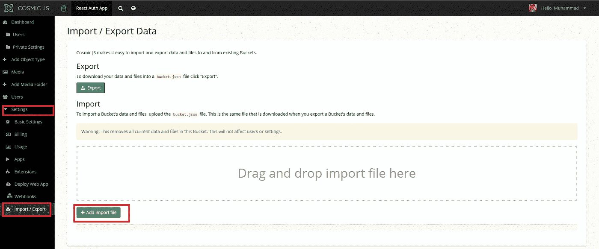

# 如何使用 reactor、Cosmic JS 和 Node 构建一个 React Auth 应用程序

> 原文：<https://medium.com/hackernoon/how-to-build-a-react-auth-app-using-react-cosmic-js-and-node-9022c0ca328c>

This is what we will be building.

# TL；速度三角形定位法(dead reckoning)

[下载 GitHub 回购协议。](https://github.com/cosmicjs/react-auth-app)
[查看演示。](https://cosmicjs.com/apps/react-auth-app)

# 先决条件

环境:

开始之前，您需要安装 node.js 和 npm。请确保您的计算机上已经安装了它们。

技术栈

1.  **宇宙 JS** : [宇宙 JS](https://cosmicjs.com) 用于 API 管理。
2.  **ReactJS** : ReactJS 用于将前端应用与 Cosmic JS 连接。使用基于**反应纤维**的反应 v16，使 app **比反应 v15 更快**和**更轻**。
3.  **NodeJS** : NodeJS 用于处理端点，例如使用私有设置&与 Cosmic JS 通信，以及使用 gmail SMTP 客户端服务发送电子邮件。
4.  **NextJS** : NextJS v4 用于使应用服务器端呈现。

# 入门指南

在这个存储库中，我们将构建一个应用程序，演示基本身份验证应用程序中包含的所有内容。

**设置时段:**

要创建存储桶，请登录 [Cosmic JS](http://cosmicjs.com/) 并单击“添加新存储桶”。

选择“从头开始”

**导入时段数据:**

下载此[reaction Auth App Bucket JSON](https://raw.githubusercontent.com/musaghauri/react-auth-app/60f0000cdbcfe62b208d50d7cfd168f533602ec2/bucket.json)文件并转到您的宇宙 JS 仪表板。现在在边栏上，转到设置- >导入/导出数据，然后单击**添加导入文件**并选择下载的文件。它将导入所有对象类型和所需数据。

现在让我们从实际应用开始。

# 宇宙 JS 配置

下载[reaction-auth-app 库](https://github.com/cosmicjs/react-auth-app)后，在终端做`npm install`。在安装了所有的依赖项之后，我们需要为 Cosmic JS 设置配置。为此，我们将克隆`.env.example`并将其重命名为`.env`，并使用桶配置设置其中的所有变量。

`.env`看起来会像下面列出的文件

私有设置

您需要为**私有设置**添加一个条目，其中包括以下内容:

**标题:**一些虚拟测试

**邮箱用户名:**您的 gmail 账户邮箱。

**邮箱密码:**您的 gmail 账户密码。

**发件人:**您的电子邮件，通知邮件将从该电子邮件中发出。

**注意:**我们使用 SMTP gmail 客户端发送电子邮件。

现在你已经准备好运行应用程序了。

**工作流程**

**页数:**

1.  登录—此页面用于用户登录
2.  路线:/
3.  失败
4.  如果电子邮件或密码不正确，这将失败。
5.  如果帐户未经验证，此操作将会失败。
6.  成功
7.  只有在凭据正确且帐户已激活的情况下，此操作才会成功。
8.  注册—此页面用于注册用户，验证电子邮件将发送到相应的电子邮件地址
9.  路线:/注册
10.  简档—此页面用于列出简档信息
11.  路线:/配置文件
12.  编辑简档—此页面用于编辑简档信息
13.  路线:/个人资料/编辑
14.  编辑密码—此页面用于编辑帐户密码
15.  路由:/个人资料/编辑/密码
16.  忘记密码—此页面用于向电子邮件发送用于重置密码的 OTP
17.  路由:/forgotPassword
18.  重置密码—此页面用于通过发送到相应电子邮件的 OTP 来重置密码
19.  路由:/resetPassword
20.  激活账户:该页面用于激活账户
21.  路由:/activateAccount

**登录:**

**报名:**

**简介:**

**编辑个人资料:**

**编辑密码:**

**忘记密码:**

**重置密码:**

**激活账户:**

**安全性** 这款 app 在登录时使用了 **MD5** 加密对密码进行加密，并与加密后的密码相匹配。为了维护经过认证的场景，我们使用 **JWT 标记化**来标记信息并将它们存储到 cookies 中。

**结论** 这是一个基本的应用程序，涵盖了上面列出的所有基本认证功能。我们还遵循了信息和密码加密等安全措施。希望你喜欢这个应用入门教程，觉得有用。干杯。快乐编码。

> [原创文章](https://cosmicjs.com/articles/how-to-build-a-react-auth-app-using-react-cosmic-js-and-node)发表在[宇宙 JS](https://cosmicjs.com) 上。Cosmic JS 通过提供强大的应用程序开发和管理工具，帮助您的团队更快地构建应用程序。