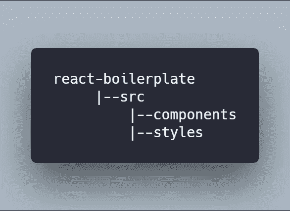

# 如何使用 Webpack 4 和 Babel 从头构建一个 React 项目

> 原文：<https://medium.com/hackernoon/how-to-build-a-react-project-from-scratch-using-webpack-4-and-babel-56d4a26afd32>


“Man wearing headphones at desk with window view of sunset in background” by [Simon Abrams](https://unsplash.com/@flysi3000?utm_source=medium&utm_medium=referral) on [Unsplash](https://unsplash.com?utm_source=medium&utm_medium=referral)

我最近一直在学习 [react](https://reactjs.org/) ，我已经使用 [create-react-app](https://github.com/facebook/create-react-app) 以最少的努力和配置轻松地创建了我的 React 项目，我猜你也很可能使用过 [create-react-app](https://github.com/facebook/create-react-app) 或[React-slings](https://github.com/coryhouse/react-slingshot)来创建你的 React 应用。如果您只想专注于 React 并让他们负责配置，这些是非常棒的工具。但这是你想学的反应方式吗？

可能不是，这就是你在这里的原因。所以我们开始吧:)

# 开始使用:

在开始之前，你必须在你的电脑上安装 npm，它与 [Node.js](https://nodejs.org/en/) 捆绑在一起，你可以从[这里](https://nodejs.org/en/download/)安装它。

## 文件夹结构:



Folder structure for the React app

您可以使用这些命令创建上述目录。

```
mkdir react-boilerplate
cd react-boilerplate
mkdir -p src/components src/styles
```

# 初始化项目:

所有使用节点包管理器(npm)的项目都必须初始化。要初始化项目，请在终端中输入以下命令。这将创建一个 **package.json** 文件。

```
npm init
```

您将被问及几个与项目相关的问题，您可以通过按 enter 跳过它们，如果您想跳过所有问题，请添加-y 标志。

```
npm init -y
```

现在，您的 package.json 文件将如下所示。

```
{
"name": "react-boilerplate",
"version": "1.0.0",
"description": "",
"main": "index.js",
"scripts": {
  "test": "echo \"Error: no test specified\" && exit 1"
},
"keywords": [],
"author": "",
"license": "ISC"
}
```

# 安装 Webpack:

Webpack 是一个模块捆绑器，可以让我们将项目文件捆绑成一个文件用于生产。因此，让我们将 webpack 添加到我们的项目中。

```
npm install **webpack** **webpack-cli** --save-dev
```

上面的命令将把 **webpack** 和 **webpack-cli** 作为开发依赖项添加到我们的项目中。我们安装了 **webpack-cli** ，这样我们就可以在命令行中使用 **webpack** 。

# 安装 React:

将 **react** 和 **react-dom** 作为依赖项安装。

```
npm install **react** **react-dom** --save
```

# 安装 Babel:

为了让 React 工作，我们需要在它旁边安装 Babel。我们需要巴别塔穿越 ES6，JSX 穿越 ES5。

安装 **babel-core** 、 **babel-loader** 、 **babel-preset-env** 、 **babel-preset-react** 作为开发依赖。

```
npm install **@babel/core** **babel-loader** **@babel/preset-env** **@babel/preset-react** --save-dev
```

*   **巴别核心:**将 ES6 代码转换为 ES5
*   **babel-loader:** 给定预设，Webpack 助手用于传输代码。
*   **babel-preset-env** :帮助 babel 将 ES6、ES7、ES8 代码转换为 ES5 的预置。
*   **巴别塔-预设-反应:**将 JSX 转换为 JavaScript 的预设。

**Index.js :**

在 ***/src*** 文件夹的根目录下创建一个 index.js 文件，现在在其中添加以下代码。这个文件将是我们应用程序的入口点。

```
console.log("hello");
```

**Index.html:**

在 ***/src*** 文件夹的根目录下创建一个 index.html 文件，并在其中添加以下代码。

# 入口和输出文件:

在项目的根目录下创建一个 **webpack.config.js** ，这样我们就可以为我们的加载器定义规则。

在 **webpack.config.js** 中定义我们的应用程序的入口点和输出目录

在上面的代码中，Webpack 将我们所有的 JavaScript 文件捆绑到 ***/dist*** 目录中的 **index-bundle.js** 文件中。

# Webpack 加载器:

现在在这个文件中添加一些加载器，它们将负责加载和捆绑源文件。

在 **webpack.config.js 中，**添加以下代码行:

这里 **babel-loader** 用于加载我们的 JSX/JavaScript 文件，而 **css-loader** 用于加载和捆绑所有的 css 文件到一个文件中，而 **style-loader** 将在文档的 style 标签中添加所有的样式。

在 Webpack 可以使用 **css 加载器**和**样式加载器**之前，我们必须将它们作为开发依赖项进行安装。

```
npm install **css-loader** **style-loader** --save-dev
```

*请记住，webpack 从最后到第一个执行加载程序，即从右到左。*

## 。babelrc:

现在，在项目目录的根目录下创建一个. babelrc 文件，其中包含以下内容。

```
{
  "presets": ["@babel/preset-env", "@babel/preset-react"]
}
```

这个文件将告诉 babel 使用哪些预置来编译代码。这里我们使用两种预设:

*   **env** :该预置用于将 ES6/ES7/ES8 代码转换到 ES5。
*   **反应**:该预置用于将 JSX 代码转换成 ES5。

# 使用 Webpack 编译文件:

将以下代码行添加到 package.json 文件的脚本对象中，如下所示:

```
"start": "webpack --mode development --watch",
"build": "webpack --mode production"
```

这里我使用了 **watch** 标志，所以每当源文件有变化时，webpack 会自动编译所有的源文件。

webpack 4 中有两种模式，一种是生产模式，用于生成可用于生产的优化文件；另一种是开发模式，用于生成易于阅读的代码，为您提供最佳开发体验。`--mode`标志让我们选择使用哪种模式。

现在，您可以使用以下命令编译项目:

```
npm start
```

执行上述命令后，您将看到在 ***/dist*** 目录下创建的 **index_bundle.js** 文件，该文件将包含从 **index.js** 文件中转编译的 ES5 代码。

## App.js

在 ***src*** 文件夹的 ***components*** 文件夹下创建一个 App.js 文件，其内容如下。

## App.css:

在 ***src*** 文件夹的 ***styles*** 文件夹下创建一个 App.css 文件，文件内容如下。

这个 css 文件用于确保 CSS 加载器和样式加载器正常工作。

现在修改我们之前创建的 **index.js** 文件，使其包含以下代码行。

# 正在安装 Html-webpack-plugin:

现在我们还需要安装 **html-webpack-plugin** ，这个插件生成一个 html 文件，将脚本注入 HTML 文件内部，并将这个文件写入 **dist/index.html** 。

将 html-webpack-plugin 作为开发依赖项安装:

```
npm install **html-webpack-plugin** --save-dev
```

现在我们需要在 **webpack.config.js** 文件中配置这个插件，在其中添加下面几行代码。

这里模板键值是我们之前创建的文件**index.html**，它使用这个文件作为模板，在 ***/dist*** 文件夹内生成名为**index.html**的新文件，并注入脚本。

设置几乎完成了，我们要做的就是使用 webpack 编译源文件，您可以使用下面的命令运行项目:

```
npm start
```

你会在项目的/ ***dist*** 文件夹中得到输出，现在在网页浏览器中打开**index.html**，你会看到文本**“我的 React 应用！”**它的内部。

但是这种方法有一个缺点，你必须手动刷新网页，才能看到你所做的改变。为了让 webpack 监视我们的更改并在我们的组件发生任何更改时刷新网页，我们可以安装 **webpack-dev-server。**

# 正在安装 Webpack-dev-server:

安装 **webpack-dev-server** 作为开发依赖项

```
npm install **webpack-dev-server** --save-dev
```

并修改 **package.json** 启动脚本如下:

```
"start": "webpack-dev-server --mode development --open --hot"
```

我添加了两个标志`--open`和`--hot`,每当组件发生变化时，它们都会打开并刷新网页。

现在在终端中运行以下命令:

```
npm start
```

您应该看到浏览器窗口打开并显示内容，就像下面的截图。


Output in a browser window

就这样，现在我们有了自己的 React 样板文件，可以用来创建 React 项目。你也可以从我的 [**Github**](https://github.com/SukhjinderArora/react-boilerplate) 下载这个 react 设置。

如果您觉得这篇文章有帮助，请点击👏按钮。如果你有任何疑问，可以在下面评论，我很乐意帮忙:)