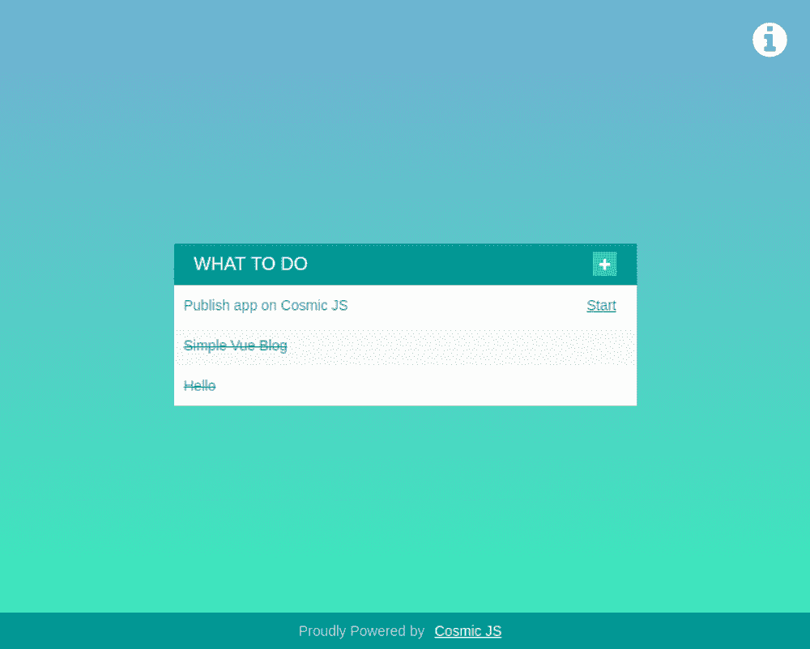

# 如何使用 Cosmic JS 构建一个带有番茄计时器的 React Todo 应用程序

> 原文：<https://medium.com/hackernoon/how-to-build-a-react-todo-app-with-a-pomodoro-timer-using-cosmic-js-b451de2ab754>

What we will be building.

在本教程中，我将向你展示如何使用 [React](https://reactjs.org/) 和 [Cosmic JS](https://cosmicjs.com/) 创建一个包含【pomodort timer 的 **Todo list 应用程序。我们将使用 Cosmic JS npm 包来实现我们对象的基本 CRUD，并从 Cosmic JS 中检索数据和媒体。让我们开始吧。**

# TL；速度三角形定位法(dead reckoning)

[查看演示](https://cosmicjs.com/apps/react-pomodoro-todo-app)
[下载 GitHub 回购](https://github.com/cosmicjs/react-todo-pomodoro)

# 先决条件

在启动之前，您需要安装节点 JS 和 npm。确保你已经有了。

# 入门指南

# 使用现有的 git repo 做任何事情

首先，您必须确保您已经安装了 node > 6.x 和 yarn，然后运行以下命令:

成功完成最后一个命令后，浏览器窗口将自动打开`package.json`,如下所示。

现在，应用程序必须在`[http://localhost:300](http://localhost:3000/)`上运行

让我们设置`webpack.config.js`

这里写的代码负责编译 React JS。

设置`./src/components/app/app.js`

在这个文件中，我们正在创建主页文件。因此，在 state 中，我们保留以下数据。

1.  表单->标题:负责新任务输入值
2.  List:字符串数组，这里保存了所有的任务
3.  showNewTaskInput:布尔值，负责显示/隐藏新的任务输入
4.  通知:当前通知名称，我们也有类型的通知列在下面作为一个对象，这里是排序的通知类型的名称。

在我们的`Class`中我们使用了以下方法:

1.  构造者:我们正在设置新的`Api service`，它将被用来连接宇宙 JS API。
2.  ComponentWillMount:这是属于 React 组件生命周期的函数，这里我们只是调用我们自己创建的另一个方法。
3.  getData:调用 API 并更新任务列表的函数，之后我们使用`this.resetForm()`重置新任务输入的值
4.  createNotification:函数获取一个通知类型作为参数，并将其置于状态中以备将来使用
5.  onChange:函数负责保持新任务标题的状态。
6.  onSave:函数使用 Cosmic JS api 创建一个新任务。
7.  onStart:函数负责启动特定任务的定时器，它调用 Api 将启动时间保存在 Cosmic 的 db 中。
8.  onDone:函数负责将特定任务的状态设置为“完成”。
9.  onUpdate:函数负责更新特定任务的标题。
10.  showNewTaskInput:函数显示新的任务输入。
11.  resetForm:函数负责清理新任务输入的值。
12.  render:在 render 中，我们放置 html，并调用上面提到的函数。

# 设置`./src/task-list/list-item/index.js`

# 在`list-item`中，我们正在创建每个任务项

在州政府，我们保留两件物品:

1.  编辑:如果标题正在修改中
2.  标题:任务的当前标题

下面我们将介绍 3 个函数。他们将调用由`props`传递给组件的函数。

接下来的两个函数有一些逻辑。他们在这里:

1.  onEdit:响应更新状态`editing`项的函数。
2.  onChange:改变`title`项状态的函数。

然后，我们有 2 个 React 组件生命周期方法:

1.  componentWillReceiveProps:在这个函数中，我们检查组件是否收到了新的 Props，我们正在更新我们的本地状态。
2.  render:所有的 HTML 代码都在这里。我们在这里调用上面提到的函数。

# 设置`./src/components/countdown/index.js`

在这个文件中，我们使用 [Moment JS](https://momentjs.com/) 进行倒计时的基本计算。

## 结论

我们都设置好了，你可以运行应用程序，并享受它。有问题的话，[上 Cosmic JS](https://cosmicjs.com/drprotg00) 找我。

本文[原载于 Cosmic JS](https://cosmicjs.com/articles/how-to-build-a-react-todo-app-with-a-pomodoro-timer-using-cosmic-js) 。