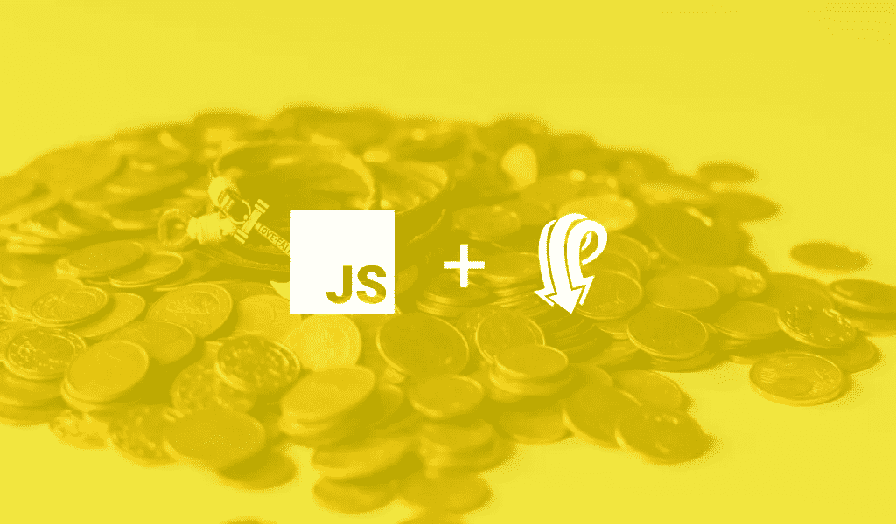
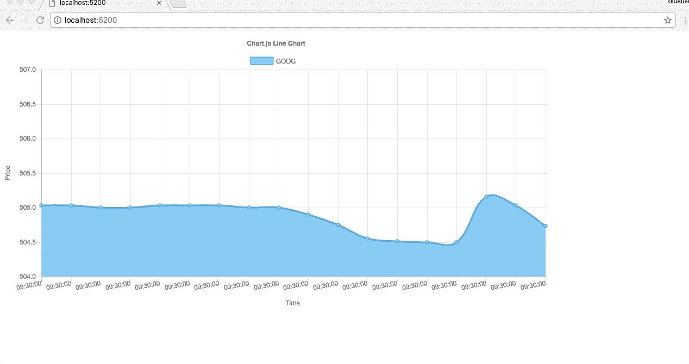

# 如何用 JavaScript 和 Pusher 构建实时交易平台

> 原文：<https://medium.com/hackernoon/how-to-build-a-realtime-trade-platform-with-javascript-and-pusher-1f7275e396e>



> 披露:[为开发者提供实时 API 的 Pusher](https://goo.gl/52hnDL) ，此前曾赞助过黑客 Noon。

股票市场数据变得更有价值，因为它本质上为寻求分析和统计的交易者提供了一个机会。

在本教程中，我们将构建一个描绘股票市场体验的交易平台，在这里，价格交易可以在[实时](https://hackernoon.com/tagged/realtime)中可视化。这将使用 [JavaScript](https://hackernoon.com/tagged/javascript) 、Chart.js 和由 [Pusher](https://goo.gl/52hnDL) 支持的实时功能来构建。

Pusher 是一个专门为开发人员构建实时基础设施的平台，目的是尽可能高效地构建实时应用程序。我们将利用 Pusher 的强大功能，直接从服务器在我们的图表上显示更新的价格，并添加一个额外的功能来显示描述价格的表格，如下所示:

# 入门指南

如前所述，Pusher 将用于轻松交付我们的图表按指定运行所需的实时功能。如果没有 Pusher 的账号，可以[免费注册](https://pusher.com/signup)。完成后，继续从您的仪表板创建一个新的应用程序。不要忘记记下您的 **app_id** 、 **key** 、 **secret** 和 **cluster** ，因为您将需要在本教程的后面使用它们。


# 设置应用程序

现在我们已经设置了一个帐户并获得了必要的凭证，我们需要为我们的应用程序设置一个服务器和视图。这是为了确保我们的应用程序和[推动器](https://pusher.com/)之间的通信。如果你还没有在你的机器上安装 Node 和 npm，请点击这里从[下载它们以便跟进。否则，继续以任何名称创建新目录，并运行以下命令:](https://nodejs.org/)

```
npm init -y
```

会问你一堆问题，然后会为你创建一个 package.json 文件。用以下内容更新文件:

现在，编辑上面的文件，添加脚本来启动我们的本地服务器，我们将设置它。

我们需要安装 Pusher SDK 和`serve`来帮助我们启动客户端应用程序:

```
## Pusher
npm install --save pusher## Serve
npm install --save-dev serve
```

我们还需要一些现有的虚拟数据，以便对股票交易和价格变化进行适当的模拟。出于这个原因，我下载了一个以前股票历史的数据样本，我们可以玩玩。下面是`stock.json`的删节版。你可以在这里找到完整的文件。

接下来，我们需要创建我们的项目文件。在项目文件夹中添加以下文件，并将其留空。我们将一边走一边填充内容:

# 创建简单的服务器

在`server.js`内，导入`stock``.json`文件，并使用从应用仪表板获取的所需凭证初始化推送器。

为了让我们的客户接收实时负载，我们需要使用 Pusher 从我们的服务器发出这些负载:

每两秒钟，我们就在 JSON 文件中查询`GOOG`股票价格，并使用推送器的`trigger`方法将这个价格和一些其他有效负载(如股票名称)一起作为 JSON 发出。该方法将通道、事件和负载作为参数。

运行以下命令启动服务器:

```
npm run serve
```

# 构建客户端应用程序

首先，用以下内容更新您的`index.html`:

您有一个`canvas`,在这里您将启动图表以及一个简单的表格来显示实时更新的当前价格。我们还包括了 Pusher 和 Chart SDK，我们将很快使用它们。

**App 类**为了接收服务器发来的有效载荷，我们需要订阅服务器发出的 Pusher 事件。为了可视化它，您需要创建一个图表，并使用从服务器接收的有效负载不断更新它的数据点。我们将需要几个函数:

我们刚刚创建了方法体。下一步是开始一个接一个地实现它们的功能。

首先，让我们初始化 Pusher

仅出于调试目的，我们将`Pusher.logToConsole`设置为`true`，以便查看记录到控制台的实时活动。请记住在生产中删除它，这样就不会让用户的控制台被调试日志弄得臃肿不堪。

接下来，我们创建一个`Pusher`的实例。构造函数在我们之前包含的`pusher-js`文件中可用。

请记住，服务器仍在发送数据。我们需要订阅它，并开始使用传入的数据:

Pusher 上的`subscribe`方法获取我们需要订阅的频道，并返回订阅。然后，我们可以使用`bind`绑定到这个订阅，并向它传递事件的名称和一个回调函数。

在这种情况下，我们调用`updateChartData`并传递数据给它来不断更新图表。我们在名为`chart`的构造函数中创建一个实例变量。我们还调用了`initializeChart`方法来在构造函数中设置图表。在我们看到更新图表逻辑之前，让我们看看这个图表是如何初始化的:

这可能看起来令人不知所措，但仔细观察就会发现，我们只是在定义一个图表，并描述它应该预期什么样的数据，它应该如何标记数据，以及它应该是什么样子。

现在，update chart 方法使用 chart 实例在每次数据从 Pusher 服务器进入时更新图表。

您可以使用以下命令启动客户端应用程序:

这将在端口 5200 上启动 web 应用程序。打开你的浏览器



# 实时报价机

目前，由于 Pusher 的功能，我们能够用服务器发送的有效载荷实时更新图表。让我们继续添加另一个特性来在表上显示价格。

我们将选择一个随机价格设置为阈值，以确定从服务器接收价格时价格是上升还是下降。这些价格的变化会用不同的颜色表示，因为它可以在任何股票市场图表中获得。

记得我们在`index.html`中有以下表格:

为了完成这项工作，我们将编辑`updateChartData()`方法，并创建一个名为`flashColor``()`的新方法。新方法将用于根据价格的变化来改变颜色。

不要忘记在构造函数中包含阈值价格，如下所示:

对于视觉提示，这里有一个函数，它会在每次超过阈值时改变价格文本的颜色:

就是这样:

从图表中可以看出，价格的绿色表示价格已经超过阈值，而红色表示价格降低，蓝色表示价格与阈值完全相同。

# 结论

从本教程中，我们看到了如何建立一个类似股票市场的平台，价格的变化是实时更新的。这可以在任何图表库的基础上构建和使用。如果您遗漏了什么，可以在 GitHub 上找到完整的代码。您可以在这里[找到它](https://github.com/christiannwamba/pusher-stock)，请随时提交拉动请求。

> 这篇文章最初出现在 [Pusher 博客](https://blog.pusher.com/realtime-trade-platform-javascript-pusher/)上。