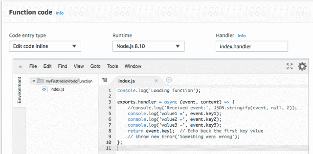
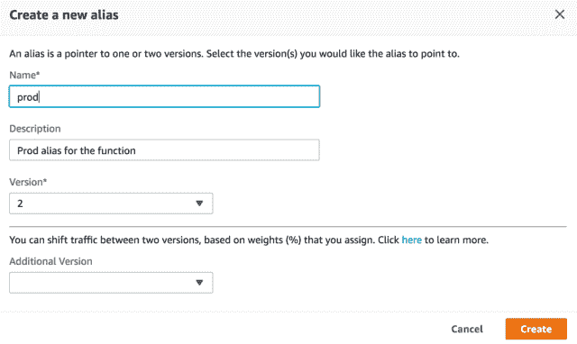

# 如何使用 AWS 控制台构建无服务器应用程序

> 原文：<https://medium.com/hackernoon/how-to-build-a-serverless-app-using-the-aws-console-4cf1fb390ae3>


在本教程中，您将学习如何创建、测试和更新 Lambda 函数。您还将学习如何发布新版本并为 Lambda 函数创建别名。你可以在这里学习无服务器[的基本知识。](https://codeforgeek.com/2017/09/serverless-framework-tutorial-using-aws-lambda/)

# 创建函数

以下是如何通过 AWS Lambda 控制台创建 AWS Lambda 函数:

1.  一旦您创建了 AWS 自由层帐户，请通过位于 https://aws.amazon.com/console/[的 AWS 管理控制台登录您的 AWS 帐户。](https://aws.amazon.com/console/)
2.  登录到 AWS 控制台后，导航到 AWS Lambda 控制台。
3.  从 AWS Lambda 控制台，点击**创建功能**按钮:


单击该按钮后，您将看到三个不同的选项来创建 AWS Lambda 函数:

1:从头开始创作 AWS Lambda 函数。

2:从预先配置的蓝图列表中创建一个 AWS Lambda 函数来启动您的 AWS Lambda 函数。

3:从**无服务器应用库**中选择一个已经发布的无服务器应用，无服务器应用库由开发者和公司在 AWS 上发布的应用组成

选择蓝图选项:


在蓝图过滤器框中，添加一个名为 **hello-world** 的过滤器，并选择名为 **hello-world** 的蓝图。

您应该在 Node.js 中看到一个 starter AWS Lambda 函数。点击底部的**配置**按钮:


现在，您将看到配置您正在创建的 AWS Lambda 函数的选项:

*   将你的 Lambda 函数命名为**myfirsthellowerdfunction**。
*   从**角色**的下拉列表中选择**从模板创建新角色**
*   为您的角色指定与 Lambda 函数相同的名称，以便于识别 IAM 角色。
*   从**策略模板**列表中，选择**基本边缘λ权限**。
*   点击底部的**创建功能**按钮:


另一个非常重要的配置设置是 AWS Lambda 函数的处理程序的名称。

对于您创建的那个，将其设置为 **index.handler** ，这是您的 AWS Lambda 函数的 **module-name.export** 值。

在这种情况下，AWS Lambda 函数将调用作为蓝图的一部分创建的 index.js 文件中的 exports.handler:



如果您检查蓝图创建的代码，它将如下所示:

```
console.log(‘Loading function’);exports.handler = async (event, context) => {// console.log(‘Received event:’, JSON.stringify(event, null, 2));console.log(‘value1 =’, event.key1);console.log(‘value2 =’, event.key2);console.log(‘value3 =’, event.key3);return event.key1; // Echo back the first key value// throw new Error(‘Something went wrong’);};
```

你可以在这里找到这个 AWS Lambda 功能代码[。](https://github.com/PacktPublishing/Hands-On-Serverless-Computing/blob/master/Your-first-Serverless-application-on-AWS/hello-world-blueprint.js)

前面的代码打印了触发 AWS Lambda 函数(被注释掉)的整个事件。然后它打印事件中的三个不同的键，名为 **key1、key2** 和 **key3** ，最后返回 **key1** 。当您通过控制台测试这个 AWS Lambda 函数时，您需要确保测试事件定义了这三个键。

# 测试功能

是时候看看如何使用 AWS Lambda 控制台测试新创建的 AWS Lambda 函数了。此时，由于您还没有为 AWS Lambda 函数定义任何触发器，您只需使用 AWS Lambda 控制台来配置测试事件并调用 AWS Lambda 函数。

要测试新创建的 AWS Lambda 函数:

1.  点击**测试**按钮，打开**配置测试事件**对话框。
2.  在**配置测试事件**中，选择 **Hello World** 事件模板。
3.  为事件设置一个名称，例如 **myHelloWorldEvent** ，并点击 **Create** 按钮。
4.  Hello World 事件模板应该类似于以下 JSON 片段:

```
{
 “key3”: “value3”,
 “key2”: “value2”,
 “key1”: “value1”
 }
```

以下是配置测试事件的屏幕截图:


现在，确保在事件列表中选择了 **myHelloWorldEvent** 事件，以便在控制台中测试您的 AWS Lambda 函数，该事件位于**测试**按钮旁边:


现在，当你点击**测试**按钮时，你会看到一个执行结果说它成功了，提供了一个指向 CloudWatch 日志的链接，这样你就可以查看你的 AWS Lambda 函数执行的日志了。

在控制台中，您还将看到记录的 key1 的值，在本例中为 **value1** ，因为这是在测试事件中配置的:


控制台输出还记录此 AWS Lambda 函数执行的摘要，包括以下内容:

*   执行所花费的时间
*   为 AWS Lambda 功能配置的内存
*   AWS Lambda 函数执行所消耗的最大内存
*   AWS Lambda 执行的计费持续时间。

摘要部分还包括一个指向 CloudWatch 日志组的链接:


如果导航到摘要中提供的 CloudWatch 日志组链接，就可以查看由 AWS Lambda 函数生成的日志。在这种情况下，该函数输出在用于测试 Lambda 函数的测试事件中配置的三个不同的键值:

# 更新功能

现在，您已经能够通过控制台成功地测试您的 AWS Lambda 函数，是时候看看如何通过控制台对 Lambda 函数进行更改，通过控制台部署这些更改，并查看您的更改是否通过测试 AWS Lambda 函数反映出来，如以下步骤所示:

1.  在 AWS Lambda 控制台中，选择之前创建的 AWS Lambda 函数**myfirsthellowerdfunction**，并导航到**函数代码**部分修改代码。
2.  您将进行的唯一更改是取消对打印发送给 AWS Lambda 函数的整个事件的行的注释。一旦进行了更改，代码将如下所示:

```
console.log(‘Loading function’);exports.handler = async (event, context) => {console.log(‘Received event:’, JSON.stringify(event, null, 2));console.log(‘value1 =’, event.key1);console.log(‘value2 =’, event.key2);console.log(‘value3 =’, event.key3);return event.key1; // Echo back the first key value// throw new Error(‘Something went wrong’);};
```

你可以在这里找到前面的 AWS Lambda 功能代码。

完成更改后，单击右上角的**保存**按钮，这会将更改部署到您的 AWS Lambda 函数的$最新版本。

更改完成后，点击测试按钮，选择 **myHelloWorldEvent** 。

在 AWS Lambda 函数执行的输出中，您现在应该看到打印出的整个事件，以及每个键的值:


# 发布新版本

默认情况下，当您更新并保存 AWS Lambda 函数时，它会被保存到 **$LATEST version** 。但是，如果您想要创建 AWS Lambda 函数的 **$LATEST** 版本的快照以供将来参考，AWS 提供了一种机制，通过将函数发布到命名版本来实现。您可以通过 AWS 控制台执行以下步骤来实现这一点:

1.  在 AWS Lambda 控制台中，单击操作下拉菜单，然后选择发布新版本:


在对话窗口中，输入版本描述的值(例如，2018 年 6 月 1 日创建的**快照**，点击**发布**按钮:


一旦按下**发布**按钮，将为您的 AWS Lambda 函数发布一个新版本，版本号将由 AWS Lambda 平台自动设置为 1(假设这是您第一次为您的 AWS Lambda 函数创建版本)。

当您发布新版本时，它们将由 AWS Lambda 平台自动递增。

您可以通过选择版本下拉列表来查看 AWS Lambda 函数的可用版本:


# 为 Lambda 函数创建别名

在有些情况下，您需要为不同的环境(测试和生产)和不同的特定环境设置创建略有不同的 AWS Lambda 函数版本。为了处理这个用例，AWS Lambda 平台为您提供了创建别名的能力，该别名指向 AWS Lambda 函数的一个或多个版本。以下是为 AWS Lambda 函数创建别名的方法:

在 AWS 控制台中，从**动作**下拉菜单中，选择**创建别名**:


在打开的对话窗口中:

*   输入名称 prod
*   输入描述作为功能的**产品别名**
*   选择要为其创建别名的版本，然后按“创建”按钮:



创建别名后，当您从 HTTP 事件触发器(如 Amazon API Gateway 或 S3 事件触发器)调用 AWS Lambda 函数时，您可以指定需要调用的 AWS Lambda 函数的别名。

# 结论:

我们已经逐步介绍了创建、更新 AWS lambda 函数以及创建它们的别名的说明。你可以看看这本书来了解更多关于它的信息。

*原载于 2018 年 8 月 29 日*[*codeforgeek.com*](https://codeforgeek.com/2018/08/how-to-build-a-serverless-app-using-the-aws-console/)*。*