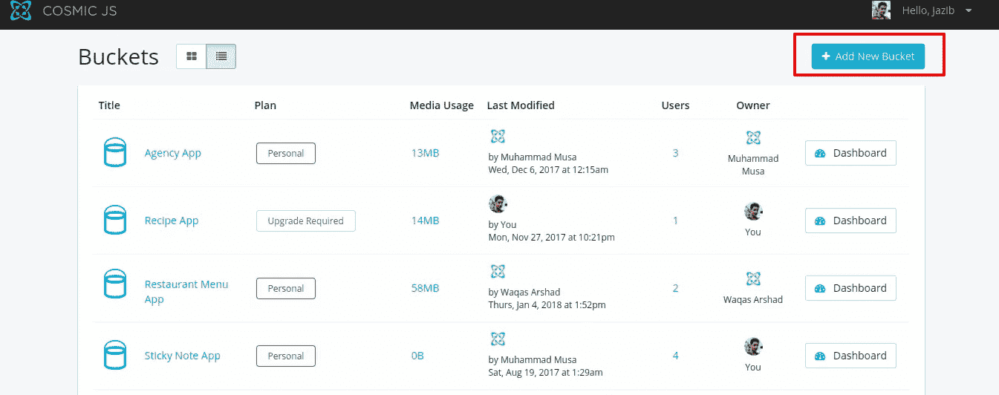
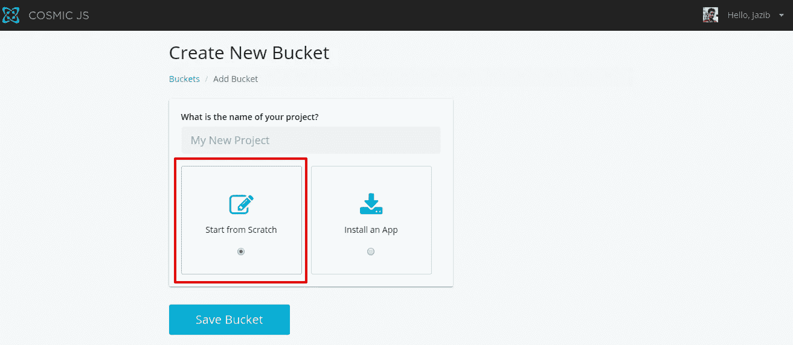
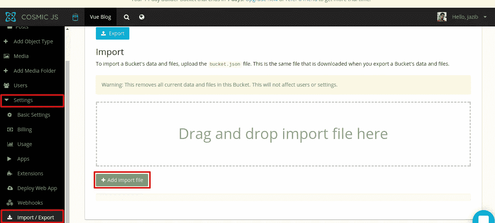
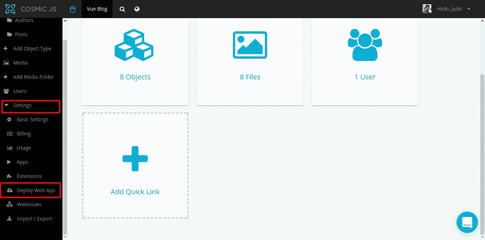
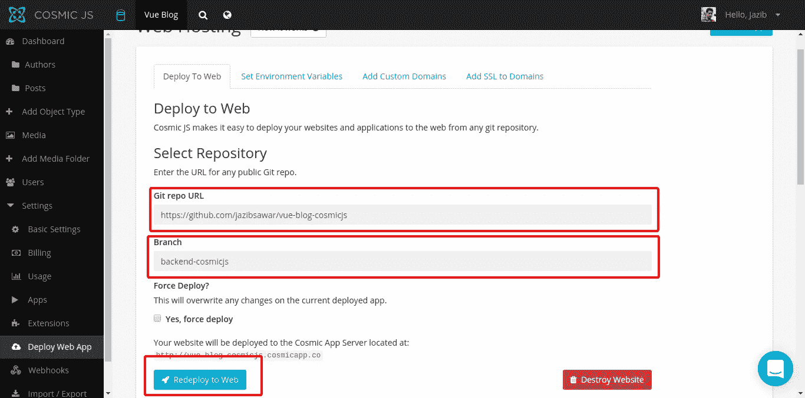
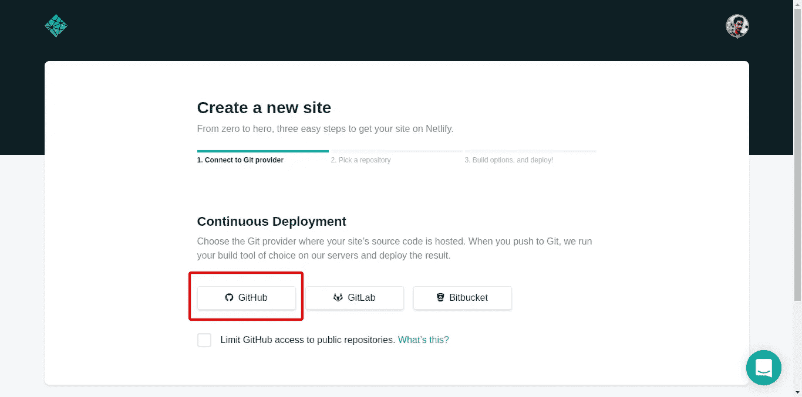
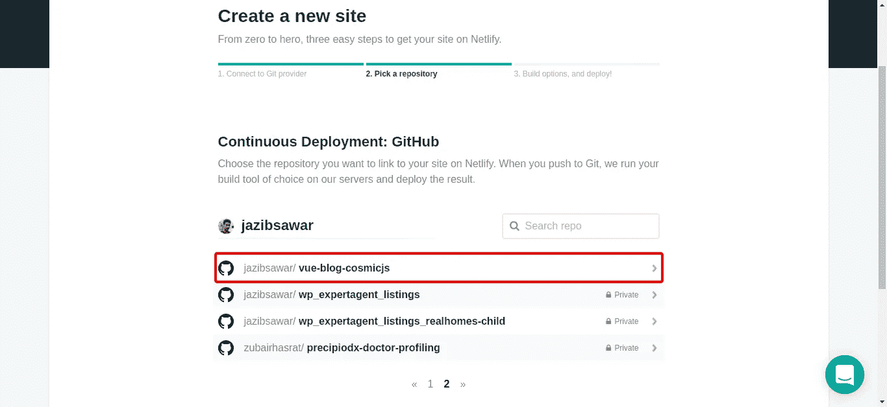
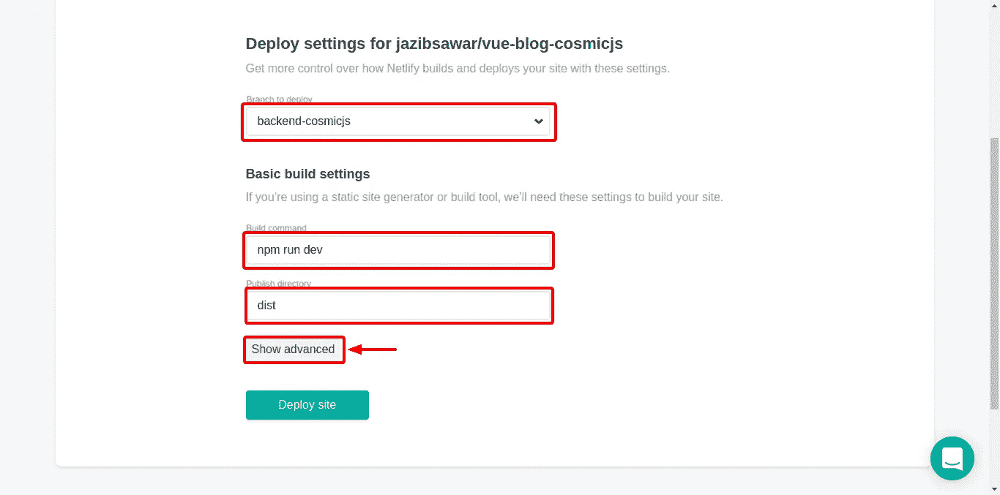
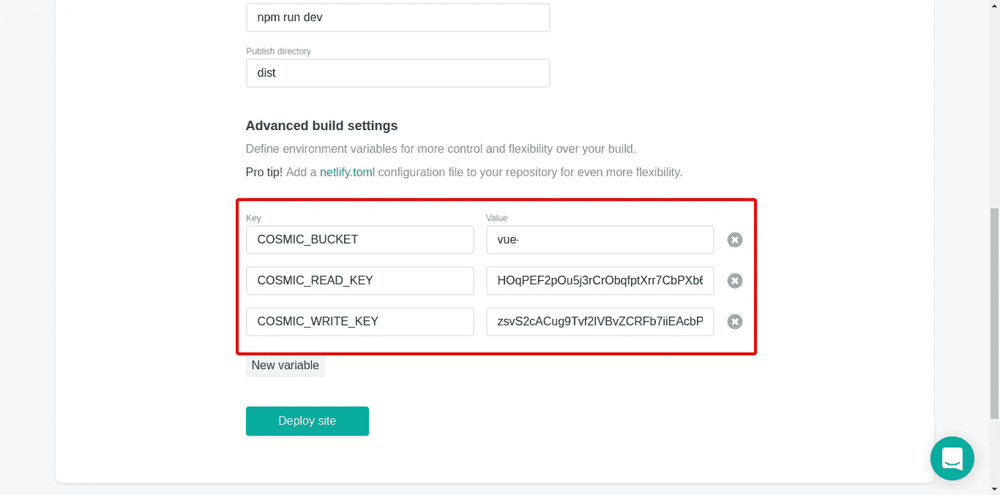

# 如何使用 Vue、Cosmic JS 构建一个简单的博客并部署到 Netlify

> 原文：<https://medium.com/hackernoon/how-to-build-a-simple-blog-using-vue-cosmic-js-and-deploy-to-netlify-2bd3e2b3a115>

What we will be building.

在本教程中，我将向您展示如何使用 [Vue](https://vuejs.org/) 、Vuex、 [Cosmic JS](https://cosmicjs.com/) 创建一个简单但令人惊叹的博客，并部署到 [Netlify](http://netlify.com/) 。让我们开始吧。

# TL；速度三角形定位法(dead reckoning)

[下载 GitHub 回购。](https://github.com/cosmicjs/vue-blog-cosmicjs)
[查看演示。](https://simple-vue-blog.cosmicapp.co/)

# 先决条件

在启动之前，您需要安装节点 JS 和 npm。确保您已经安装了它们。

# 开始使用:

在这个应用程序中，我们使用 [Snipcart Vue 博客演示](https://github.com/snipcart/vue-blog-demo)作为起点。派生和克隆这个存储库，我们稍后将研究它。首先，我们将在 Cosmic JS 中设置桶。

**设置桶:** 要创建桶，登录 [Cosmic JS](http://cosmicjs.com/) ，点击添加‘新桶’。

选择从头开始。

**导入桶数据**

下载这个 [bucket.json](https://raw.githubusercontent.com/jazibsawar/vue-blog-cosmicjs/backend-cosmicjs/bucket.json) 文件。并在设置- >导入/导出数据中，点击“添加导入文件”并选择下载的文件。它将导入所有对象类型和所需数据。

现在我们将致力于应用。

**整合宇宙 JS**

当铲斗完全安装时。现在我们将在分叉的[https://github.com/snipcart/vue-blog-demo](https://github.com/snipcart/vue-blog-demo)仓库中集成 Cosmic JS 后端。首先用这个替换 *package.json* :

在终端中打开文件夹并执行`npm install.`之后，我们需要设置 Cosmic JS 配置以便与 API 通信。为此，我们将在`/src/config/`文件夹中创建一个文件`index.js`。

之后分别替换`/config/`文件夹中`index.js`和`prod.env.js`的内容。

`prod.env.js`

现在宇宙 JS 配置完成。我们需要在项目的根目录下创建一个`.env`文件。它会将所有变量加载到 process.env 中。

**更改 Vue 资源插件以集成 Cosmic JS API**

现在 app 差不多了。我们只需要做一些小的调整就能让它正常工作。

用下面的代码替换`src/main.js`。我们正在更改 API 端点，以便调用 Cosmic JS 后端。

用下面的代码替换`src/plugins/resource/index.js`,我会解释我们在这里做什么。

在这次修改中，我们基本上导入了之前创建的配置，并将 API 请求的端点 URI 更改为 Cosmic JS。

**博客供稿**

替换`src/resources/BlogFeed.js`以便将来自 Cosmic JS API 的数据映射到博客提要。我们只需要正确地进行映射，因为前端代码独立于 API 调用。

**博客帖子**

同样，更换`src/resources/BlogPost.js.`它将使单柱工作完美。

**最终确定**

如果你在终端做`npm run dev`，它会工作。但是在我们开始部署之前，我们需要完成一些事情。替换`static/api/blog.json`中的博客标题、作者标签和帖子标签。这些字符串将在应用程序中使用。

因为这个博客应用程序是静态的，所以如果你想把它部署到 Cosmic JS 主机，你需要创建一个简单的 Node.js Express 服务器。在应用程序的根目录下创建`server.js`,并将下面的代码复制到该文件中。

一切都结束了😃。另外，我添加了 TitleComponent 来更改 document.title，你可以在我的[资源库](https://github.com/jazibsawar/vue-blog-cosmicjs)中查看代码。

**部署**

现在我将展示如何在 Cosmic JS 主机和 Netlify 的免费主机上部署这个应用程序。您需要将这个应用程序代码推送到 GitHub 上的存储库中。

**部署在 Cosmic JS 主机上**

在 Cosmic JS dashboard 中转到您的桶，然后单击设置->部署 Web 应用程序。

在新窗口中，输入您的存储库 Url 和分支名称。添加完所有需要的配置后，点击“部署 web 应用程序”。它将被部署，您将收到关于成功部署的电子邮件。你不需要在这里输入任何环境变量，因为在 Cosmic JS 中，主机已经为我们做好了一切。

**在网络上部署**

在 Netlify 上注册，点击“来自 Git 的新站点”。请在那里选择 Git 提供者。就我而言，我将使用 Github。

成功认证后，您的所有存储库都将显示出来。选择正确的存储库。

现在您需要选择您的分支并提供一些配置，以便使它正常工作。选择分支成功后，在`build`命令中输入`'npm run build'`，在`publish`目录中输入`'dist'`。最后，点击`'Show advance'`按钮。

点击前进按钮后，需要添加`3 environment variables`。这里我们必须手动操作。宇宙 JS 主机自动为我们做这件事。

在那里加上`COSMIC_BUCKET, COSMIC_READ_KEY & COSMIC_WRITE_KEY`。您可以从设置- >基本设置中获得这些值。只需将值粘贴到那里，然后按`Deploy Site`。它将在几分钟内部署！

# 结论

这是一个简单的博客应用程序，使用 vue、vuex 和 Cosmic JS 构建。最后，我们还学习了如何将这个应用程序部署到 Netlify 以及 Cosmic JS 主机。我希望你喜欢这个教程，并会对你有所帮助。干杯！