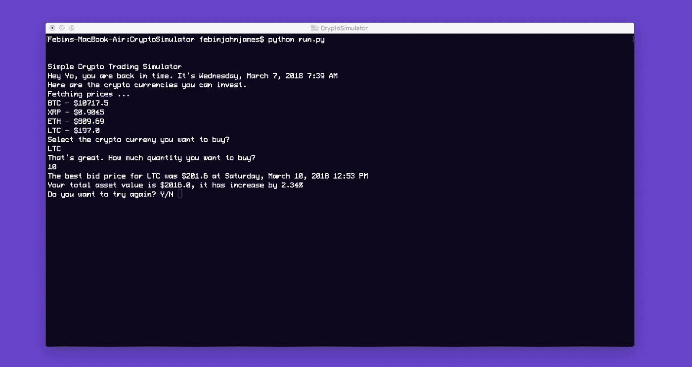
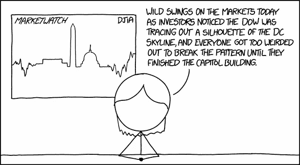
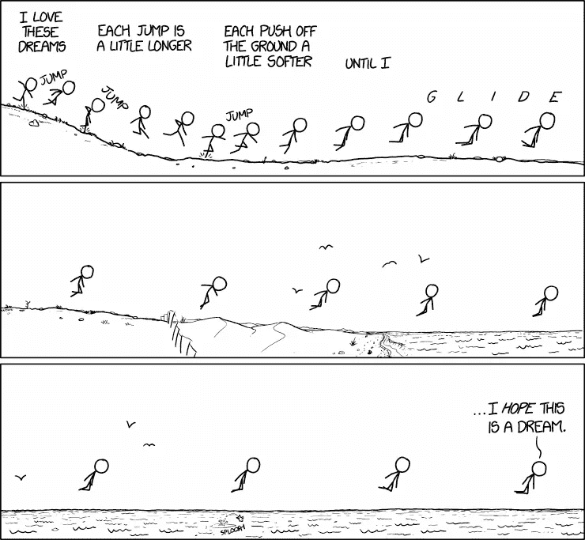
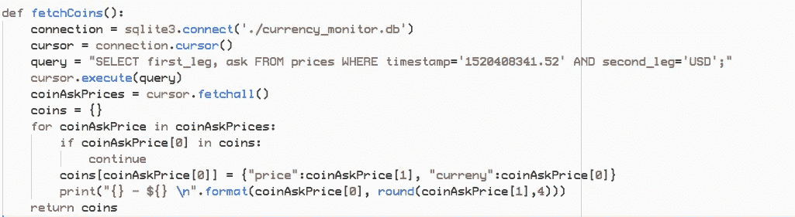
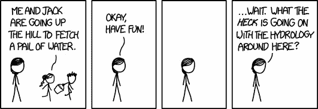
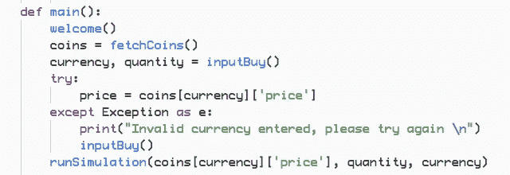
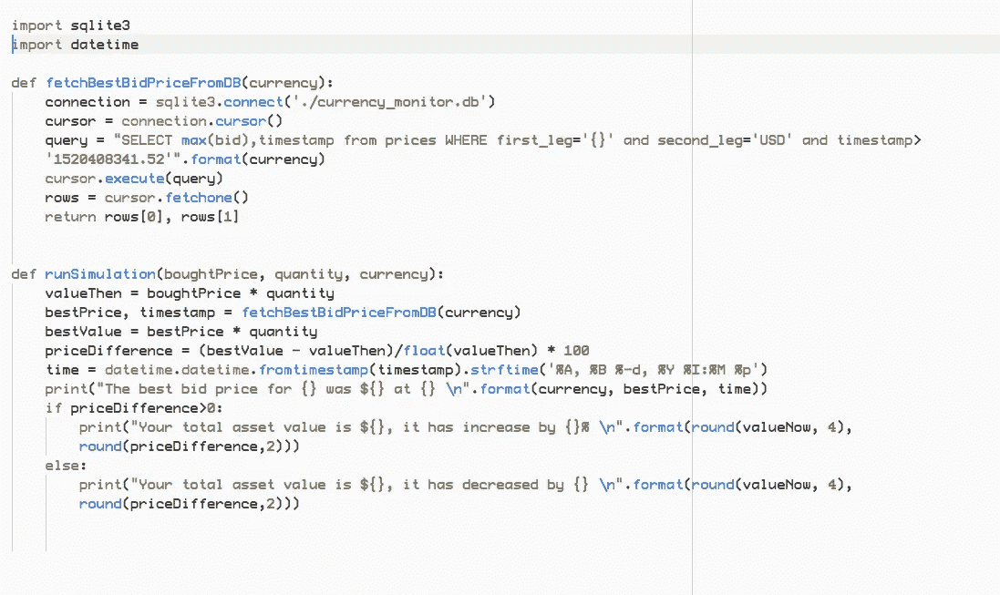

# 如何构建一个简单的加密交易模拟器，第 1 部分

> 原文：<https://medium.com/hackernoon/how-to-build-a-simple-crypto-trading-simulator-part-1-4ccdddcd6b76>



## 学习用 Python 编写加密交易模拟器

我不是一个交易者，但交易密码的想法是如此诱人。除非我知道自己在做什么，否则我不想投入真金白银。我想找个地方来测试我的策略。



Credits : [xkcd](https://www.explainxkcd.com/wiki/index.php/1600:_MarketWatch)

所以，我想到了建立一个加密交易模拟器。这个想法是为了帮助新手投资者在不损失真钱的情况下学习和实验。在这个系列中，我将教你如何建立一个。我有一个数据库，其中包含 2018 年 3 月 7 日至 2018 年 3 月 16 日之间不同交易所的加密价格。

在这个故事中，我们将在 python 中构建一个简单的加密模拟器，允许用户投资加密货币，然后我们将运行一个模拟器，看看他的加密资产在接下来的 9 天 ***中的性能如何。***

现在，我们将显示他的资产的最佳出价，将其与初始投资进行比较，并告诉他是否盈利或亏损。**在接下来的故事中，我将讲述如何添加实时货币监控、如何编写和测试策略、如何构建用户界面等..** *(* ***)我将需要你的*** [***支持这里的***](https://www.buymeacoffee.com/febin) ***，我在故事的最后已经提到差不多了。)***

这里有一个我们今天正在构建的模拟器的视频，你也可以看看该项目的 [Github 库](https://github.com/jamesfebin/CryptoTradingSimulator)。**你需要从** [**这里**](https://drive.google.com/file/d/1OHhtrvOe-EWcX_8tipWo6tWYqkkYDkPw/view?usp=sharing) **单独下载数据库，放在项目的目录下。**

# 伪码

在我们开始编码之前，我们需要清楚下一步是什么。这一点很重要，否则我们会经常困惑。我们使用伪代码来获得清晰度，伪代码不是真正的代码，而是我们自己语言中的路线图。

```
Step 1: Welcome the user. Step 2: We will fetch the cryptocurrency prices during March 7th, 2018 since our database starts at that time. Step 3: We will ask the user to invest in one currency.Step 4: Then, we will run the simulator to see how his crypto asset does in the next 9 days. Step 5: We will find the best bid price for that currency, compare it with user's initial investment and display if he made a profit or loss.
```

我们不必按那个顺序做这些步骤，我们可以先做比较容易的。因为完成更多的事情给了我们信心，我们有可能完成整个项目。

这个故事中使用的代码使用的是 Python 2.7。

让我们首先创建一个空文件夹，例如:“ *CryptoSimulator* ”。 ***您还需要从*** [***这里***](https://drive.google.com/file/d/1OHhtrvOe-EWcX_8tipWo6tWYqkkYDkPw/view?usp=sharing) ***下载加密价格数据库，并将其放在您的项目文件夹中。***

*制作一个名为“run.py”的文件*



Credits : [xkcd](https://xkcd.com/1376/)

## 欢迎

我们将创建一个名为“ *welcome* ”的简单函数。它没做什么了不起的事情，只是打印了一系列的行，程序名，给用户一个程序要做什么的概念，换句话说就是说“*嗨*”。

```
def welcome():
   print(“Simple Crypto Trading Simulator”)
   print(“Hey Yo, you are back in time. It’s Wednesday, March 7, 2018 7:39 AM”)
   print(“Here are the crypto currencies you can invest.”)
   print(“Fetching prices … ”)
```

很好，现在我们需要获取 2018 年 3 月 7 日上午 7:39 加密货币的价格。

因为我们的数据库是基于 sqlite3 的，所以我们需要下载 python 库，您可以使用下面的命令来完成。

```
pip install sqlite3
```

现在，在文件 run.py 的开头，我们需要导入库。

```
import sqlite3
```

现在让我们编写代码从时间的开始获取价格并显示它。

在数据库中，我们有以下几列，时间戳，第一段，第二段，要价，出价和交易所名称。如果我们考虑货币对“*BTC/美元*”。第一站是 BTC，第二站是“*美元*”。

在下面几行代码中，我们获取给定时间的价格。

```
connection = sqlite3.connect(‘./currency_monitor.db’)
cursor = connection.cursor()
query = “SELECT first_leg, ask FROM prices WHERE     timestamp=’1520408341.52' AND second_leg=’USD’;”    cursor.execute(query)
coinAskPrices = cursor.fetchall() 
```

现在我们将遍历价格，删除重复项，然后添加到 python 字典并打印它们。

```
coins = {}
for coinAskPrice in coinAskPrices:
    if coinAskPrice[0] in coins:
        continue
    coins[coinAskPrice[0]] = {“price”:coinAskPrice[1], “curreny”:coinAskPrice[0]}
    print(“{} — ${} \n”.format(coinAskPrice[0], round(coinAskPrice[1],4)))
    return coins
```

如果你不懂代码，不要担心。只需下载存储库，运行它，四处修补，看看会发生什么，慢慢地一切都会开始有意义。

现在我们将把上面的代码组合成一个函数“ *fetchCoins* ”。



Credits : [xkcd](https://xkcd.com/1662/)

现在，价格已经显示出来了，我们将询问用户他想买哪种密码以及价格。我们将创建一个名为“ *inputBuy* ”的函数。

```
def inputBuy():
   print(“Select the crypto curreny you want to buy? \n”)
   curreny = raw_input(“”).upper()
   print(“That’s great. How much quantity you want to buy? \n”)
   quantity = float(raw_input(“”))
   return curreny, quantity
```

现在我们需要找到用户感兴趣的货币的价格。我们可以通过查询 python 字典简单地做到这一点。

```
price = coins[currency][‘price’]
```

然后我们需要将这些参数传递给我们的模拟器。让我们把这些代码放到主函数中。



是的，“ *runSimulation* ”函数还没有定义，我们下一步会这么做。我们可以创建另一个文件“simulator.py”


Credits : [xkcd](https://xkcd.com/277/)

我们需要导入这些库

```
import sqlite3
import datetime
```

现在让我们定义函数 *runSimulation。*

```
def runSimulation(boughtPrice, quantity, currency):
  valueThen = boughtPrice * quantity
  bestPrice, timestamp = fetchBestBidPriceFromDB(currency)
  bestValue = bestPrice * quantity
  priceDifference = (bestValue — valueThen)/float(valueThen) * 100
```

我们在这里计算买入时的总资产价格，然后找出 3 月 7 日和 3 月 16 日期间该货币的最佳价格。稍后我们会计算差值，看看值是增加了还是减少了。

为了找到最好的价格，创建一个名为“*fetchBestBidPriceFromDB*”的函数。

```
def fetchBestBidPriceFromDB(currency):
   connection = sqlite3.connect(‘./currency_monitor.db’)
   cursor = connection.cursor()
   query = “SELECT max(bid),timestamp from prices WHERE first_leg=’{}’ and second_leg=’USD’ and timestamp> ‘1520408341.52’”.format(currency)
   cursor.execute(query)
   rows = cursor.fetchone()
   return rows[0], rows[1]
```

我们还需要在 runSimulation 函数中添加几行来打印我们的发现。

```
print(“The best bid price for {} was ${} at {} \n”.format(currency, bestPrice, time))
if priceDifference>0:
     print(“Your total asset value is ${}, it has increase by {}% \n”.format(round(bestValue, 4), round(priceDifference,2)))
else:
     print(“Your total asset value is ${}, it has decreased by {} \n”.format(round(bestValue, 4), round(priceDifference,2)))
```

让我们把这些代码放在一起。



快完成了，但我想加点戏剧性。你知道在电影里，字母是在控制台上一个接一个打印出来的吗？

创建一个名为“ *drama.py* 的文件，并添加以下代码行

```
import time
import sysdef dramaticTyping(string):
   for char in string:
     sys.stdout.write(char)
     sys.stdout.flush()
     time.sleep(0.10)
```

现在在 *run.py* 和 *simulator.py* 上导入这个文件，然后用 *dramaticTyping* 替换函数调用 *print* 。

恭喜，我们已经准备好了一个基本版本的加密交易模拟器。


***请鼓掌*** 👏，*谢谢*😊。这只是一个开始，我们将在接下来的系列中做很多事情，如将它与实时加密 API 集成，编写和测试策略，制作 UI 等。

*关注我们，*[*HackerNoon*](https://hackernoon.com)*和我(*[*Febin John James*](https://medium.com/u/75a616711f4e?source=post_page-----4ccdddcd6b76--------------------------------)*)让你不会错过这个系列。*

我需要你的支持，如果我得到足够的支持，我甚至会建立一个移动应用程序，并免费发布。请支持我，请[给我买杯咖啡](https://www.buymeacoffee.com/febin)。你也可以赞助这个系列，请通过我的 [Linkedin](https://www.linkedin.com/in/febinjohnjames/) 联系我。

[](https://www.buymeacoffee.com/febin)

也可以捐 ETH。

## 以太币

0 XB 65 bbf 5 c 47 f 9 ABC 2d 40 a5e 739 DD 69 c 64 C2 e 89 a 0 f