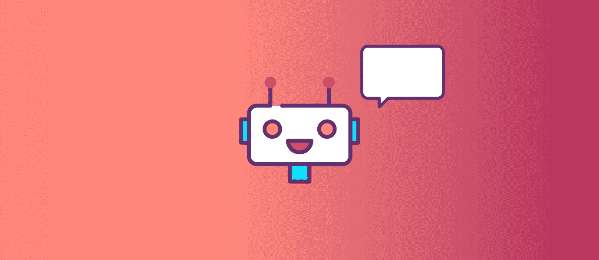
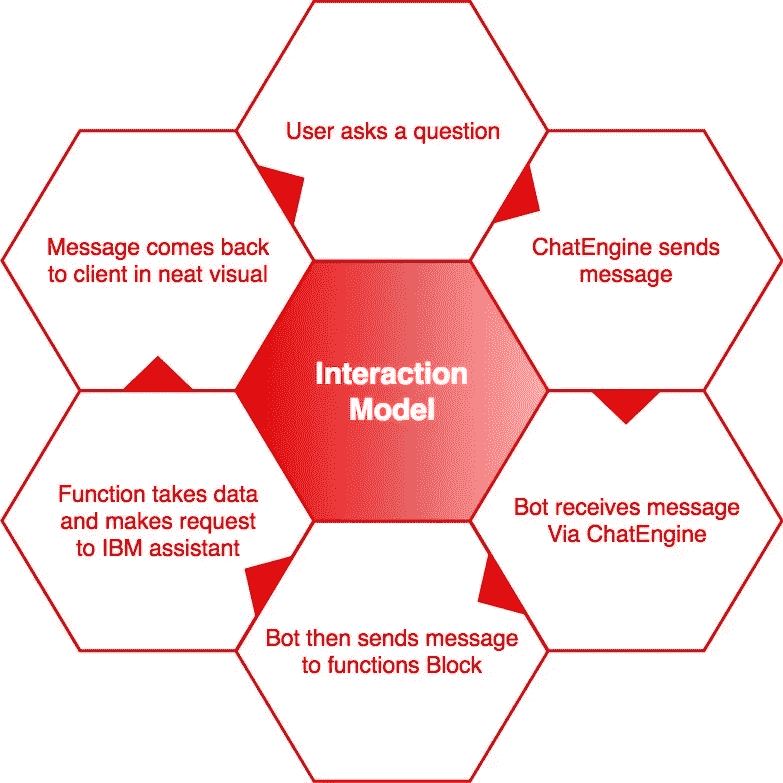
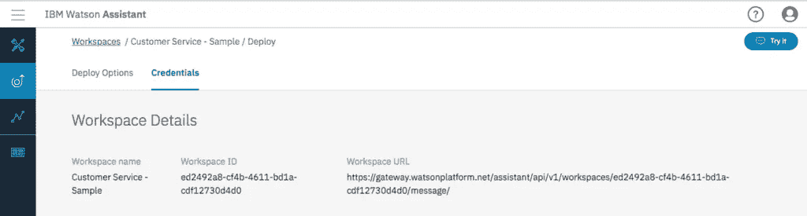
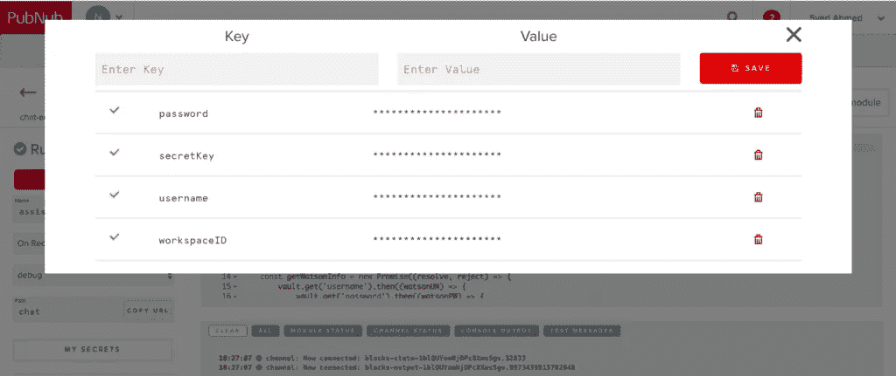
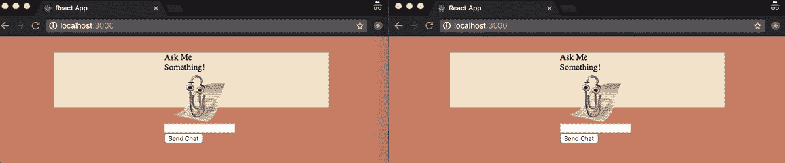

# 如何用 ChatEngine 和 IBM Watson Assistant 搭建智能聊天机器人助手

> 原文：<https://medium.com/hackernoon/how-to-build-a-smart-chatbot-assistant-with-chatengine-and-ibm-watson-assistant-ffe3f43436b8>

## Pubnub 与 IBM Watson 相结合，可以让开发人员和企业主通过创建智能助手来为您解答简单的问题，从而简化他们的工作。



聊天机器人，无论是客服人员还是网上商店的购物助理，都已经成为我们与企业互动的常见方式。智能机器人和助手是许多企业的前线，现在是建立解决问题的智能方法的最佳时机。

你可能想知道是否有可能创造一个你自己的智能助手。简单的回答是肯定的，这正是我们今天要通过聊天引擎和 [IBM 沃森助手](https://www.ibm.com/watson/services/conversation/)完成的。我们的机器人将回答那些希望了解更多关于 [PubNub](https://hackernoon.com/tagged/pubnub) 信息的人的基本问题，但是你的机器人可以按照你的意愿进行训练和定制。我们也将向您展示如何做到这一点。

这里有完整的 GitHub 回购项目。

你还需要注册 Pubnub！

# 它是如何工作的👩‍💻

在我们进入代码之前，让我们根据我们的用户将如何与我们的助手交互来绘制逻辑。



首先，用户通过聊天引擎提出一个问题，然后向我们的聊天助手发送一条消息。我们有两个 ChatEngine 连接的原因是为了确保我们的 bot 可以同时处理多个连接。在我们的具体案例中，我们将在同一个客户端上创建聊天机器人，但在理想情况下，让聊天机器人在单独的客户端上运行是一个好主意。

一旦机器人通过 ChatEngine 接收到消息，它就将消息发送给 [PubNub 函数](https://www.pubnub.com/products/functions/)。这背后的目标是减少我们拥有的后端代码量，只关注重要的事情——体验。函数是我们将消息传递应用程序连接到 IBM Watson Assistant 服务的方式。

在我们的 [BLOCKS 目录](https://www.pubnub.com/docs/blocks-catalog)中，有一个 [IBM Assistant BLOCK](https://www.pubnub.com/docs/blocks-catalog/pubnub-tutoring-bot) ，它需要一点配置，一旦配置完成，它将被连接到 IBM Watson。该函数将查询 Watson 并得到回复，然后将回复发送给我们的客户。

# ChatEngine 和 Watson 入门

## 配置聊天引擎🚒

为聊天机器人构建聊天界面和后端是一件既有挑战性又耗时的事情。我们将使用 ChatEngine 来缓解这一问题，这是一个基于 PubNub 的框架，使跨平台构建变得轻而易举。

首先必须在 PubNub 中配置一个新的 ChatEngine 应用程序。你可以在我们的 ChatEngine quickstart 中 [**做到这一点，它将为你提供你的 pub/sub 密钥以及为 ChatEngine 配置你的密钥集。**](https://www.pubnub.com/docs/tutorials/chatengine#step-one-pubnub-keys)

## 沃森+积木🍫

一旦我们配置了 ChatEngine，我们就可以开始构建我们的助手了。

首先，在我们的 ChatEngine 模块中创建一个新函数。我们可以将这个函数称为“assistant”，有一个“On Request”事件，并将我们的通道名设为“Assistant”。添加了新函数后，我们可以继续添加代码来连接到 IBM Assistant。

这实际上是在 [IBM Assistant 块](https://www.pubnub.com/docs/blocks-catalog/pubnub-tutoring-bot)中可用的代码的一个版本，但是稍微做了一些修改，以便我们可以使它适合我们的交互模型。特别是，如果我们看第 55-65 行，我们会发现我们处理回应的方式和从客户那里获取数据的方法已经改变。

你会注意到，在上面的函数代码中，我们使用保险库来访问我们的模块可用的某些密钥。我们需要在我们的金库中再添加三把钥匙，这三把钥匙可以在设置 Watson 时找到。

**沃森配置**🤸

前往沃森[领取钥匙。如果你还没有，请在你的 Bluemix 控制台](https://console.bluemix.net/registration/)上[设置一个 Watson 实例。您将看到，使用新的 Watson 资源，您将拥有一个用户名和密码。查看它们，并将其插入到我们刚刚创建的助手功能中的 vault 中。我们需要的下一个键是 workspaceID，我们可以转到 Bluemix 控制台中的启动工具并创建一个工作区。](https://console.bluemix.net/catalog/services/watson-assistant-formerly-conversation)

在这里，我们可以从头开始创建一个工作区，也可以使用一个示例。对于这个例子，让我们以客户服务为例。进入工作区后，我们可以打开侧面的汉堡菜单，进入“改善”选项卡。在页面顶部附近，我们应该会看到一个凭据按钮，单击该按钮可以获得我们的 workspaceID。



现在我们有了钥匙，我们的保险库应该是这样的。



此时，我们已经让应用程序的齿轮工作了。我们创建了一个结构，该结构将从我们的机器人接收消息，并将这些数据发送给我们的助手，还将我们的助手连接起来，以便这些消息可以得到有意义的响应。

让我们开始开发我们的客户端及其接口。

# 我，我的机器人，还有我🤖

从客户的角度来看，我们要做两件事。第一个是用户可以提交消息的输入，第二个是可以将数据发送给我们的函数的机器人。理想情况下，我们应该将这两个组件分开，但是为了简单起见，我们将它们都运行在同一个客户端上。

首先，让我们通过使用 create-react-app 工具创建一个基本的 React 项目。

```
$ npx create-react-app Watson-Assistan
```

如果你的 npm 版本低于 5.2，请随意使用`npm`而不是`npx`。两者之间的区别基于安装的范围以及命令是否是一次性的。如果你需要更多信息，请阅读 [npm 的博客](https://blog.npmjs.org/post/162869356040/introducing-npx-an-npm-package-runner)。

该文件夹现在应该已经设置好了，让我们导航到它。

```
cd Watson-Assistant/
```

太好了！我们的项目树应该看起来像这样。

```
|-- Watson-Assistant 
    |-- .gitignore 
    |-- README.md 
    |-- package-lock.json 
    |-- package.json 
    |-- public 
    |  |-- favicon.ico 
    |  |-- index.html 
    |  |-- manifest.json 
    |-- src 
    |-- App.css 
    |-- App.js 
    |-- App.test.js 
    |-- index.css 
    |-- index.js 
    |-- logo.svg 
    |-- registerServiceWorker.js
```

在这里，我们将拿出 create-react-app 工具为我们留下的一些样板文件。

我们可以干掉`logo.svg`和`registerServiceWorker.js`。除了清理我们的项目，没有什么特别的原因，但是如果你觉得你需要更多地了解为什么服务人员文件会在那里，看看主 GitHub repo 上的这个[问题](https://github.com/facebook/create-react-app/issues/2398)。

清理完我们的目录后，我们的结构应该像这样。

```
|-- Watson-Assistant 
    |-- .gitignore 
    |-- package-lock.json 
    |-- package.json 
    |-- public 
    |   |-- favicon.ico 
    |   |-- index.html 
    |   |-- manifest.json 
    |-- src 
    |-- index.css 
    |-- index.js
```

现在让我们来看看我们的大部分应用程序将要放置的文件:*[*index . js*](https://github.com/nxsyed/commun-ai/blob/master/src/index.js)。*

*我们将从生命周期和我们将在浏览器中呈现的内容开始。首先，确保我们的包中有 ChatEngine。*

```
*$ npm i chat-engine*
```

*在这一点上，我还建议在 GitHub 上查看我的 [package.json 文件。在这里，您可以完全跟随，而不会破坏您的代码。我会尽量确保我解释了我使用的每个包，这样你就能更好地理解每样东西是如何适应的。](https://github.com/nxsyed/commun-ai/blob/master/package.json)*

*现在我们有了包，让我们开始编码吧。*

*要创建我们的客户端，我们需要向我们的 ChatEngine 客户端提供我们之前制作的 ChatEngine 应用程序的密钥。在 [PubNub 管理仪表板](http://admin.pubnub.com/?utm_source=Syndication&utm_medium=Medium&utm_campaign=SYN-CY18-Q2-Medium-Jun-12)上选择我们的应用，然后选择我们的密钥集，我们就可以获得发布和订阅密钥。然后，我们可以像这样创建我们的客户机对象。*

```
*const ChatClient = ChatEngineCore.create({ 
    publishKey: 'pub-c-e1295433-4475-476d-9e37-4bdb84dacba0',    subscribeKey: 'sub-c-890a0b26-6451-11e8-90b6-8e3ee2a92f04'
},{ 
    globalChannel: 'watson-assistant' 
});*
```

*因为我们在同一个客户端上创建聊天客户端和聊天机器人，所以我们将复制它，但是将名称改为聊天机器人。*

*我们建立的每个连接都有一个用户名也很好，所以让我们为用户名创建一个模板，如下所示:*

```
*const now = new Date().getTime(); const username = ['user', now].join('-');*
```

*将我们的用户和聊天机器人连接到我们的聊天引擎。*

```
*ChatClient.connect(username, { signedOnTime: now }); ChatBot.connect(`${now}bot`, { signedOnTime: now });*
```

*创建我们的聊天类，看看不同的生命周期方法。*

*构造函数是一个很好的起点，在这里我们将为我们的聊天实例分配变量。我们也可以初始化所有我们想存储在状态中的变量。*

*就我个人而言，我想用这个[反应-剪辑包](https://www.npmjs.com/package/react-clippy)作为我们的助手。我们可以使用不同的动画角色来展示我们的信息并制作动画。对于 Clippy，我们需要一个可以播放的动画，所以我将在我的状态中定义它。我们还需要用户给出的输入和我们从函数中得到的响应。*

****注:此贴与微软无关，他们与此*** 无关*

*最后，我们的构造函数看起来像这样。*

```
*constructor() { super(); this.chat = new ChatClient.Chat(`${now}chat`); 
this.bot = new ChatBot.Chat(`${now}chat`); 
this.state = { 
    reply: 'Ask Me Something!', 
    chatInput: '', 
    animation: 'Congratulate' }; 
}*
```

*在进一步讨论之前，最好对 render 函数做进一步的阐述。我们知道我们将接受输入，所以我们需要某种输入框。同样，我们将显示一个响应，我将添加精彩的剪辑。*

```
*render() { 
   return ( 
     <div style={container}> 
       <div style={{height:100, width:100}}> 
          <p> {this.state.reply} </p>           <Clippy 
             actor={ 'Clippy' } 
             animation={ this.state.animation } />           <input 
             id = "chat-input" 
             type = "text" 
             name = "" 
             value = { this.state.chatInput } 
             onChange = { this.setChatInput } 
             onKeyPress = { this.handleKeyPress } />           <input 
             type = "button" 
             onClick = { this.sendChat } 
             value = "Send Chat" /> 
       </div> 
     </div> ); }*
```

*还有几个其他的函数来完成聊天类中的一些功能，比如按回车键来发送消息，但是我会让你自己去探索。我们现在要看的是发送消息部分。有两个功能，它们直接关系到我们项目的工作流程。*

```
*sendChat = () => { 
  if (this.state.chatInput) { 
    this.chat.emit('message', { 
      text: this.state.chatInput, 
      channel: `${now}chat` 
    }); 
    this.setState({ chatInput: '' }) 
    this.setState({ animation: 'Processing', reply: '' }); } 
} 
componentDidMount() { 
  this.bot.on('message', (payload) => {      axios.get(`https://pubsub.pubnub.com/v1/blocks/sub-key/sub-c-890a0b26-6451-11e8-90b6-8e3ee2a92f04/chat? question=${payload.data.text}`) .then(response => { this.setState({ animation: 'Writing', reply: response.data }); }); 
  }); 
}*
```

*sendChat 功能允许用户向机器人发送消息。请注意我们是如何发出信息的，我们是如何根据时间来定义通道的。这使得每次聊天都可以在自己的私人会话中进行，这样我们就不会打断其他客户可能正在进行的对话。*

**

*我们还需要确保我们的机器人监听传入的消息。因此，当聊天组件已经安装，我们需要确保我们的机器人发送消息给我们的功能，然后用消息更新我们的组件。为了完成这个请求，我使用了 axios 包，你可以在这里了解更多信息。*

*最后一步。我们需要确保一旦我们的 ChatEngine 连接建立，我们就呈现我们的聊天组件。我们可以通过将它添加到文件的底部来做到这一点。*

```
*ChatClient.on('$.ready', () => { 
   ChatBot.on('$.ready', () => { 
     ReactDOM.render( <Chat /> , document.getElementById('root') );     }); 
});*
```

# *我们的聊天机器人开始运行了！🏃‍*

*这是构建更独特的东西的一个很好的起点。探索 IBM Assistant 的文档来训练我们的机器人变得更聪明，并且在它们的响应中更有深度，这绝对是一个好主意。ChatEngine 可以做很多很酷的事情来与人和服务即时联系。我很想看看你接下来会做什么🙂。*

# *在 Twitter / Instagram 上关注我！@nxsyed*

**最初发表于*[T5【www.pubnub.com】](https://www.pubnub.com/blog/chatengine-chatbot-ibm-watson-assistant-tutorial/?utm_source=Syndication&utm_medium=Medium&utm_campaign=SYN-CY18-Q2-Medium-Jun-12)*。**