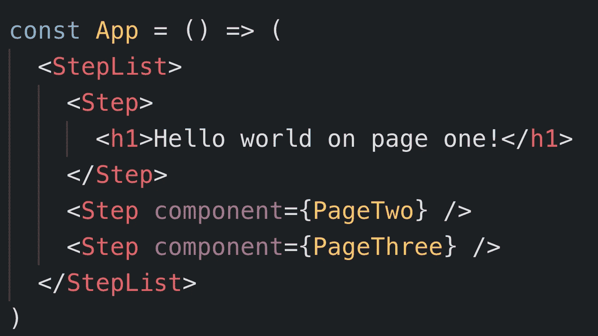

# 如何用复合组件构建步进器

> 原文：<https://medium.com/hackernoon/how-to-build-a-stepper-with-compound-components-6a49d90950ba>

## 在本文中，我们将通过逐步为不同的视图构建一个分档器来重新审视复合组件。

A Stepper component.

上一次关于构建复合组件，Steven 写了一篇文章来展示如何通过三个简单的步骤构建复合组件。他使用一个复杂的多步骤表单应用程序来演示这个概念。观众们有点困惑地回答。React 社区会理解构建复合组件有多容易吗？下次在构建复合组件时了解一下！

嗯……让我先说这个摘要是真的。对不起，我让你失望了。我告诉过你在 React 中构建复合组件会很容易。如果您阅读了我的上一篇文章，您会发现构建组件分三个步骤。这方面的任务已经完成，但是附带的多步表单示例有点难以理解。

在本文中，您将构建一个 Stepper 组件，用于创建多步视图。与前一篇文章一样，复合组件可以通过三个简单的步骤编写。第一步是绘制我们想要的 JSX 标记，如第 15 到 21 行所示。

现在您已经有了 JSX 模型结构，您需要确定您想要在组件中使用的道具类型。步骤组件将是接收道具的目标组件。下面列出了您想要的道具及其预期功能。

> isActive 确定步骤是否应处于活动状态
> 
> 显示上一个—控制“上一个”按钮的显示
> 
> 显示下一个—控制下一个按钮的显示
> 
> 显示提交—控制提交按钮的显示
> 
> goToPreviousStep 后退的步长函数
> 
> goToNextStep —前进的步进函数

有了这些组件，你可以从一页跳到下一页。您可以根据步骤列表中当前活动的步骤来控制何时显示按钮。您可以在下面看到如何设置您的步骤组件。

The Step component bundled with the display buttons.

我们的步骤组件已经准备好接收道具了。接下来，使用父组件步骤列表将所需的属性传递给它的子步骤组件。当你使用 React API 来传递属性时，你可以避免直接注释 JSX，这样可以让代码更简洁。最后，你得到了看起来像增强的 HTML。

The StepList component passing props to its child components, Step.

现在你有了它，一个由复合元件组成的步进器元件。现在，您可以在您的应用程序中创建多步流程。你可以[在这个代码沙箱](https://codesandbox.io/s/qxxo7690nj)找到一个工作演示。

这种高级 React 模式的好处是代码简洁。当您以这种方式将道具传递给子组件时，您将表示层从逻辑层中分离出来，从而允许您在许多项目中重用这些组件，而不必花费大量时间来解决特定项目的需求。

另一件要注意的事情是，对于任何软件模式，他们都是固执己见的。一些使用 React 的人可能会评论说这段代码很脆弱或者不灵活，因为你不能到处添加一个 **div** 。嗯，我说的没错，复合组件强制约束允许某些组件相互嵌套。但是你已经在其他语言中看到了这种强加的限制。

上次你使用一个 **ul** 标签时，你可能没有在 **li** 标签前加上一个 **div** 标签，这只是为了好玩。您不这样做的原因是因为您了解编写 web 标记的 HTML 规则。同样，当您使用复合组件模式时，为了编写干净、可重用的代码，会有一些限制。如果你不喜欢这个处方，就用最适合你需求的风格来编码…

与朋友分享这篇文章，让他们吸毒！

👋🏽嗨！我是史蒂文·纳特拉。在 Twitter 上关注我 [@StevenNatera](https://twitter.com/stevennatera) 。我积极参与了[开源社区](https://github.com/nodox)，特别是 [GatsbyJS](https://www.gatsbyjs.org/contributors/steven-natera) 。我喜欢写代码、初创公司、React 和 Kubernetes。