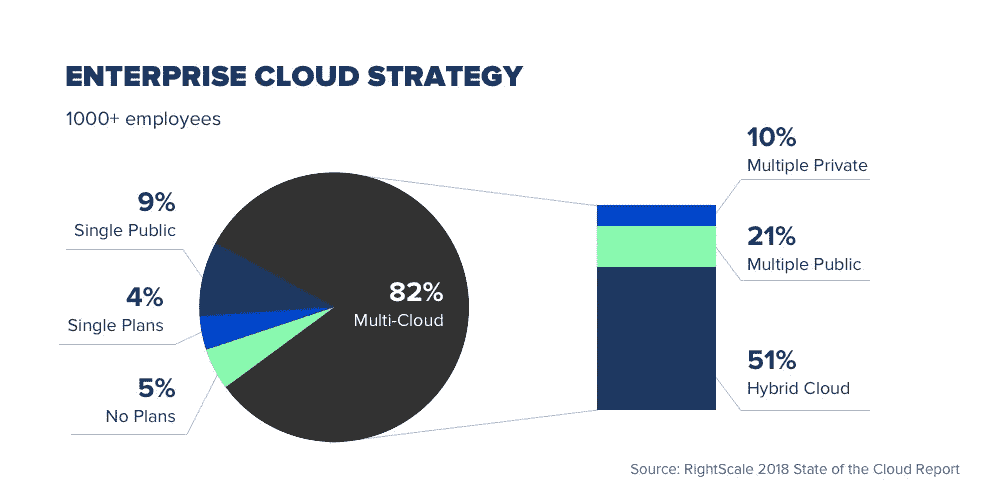

# 如何构建成功的云迁移策略

> 原文：<https://medium.com/hackernoon/how-to-build-a-successful-cloud-migration-strategy-9c383729b2ad>

处于采用云计算风口浪尖的企业需要获得正确的云迁移策略，以从云计算中获得所需的成本效益、性能提升和可扩展性。

现在，数百万企业正在将计算工作负载转移到云平台上。根据 Forrester 的数据，2018 年全球公共云市场总额将达到 1780 亿美元，高于 2017 年的 1460 亿美元，并将继续以 22%的复合年增长率增长(CAGR)。

虽然云计算已经[获得了不可阻挡的势头，l](https://www.forbes.com/sites/louiscolumbus/2017/11/07/forresters-10-cloud-computing-predictions-for-2018/#f0d56954ae18) et 回顾了构建成功的云迁移策略的最佳实践。

# 选择正确的部署模式

云计算并不总是意味着将所有的计算需求和数据转移到由第三方控制的服务器群。事实上，有几种选择，每种都有独特的优点:

*   **公有云**。作为最初也是最受欢迎的云模式，公共云需要利用第三方计算能力，与其他数百万甚至数百万用户共享。提供商完全控制计算资源，包括安全性。
*   **私有云**。与公共云一样，私有云也应用了同样的高效技术，如虚拟化，但只针对一个用户专用的平台。可以由第三方托管，也可以在内部托管。
*   **混合云**。一种中间方式，其中一些计算需求在公共云中执行，而其他更敏感的需求在私有的专用云环境中处理。
*   **多云**。避免供应商锁定的一种方法是，使用多个云供应商来完成您的计算任务。例如，它可能涉及将数据库工作负载分散到两个云供应商。多重云也可以用作混合部署，其中一些工作负载在内部管理。

您选择的部署模型将取决于您处理的数据类型。例如，选择公共云可能会导致处理高度敏感数据的问题。反过来，混合模式很有吸引力，但管理成本可能会很高，并且可能会更加关注现有基础架构适应云模式的能力。

最后，选择私有云可能会牺牲云计算提供的许多成本节约效率。重要的是，在决定供应商和实际迁移之前，您应该认真权衡每种部署模型的利弊。

# 正确迁移

您的企业可能熟悉技术迁移流程，但是迁移到云会带来独特的挑战。在您的企业开始迁移流程之前，必须应对这些挑战:

*   **战略与规划**。这可能意味着显而易见但详细的迁移规划至关重要。特别是大型企业，应该留出时间让内部流程适应云场景。首先迁移非关键应用程序，并确保在迁移失败时有备用备份。
*   **员工入职培训**。与现有的应用程序相比，您选择的云平台可能会带来显著的功能差异。培训你的员工，更重要的是激励你的员工对变革充满热情，同时对所涉及的时间和成本进行规划。
*   **连通性**。公共云应用需要可靠的互联网连接。在云计算的世界中，互联网停机实际上意味着业务停机，因此在迁移之前，请安排高带宽的冗余低延迟连接。

# 持续管理和维护计划

采用云的一大优势是减少了对内部技术管理的需求，而硬件和软件维护则被外包。这并没有让云计算成为一个一劳永逸的选择。您的云解决方案需要持续关注:

*   **计费和成本**。请注意，从资本支出模式转换到运营支出模式需要不同的预算方式和团队成本分配方式。避免供应商锁定:您需要自由转换供应商以保持成本效益。最大效率还需要在需求较低时相应地缩减容量，这是云计算独有的灵活性。
*   **治理和数据安全**。云是灵活的、可延展的工作空间，如果管理得当，可以极大地提高生产率，但也可能很快变得混乱。安装涵盖内部使用的治理措施和管理外部方访问您的公共云或私有云的条款的规则。
*   **更新和变更**。尤其是公共云平台，其功能和表现形式往往会频繁变化。这意味着持续的用户提醒、流程的调整以及检查集成是否有效。预算时间和资金来管理不断变化的云环境。

云计算之所以有吸引力，部分是因为它消除了许多关于充分利用技术的难题。但是云部署也需要管理，而且对于没有使用过云部署的企业来说，通常会有一些不熟悉的复杂性。

[联系我们](https://eleks.com/contact-us/?utm_source=medium&utm_medium=refferal&utm_campaign=Republ-Cloud-Migration-Blog)充分利用您的云计算之旅。

*原载于 2018 年 7 月 19 日*[*【eleks.com*](https://eleks.com/blog/build-successful-cloud-migration-strategy/?utm_source=medium&utm_medium=refferal&utm_campaign=Republ-Cloud-Migration-Blog)*。*