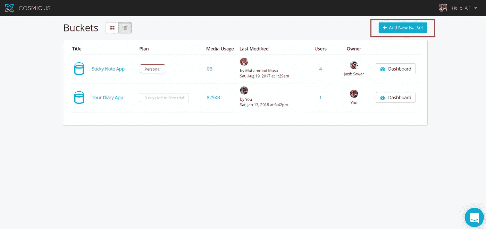
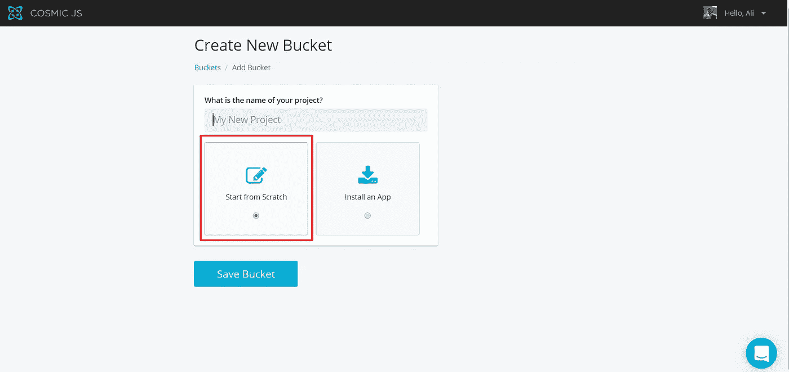
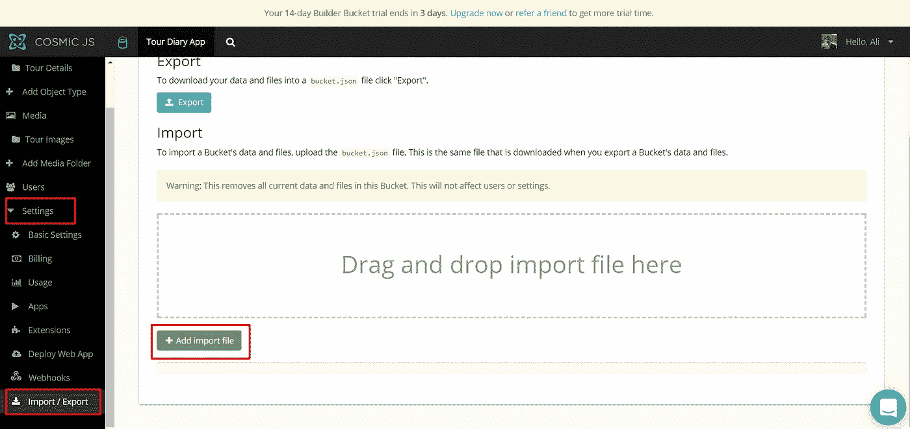

# 如何用 Next.js 和 Cosmic JS 搭建一个旅游日记 App

> 原文：<https://medium.com/hackernoon/how-to-build-a-tour-diary-app-using-next-js-and-cosmic-js-bd2daddb1fc5>


在本教程中，我将向大家展示如何使用 [Next](https://github.com/zeit/next.js/) 、Redux、 [Ant design](https://ant.design/docs/react/introduce) 和 [Cosmic JS](https://cosmicjs.com/) 创建一个旅游日记 app。它将涵盖使用 Cosmic JS 进行 CRUD 的所有可用选项。

# TL；速度三角形定位法(dead reckoning)

[下载 GitHub 回购。](https://github.com/cosmicjs/next.js-tour-diary)
[查看演示。](https://cosmicjs.com/apps/nextjs-tour-diary)

# 先决条件

在启动之前，您需要安装节点 JS 和 npm。确保您已经安装了它们。

# 开始使用:

首先，我们将在 Cosmic JS 中设置桶。

**设置桶:** 要创建桶，登录 [Cosmic JS](http://cosmicjs.com/) ，点击添加‘新桶’。



选择从头开始。



**导入桶数据:** 下载此 [bucket.json](https://github.com/cosmicjs/next.js-tour-diary/blob/master/bucket.json) 文件。并在设置- >导入/导出数据中，点击“添加导入文件”并选择下载的文件。它将导入所有对象类型和所需数据。



现在我们将致力于应用。

使用现有的 git repo 做任何事情

您需要在您的系统中安装 git，以便克隆存储库。完成后，通过终端或命令行运行以下命令:

```
git clone https://github.com/cosmicjs/next.js-tour-diary
cd next.js-tour-diary
npm install
npm run dev
```

**package.json** 会是这样的:

# 我们正在安装什么，为什么

1.  我们将使用**下一个**和 **Redux** 库来创建组件，并在**下一个**中管理状态。
2.  我们使用 **next-routes** 包在页面间导航。
3.  我们正在使用 **antd** 包来使用 react 组件创建漂亮的布局。我们使用 **babel-plugin-import，babel-plugin-inline-import，babel-plugin-transform-decorators-legacy**来集成 **ant design** 和下一个的**。**
4.  我们将使用 **cosmicjs** 库来处理我们对 cosmicjs 桶的请求。
5.  **react-draft-wysiwyg** 用于编辑器& **draft-js** ，**不可变，已经安装了 html-to-draftjs，draftjs-to-html，react-html-parser** 与其内容和状态交互。
6.  我们使用**反应-中等-图像-缩放**的图像缩放效果。
7.  我们使用**时刻**进行时间和日期操作。
8.  我们使用 **cross-env** 来设置环境变量，使用**babel-plugin-inline-dotenv**通过创建**来设置它们。我们项目中的 env** 文件。
9.  我们使用 **eslint** 和**eslint-config-rally codeing**中的一组预定义规则来编码林挺。
10.  我们使用 **react-cookies** 来管理我们的 **redux 存储**，因为它在页面重载中被破坏了。

# 构建我们的应用

一旦我们通过运行 npm install 安装完每个必需的包，让我们开始创建我们的应用程序。

让我们通过在**Tour/TourDetailModal . js**中创建一个文件并在其中添加以下代码来创建我们的 **TourDetailModal** 组件:

**TourDetailModal.js**

这是最初出现在宇宙 JS 上的文章[的缩略版。](https://cosmicjs.com/articles/how-to-build-a-tour-diary-app-using-next-js-and-cosmic-js-jci5wyod)

**结论** 所以，这是一个涵盖了所有使用 Cosmic JS npm 包的 Cosmic RESTful API 场景的应用(CRUD)。我希望你喜欢这个教程。如果您有任何问题，请[在 Twitter](https://twitter.com/cosmic_js) 上联系宇宙 JS，并加入 Slack 上的[宇宙 JS 社区。](https://cosmicjs.com/community)