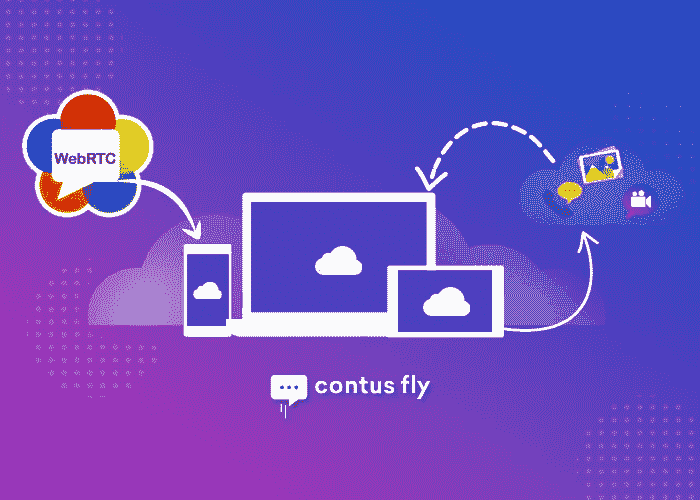
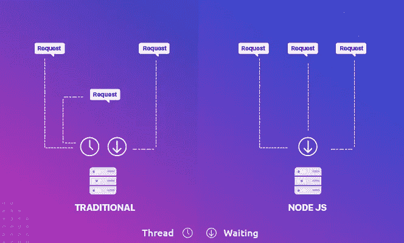
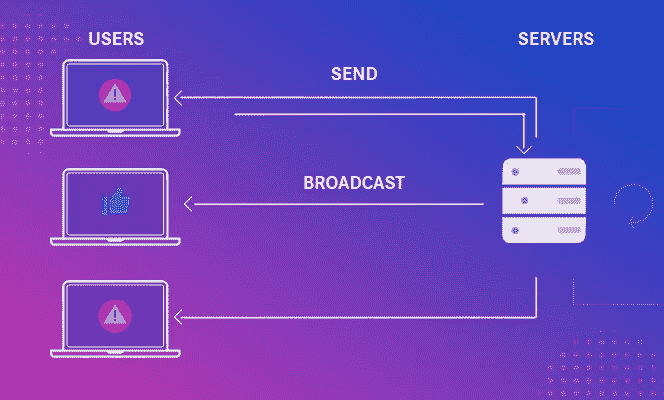
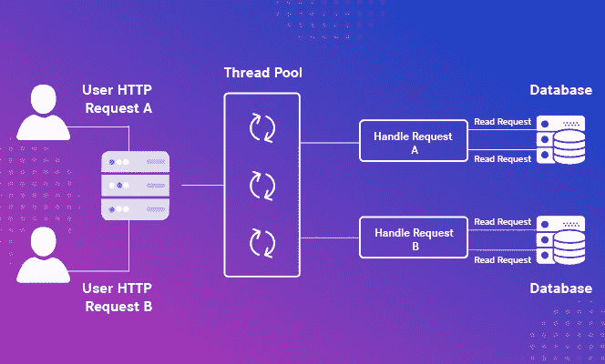
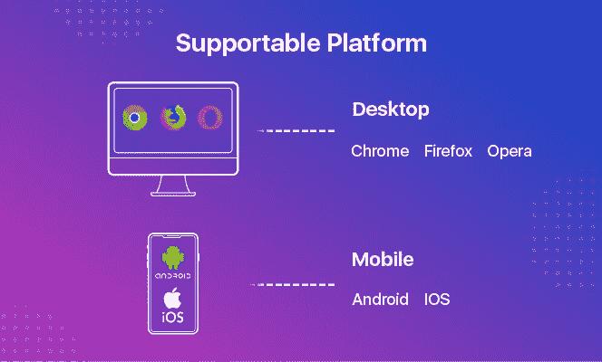

# 如何使用 Javascript/node.js 在 WebRTC 中搭建视频通话&语音聊天 App？

> 原文：<https://medium.com/hackernoon/how-to-build-a-video-call-voice-chat-app-in-webrtc-using-javascript-node-js-d256d434acbc>

Build Video Chat App in WebRTC

WebRTC 的持续发展使重要的对话变得简单，它完全放大了“企业”和“专业人士”的视频/音频通信。随着聊天功能拉动全球市场价值的同时，视频通信的重要性也变得越来越受追捧。实时通信技术是在浏览器之间交换任意数据而不需要中介的通用元素，它扮演着多重角色。该技术使 web 应用和移动应用能够直接流式传输对等音频/视频呼叫，而无需第三方集成。

> ***“根据透明市场研究，预计到 2025 年，WebRTC 市值将达到 815.2 亿美元。”***

毫不奇怪，在构建视频聊天应用程序方面，对 WebRTC 的需求仍然是一个永恒的市场，这在每种使用情况下都很方便。说到使用支持 WebRTC 的聊天应用程序的好处，WebRTC 视频聊天应用程序不仅仅是节省成本，它还在实时的基础上为世界提供了技术和架构上的好处。WebRTC 视频/语音聊天的主要行业用例是消费者网络、移动和社交、广播、教育、销售、内部和协作以及电信。

回到使用 JavaScript 构建 WebRTC Android、iOS 视频聊天应用程序的场景，它在 web 应用程序中发挥了强大而高效的作用，并实时检测缺陷。虽然使用了多种编程语言、数据库和操作系统，如 Linux 和 Firebase 中的 peer.js、node.js，来构建适用于 Android、iOS 和 Web 的 WebRTC 视频/语音聊天应用程序。Node.js 一直是创建 WebRTC 信令服务器的主要服务器端框架。让我们仔细看看将 JavaScript 推向其他语言的参数。

# ***在构建 WebRTC 视频/语音聊天 App 时，为什么选择 JavaScript (Node.js)作为核心语言而不是其他编程语言？***

将 Node.js 视为在服务器端运行 JavaScript 的核心框架，这当然会启动调用过程，也称为***【JavaScript Runtime build】***，这是在跨多个分布式设备运行的实时应用程序中数据密集型的完美模型。轻量级和高效的行为作为一个运行时环境在开发 WebRTC 视频通话移动应用程序的 Android，iOS & Web。某些参数诱使开发人员依赖 Node.js 来构建在多个平台上无缝运行的视频聊天应用程序。

Build Instant Voice/Video Call Using Contus Fly

***#1 实时网络应用:***

曾经底层的套接字和协议是开发人员真正的困惑，现在 node.js 提供的好处是以闪电般的速度构建实时 web 应用程序，如 WebRTC 语音/视频聊天应用程序，并阻止多用户实时应用程序。这种事件驱动的架构有潜力满足用 JavaScript 编写的服务器端和客户端绝对更快的同步。

WebRTC Signaling Server

***#2。并发请求同时:***

因为 Node.js 是一个兼容的服务器端框架，它可以被配备为服务器端代理，并提供*非阻塞 IO* ，可以同时管理大量的*连接*。该系统可以处理同时请求，其中您的 WebRTC 视频聊天应用程序不会在设备中提交过多的 RAM，并且传入的请求以更快的速度排队，并在比 Python 和 Ruby 等其他语言更快的会话中执行。

WebRTC voice chat server

***#3。理想社区友好:***

虽然 node.js 在整个企业中普及，但该社区也在迅速发展，以提供出色的模块，这些模块对于将视频通话集成到网站和移动应用程序中是绝对理想的。社区中有各种各样的模块可用，其中 ***Socket.io*** 用于管理两台服务器之间的持续通信，以即时提供实时更新。

除了构建 WebRTC 视频聊天应用程序之外的实际原因，选择将视频通话集成到网站/应用程序和视频通话集成提供商的一些第三方集成有可能创建最终在 Android/iOS 和 Web 上运行的无与伦比的视频聊天应用程序。

# ***Contus Fly——知名的 WebRTC 视频/语音集成提供商***

隆重推出 Contus Fly —一款面向 Android & iOS 的现成消息传递 SDK、 [**网站聊天 API**](https://www.contus.com/messaging-solutions.php?utm_source=Webrtc-API&utm_medium=InContentLink1&utm_campaign=Hackernoon)，在为网站提供视频通话 API 和面向 Android/iOS 的视频通话 SDK 方面拥有多年经验和声誉的 WebRTC 解决方案提供商，可持续执行(点对点连接)跨浏览器平台提供实时视频/语音聊天功能&。Contus Fly 提供将视频通话集成到您的网站/应用程序的完全一次性付款，这是一种无限制的使用基础，而其他提供商提供按成本使用。Contus Fly 使 WebRTC 信令流程的集成达到了极致，在任何平台上的定制都可以为您提供比以往任何时候都更强大的视频/语音通话聊天功能。

Add video conferencing to your website

## ***底线:***

因此，有多种编程语言可用于构建 WebRTC 视频聊天应用程序，但只有 JavaScript 等特定语言有能力提供用户期望的精确视频/语音聊天应用程序。在全球 WebRTC 信令市场上，Node.js 是构建支持 WebRTC 的视频聊天应用程序的理想选择，该应用程序可提供卓越的性能、创建 API、处理并发请求并要求可扩展性，以便在 Android、iOS 和 Web 上开发成功的 WebRTC 视频/语音聊天应用程序。