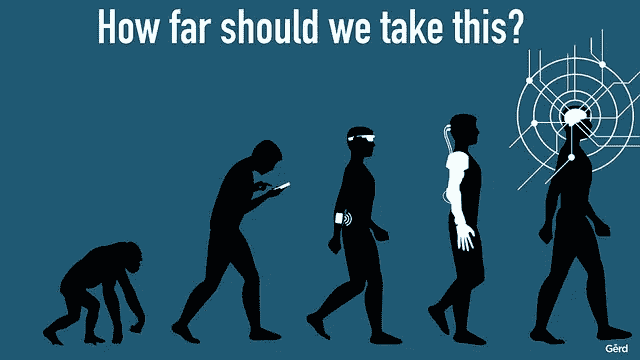

# 如何构建 AI 文化:走过启蒙的曲线

> 原文：<https://medium.com/hackernoon/how-to-build-ai-culture-go-through-the-curve-of-enlightenment-21c239c1d5a7>

© [Gerd Leonhard](https://www.flickr.com/photos/gleonhard/33661760430/)

# 向 90 年代学习

在 web 诞生之初，有一个写“代码”的“开发者”。这些代码将被构建，然后被扔给“操作”人员。他们——你知道，运营他们公司赚钱的网站。系统管理员、数据中心人员、数据库管理员(我忘了他们仍然存在——嗨，数据库管理员！).那里…