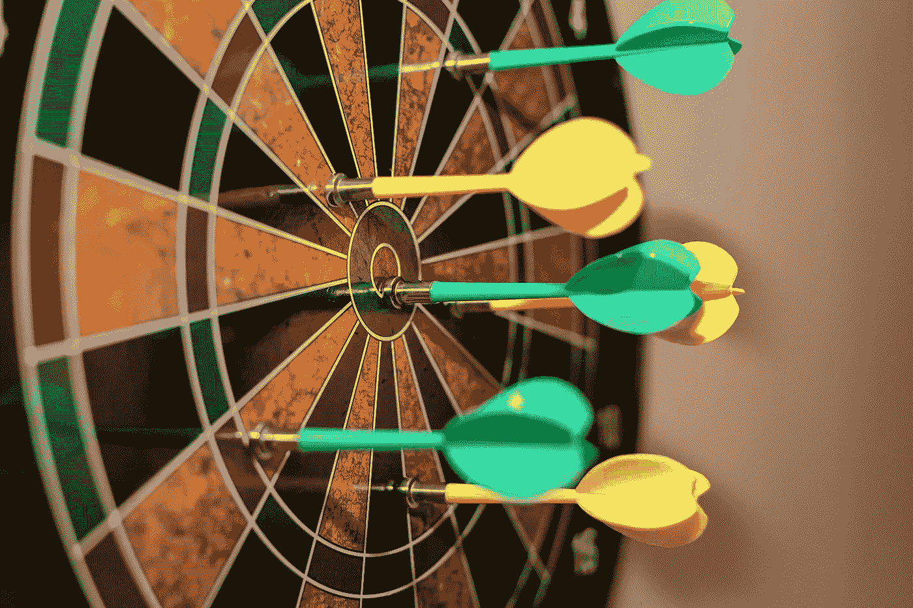
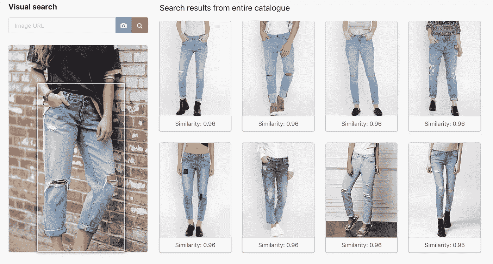
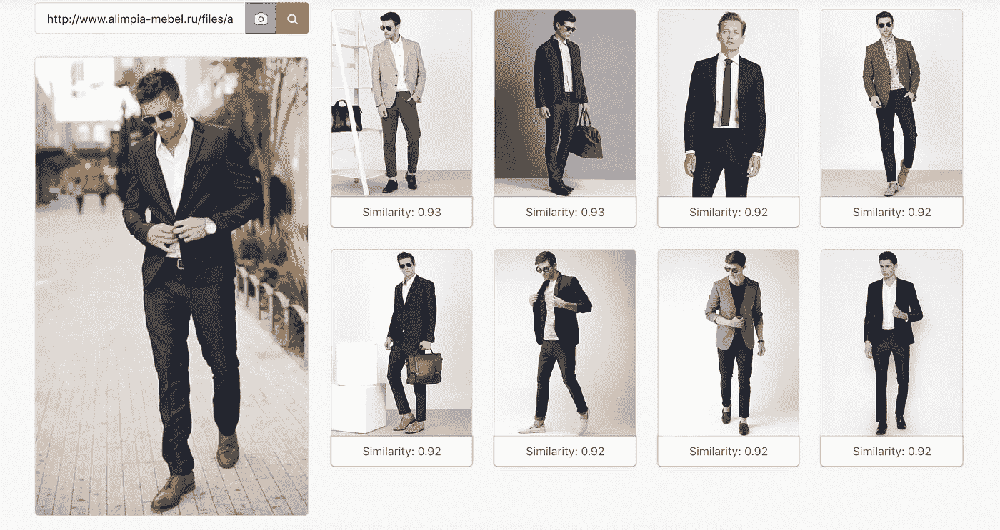
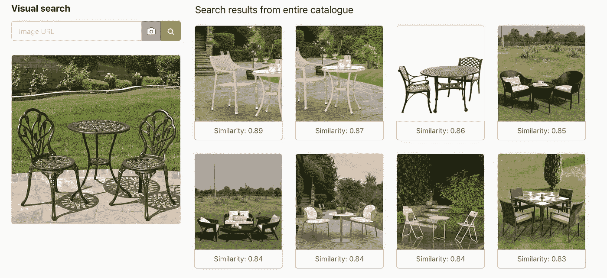
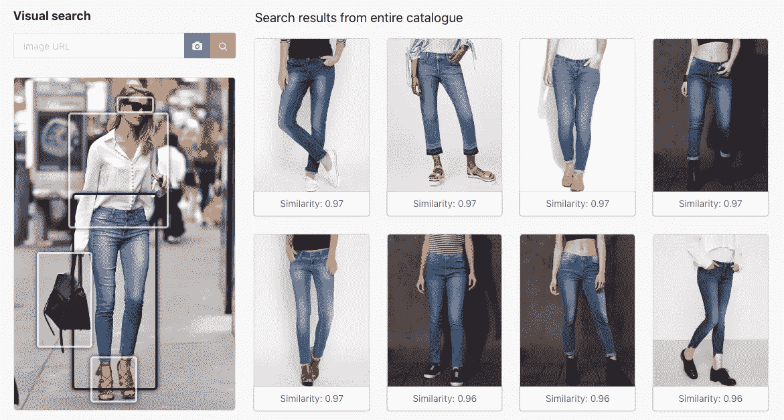

# 如何建立精确的视觉搜索

> 原文：<https://medium.com/hackernoon/how-to-build-an-accurate-visual-search-44e04a2830e8>

今天最流行的短语之一是“谷歌一下”。对我们所有人来说，网上搜索是一种自发的、无计划的活动。我们本能地在搜索引擎上搜寻，因为我们知道只要点击一个按钮，我们就会在几毫秒内得到压倒性的回应。

但是我们当中有多少人曾经停下来思考过谷歌是如何给我们提供我们想要的东西的呢？谷歌通过不断迭代和调整算法，完善了搜索和排名过程。他们每年都会有一到两次重大更新，这会对搜索结果产生重大影响。

“负鼠”是谷歌的一个重大更新。2016 年，谷歌确保结果取决于搜索者的位置，即你的结果将靠近你的位置。所以，如果你搜索一个药剂师，第一个结果会弹出一个离你最近的。在此更新之前，搜索结果可能是您所在地区的药剂师列表，排名第一的商店是搜索最多的商店。搜索结果的这种本地化使得查找附近的地方变得容易得多，而不必指定区域等。

除了这些主要的更新，我们都知道这样一个事实，你搜索得越多，结果的整体质量就会提高。搜索的质量本身就是一个光谱，也就是说，搜索结果没有好坏之分。你对一个话题搜索得越多，结果就会从“好”到“更好”再到“最好”。换句话说，搜索结果只会随着时间的推移而改善。

同样，视觉搜索与普通的文本搜索没有什么不同。视觉搜索引擎的每一次升级都会改善搜索结果；虽然阻碍视觉搜索结果的并不类似于文本搜索。

让我们看看目前为止我们已经克服的一些挑战-

# 子类别的深度

假设我们搜索牛仔裤，如下图所示。有许多不同的类型，如突然爆发，男朋友，苦恼等。视觉搜索引擎可能会发现。但是我们的搜索引擎只搜索那些喜欢的牛仔裤。牛仔裤的子类别是一个挑战，我们的视觉搜索引擎已经克服了这个挑战。他们训练神经[网络](https://hackernoon.com/tagged/network)为视觉搜索引擎提供多个文章子类。目前，我们支持在线销售的 1000 多个商品子类，如服装、配饰、家具和厨房用品。

Ability of a Visual Search engine to recognise various sub-categories of jeans

# 模特姿势

这是目前大多数视觉搜索引擎面临的最常见的挑战。如下所示，该查询是一个模特穿的西装，以某种方式摆姿势。针对这一点的图像搜索可能会返回与模特以相同方式摆姿势的图像而不是她们穿的衣服不太相关的结果。然而，我们用数百张不同姿势的图像来训练我们的神经网络，以确保它能够识别出不同姿势的衣服。因此，我们的结果如下图所示，是其他服装，而不是模特的姿势。像基于位置敏感散列算法的旧搜索算法不能实现这一点。

Ability of an image search engine to recognise a blazer in various pictures where the model poses differently

# 背景噪声

顾名思义，如果被搜索的图片有鲜明的背景，那么很有可能搜索结果只会带来匹配背景的图像，而不是想要的对象。下面我们可以看到不同背景图片的搜索结果，而不是正在搜索的庭院家具。我们已经训练我们的神经网络从图像中去除背景。这样，只在主对象上执行搜索。

An example where the search engine provided results with a strong bias on background instead of the object

# 多项查询

如图所示，您可以搜索整个房间的家具。在搜索多篇文章时，我们的搜索引擎可以让我们选择要搜索的文章，方法是用方框突出显示它们，或者使用自动裁剪功能，即通过自动裁剪照片中不需要的部分，让我们轻松选择感兴趣的对象。大多数其他现有的解决方案将具有如图所示的全部组合的结果，这些结果通常不是最相关的结果。

Example where Auto-crop helps Visual Search engine serve better results

# 颜色权重挑战

假设我们正在搜索一个带有花卉图案的黄色连衣裙的图像。我们实际预期的结果可能是一件带有相似花卉图案的红色连衣裙，但视觉搜索引擎返回给我们的却是更多的黄色连衣裙。当视觉搜索引擎将颜色检测从其他参数中分离出来时，这个挑战就被克服了。我们的结果不仅仅是基于颜色，还基于款式、袖长以及裙子的其他属性。因此，我们确保在搜索外观相似的产品时，颜色不是唯一的参数。

# 结论

对我们来说，克服这些障碍已经成为一项定期和有计划的活动。我们为每个子类别拍摄 10 张不同的图片，通过我们的视觉搜索引擎，检查结果是什么。参考我们之前的例子，我们将通过 10 种不同类型的牛仔裤，并测试结果会是什么。这确保了我们的搜索结果在我们支持的任何子类别中都没有上述偏见。

与谷歌类似，[图灵分析](https://www.turingiq.com/)也计划每三个月更新一次重大变化。在 2018 年 5 月的最后一个版本中，他们将支持的子类别数量增加了一倍。在此之前，2018 年 2 月，他们发布了自动裁剪功能，使他们能够克服一幅图像中多个项目的挑战。另一个重要的更新是在去年 12 月，他们将搜索响应时间减少了大约 80%。图灵分析的搜索引擎是一个革命性的软件，提高客户满意度。

既然你已经知道图灵分析的视觉搜索结果有多准确，为什么不试试我们在 VisualSearch.App/Demo[的演示呢](http://visualsearch.app/demo)