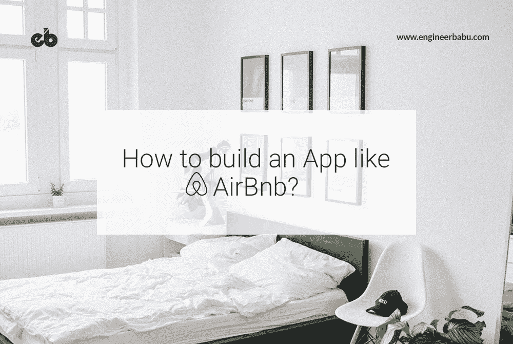
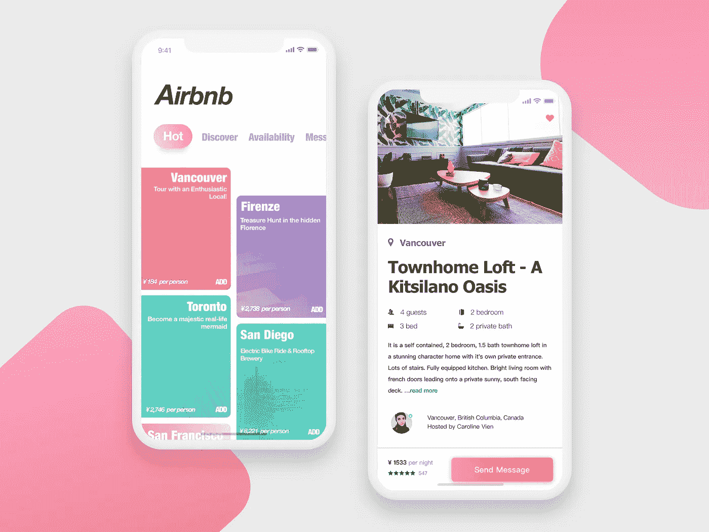
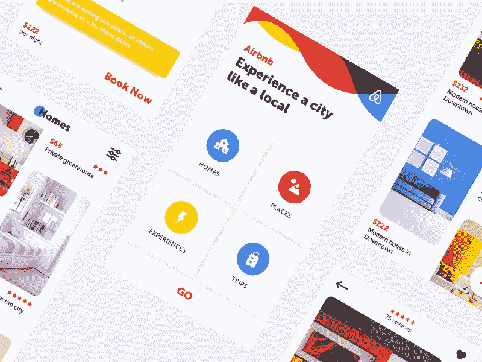
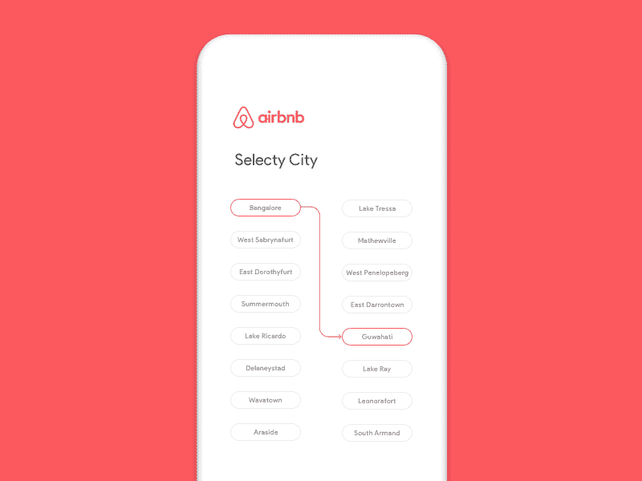
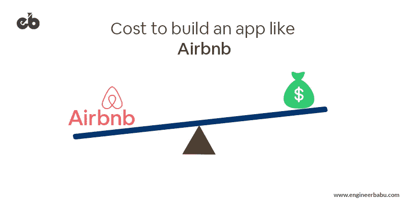
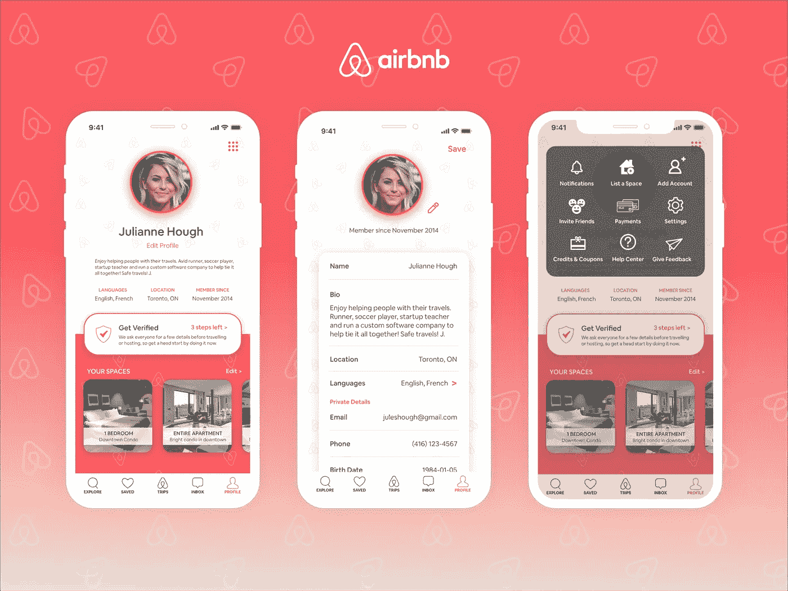
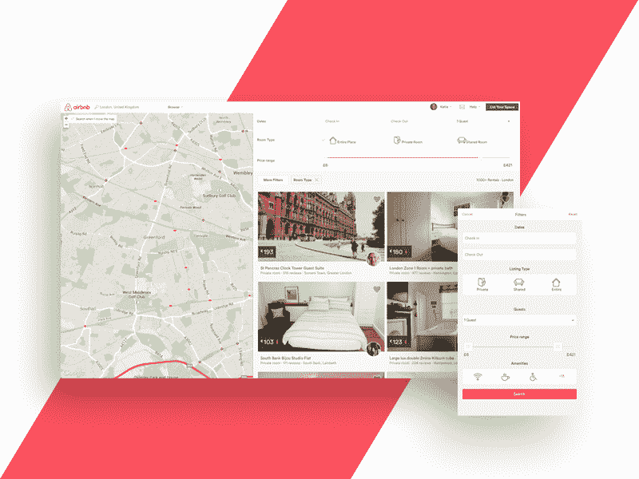
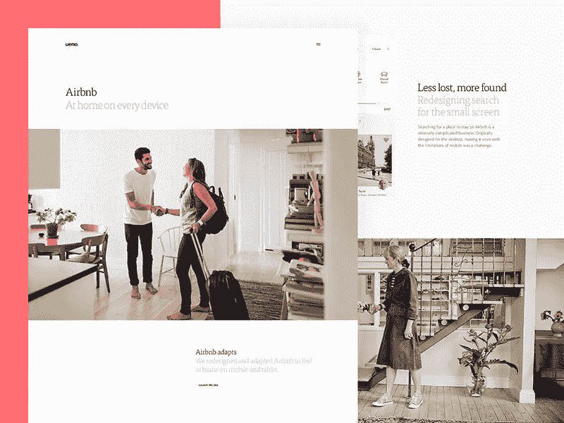

# 如何搭建一个像 Airbnb 这样的 app？

> 原文：<https://medium.com/hackernoon/how-to-build-an-app-like-airbnb-405f3c5872f9>

Image Source: Photo by Sonnie Hiles on Unsplash

当我们去一个新的地方旅行时，我们在寻找什么？我们期待一个新的激动人心的经历，但以最经济的价格。想象一下，你可以在一个平台上找到所有这些，这是你的另一个家。

Airbnb 是一个旅游应用程序，它为全世界的公寓租赁机会提供了一个平台。Airbnb 对房产所有者和寻求短期住宿的人来说是一个诱人的市场。Airbnb 改变了人们寻找公寓的方式。它为业主和游客提供了诱人的机会。这个数字平台为人们提供了一个互动的环境，也就是说，主人通过将自己的房产出租给寻找经济适用房的客人来获得收入。Airbnb 在全球 190 多个国家都可以使用。这是它很快就完全征服了全球市场的主要原因。

# Airbnb 商业模式画布

主要合伙人:

*   **主人**——拥有房屋或财产并想出租/承租的人。Airbnb 在每次预订时都会从房东那里收取佣金。
*   **客人** —想要以实惠的价格舒适入住的旅行者、度假家庭和/或公务人员。每次预订，他们都从客人那里收取佣金。
*   **自由摄影师**——Airbnb 在全球大多数城市都有自由摄影师网络。一旦主人在门户网站上列出他们的位置，这些摄影师就会被雇佣来拍摄高质量的酒店照片。他们直接从 Airbnb 门户网站获得报酬。

**目标受众**

*   需要一个简单实惠的地方的旅行者
*   商务旅行者
*   有家人的旅行者
*   寻求探索新地方的旅行者。
*   寻找额外收入的人可以主持赚取。

## 交货途径

*   网站(全球资讯网的主机站)
*   iOS 和 Android 平台上的移动应用程序
*   数字营销
*   社会化媒体
*   促销

## 费用结构

*   在线平台的维护
*   员工(Airbnb 有超过 2000 名员工)
*   像万事达卡、维萨卡和贝宝这样的在线支付平台
*   营销和促销活动
*   保险

**根据最新统计，该公司现在有:**

*   超过 1 亿用户
*   64 万台主机
*   大约 200 万个列表
*   每晚有 50 万客人通过 Airbnb 入住
*   前往 Airbnb 目的地的 100 亿英里旅行
*   Airbnb 积极参与 191 个国家和 65，000 个城市。
*   估计收入为 9 亿美元

Image Source: [Dribbble](https://cdn.dribbble.com/users/1968881/screenshots/4447446/attachments/1009488/3.png)

**Airbnb 等应用程序所需的功能**

# 客人/旅行者

*   **登录/注册** —用户应该使用他们预先注册的 id 登录或通过填写他们的详细信息(如姓名、号码等)创建一个新帐户。他们也可以通过电子邮件地址或社交媒体渠道登录。
*   **管理帐户** —编辑、管理和更新个人档案信息，如电子邮件 id、手机号码、出生日期、性别、永久地址等。帐户密码也可以更改。
*   **聊天和推送通知**——像其他任何消息应用一样，Airbnb 提供即时聊天通知。
*   **搜索过滤器** —用户可以通过过滤他们的旅行来寻找想要的住宿，如日期、房间类型、价格范围、所需设施等。
*   **主人互动** —用户甚至可以在预订住宿前通过信息与主人交流。他们也有接受或拒绝提议和创建新请求的自由。
*   **支付** —用户可以选择支付方式，并可以访问交易的收据和支付详情。他们还可以查看每个交易历史。他们也可以转换到想要的货币。
*   **创建愿望清单/保存** —由于高租金或无空房而错过一个地方。不要担心，你可以列出他们的意愿，如果租金下降，你会得到通知。
*   **预订** —也可以查看用户所做的预订。它可以是过去的烹饪或即将到来的烹饪。
*   **优惠券** —优惠券可以在结账时使用。这些优惠券可以通过推荐代码获得。
*   **地图** — Airbnb 通过地图简化预订流程。它们有助于在用户希望停留的区域周围展示租赁的位置。
*   **帮助** —用户可以查看常见问题部分，并在对预订有任何困惑或寻求任何预订或主机相关帮助时寻求帮助。
*   评级和评论——用户可以通过评级和评论来与主持人分享他们的体验。
*   **分享** —用户可以通过社交媒体账户邀请朋友下载应用。

Image Source: Dribbble — George Vasyagin

# 新增内容

还可以添加这些功能，使其更加突出。

*   **接收短信通知** —用户可以接收短信通知他们的预订和促销活动。
*   **补充**——在制作 Airbnb 这样的 app 的同时，更多的社交媒体渠道和支付方式可以与之融合。

# 主机应用程序

*   **登记** —主持人可以填写他们的详细信息，并通过列出他们的空置房产来进行登记。
*   **登录或注册** —主持人应该使用他们预先注册的 id 登录或通过填写他们的详细信息(如姓名、号码、地址等)创建一个新帐户。他们也可以通过电子邮件地址或社交媒体渠道登录。
*   **管理个人页面和档案信息** —编辑、管理和更新个人档案信息，如电子邮件 id、手机号码、地址等。帐户密码也可以更改。
*   **管理列表** —列表，即酒店的详细信息，如可用的便利设施和价格可以在此部分处理。需要时可以上传新图片。
*   **预订列表** —所有即将到来的预订都可以以日历视图的形式系统地查看。每月的每个日期都会显示预订情况。
*   **请求** —这是接受或拒绝用户共享空间请求的一段话。
*   **信息功能** —主人可以通过聊天功能与客人自由交流。他们甚至可以在预订或确认住宿之前回复客人的所有询问。创建并向客人发送新请求。
*   **评定和评估游客** —可以根据每位游客的行为举止对其进行评定和评估。
*   **账户详情** —这有助于添加或删除账户中的信息。
*   **帮助** —客人可以查看常见问题解答部分，并在对其酒店列表有任何困惑或寻求任何预订或客人相关帮助时寻求帮助。
*   **分享** —主持人可以通过社交媒体账户邀请朋友下载应用程序。
*   **预订历史** —所有以前的预订和收到的付款都可以在这里找到。此外，可以估计产生的收入。

# 管理面板

*   **仪表板** —查看所有注册用户(新老)、主持人(新老)和摄影师的管理仪表板。
*   **管理新列表** —所有上传的新列表都经过仔细检查和进一步处理。根据需要，管理面板提供编辑、添加或删除列表的自由。
*   **预订历史** —所有以前的和新的预订都可以在这里查看。每个预订的当前状态也有更新。这些也可以编辑、更新或删除。
*   **反馈和投诉** —所有客人和主人提供的反馈都可以在这里查看。任何关于主人或客人的投诉都可以在这里处理。
*   **洞见** —之前和现在活动的所有细节都可以在这里观察到。这些详细的见解有助于未来的决策。

# 构建像 Airbnb 这样的应用程序所需的技术

Image Source: [Dribbble](https://cdn.dribbble.com/users/997070/screenshots/3104581/airbnb43.gif)

**编程语言** — Ruby、JavaScript、HTML5、CSS3
**应用框架**—Ruby on Rails
**JavaScript 框架** — React.js
**自动化框架** — RSpec、Capybara、PhantomJS
**SQL 数据存储** — PostgreSQL
**全球支付** — Braintree
**消息传递【t33**

# 了解主要竞争对手

随着 Airbnb 越来越受欢迎，还有几家公司提供短期房屋租赁平台。我们已经涵盖了最突出的，像 Airbnb 托管平台。看看这些替代品吧！

# [Homeaway](https://www.homeaway.co.in/)

Homeaway 在全球有 100 多万份清单，在 190 个国家有业务。它被认为是 Airbnb 的主要竞争对手，因为它提供 Airbnb 提供的所有服务，也有自己的保险计划。它归 Expedia 所有，运营着 VRBO、TravelMob 和 VacationRentals 等地区性网站。它有许多高档商品。

# [FlipKey](https://www.flipkey.com/)

Flipkey 是猫途鹰经营的一家大公司。它有大量的用户和最高质量的网站员工人工验证程序。这个被称为“度假租赁市场”的市场一直在扩张，在大约 160 个国家拥有近 300，000 处房产。它不提供共享房间，但有独特的属性过滤器，如狗友好，孩子友好，或海滨财产。

# Roomorama

这家总部位于新加坡的度假租赁公司可能没有 Airbnb 那么大，但在全球范围内提供约 80，000 处房产。他们所有的公寓和住宅都可以立即预订。他们主要关注安全性，并声称他们所有的主机都是 100%经过验证的。客人可以利用当地的交易和额外津贴，这还不是 Airbnb 的特色。

# 建一个 Airbnb 这样的 app 要多少钱

分析像 Airbnb 这样的移动应用程序的[开发成本](https://www.engineerbabu.com/blog/mobile-application-cost/)是一项任务。应用程序的整个设计根据所需的规格分为几个部分。像 Airbnb 这样受欢迎的应用程序的开发成本取决于以下因素:

Image Source: [EngineerBabu](https://www.engineerbabu.com/)

团队的规模
如果团队规模小且功能齐全，流程就能顺利进行。比方说，项目经理处理的不仅仅是他份内的事情。另外，除了设计师和开发人员，团队中还需要更多的人，比如项目经理、系统管理员、质量保证员。

**应用程序的平台数量** 开发像 Airbnb 这样的应用程序的成本会因平台不同而有所波动。iOS 和 Android 都需要不同的应用屏幕来调整应用。所有这些都是根据目标受众、设备环境等决定的。此外，android 应用程序开发需要的时间比 iOS 多一点，因为它需要测试更多的设备。

**应用程序的特性和功能** 开发中的另一个重要因素是用户希望整合的特性和功能。基本特征，如过去的预订历史、评论和评级、东道主的数据、东道主和旅行者之间的交流等。占用大量空间并导致多余电荷。

**应用程序的设计** Airbnb 作为一个大应用程序，必须看起来很好，才能吸引全球市场的客户。它应该在观众的脑海中留下长久的印象，以吸引他们进行预订。该应用程序应该易于使用，设计必须引人入胜。设计的另一个方面是它是标准的还是定制的。可以添加新的、独特的视觉效果来代替刻板的背景。新设计肯定会拍出开发价。

**开发者** 最关键的一点是，你去哪里找开发者。开发商的地点或位置是决定因素之一。此外，成本将根据开发人员的经验和他/她的专业知识而有所不同。

**应用内购买和任何其他特殊功能。** 您希望添加的任何技术复杂性，无论是简单、中等还是高，都会影响成本计算。不同的功能，如地理定位、数据同步、预约日历、应用内呼叫等。肯定会提高你的预算。

以上只是对可能影响开发成本的因素的基本分析。为了确定应用程序的定价，将根据创建每个功能所需的大致时间来计算估计的开发成本。开发时间以小时计算，每小时的费率因公司而异。每个公司都有自己的每小时费率。根据全球标准，我正在考虑每小时 30 美元的平均开发价格。现在让我们假设我们正在为 iOS 平台开发一个应用程序。

## 1.团队

最小团队将包括:

*   1 名用户界面设计师
*   1 名 iOS 开发人员
*   1 名后端开发人员
*   1 名项目经理
*   1 名质量保证工程师

**应用架构**

Image Source: Dribbble — Sarah Chudawala

接下来，我们确定应用程序架构。每个项目都从最初的行动步骤开始。我们可以根据整体应用资源、模块和使用的技术基础，通过将应用分成不同的组件来计算每步的时间。

*   20 小时—项目准备
*   20-25 小时— REST API 实施
*   10 小时—数据库模型
*   10 -15 小时—服务和库的实施

**开发工作评估**

**注册/登录功能** —基本步骤是注册，以便用户能够访问应用程序。要开始使用应用程序，除了其他基本细节之外，还需要寻求用户对条件和政策的同意。这大约需要 10 到 12 个小时。

## 2.用户概要

用户配置文件将有两种，客人和主人(地方的所有者)。两个人都必须通过填写个人信息来创建个人资料，比如-

*   名字
*   性别
*   电子邮件地址
*   出生日期
*   电话号码
*   永久居住地址
*   个人描述

## 3.过滤

主机和用户都可以使用列表和搜索过滤器。主持人可以添加房屋类型、房间类型、住宿细节、照片、价格等信息。如果用户正在寻找一个住宿的地方，他们将需要房屋的详细信息，如位置、入住和退房日期、房屋类型和大小、便利设施、主人语言、房屋照片、价格范围等。由于这项功能非常庞大，开发人员可能需要 24 小时来构建它。

Image Source: [Dribbble](https://cdn.dribbble.com/users/40433/screenshots/2363692/open-uri20151120-3-33aeqh)

## 4.住宿描述

经过筛选后，各种各样的搜索结果将会弹出，其中有各种选项和对您希望入住的房间的描述。变量如下-

*   照片
*   带有位置的地图
*   住处
*   主机配置文件
*   提供便利设施
*   评级
*   复习
*   价格
*   条件
*   可用日期

## 5.地图

地图允许用户自由地搜索一个完美的位置，检查地图上的各种地点，并找到一个住的地方。地图定位有助于查看位置附近的路线、社区和便利设施。所有这些都有助于选择理想的住宿地点。

## 6.设置

用户可以在此功能下定制和配置他们的偏好。设置菜单允许您控制以下功能-

*   推送通知
*   短信通知
*   特定区域租赁方案的更新
*   与主持人的对话(消息)
*   愿望清单
*   支付方式和货币

## 7.邀请朋友

用户可以很容易地邀请朋友下载应用程序并加入其中。

## 8.添加到收藏夹

这是一个基本功能，用户可以通过它将某些结果添加到书签中，并在以后查看它们。

## 9.翻译特征

这个功能帮助用户将房间的描述翻译成他们喜欢的语言。它是通过谷歌翻译启用的，文本被发送到谷歌翻译并翻译成选定的语言。

## 10.引导特征

这种个性化功能显示所选位置周围的地点和社区。它显示了周围可以参观的地点。

## 11.财产清单

一旦你注册成为主持人，你需要填写所有必需的细节，应用程序会告诉你你的房子/公寓/房间的大概租金。

## 12.后端

应用程序的服务器端部分非常重要，因为该产品需要时间从客户端和服务器端进行配置。客户端是它与用户进行虚拟交互的方式，而服务器端包括其功能、服务器连接等。后端是整个过程中最耗时的部分。

# 那么，我们的总数是多少？

Image Source: Dribbble — Ueno.

在处理完所有的特性和模块之后，我们已经对开发成本进行了估算。每台的总成本为 28140-30840 美元。考虑到每小时 30 美元作为计算成本的平均费率，这大约是 29000-31000 美元。然而，这取决于移动应用程序开发公司和他们使用的技术。此外，每小时的费用因国家而异。

在查看了开发的所有方面和阶段后，我们可能会说构建一个应用程序并不是一项简单快捷的任务。然而，如果所有的东西都以适当的方式排列，不仅会超级成功，而且非常实惠。如果你对建设一个像 Airbnb 这样的应用程序的成本有疑问，请在这里告诉我们你的确切要求，我们会让你知道估计。

EngineerBabu 作为一家经验丰富的应用开发公司，Airbnb 类的应用现在对我们来说只是小菜一碟。

如果您希望雇用我们的专家团队，我们只是一个电话！

我们的客户极具创新精神，我们尊重他们为我们提出的创新挑战。请抽出一些时间，通过我们的案例研究，了解我们应对各种技术挑战的创造性解决方案。

你听到我们的客户对我们的评价了吗？通过与我们一起阅读客户的工作经验来更好地了解我们。

这是我们为全球客户开发的创新移动应用的完整库。随时要求演示，我们会帮助你。

我们非常乐意成为您的应用开发合作伙伴。请详细询问您的需求，我们的团队将尽快与您联系，进一步讨论开发事宜。

从“是”到“否”的范围来看，您认为本指南有多大帮助？请在下面的评论区分享你的观点，我们会感谢你的努力。

我们错过了一两个方面吗？我们很想扩大我们的知识面。

> 原载于 [**EngineerBabu 博客**](https://www.engineerbabu.com/blog/) 。

— — — — — — — — — — — — — — — — — — — — — — — — — —

## 看我的其他相关文章

**1。** [**如何打造一个像优步一样的 app？**](https://www.engineerbabu.com/blog/how-to-build-an-app-like-uber/) **亦作** [**亦作**](https://hackernoon.com/how-to-build-an-app-like-uber-f93a24fa9a5a)
**2。** [**如何搭建一个 Zomato 这样的订餐 App？**](https://www.engineerbabu.com/blog/how-to-build-app-like-zomato/) **，亦作于** ****3。** [**如何打造像 Instagram 这样的手机 App？**](https://www.engineerbabu.com/blog/how-to-build-a-mobile-app-like-instagram/) **，也上** ****4。** [**如何打造一个电子商务 App:创业者指南**](https://www.engineerbabu.com/blog/how-to-build-an-ecommerce-app/) **，也上**[**hacker noon**](https://hackernoon.com/how-to-build-an-ecommerce-app-feeea1c10808) **5。** [**如何搭建一个交友 App？**](https://www.engineerbabu.com/blog/love-online-building-a-dating-app/) **，也上******

> *******我是 Mayank，*[*engineer Babu*](https://www.engineerbabu.com/)*的联合创始人。随时联系我*[*LinkedIn*](https://www.linkedin.com/in/mayankpratap/)*| mayank@engineerbabu.com(关于 EngineerBabu —* [*中*](https://hackernoon.com/how-mayank-pratap-built-engineerbabu-a-profitable-it-service-company-generating-more-than-50-000-per-month-bcd3006bdbb5) *)。*******

******此外, [EngineerBabu](https://www.engineerbabu.com/) 通过构建高级 IT 解决方案，帮助初创公司、企业和所有者发展业务。他们开发的项目 95%都按时完成了。 [30+由风投](https://www.engineerbabu.com/casestudies)资助，获得最具创新总理设计奖，入选 Y-Combinator 2016 & 2017。******