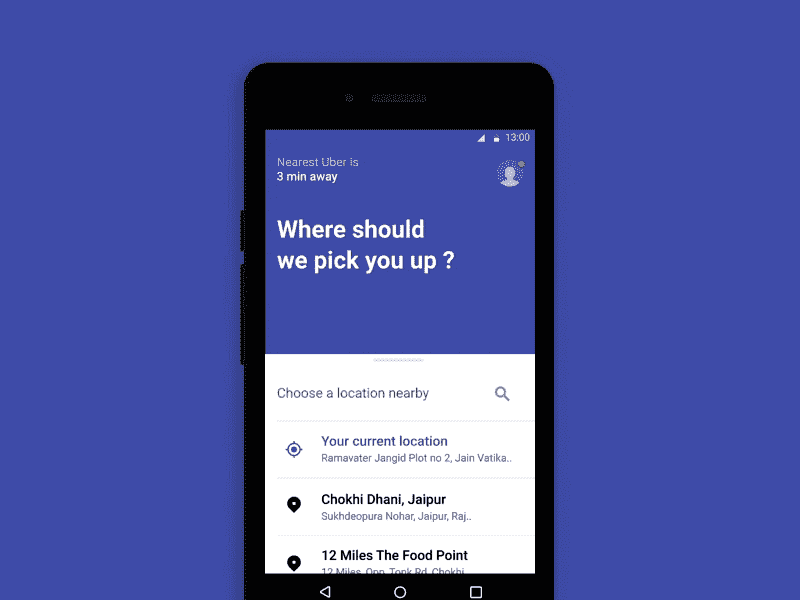

# 如何建立一个像优步一样的应用程序？

> 原文：<https://medium.com/hackernoon/how-to-build-an-app-like-uber-f93a24fa9a5a>

## 在开发像优步这样的移动应用程序之前，每一个有抱负的点播企业都应该知道些什么！

[Image Source](https://www.engineerbabu.com/)

出租车服务曾经是一种特权，[优步](https://www.uber.com/)通过让出租车变得实惠，让出租车成为一种需求。优步不仅扰乱了传统的出租车服务，还阻碍了人们开展业务的方式。

如今，优步的按需服务模式可以应用于几乎所有的行业和领域。毫不夸张地说，对随需应变解决方案的需求与日俱增。人们优化他们的想象力，用一个随需应变的解决方案概念化一个相当不可预见的利基。

优步用一款 iOS 应用开始了它的颠覆。最初，优步只能为顾客预订游乐设施。随着时间的推移，优步推出了豪华出租车服务的优步黑色。

优步·布莱克允许用户从各种豪华车中根据自己的喜好选择骑行。然而，它只是设法取悦上层阶级，优步有办法吸引社会的所有部分。

UberX 承诺收取合理费用，并成为大多数人的默认打车服务。但优步有更多的计划来提升客户体验，这就是 UberPool 的形式。

在探索了取悦客户的所有方法后，它正计划借助 UberCopter 实现飞跃！

# 是什么让优步克隆产业的崛起如此明显？

Uber — [Image Source](https://dribbble.com/shots/3640900-Uber-Brand-Evolution-Locations)

随需应变商业模式的基础是需求的增加和满足需求的供应计划。

然而，规划“优步式”应用程序开发的正确方法是:

*   用一种原始的方法潜入这个行业。
*   构建一个可持续的模型，以移动应用的形式为服务提供商和客户聚集需求。
*   用分布式供应链管理满足客户的这种需求。
*   留住你的客户。

但是优步与其他出租车服务有什么不同呢？

优步的深思熟虑的特点！

# 为你的类似优步的移动应用——优步方式——规划功能

Features of Uber-like Mobile App — [Image Source](https://dribbble.com/shots/4730676-Uber-Lite)

没有多少未来的优步企业知道优步基本上是由三个移动应用组成的:

*   管理应用程序
*   驱动程序
*   客户应用程序

每个利益相关者都有自己的一套特征。为了便于您理解这些特性，我将它们分为不同的类别:

*   最可行的功能
*   高级功能

让我们先来看看这家市值 10 亿美元的打车公司优步的特点。

# 客户应用程序功能:

Customer App Features

## 追踪一辆车

优步为其乘客提供了在他们预订了他们的旅程之后跟踪他们的旅程的选项。发生的情况是，在乘客进入上下车地点后，司机接受乘车请求并接近上下车地点。

为了了解司机离该位置有多远，乘客可以通过应用程序中集成的地图来跟踪他们。

## 票价估算

乘客能够基于他们的上车和下车位置来为他们的乘坐绘制费用估计。

票价也根据所选择的交通工具而变化。当乘客在他的上车地点和下车地点之间的多个目的地停留时，在强大的优步算法的帮助下，它会在旅程结束时计算出来。

## 多种支付方式

为了使打车生态系统对客户更加友好，优步提供了多种支付模式供选择。

乘客可以选择任何类型的支付方式，例如信用卡、借记卡、现金、手机钱包等。

## 跟踪服务历史

对于每天通勤的乘客，优步有一个称为轨道服务历史的功能。在服务历史的帮助下，乘客可以获得特定时间段内的乘车细节。

乘客可以查看任何日期，并且整个服务历史细节将以报告的形式提供给他们。

## 现在预订，以后再骑

现在预订以后乘车是优步的一项高级功能。它允许乘客在实际乘坐时间之前安排他们的乘坐。

一旦完成，乘客就会得到确认。乘客可以在预定行程前一小时获得司机的详细信息，并可以跟踪行程。

## 为他人预订

与现在预订稍后乘坐类似，为他人预订是乘客应用程序的高级功能。乘客可以用自己的账户为他们的朋友和家人预定旅程。

预订完成后，乘客可以获得所有的乘车细节，并会有一条短信发送给乘客。这里，跟踪也可以通过使用 SMS 中存在的链接来完成。

## 智能钱包

Smart Wallets Gif — [Image Source](https://dribbble.com/shots/4749533-Add-Card-interaction)

优步向乘客提供智能钱包来支付车费。乘客将这些智能钱包与他们的银行账户相结合，并转移一定数量的资金。

乘客可以使用手机钱包直接付款。

## 紧急按钮

为了确保乘客的安全，优步采取了紧急按钮的形式。一旦乘客登机，乘客的手机应用程序中就会启用紧急按钮。

当乘客感到受到威胁或感觉到危险时，他们可以按下紧急按钮。这将向最近的警察局、优步当局和乘客家属发出通知。

## 最喜欢的目的地

最喜爱的目的地是乘客应用程序的高级功能。当乘客必须日复一日地前往相同的目的地时，他们只需输入一次目的地，然后点击一下就可以选择。

乘客可以为他们的家、办公室、餐馆等保存目的地。

## 拆分费用

这是乘客应用程序的一项高级功能。当乘客与他们的朋友一起旅行时，他们可以分摊车费，并根据乘车费用和每位乘客的上车和下车地点单独付款。

他们可以分摊车费，如果他们使用了移动钱包，车费会自动从钱包中扣除。

# 驱动程序功能:

Driver App Features — [Image Source](https://dribbble.com/shots/3418325-Beacon)

## 驱动程序交付报告

为了确保乘客和司机的安全，优步有一个司机交货报告功能。该报告是驾驶员在整个一周、一个月等期间的驾驶风格的总结。如果司机继续鲁莽驾驶，优步甚至可以取消该司机的服务。

另一方面，如果一个司机驾驶顺畅，他就成了优步新手司机的教练。

## 路线优化:

路线优化有助于驾驶员选择最有效的路线，以便他们能够以最快的时间到达目的地。驾驶员可以利用路线优化功能，改变整个旅程的路线，并有效地导航到该路径。

## 驱动程序目的地:

驾驶员目的地是优步驾驶员移动应用程序中的一项高级功能。司机可以选择搭车去他喜欢的目的地。当司机想要赚钱并且必须到达目的地时，他们可以使用该功能。

## 任务收入:

探索赚钱是优步司机应用的一个功能。它帮助司机赚取额外的钱。这项任务带有一个预定义的次数，车手必须完成这些次数才能获胜并获得额外的奖励。

## 更短的 2 分钟取消窗口:

Cancel your booking — [Image source](https://dribbble.com/shots/3514544-Cancel-Dialogue)

取消窗口是司机必须等待乘客的时间。这是司机应用程序中的一项高级功能。当司机准时到达目的地时，前 2 分钟对乘客不收费。

然而，如果他们花了很多时间，收费开始，乘客必须支付额外的时间以及乘坐的基本费用。

## 热图

热图是“优步式”驱动程序中的高级功能。对于司机来说，这就像一张小抄。热图基本上是需求的地图视图。司机可以知道哪里的乘客比例高，并且可以移动到该位置以容易地得到乘客的请求。

## 远期发货

转发调度是司机 app 的一项高级功能。它允许驾驶员在完成当前驾驶的同时接受另一次驾驶的请求。

这有助于他们缩短理想时间，多挣几块钱。

## 规划“优步式”应用的利基市场

*   卫生保健
*   美容服务和按需沙龙
*   按需技工
*   按需气体输送服务
*   按需运输
*   按需送餐服务

# 如何有策略地在一个类似优步的移动应用程序中构建功能？

[Image Source](https://dribbble.com/shots/3370551-Uber-Logo-Animation)

类似优步的应用程序开发是一个长期的承诺。从你开始构思这个想法的时候起，你就需要保持警觉，直到这个应用的测试版发布。开发像优步这样的应用程序的一个简单方法是预先计划你的开发。

请允许我帮助您规划构建一个类似于优步的应用程序的功能:

基本上，有三个类别来开始你的发展。类似优步的移动应用程序的基本版本可以包含对所有三个利益相关者(管理员、司机和乘客)来说最可行的功能。

该应用程序的高级版本包含面向所有利益相关方的最高级功能。不过，一旦你拿到市场，这个版本就可以推出了。

该应用程序的第三个版本包括所有利益相关者的“优步喜欢”应用程序的所有基本功能和一些高级功能。

现在，由你来决定如何使用你的“优步式”手机应用程序。

## 构建一个类似优步的移动应用程序，你应该记住什么

Uber-like App Essentials — [Image Source](https://dribbble.com/shots/3801468-Map-navigation-concept)

建立一个像优步一样的应用程序的理想方式是建立一个应用程序的基础版本，并仔细研究市场。

了解司机和乘客的应用程序可能会有哪些创新。一旦清楚了这一点，您就可以继续使用高级功能集了。

除此之外，你应该始终努力吸引和留住司机和客户，以实现平稳运行。

虽然应用程序开发市场中有许多自称是行业先锋的人，但并不是每个人都有按需解决方案的实践经验。

关键是要为你的“优步式”应用做好调查，以确保你的业务在安全的人手里。

除此之外，在构建像优步这样的应用程序时，需要记住的其他重要元素有:

*   用户友好的导航
*   流畅的用户界面/UX 设计
*   令人愉悦的视觉效果和图形
*   实时功能

计划开发“优步式”应用程序的最佳方式如下:

*   你的 USP 应该是你最关心的。毕竟，它将把你的声音从噪音中分离出来。问问你自己，为什么你想建立一个像优步这样的应用程序。你打算用它做什么改变，然后继续开发它？
*   如前所述，你的特色将成为你品牌的声音。它会引起你的终端用户的共鸣。牢记用户友好功能的重要性，为你的第一个应用版本计划最可行的功能，然后在后续阶段扩大你的业务。
*   人口统计在创业中起着重要的作用。了解你的目标人群。向这些用户推广你的应用，并获取反馈。根据提供的反馈实施，并在下次提出创新。

Uber Analytics — [Image Source](https://dribbble.com/shots/3255585-Case-UBER-Analytics-Platform)

# 建立一个像优步这样的应用程序可能的收入模式是什么？

优步没有车队。它只能靠司机和乘客来赚钱。

你的“优步喜欢”应用程序可能的收入来源包括:

*   司机的佣金
*   顾客的乘车费
*   客户的取消费用

让我来告诉你建立一个像优步这样的应用程序的成本。

# 开发像优步这样的移动应用程序的成本:

对于一个商人来说，关注投资回报率是显而易见的。而要算出预期的营业额，就需要知道所需的投资。简而言之，让我们看看构建一个“类似优步”的移动应用程序的[成本是多少](https://www.engineerbabu.com/blog/mobile-application-cost/):

Cost of Developing an App like Uber — [Image Source](https://www.engineerbabu.com/)

## 特征的影响:

基本上，有三种可能性可以让你开发出类似优步的移动应用。

您可以选择最可行的功能、高级功能，或者基本功能和一些高级功能的完美结合。

## 操作系统的影响:

众所周知，与安卓应用相比，iOS 应用给你的口袋带来了更大的缺口。但是，选择操作系统取决于您的目标受众及其设备偏好。可能的情况是，你的目标受众可以有相等的比例，你可能必须为两个平台推出一个应用程序。

## 技术的影响:

虽然用 Kotlin 编写你的应用程序会更贵，但也更时尚，这取决于你自己来确定你的应用程序开发需求。同样，您必须在本地和混合应用程序开发方面做出更明智的选择。如果你在技术上不完善，你可以向你的开发者寻求帮助。

## 资源的影响:

如果你还没有一个头脑冷静的开发团队，而你正在考虑将他们外包出去，你需要在选择过程中非常小心。寻找案例研究和经验。比较应用程序开发的成本，然后做出决定。

虽然不同的应用程序开发公司有自己的变量，但开发一个“类似优步”的移动应用程序的成本是相当模糊的。因此，无法确定准确的数字，但为了给你一个粗略的估计，请看以下内容:

*   如果我们考虑最基本版本的应用程序，只有 MVP 功能和干净的 UI/UX 设计，预计开发价格可以高达 7500 美元。但是，几乎不需要支持和维护。
*   如果我们考虑基本功能和一些高级功能的混合，价格可能会增加到 20，000 美元到 25，000 美元之间
*   如果我们考虑开发具有完整高级功能的应用程序，那么价格可能会高达 95，000 美元到 100，000 美元

# 外包开发者构建“优步式”移动应用的更明智方式

确定工作范围，然后决定为您的企业构建一个像优步这样的移动应用程序所需的资源数量。

有许多不同类型的定价模式可供您选择—基于时间的、基于范围的、固定价格和固定时间的定价模式，或者专用资源租用。虽然其中一些模型是基于客户的需求，但其他模型是由应用程序开发公司自己决定的。

## 基于资源的专门招聘

当选择基于专门资源的招聘时，确保你了解工作范围，并且你没有为额外的资源付费。

要开发“优步式”移动应用的基本版本，您的资源集将是-

*   UI 和 UX 设计器
*   2-4 名开发人员
*   质量保证工程师
*   后端开发人员
*   项目经理

要开发“优步 like”移动应用的高级版本，您需要一个团队

*   团队经理/项目经理
*   UI/UX 设计器
*   每个平台 3-4 名开发人员
*   质量保证工程师
*   2-3 名后端开发人员
*   管理面板

做好准备，用类似优步的移动应用打造颠覆性业务

从“是”到“不是”，您认为本指南有多大帮助？请在下面的评论区分享你的观点，我们会感谢你的努力。

我们错过了一两个方面吗？我们很想扩大我们的知识面。这本精心研究的指南是为帮助你开发像优步这样的应用而定制的，请点击这里帮助我们接触到更多的读者。

— — — — — — — — — — — — — — — — — — — — — — — — — —

## 看我的其他相关文章

**1。** [**做一个手机 app 要多少钱？**](https://www.engineerbabu.com/blog/mobile-application-cost/) **，也上** ****2。** [**如何搭建一个交友 App？一款关于交友手机 App**](https://www.engineerbabu.com/blog/love-online-building-a-dating-app/) **的终极指南，也是关于**[**hacker noon**](https://hackernoon.com/how-to-build-a-dating-app-an-ultimate-guide-on-dating-mobile-app-aaa6964cb7f1) **3。** [**如何打造像 Instagram 这样的手机 App？**](https://www.engineerbabu.com/blog/how-to-build-a-mobile-app-like-instagram/) **，也上** ****4。** [**如何打造一个像 Zomato 一样的 App:百万美元指南**](https://www.engineerbabu.com/blog/how-to-build-app-like-zomato/) **，也上**[**hacker noon**](https://hackernoon.com/how-to-build-a-food-ordering-app-like-zomato-cf41f83de5ec)****

*****我是 Mayank，*[*engineer Babu*](https://www.engineerbabu.com/)*的联合创始人。随时联系我上*[*LinkedIn*](https://www.linkedin.com/in/mayankpratap/)*| mayank@engineerbabu.com(关于 EngineerBabu —* [*中*](https://hackernoon.com/how-mayank-pratap-built-engineerbabu-a-profitable-it-service-company-generating-more-than-50-000-per-month-bcd3006bdbb5) *)。*****

****此外， [EngineerBabu](https://www.engineerbabu.com/) 通过构建高级 IT 解决方案，帮助初创公司、企业和所有者发展业务。他们开发的项目 95%都按时完成了。 [30+获风投](https://www.engineerbabu.com/casestudies)资助，赢得最具创新总理设计奖，入选 Y-Combinator 2016 & 2017。****