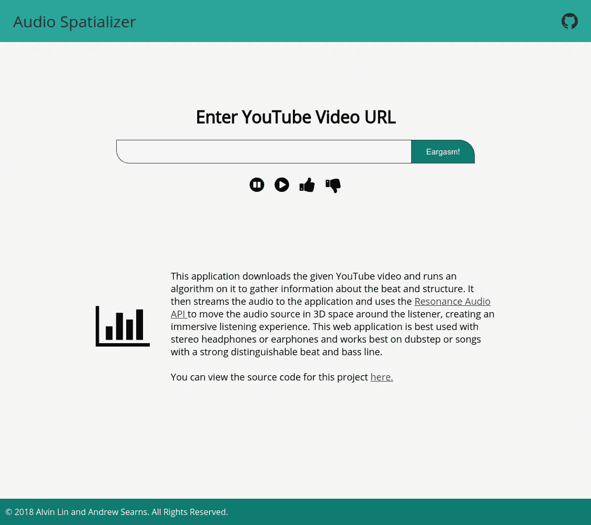
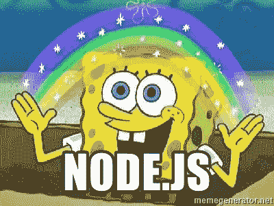
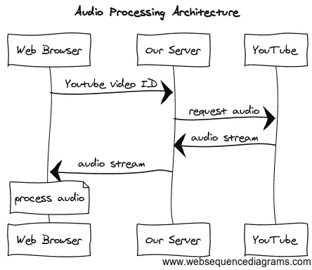
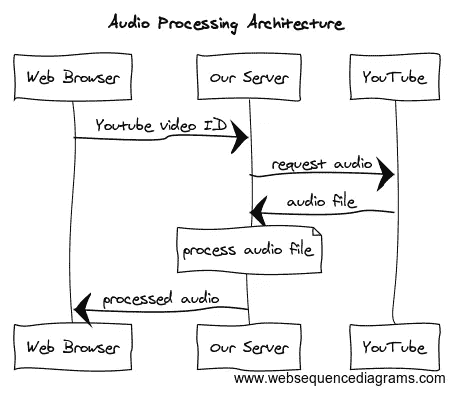
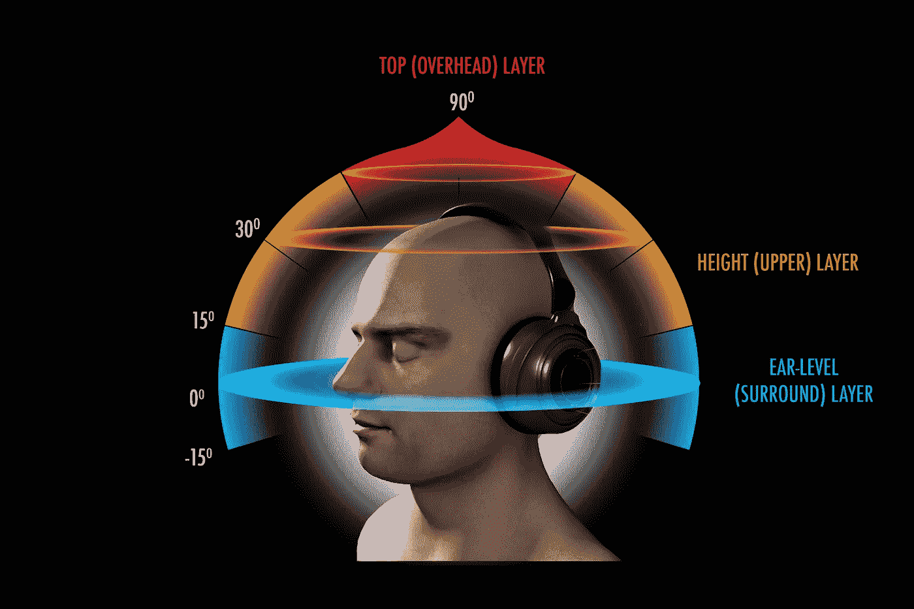
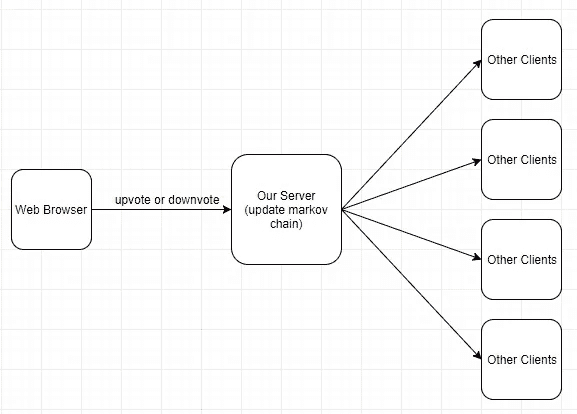

# 如何在浏览器中构建音频处理器

> 原文：<https://medium.com/hackernoon/how-to-build-an-audio-processor-in-your-browser-302cb7aa502a>

[Audio Spatializer](https://github.com/omgimanerd/audio-spatializer), submission for BrickHack4

# 一些背景信息

我上周末在 RIT 的 brick hack 4 做黑客。通常，我喜欢用我的黑客马拉松来构建多人游戏，但这一次，我想尝试实现一个我已经在待办事项列表后面有一段时间的想法。这个想法是在我听了一些 [nightcore](https://www.urbandictionary.com/define.php?term=nightcore) (一首歌曲的混音曲目，加快了速度，提高了音高，更强调了强有力的节拍)后产生的。具体来说，我在 YouTube 上听了这个:

如果你跳到 0:36 标记，你可以听到一个有趣的音频效果，如果你戴着耳机。节拍在左耳和右耳之间跳跃(这个视频中的其他几个点也会发生这种情况)。这是一个如此有趣的效果，我想知道是否有可能通过算法为其他歌曲创造这种效果。我对这个项目的最终目标是能够采取一些 dubstep 和使用立体声效果来切换左右耳之间的节拍，并创建一个身临其境的听觉体验。在黑客马拉松期间，我和我的朋友[安德鲁·瑟恩斯](https://github.com/Searnsy)一起工作，尝试创建一个网络应用程序来完成这项工作(安德鲁还向我展示了[其他有趣的歌曲，艺术家在这些歌曲中播放了立体声效果](https://www.youtube.com/watch?v=L8RT9yAzYXE))。

虽然它不像我们预期的那样成功，但我们用一个架构来做这件事是很有趣的，而且我个人在设计应用程序界面时学习了相当多的 CSS Flexbox。在本次技术发布中，**我将带您了解我的思考过程，并向您展示如何概括我们编写的代码，以在浏览器中构建音频处理框架。**

# 音频流架构

好吧，让我们想想我们需要什么来完成这个。理想情况下，我们希望用户只需将一个 YouTube 链接粘贴到我们的应用程序中，它将处理音频流，将其空间化，然后播放它。

显然，我们需要的第一件事是一些方法来做音频流。我将在本节中讨论我们如何设置它，稍后我们将讨论音频空间化部分。

因为我们想快速开发和迭代，我们使用了

(也是因为我刚好很喜欢 node.js)。在黑客马拉松期间，我们发现了两种有据可查的从 YouTube 进行音频流传输的方法。

o̶n̶e̶̶o̶p̶t̶i̶o̶n̶̶w̶a̶s̶̶t̶h̶e̶̶p̶a̶c̶k̶a̶g̶e̶̶[y̶o̶u̶t̶u̶b̶e̶-̶a̶u̶d̶i̶o̶-̶s̶t̶r̶e̶a̶m̶](https://github.com/JamesKyburz/youtube-audio-stream),̶̶a̶n̶d̶̶t̶h̶e̶̶o̶t̶h̶e̶r̶̶o̶p̶t̶i̶o̶n̶̶w̶a̶s̶̶t̶h̶e̶̶p̶a̶c̶k̶a̶g̶e̶̶[y̶t̶d̶l̶-̶c̶o̶r̶e̶](https://www.npmjs.com/package/ytdl-core)̶(̶w̶h̶i̶c̶h̶̶y̶o̶u̶t̶u̶b̶e̶-̶a̶u̶d̶i̶o̶-̶s̶t̶r̶e̶a̶m̶̶a̶c̶t̶u̶a̶l̶l̶y̶̶d̶e̶p̶e̶n̶d̶s̶̶o̶n̶)̶.̶̶a̶f̶t̶e̶r̶̶a̶̶l̶o̶t̶̶o̶f̶̶i̶t̶e̶r̶a̶t̶i̶o̶n̶̶a̶n̶d̶̶t̶e̶s̶t̶i̶n̶g̶,̶̶w̶e̶̶s̶e̶t̶t̶l̶e̶d̶̶o̶n̶̶u̶s̶i̶n̶g̶̶y̶o̶u̶t̶u̶b̶e̶-̶a̶u̶d̶i̶o̶-̶s̶t̶r̶e̶a̶m̶̶t̶o̶̶p̶i̶p̶e̶̶t̶h̶e̶̶a̶u̶d̶i̶o̶̶s̶t̶r̶e̶a̶m̶̶d̶i̶r̶e̶c̶t̶l̶y̶̶t̶o̶̶t̶h̶e̶̶c̶l̶i̶e̶n̶t̶.̶

**编辑:我重新审视了这个项目，youtube-audio-stream 包有时有点古怪，不像**[**ytdl-core**](https://www.npmjs.com/package/ytdl-core)**那样积极维护。我已经重写了项目以使用 ytdl-core，但是由于遗留的原因，我不会修改这篇博文。不要担心，这个变化几乎是一个下降的替代，只影响大约 5 行代码。**

为此，客户端将 youtube 视频 ID 发送到我们的服务器，服务器使用 [youtube-audio-stream](https://github.com/JamesKyburz/youtube-audio-stream) 从 YouTube 获取视频 ID，然后通过管道将其发送回客户端。

Diagram created using [websequencediagrams.com](http://www.websequencediagrams.com)

我们决定将音频处理卸载到客户端，以减少服务器的负载。对于我们的目的来说，这是最实用的解决方案，并且易于编码和组装。

现在你可能会看到这个，并问为什么我们没有跳过中间人，让网络浏览器直接从 YouTube 请求音频流。[跨来源资源共享(CORS)](https://developer.mozilla.org/en-US/docs/Web/HTTP/CORS) 阻止我们从客户端直接向 YouTube 发出请求。此外，我们希望我们的服务器在所有客户机之间提供一个通信通道(原因我们将在后面的部分讨论)。

下面是上述架构的一个最小工作示例:

[Here’s a link to a git repository you can clone to get this sample code](https://github.com/omgimanerd/audio-spatializer/tree/blog-min-example)

这看起来可能需要消化很多代码，但实际上非常简单，大部分代码都是样板文件。让我们浏览一遍。

`audio-processor-server.js`是一个非常标准的 [boilerplate express.js 服务器](https://expressjs.com/)，它定义了两条路径:一条用于向客户端提供 HTML 页面，另一条用于向客户端提供音频流。服务器还将静态地提供`/client`文件夹中的文件，这是我们存储`audio-processor.js`的地方。

`audio-processor.html`是一个普通的 HTML 页面，除了一个 YouTube 视频 ID 的输入字段和一个提交按钮之外什么都没有。

`audio-processor.js`是加载到 HTML 页面中的客户端脚本，用于向服务器发送音频流请求。我们使用一个 [XHR 请求](https://developer.mozilla.org/en-US/docs/Web/API/XMLHttpRequest)来请求音频流，这样我们就可以指定 arraybuffer 的返回类型。使用 [Web Audio API](https://developer.mozilla.org/en-US/docs/Web/API/Web_Audio_API) 的 [AudioContext](https://developer.mozilla.org/en-US/docs/Web/API/AudioContext) 对象，我们可以[将 arraybuffer 解码为包含解码后的 PCM 音频数据的 AudioBuffer 对象](https://developer.mozilla.org/en-US/docs/Web/API/BaseAudioContext/decodeAudioData)。这个缓冲区被传递给`processAudio()`方法(在上面的示例存根中没有定义),您可以用任何想要的函数替换它。

这里有一个例子`processAudio()`函数，我们用来做一些天真的节拍检测。我们让音频数据通过一个低通滤波器，并隔离高于某个相对值的所有点。[我们要感谢 Joe Sullivan 精彩的文章，他解释并提供了下面的低通滤波器代码。](http://joesul.li/van/beat-detection-using-web-audio/)

[Here’s a link to a git repository you can clone to get this sample code](https://github.com/omgimanerd/audio-spatializer/tree/blog-min-example)

这里有一个[链接，链接到我们项目的一个分支，包含上面](https://github.com/omgimanerd/audio-spatializer/tree/blog-min-example)的示例代码。您可以使用[音频缓冲区](https://developer.mozilla.org/en-US/docs/Web/API/AudioBuffer)中的 PCM 音频数据做各种有趣的事情。

注意，`audio-processor.js`中的代码仍然相关，即使你不想从 YouTube 加载音频。您可以将它应用到静态载入的音频文件或您想要使用的任何其他音频源。我建议浏览一下 [Web Audio API 文档](https://developer.mozilla.org/en-US/docs/Web/API/Web_Audio_API),看看你能用音频缓冲区做些什么。

# 另一种音频流架构

然而，假设您想要在服务器上执行音频处理部分。这对于在客户端进行处理有几个好处:服务器端缓存、特定于架构的处理库，或者只是方便。然而，缺点是许多并发请求会给服务器带来很大的负载。

我们还尝试在黑客马拉松期间使用这样的架构在服务器端进行处理:

Diagram created using [websequencediagrams.com](http://www.websequencediagrams.com)

我们选择不这样做是为了减少服务器负载，但是如果您想在自己的项目中复制这一点，我也会给出这个架构的示例代码。

[Here’s a link to a git repository you can clone to get this sample code](https://github.com/omgimanerd/audio-spatializer/tree/blog-min-example-2)

`audio-processor-server.js`还是一个简单的 [express.js 样板服务器](http://expressjs.com)，但是这次增加了一些额外的部分。在这个版本中，我们将音频流作为. flv 文件保存到文件系统中。如果您只想将音频流传输到您的定制音频处理器，这是不必要的，但我们发现这允许更多的灵活性和控制。像以前一样，这个服务器定义了两条路由:一条用于服务 HTML 页面，另一条用于服务音频流。同样，服务器也将静态地服务于`/client`文件夹中的文件。

`audio-processor.html`是相同的普通 HTML 页面，带有 YouTube 视频 ID 的输入字段和提交按钮。

`audio-processor.js`是一个加载到 HTML 页面的客户端脚本，它使用 [HTMLAudioElement](https://developer.mozilla.org/en-US/docs/Web/API/HTMLAudioElement) 请求一个音频文件并播放它。

如果你选择做服务器端的处理，[要注意 Web Audio API 是一个 web JavaScript API，它不是 JavaScript 语言的一部分](https://stackoverflow.com/questions/33725402/why-web-audio-api-isnt-supported-in-nodejs)。因此，它对于运行在服务器端的 node.js 服务器是不可用的。

如果你想要更多的粒度，**你实际上可以结合上述两种方法在服务器上进行处理，在客户端进行额外的后处理**。我们没有尝试这样做，但是通过将后端特定的库与 Web Audio API 的强大功能相结合，您可能会做很多很酷的事情。

**如果您只对构建浏览器内音频处理架构感兴趣，那么您可以在此停止阅读或跳到最后。**技术发布的其余部分将是关于我们如何将这个音频流架构连接到 [Resonance Audio API](https://developers.google.com/resonance-audio/) 进行我们的黑客攻击。

# 将音频流空间化

一旦我们克服了找出处理音频流的最佳方式的挑战，我们就需要找出如何在立体声中移动音频来创建我们想要的效果。我们使用了 [Google Resonance Audio API](https://developers.google.com/resonance-audio/) 来做到这一点。给定一个音频源和一个矢量位置，这个 API 允许我们在 3D 空间中围绕听众定位音频源。你可以在他们的[演示](https://cdn.rawgit.com/resonance-audio/resonance-audio-web-sdk/master/examples/hello-world.html)中探索这种效果(最好用耳机体验)。

我们的计划是基于音频数据生成一个向量值列表，并在播放音频时使用 Resonance Audio API 移动声源。使用`setInterval()`并使用音频中的当前帧来同步向量位置列表是非常简单的。由于音频缓冲器的采样速率是已知的，所以我们可以精确地计算出将音频源定位在哪个矢量位置。

困难的部分(也是最酷的部分)是弄清楚如何正确地生成向量位置列表，以便立体声平移与节拍同步。我们不希望只是在左右摇摆，也不希望运动模式重复而乏味。安德鲁和我试验了各种运动模式，并开发了一种编码方案。

Locations around the head which we can place the audio source. [Image from ***3D audio experience*** — Imgur.](https://imgur.com/gallery/gXIDw4j)

我们将移动模式命名为变换，并决定了围绕听众移动音频的 5 种不同方式:跳跃(将音频源移动到听众周围的随机位置)、翻转(将音频源移动到听众的正对面)、旋转(围绕听众缓慢旋转音频源)、延迟(将音频源保持在原位)和重置(将音频源重置到原点)。使用之前描述的简单节拍检测算法，我们在每个节拍上从一个变换过渡到另一个变换。

为了生成转换序列，我们使用马尔可夫链，最初以相等的概率播种每个转换。在这里，我们实际上利用服务器作为连接的客户端之间的中继点。我们试图通过在界面上添加一个按钮，允许用户投票赞成或投票反对当前的音频空间化模式，使序列生成变得有些智能。然后，服务器将通过增加或减少用户正在收听的歌曲中使用的序列的概率来考虑这一点。

Diagram made with [draw.io](http://draw.io)

新的马尔可夫链将被传播到所有客户端，并且访问该站点的任何新客户端将使用新的概率来生成它们的空间化。尽管我们充分讨论了这个想法，但是 JavaScript 对象的各种错误和问题阻止了我们在提交 hackathon 之前完全实现它。

# 事后思考

这是一个非常棒的设计和游戏项目。在网络音频 API 中有很多有趣的东西可以探索。我不太了解音频编码，但我想如果我对音频编解码器和 PCM 数据有更多的背景知识，那里的资源会有用得多。

如果你想查看我们的整个项目，[这里有一个到 git 库](https://github.com/omgimanerd/audio-spatializer)的链接。有三个显著的分支。[主分支](https://github.com/omgimanerd/audio-spatializer)包含我们对音频空间化项目的实施。 [blog-min-example 分支](https://github.com/omgimanerd/audio-spatializer/tree/blog-min-example)包含第一部分中描述的客户端处理示例，而 [blog-min-example-2 分支](https://github.com/omgimanerd/audio-spatializer/tree/blog-min-example-2)包含第二部分中描述的服务器端处理示例。

如果你喜欢这个技术演讲，可以考虑点击拍手图标或者在 Twitter 上关注我以获得更多类似的内容。非常感谢您的阅读！