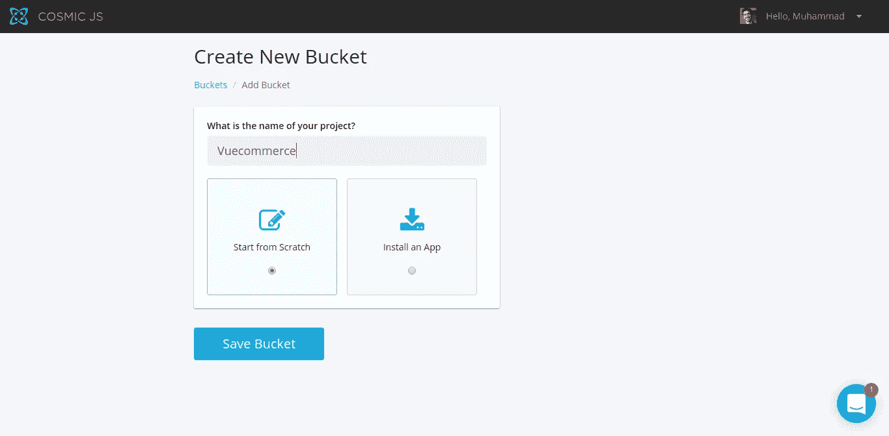
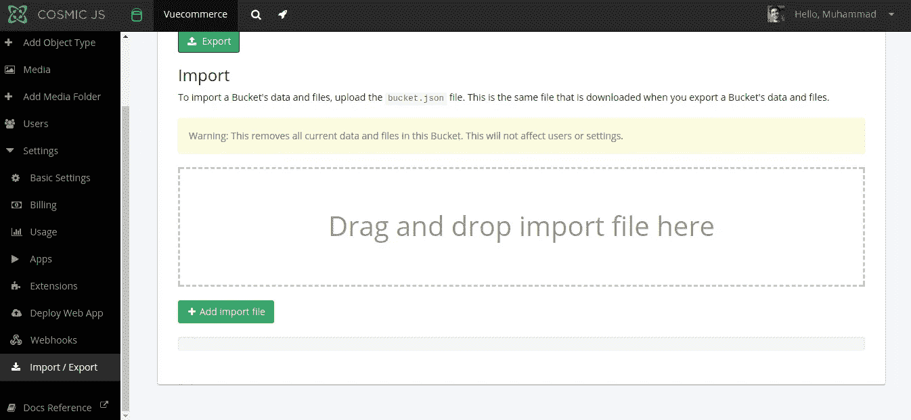
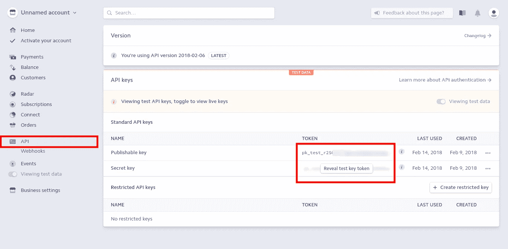

# 如何用 Nuxt 和 Cosmic JS 搭建一个电子商务网站

> 原文：<https://medium.com/hackernoon/how-to-build-an-e-commerce-website-with-nuxt-and-cosmic-js-292c94e37b41>


What we will be building.

对于简单的购物网站来说，使用 Shopify 或 Woocommerce 等成熟的解决方案可能有些矫枉过正。在本教程中，我们将使用 [Nuxt](http://nuxtjs.org/) 和 Cosmic JS 构建一个电子商务网站。我们还将使用 [Buefy](http://buefy.github.io/) ，它是基于广受喜爱的[布尔玛](http://bulma.io/)的 Vue JS 的 UI 组件库。

# TL；速度三角形定位法(dead reckoning)

[下载 GitHub 回购](https://github.com/cosmicjs/vue-ecommerce)
[查看演示](https://cosmicjs.com/apps/vue-ecommerce-app)

# 先决条件

您需要在您的计算机上已经安装了 node 和 npm。如果没有，请访问 [node js 网站](https://nodejs.org/en/)并安装最新的稳定版本。

# 入门指南

对于我们的项目，首先构建我们的后端模型是有意义的。

**设置 Cosmic JS 后端** 登录你的 Cosmic JS 仪表盘，选择“添加新桶”。在下一个屏幕中，为您的存储桶提供一个名称，然后选择“从头开始”。



**导入 Bucket 数据** 从仓库下载 [bucket.json](https://github.com/cosmicjs/vue-ecommerce/blob/master/bucket.json) 文件。然后从仪表板转到设置- >导入/导出页面，导入下载的文件。现在，我们将在仪表板中显示可用的对象和对象类型。



# 设置条带

对于任何电子商务网站来说，我们都必须在某个时候接受客户的付款。设置支付处理器曾经是一个困难的领域，但幸运的是，我们现在有很多方便的解决方案。

对于我们的网站，我们将使用条纹。首先，去他们的[网站](http://stripe.com/)创建一个账户。在您填写了详细信息并设置好一切之后，请转到 API 部分并获取您的公钥和私钥。



我们将需要这些密钥来配置我们网站中的 Stripe，使用更加方便的 [Stripe Checkout](https://stripe.com/checkout) 元素。

# 安装演示

通过下载或克隆位于[https://github.com/cosmicjs/vue-ecommerce](https://github.com/cosmicjs/vue-ecommerce)的 repo，将源代码放入你的机器。然后跑，

```
cd vue-ecommerce
npm install
```

在运行应用程序之前，还有一个步骤。将`.env.sample`文件重命名为`.env`,并放入环境变量中。

由于生产的主机变量需要为 0.0.0.0，NODE_ENV 需要为“生产”,我们将在`package.json`文件中设置它们，并且不需要在`.env`文件中设置。

现在运行`npm run dev`在开发模式下运行应用程序。如果你想为生产而构建，运行`npm run build`并用`npm start`启动应用程序

# 理解源代码

使用 Nuxt 构建 Vue.js 应用程序的一个主要好处是 Nuxt 是固执己见的。所以你可以进入任何一个 Nuxt 项目，在那里找到一个熟悉的结构。

最重要的文件是`nuxt.config.js`。你会发现从`plugins/`文件夹中导入了 Buefy、Stripe 和 Cosmic JS 三个插件。

我们使用 [vue-stripe-checkout](https://www.npmjs.com/package/vue-stripe-checkout) 作为 stripe 的 checkout 元素的包装器。访问[条带文档](https://stripe.com/docs/checkout#integration-simple-options)了解可用选项。

需要在客户端使用的任何环境变量都需要在 env 部分定义，我们还将在 scripts 部分链接 stripe 脚本。

`pages/`文件夹包含主页和购物车页面。购物车页面中的结帐方法处理条带结帐。基本上，我们所做的是将结帐组件生成的令牌和其他标识细节发送到应用服务器。查看 [vue-stripe-checkout](https://www.npmjs.com/package/vue-stripe-checkout) 包，了解更多用法。

对于一个简单的 Nuxt 应用程序，我们可以只对 SSR 使用服务器，并将所有代码发送到客户端。但是在这种情况下，我们需要在服务器中单独处理条带检出。在`server/`文件夹中，我们在`index.js`文件中有快速服务器设置，在`api/index.js`文件中有一个单独的路由处理器。我们将首先用`stripe.customers.create`函数创建一个 Stripe 中的客户，然后用`stripe.charges.create`函数收费。查看[https://stripe.com/docs/checkout/express](https://stripe.com/docs/checkout/express)了解更多关于实现的信息。

一旦支付成功，我们将把订单添加到“订单”对象类型下的宇宙 JS 桶中。

# 部署应用程序

用 Cosmic JS 部署应用程序非常简单。只需转到您的存储桶，然后导航到设置->部署到 Web。

提供您的 Github 存储库 url 和要部署的分支。Cosmic 使 Bucket slug、read key 和 write key 环境变量默认可用。

在那里选择要部署的存储库和分支(在大多数情况下是 master)，然后单击“部署到 Web”。这就是全部内容，一旦部署成功，您将会收到一封确认邮件。一旦成功，不要忘记通过“设置环境变量”部分提供条带密钥和环境变量，以防您尚未设置`.env`文件。

PS:任何电商 app 都需要用 https 做安全保障。因此，上线时，请务必在部署部分的应用中启用 SSL。