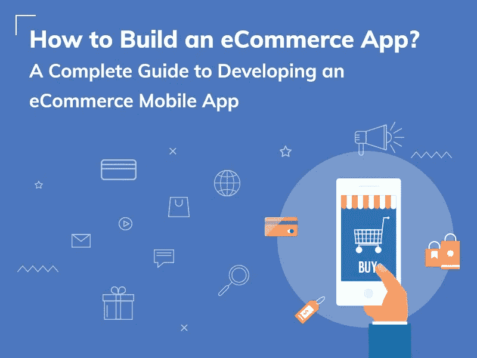
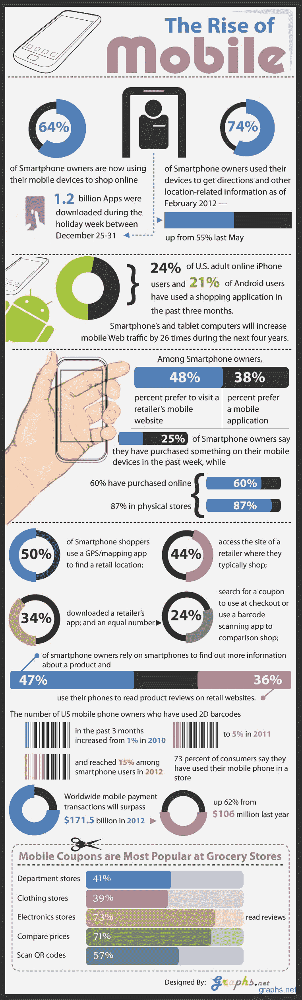
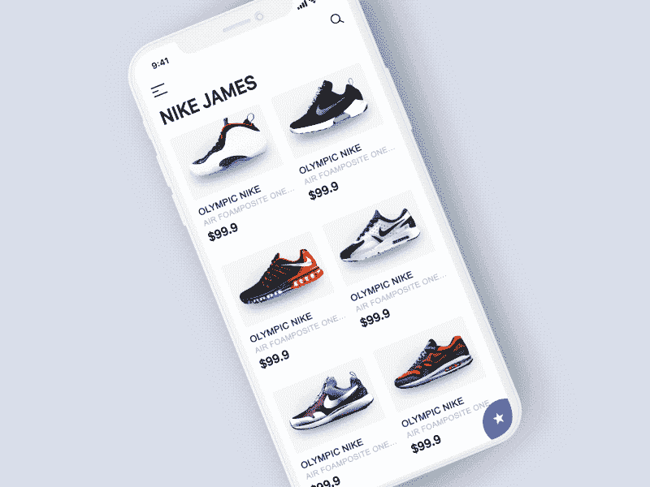
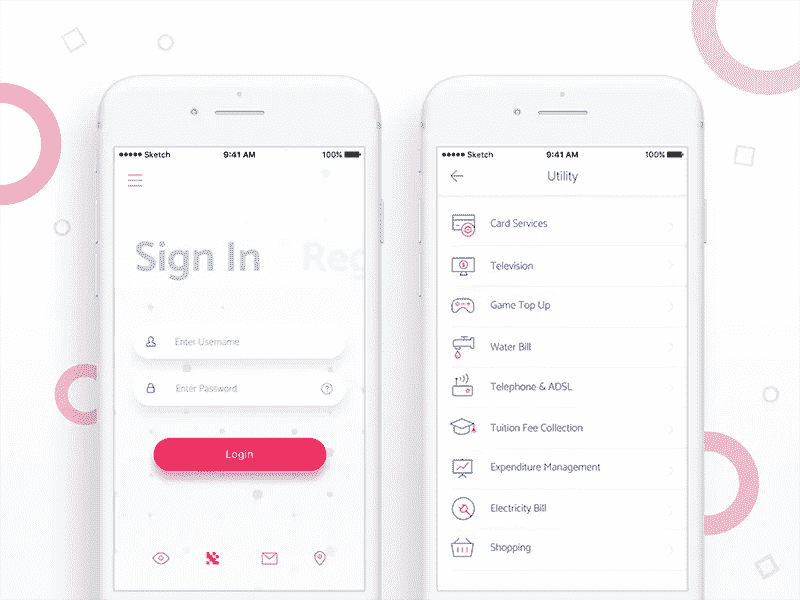
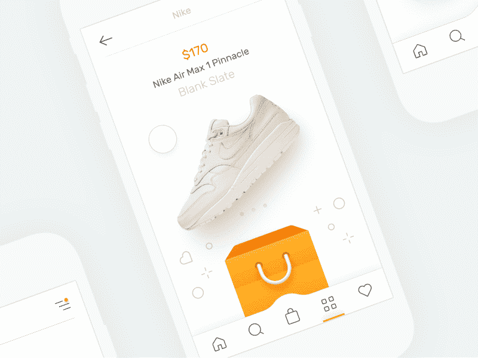
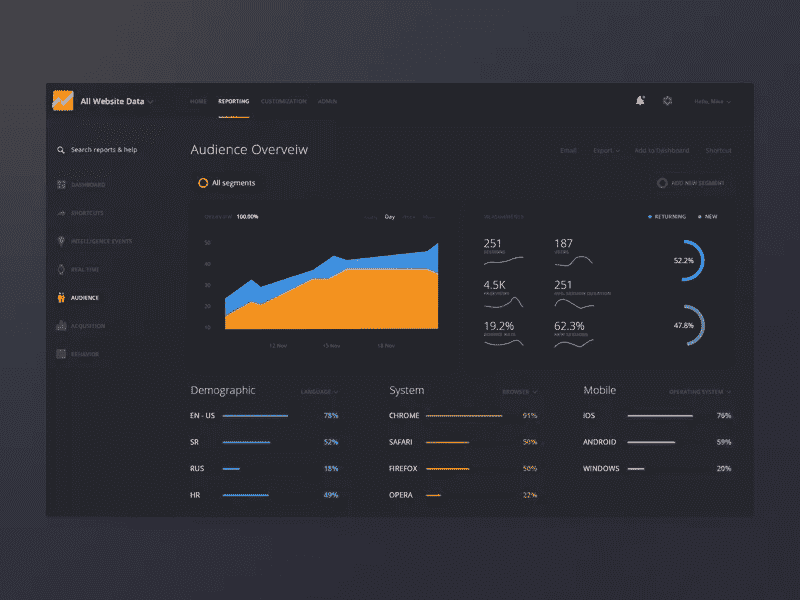
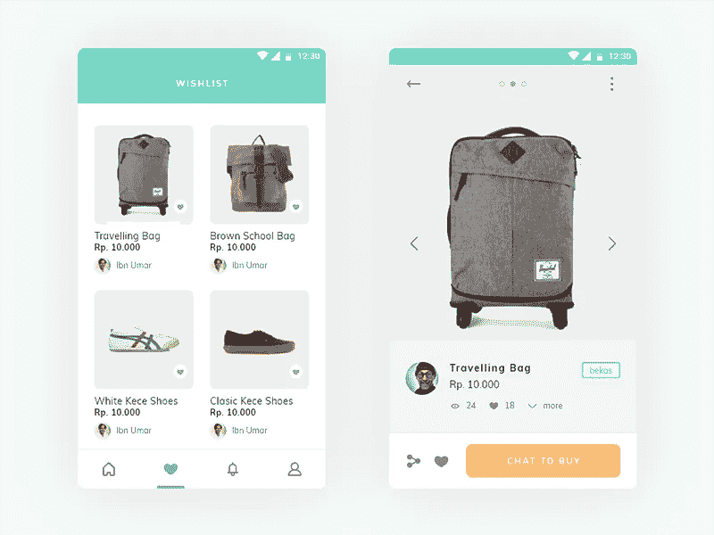
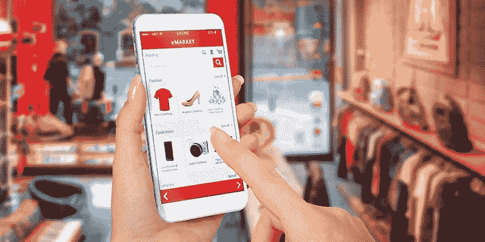

# 如何建立一个电子商务应用程序:企业家指南

> 原文：<https://medium.com/hackernoon/how-to-build-an-ecommerce-app-feeea1c10808>

## 开发电子商务移动应用程序的完整指南

疯狂购物、购物狂、时尚达人等等！这都要感谢社交媒体平台带来了人们喜欢购物的事实；不考虑时间；不管在什么地方。

随着数字化的到来，整个实体商业领域将自己改造成电子商务，人们开始通过他们的设备轻松地在线购物，这也是在他们舒适的家中进行的。

电子商务网站，曾经是一场革命的东西被[电子商务移动应用](https://www.engineerbabu.com/blog/ecommerce-app-development-guide/)纪念。确实！如今，以“移动购物”为口号的电子商务移动应用正在智能用户及其智能手机上占据主导地位。

# 亚马逊，电子商务游戏中最大的玩家，还有它的仿冒者阿里巴巴，Myntra，Snapdeal。

他们已经成为人们不可或缺的一部分，而商场和超市正被降低到“自拍区”、“橱窗购物时尚”和“签到”场所。

谁会愿意浪费周末的宝贵时间，在收银台前排起长队，等着法国对克罗地亚的比赛呢！嗯，有了电子商务移动应用程序，他们所能做的就是购物，而不会错过比赛。

# 这就是你的电子商务移动应用程序！

谁没有在店铺拥挤的情况下经营成功企业的梦想？电子商务移动应用程序可以成为你梦想成真的业务，因为你可以瞄准来自世界各地的客户，你不必为了你的品牌而去市场；这是一个额外的优势。

企业正在改变他们的偏好，以建立一个电子商务平台。他们选择移动应用而不是网站。这些企业大多由初创公司组成。

首先，最清晰地定义你的电子商务业务目标是很重要的。

> 你想用什么类型的电子商务移动应用来开展你的业务——**安卓还是 iOS？**

1.  你是在卖你的产品还是供应商会注册？
2.  你的目标受众是谁？
3.  谁将管理交付，您、您的供应商还是第三方？
4.  他们如何上传和更改产品定价？
5.  佣金如何运作，供应商可以直接付款吗？
6.  谁可以离开审查，只有经过验证的客户？

一旦解决了这个问题，您就可以进入下一个重要的步骤，为您的电子商务移动应用程序定义合适的特性。

特色是你的 USP 的反映。这对你的目标受众来说是非常重要的。基本上，它们只是决定你的收入是增长还是流向你的竞争对手的因素。因此，为开发你的电子商务移动应用程序规划功能是很重要的。

# 构建电子商务移动应用程序时需要注意的事项

从你的想法概念化到它作为移动应用的测试版，有很多需要注意的地方。

你需要注意的是用户导航的简易性、你的想法/概念的独特性、可访问性等等。

平台和客户之间或者供应商和客户之间(如果你的平台上有供应商)的交流方式也是一个关键因素。如果你已经确定了你的利益相关者，可能包括你的团队和员工。应用程序中的这个交流平台必须有效。

探索不同的垂直平台，而不是你的想法；激励你在内容和向客户提供的内容方面创造更精致的东西。

选择开源或 SaaS 平台各有利弊。根据你的预算和未来的愿望，你可以选择其中一个，比较适合你的口袋和当前需求的功能。

# 电子商务应用程序开发的关键方面

在继续下一步之前，让我向您详细介绍一下开发电子商务移动应用程序时需要关注的关键方面:

## 市场分析和买家角色:

电子商务移动应用开发的基础在于为你的业务确定买家角色。问问你自己，“你把你的产品卖给谁？”因此，针对你的目标受众开展你的研究。

分析你的目标受众的行为和模式。了解他们的数字时代和他们的好恶。这将有助于您创建尽可能与他们相关的应用程序。

## 了解你的竞争对手:

提取你的竞争对手名单。创建一个单独的清单，列出他们喜欢什么，以及是什么让他们成为买家的明显选择。不要复制他们的功能或商业模式，而是好好研究商业模式，并从你的分析中获得最大收益。

## 选择技术:

了解你的业务的来龙去脉，以便决定使用何种技术来创建你的电子商务移动应用程序。密切关注开发预算，了解您的库存，选择 CMS、数据库、框架，以及最重要的后端和前端语言来编写您的应用程序。

如果你想要更好的上市时间，请选择混合应用程序，如果你想要可持续性，请选择本地应用程序。同样，你必须决定是否要同时发布 Android 应用、iOS 应用或两者都发布，记住你的目标受众的设备使用情况。

## 用户界面和 UX 设计:

通过舒缓的配色方案、吸引人的视觉效果以及从一个页面到另一个页面的平滑过渡，为您的品牌提供应有的声音。为你的标志创造选择，并充分利用它。这将是你的企业对你的目标客户的身份。利用聪明的品牌策略来创造一个持久的印象，从而利用你的客户的潜意识。

考虑到我们已经涵盖了开始构建电子商务移动应用程序的理解和分析。让我们继续讨论开发这样一个应用程序的主要功能。

# 以下是从成功的电子商务移动应用程序中提取的功能列表，您不能错过其中的任何一个:

## 更简单的注册流程

[图像来源](https://dribbble.com/shots/3803685-Fintech-App-UI)

虽然这听起来很简单，但对你的客户来说，这可能是一个详尽的问题，他们可能会选择卸载该应用程序，并填写一页又一页的信息。谁有时间

确保注册过程简单。如今，每个人都有一个社交媒体帐户，您最多只需点击两下就可以启用“注册”和“登录”,这样您的客户就可以加入了！此外，通过他们的社交
媒体账户了解他们在数字时代的偏好，还会得到额外的加分！

## 支持多种支付方式

比方说，你有一个大胖客户，他主要在网上购物，并访问你的电子商务移动应用程序来尝试一下。把他的东西倒进购物车后，他意识到你没有他喜欢的付款方式。你刚刚失去了一个大客户。以及更多喜欢你的应用程序不提供的支付选项的人。

作为一个电子商务商人，为了玩得更安全、更聪明，你必须打开最流行的支付方式的大门。信用卡、借记卡、网上银行和电子钱包位于顶部，确保你巧妙地推动你的客户使用你的应用程序的内置钱包。

## 推送通知

[图片来源](https://dribbble.com/shots/2518631-Notifications-Illustration-Animation)

你的客户有他们的需求，你有满足他们所需的供应，但是如何弥合这种沟通的差距呢？推送通知是关键！

推送通知是决定电子商务移动应用成功与否的最重要的功能之一。它们提高了客户参与度，因为它让他们了解推荐、折扣、销售、促销和优惠，从而让他们再次光顾。这反过来又为你提供了交叉销售和追加销售的机会，让你获得更高的利润。

## 社交媒体整合

不要告诉我你不希望所有的注意力都在你的顾客身上。你甚至想要他们的社交媒体时间。考虑到你在做生意，你的要求是合理的。

不仅是一键登录，社交媒体整合将确保您的电子商务移动应用程序就在您的客户面前，无论他们在哪里；在脸书上聊天，在 Twitter 上发微博，或者在 Pinterest 上发微博。这也有助于他们在社交媒体账户上轻松分享你的特别折扣。还有什么比口碑营销和用户生成内容更好的呢！

## 完全同步

你有你的[电子商务网站](https://www.engineerbabu.com/blog/designing-a-mobile-friendly-ecommerce-website/)和一个电子商务移动应用。你想出了一个非常令人兴奋的功能，肯定会引起目标受众的共鸣，并将他们的购买体验提升到一个新的水平。但是你必须在你的竞争对手之前推出这项功能。您想要更快的上市时间，但是由于分别在两个门户中进行编辑，时间似乎停止了。你会怎么做？

通过让我们的电子商务移动应用程序与网站同步来加快流程。节省大量时间，击败竞争对手，增加您的销售额。

## 谷歌分析

[图片来源](https://dribbble.com/shots/3173227-Google-Analytics)

你开展电子商务业务已经有一段时间了。你认为你目前过得很好。但是抛开你的直觉，你如何判断什么对你的企业有利，什么不利？

好吧，像每次一样，谷歌有你想要的答案与谷歌分析。优化谷歌分析的使用，在实时数据的帮助下，找出你的客户是如何真正发现你的移动应用的。知道你的哪种产品需要不同的包装，什么优惠可以形成有吸引力的组合，以及哪种人口统计对你的业务有很好的共鸣，所有这一切都与谷歌分析。

## 审核和评级

不要害怕得到差评和差的产品评级。一个明智的商人是一个对批评和学习都持开放态度的人。

让您的客户能够检查和评价您的应用程序及其功能。可能的情况是，你提供的产品不在买家的愿望清单上，而评论将帮助你实现这种实现感。同样，在改进之后，不要删除负面反馈，而是要感谢他们，并展示你已经采取的步骤。这会让他们觉得自己很重要，谁知道他们会不会永远坚持你的品牌！

## 愿望列表按钮

[图片来源](https://dribbble.com/shots/4182159-E-commerce-App)

现在是月底。离发工资还有一周，你的客户不想错过他们最近发现的东西。他们想买，不是现在，但肯定会在一周后。让愿望清单发挥它的作用。

愿望清单有时可以成为你销售的救星。它帮助你的顾客保存他们希望以后购买的产品。此外，您还可以了解买家的偏好和个性化报价，从而获得销售优势！

## 轻松结账

顾客的所有热情和精力都消失在做出选择和向购物车添加商品的过程中。现在是最困难的部分——付款！

为了确保他们不会放弃购物车，尽可能简单地构建您的结账流程。帮助他们保存卡和电子钱包的详细信息，并让他们更快地通过支付网关。如前所述，您的客户讨厌在计费队列中等待，不要让他们在虚拟计费系统中等待！

市场上已经有无数的电子商务移动应用程序。你需要从人群中脱颖而出，这些功能将帮助你采取行动。如果你遵循顾客至上的原则，为顾客提供最大的购物便利，你就能轻松留住你的顾客。另一方面，当你的竞争对手在功能方面有惊人的体验时，你的客户就会倾向于他们。

在这种情况下，聪明的方法是建立一个具有正确功能的电子商务移动应用程序，避免任何可能降低客户参与度的错误。

让他们觉得你理解他们在使用其他移动应用和解决方案购物时面临的问题。向他们展示他们使用你的移动应用所花费的时间、精力和金钱的价值。这是赢得客户的唯一重要的关键，也是胜过竞争对手的唯一重要的关键。

> 电子商务应用程序开发有几个趋势，包括地理围栏、聊天机器人、增强现实、大数据、推荐引擎、云计算和保护支付流程。他们装扮起来，用虚拟更衣室等不可预见的功能彻底改造电子商务生态系统。这将改变客户使用配备所有这些功能的平台的体验方式。

# 市场的未来

[图片来源](https://infinitybusinessbrokers.com/brick-mortar-digital-marketplace-2-ways/5645/)

**语音会改变 SEO:**

2018 年，趋势表明，消费者将对着他们的设备说话，并使用对话式人工智能来完成任务。

像 Siri 和 Alexa 这样的开发现在已经与许多第三方应用程序集成在一起,“预订优步”是对这种变化场景的强化。零售商也需要适应和改变他们的沟通方式。

像塔吉特、Bed Bath and Beyond、好市多和美国柯尔百货公司这样的几家公司已经在着手达成协议。基于语音的搜索引擎优化整合将彻底改变人们的购物方式。

# 一幅图像胜过千言万语:

2018 年，消费者将首次使用基于图片的搜索引擎。据预测，基于图像和语音的搜索将占所有搜索的 50%以上。消费者可以给他们想买的产品拍照，然后在网上找到相似的产品。

整合了基于图像的搜索选项的零售商将受益匪浅，因为他们也可以进入新的市场，语言不再是障碍，也不再是错误产品名称和错误搜索结果的同谋。

**物联网:**随着连接到互联网的设备数量的增加，电子商务的发展很明显，它将如何影响用户体验。

**交付的优步化:**通过更新物流系统，我们能够创造的影响和从客户那里获得的反馈是巨大的。你可以把你的生意做大。

**ROPO(在线调查，线下购买):**电子商务是一种日益增长的趋势，尤其是在印度。消费者喜欢在购买前在线研究产品，甚至在商店购买，因为这有助于了解最佳价格，事实上，54%的用户在购买产品前会阅读客户评论。

# 社交和对话商务:

从一开始，用户在哪里就是生存的咒语。在过去的几年里，这意味着像脸书这样的大型社交媒体平台。

脸书和 Instagram 上的广告无疑是有效的，但 messenger 和 WhatsApp 等即时通讯应用已经开始超过消费者花费更多时间的领域。

网上购物已经到了这样一个地步，不难想象在一个信息平台上键入“我需要一件蓝色礼服参加晚宴”，然后在不离开对话的情况下获得关于送货信息、支付集成和跟踪选项的建议。

像沃尔玛和凯悦这样的几家公司已经在测试“商务信使”。 [WhatsApp](https://www.whatsapp.com/) 也开始为公司整合聊天机器人， [GoIbibo](https://www.goibibo.com/) 就是其中之一。

# 开发电子商务移动应用程序的成本:

最终，它缩小了你投资谁和你投资多少的范围。毫无疑问，预算是应用程序开发的首要考虑因素。为了将你从这种预算困境中解救出来，我为你提供了一些在应用程序开发过程中需要记住的要点:

*   功能:无论你是想推出 MVP 的电子商务应用，还是 MVP 和高级功能的混合应用，还是高级功能的全面电子商务移动应用。
*   安卓还是 iOS？iOS 的价格偏高，决定你想让什么设备成为你的业务的主要设备。你可以随时扩展你的业务。
*   低维护成本的后端开发或低预算高维护成本的第三方 API。
*   混合应用开发的上市时机更好，还是原生应用开发的可持续性更好？明智地做出选择，你是在长期的商业游戏中。
*   外包资源对你的预算有明显的影响，所以你需要非常小心地雇用他们。

同样，开发一个电子商务移动应用程序的[成本无法预测，因为存在变数。然而，为了尽我所能地提供帮助，我已经根据我所目睹的考虑通用应用程序开发场景的趋势做出了一个估计。](https://www.engineerbabu.com/blog/mobile-application-cost/)

*   如果我们考虑最基本版本的应用程序，只有 MVP 功能和简单的 UI/UX 设计，预计价格可以达到 60，000 美元。但是，几乎不需要支持和维护。
*   如果我们考虑包括一些高级功能在内的基本功能组合，价格可能会高达 60，000 到 80，000 美元。
*   如果我们考虑开发具有高级功能的应用程序，那么价格可能高达 8 万美元至 12 万美元。

# 电子商务移动应用程序开发的外包开发者:

根据你的工作范围，你会想要外包资源和熟练的开发人员来构建你的电子商务移动应用程序。

在雇佣一个开发团队或者一个成熟的企业之前，你必须已经讨论过你所有的问题。问题必须包括相关的主题，如:

**公司背景**
1。公司成立多久了？
2。团队实力如何？
3。他们参与并交付的所有项目是什么？类似领域的任何先前的项目？
4。我们将如何交流？等等。

**了解流程**
1。我在网站建设上会有多少投入？
2。项目每个阶段的时间框架是什么？
2。你会分析我的业务、市场和竞争对手以更好地了解我的行业吗？你会为此投入多少时间？等等。

**分析和报告**
1。你使用什么工具或解决方案进行网站分析？
2。我们将如何跟踪或查看哪些产品表现最佳？

**网站基本功能**
1。除了集成基本功能，您将如何帮助我开发我的产品？。
2。所有工具集成将会做什么？它们是由您开发的还是由任何第三方开发的？等等

**搜索引擎优化**
1。你把关键词研究作为网站建设的一部分吗？
2。你如何防止重复的标题标签，元描述，以及整个网站的内容？
3。你会在网站上包括一个博客吗？如果是，它们会在主站点还是子域上？等等。

你可以再问几个类似于 1 的问题。网站管理将会如何？
2。你将如何保护我的平台？

## 以及任何你认为相关的问题；毕竟这是你的梦想，你的钱。

也问问他们会在你的项目上投入多少资源，这样你就可以跟踪你的支出。

## 基于资源的专门招聘

当选择基于专门资源的招聘时，确保你了解工作范围，并且你没有为额外的资源付费。

要开发电子商务移动应用的基本版本，您需要

*   UI 和 UX 设计器
*   2 到 4 名开发人员
*   质量保证工程师
*   后端开发人员
*   项目管理人

要开发电子商务移动应用的高级版本，您需要

*   团队经理/项目经理
*   UI/UX 设计器
*   每个平台 3 到 4 名开发人员
*   质量保证工程师
*   2 到 3 名后端开发人员
*   管理面板开发人员

在这次开发电子商务移动应用程序的虚拟之旅之后，你准备好进入现实世界，为你即将成为现实的电子商务移动应用程序雇佣真正的技术人员了吗？

还在怀疑？做出这样的决定是艰难的，甚至可能比开发这样一个应用程序花费更多的时间。做一个完整的研究，做你的调查，然后去寻找选择。

我很想收到你的来信。请随时评论您的观点或困惑，我们将努力为您解决这些问题。

如果你喜欢，鼓掌一次，两次，或者直到你的心满意足。

— — — — — — — — — — — — — — — — — — — — — — — — — —

## 阅读我的其他 Hackernoon 文章

**1。** [**如何搭建一个交友 App？一款关于交友手机 App**](https://www.engineerbabu.com/blog/love-online-building-a-dating-app/) **的终极指南，还上了**[**hacker noon**](https://hackernoon.com/how-to-build-a-dating-app-an-ultimate-guide-on-dating-mobile-app-aaa6964cb7f1) **2。** [**如何打造像 Instagram 这样的手机 App？**](https://www.engineerbabu.com/blog/how-to-build-a-mobile-app-like-instagram/) **，亦作于** ****3。** [**如何打造一个像优步一样的 app？**](https://www.engineerbabu.com/blog/how-to-build-an-app-like-uber/) **，也上** ****4。** [**如何打造一个像 Zomato 一样的 App:百万美元指南**](https://www.engineerbabu.com/blog/how-to-build-app-like-zomato/) **，也上**[**hacker noon**](https://hackernoon.com/how-to-build-a-food-ordering-app-like-zomato-cf41f83de5ec)****

> *****我是 Mayank，*[*engineer Babu*](https://www.engineerbabu.com/)*的联合创始人。随时联系我*[*Linkedin*](https://www.linkedin.com/in/mayankpratap/)*| mayank@engineerbabu.com(关于 engineer Babu—*[*Medium*](https://hackernoon.com/how-mayank-pratap-built-engineerbabu-a-profitable-it-service-company-generating-more-than-50-000-per-month-bcd3006bdbb5)*)。*****

****此外， [EngineerBabu](https://www.engineerbabu.com/) 通过构建高级 IT 解决方案，帮助初创公司、企业和所有者发展业务。他们开发的项目 95%都按时完成了。 [30+获风投](https://www.engineerbabu.com/casestudies)资助，赢得最具创新总理设计奖，入选 Y-Combinator 2016 & 2017。****